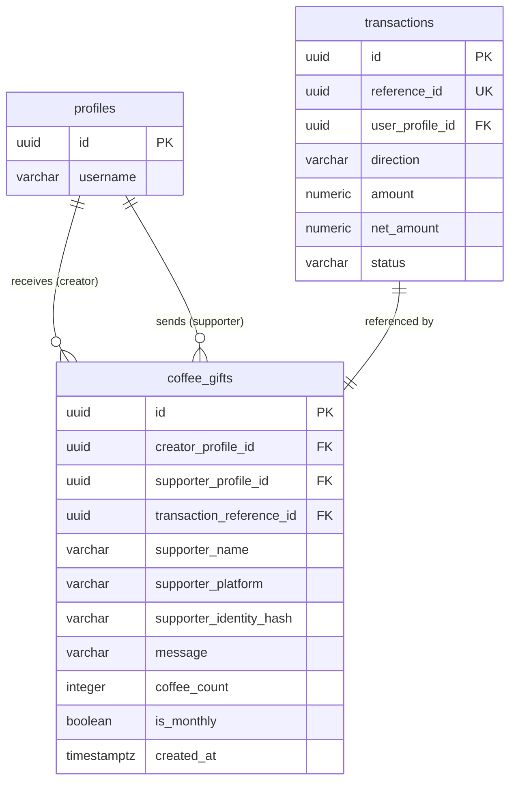

# Database Schema — `coffee_gifts`

The `coffee_gifts` table stores every **completed** coffee gift. A row is inserted only after a successful payment; there is no pending/failed state here — that lives in the `transactions` table.

## Table Definition

```sql
create table public.coffee_gifts (
  id                       uuid primary key default gen_random_uuid(),
  creator_profile_id       uuid not null references public.profiles(id) on delete set null,
  supporter_profile_id     uuid references public.profiles(id) on delete set null,
  supporter_name           varchar(100),
  supporter_platform       varchar(30),
  supporter_identity_hash  varchar(100),
  message                  varchar(500),
  coffee_count             integer not null check (coffee_count > 0),
  is_monthly               boolean not null default false,
  transaction_reference_id uuid not null references public.transactions(reference_id) on delete restrict,
  created_at               timestamptz not null default now(),
  updated_at               timestamptz not null default now()
);
```

## Column Reference

| Column | Type | Nullable | Description |
|---|---|---|---|
| `id` | `uuid` | NO | Primary key, auto-generated |
| `creator_profile_id` | `uuid` | NO | The creator who receives the gift. FK → `profiles.id`. Set to `NULL` if the profile is deleted (gift history is preserved). |
| `supporter_profile_id` | `uuid` | YES | The authenticated supporter. `NULL` means the gift was anonymous. FK → `profiles.id`. |
| `supporter_name` | `varchar(100)` | YES | Display name snapshot at the time of the gift. Preserved even if the supporter later changes their name. |
| `supporter_platform` | `varchar(30)` | YES | Social platform the supporter came from (e.g. `facebook`, `github`). |
| `supporter_identity_hash` | `varchar(100)` | YES | Deterministic hash used to deduplicate anonymous supporters across gifts. |
| `message` | `varchar(500)` | YES | Optional message from the supporter to the creator. |
| `coffee_count` | `integer` | NO | How many "coffees" were gifted. Must be `> 0`. |
| `is_monthly` | `boolean` | NO | `true` for monthly recurring gifts, `false` for one-time. Defaults to `false`. |
| `transaction_reference_id` | `uuid` | NO | FK → `transactions.reference_id`. Links to the financial ledger. Multiple transaction rows share this reference. Deletion is `RESTRICT`. |
| `created_at` | `timestamptz` | NO | When the gift was created (= when payment succeeded). |
| `updated_at` | `timestamptz` | NO | Auto-updated via trigger. Always mirrors `created_at` since the row is immutable. |

## Design Notes

### Why is `creator_profile_id` `NOT NULL` but uses `on delete set null`?

The column is `NOT NULL` at insert time because every gift must have a creator. However, if the creator's profile is hard-deleted from the database, the column is set to `NULL` rather than cascading the deletion. This preserves the gift history for auditing and supporter attribution without requiring the creator to remain in the system.

### Why is `supporter_profile_id` nullable?

Anonymous supporters do not have a user account. The platform still records the gift but identifies the supporter via `supporter_identity_hash` and the denormalised `supporter_name`/`supporter_platform` snapshot.

### Why are `supporter_name` and `supporter_platform` denormalised?

These snapshot fields preserve the display information at gift time. If a user later changes their name or platform, the historical record remains accurate. They are **not** updated after insert.

### `transaction_reference_id` uses `on delete restrict`

A gift row must not be silently orphaned from its financial record. The `RESTRICT` rule forces any deletion of the underlying transaction to be handled explicitly — you cannot delete a transaction if a coffee gift still references it.

## Constraints Summary

| Name | Type | Rule |
|---|---|---|
| `coffee_gifts_pkey` | Primary key | `id` |
| `coffee_gifts_coffee_count_check` | Check | `coffee_count > 0` |
| FK on `creator_profile_id` | Foreign key | References `profiles(id)`, `ON DELETE SET NULL` |
| FK on `supporter_profile_id` | Foreign key | References `profiles(id)`, `ON DELETE SET NULL` |
| FK on `transaction_reference_id` | Foreign key | References `transactions(reference_id)`, `ON DELETE RESTRICT` |

## Indexes

```sql
-- Most common read: "all gifts to this creator, newest first"
CREATE INDEX idx_coffee_gifts_creator_created
  ON public.coffee_gifts(creator_profile_id, created_at DESC);

-- Look up all gifts from a specific authenticated supporter
CREATE INDEX idx_coffee_gifts_supporter_profile_id
  ON public.coffee_gifts(supporter_profile_id);

-- Join to the transactions table by reference_id
CREATE INDEX idx_coffee_gifts_transaction_reference_id
  ON public.coffee_gifts(transaction_reference_id);
```

**`idx_coffee_gifts_creator_created`** is the primary read index. It covers the most frequent query pattern: "give me all gifts received by creator X, ordered by most recent". The composite index means Postgres can satisfy this query with an index-only scan.

## Trigger: Auto-update `updated_at`

```sql
create trigger on_coffee_gifts_updated
before update on public.coffee_gifts
for each row
execute procedure public.handle_updated_at();
```

`handle_updated_at()` is a shared utility defined in `common.sql`. It sets `new.updated_at = now()` before every `UPDATE`. Because coffee gifts are immutable (no `UPDATE` policy exists for authenticated users), this trigger only fires in the unlikely event of a direct service-role update.

## Relationship Diagram


