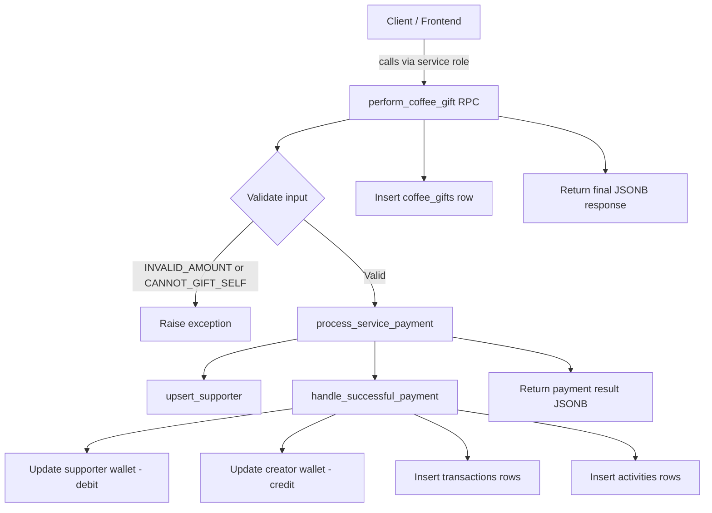

# Coffee Gifts Service — Backend Overview

The **Coffee Gifts** service is the core monetisation feature of HobeNakiCoffee. It lets supporters send one-time or monthly "coffee" gifts to creators. This section covers everything a backend developer needs to understand, maintain, and extend the service.

## What Does This Service Do?

A coffee gift is a micro-payment from a supporter to a creator. The service:

- Accepts payments from both **authenticated users** and **anonymous visitors**
- Supports both **one-time** and **monthly (subscription-style)** gifts
- Processes payments through a shared internal payment pipeline
- Records every completed gift as an immutable row in `coffee_gifts`
- Updates the creator's wallet balance automatically
- Creates unified activity feed entries for both parties
- Exposes analytics RPCs so creators and supporters can query their own stats

## Architecture at a Glance

## Table of Contents

| Page | What you'll learn |
|---|---|
| [Database Schema](./database-schema) | Table columns, constraints, indexes, triggers |
| [perform_coffee_gift RPC](./rpc-perform-coffee-gift) | The canonical entry point for gifting |
| [Stats RPCs](./rpc-stats) | Creator and supporter analytics functions |
| [Payment Pipeline](./payment-pipeline) | How `process_service_payment` works internally |
| [Security & RLS](./security-and-rls) | Row Level Security policies and SECURITY DEFINER rules |

## Key Design Principles

**Immutability** — A `coffee_gifts` row is created only after a successful payment and can never be updated or deleted by any user. The transactions table is the source of truth for money.

**Atomicity** — `perform_coffee_gift` wraps payment processing and gift insertion in a single transaction. Either both succeed or neither does.

**Anonymity-safe** — The system is designed to accommodate supporters who are not logged in. Anonymous supporters have no wallet; their identity is tracked via a server-generated `identity_hash`.

**Shared payment system** — Coffee gifts reuse the same `process_service_payment` → `handle_successful_payment` pipeline as every other paid service (newsletter memberships, etc.). There is no bespoke payment code in the coffee gifts layer.

## Related Schemas

The coffee gifts service touches several other schemas:

- `public.profiles` — creator and supporter identities
- `public.wallets` — balance ledger for creators (and authenticated supporters using the internal wallet)
- `public.transactions` — financial ledger; every gift produces two rows (debit + credit)
- `public.supporters` — aggregated supporter relationships and metrics per creator
- `public.activities` — unified public/private activity feed

## Enums Used

| Enum | Relevant Values |
|---|---|
| `provider_enum` | `HobeNakiCoffee`, `Bkash`, `Nagad`, `Rocket`, `Upay`, `SSLCommerz`, `Aamarpay`, `Portwallet`, `Tap`, `Other` |
| `reference_type_enum` | `one-time`, `subscription` |
| `supporter_platform_enum` | `facebook`, `x`, `instagram`, `youtube`, `github`, `linkedin`, `twitch`, `tiktok`, `threads`, `whatsapp`, `telegram`, `discord`, `reddit`, `pinterest`, `medium`, `devto`, `behance`, `dribbble` |
| `payment_status_enum` | `pending`, `processing`, `completed`, `failed`, `reversed`, `cancelled`, `refunded`, `reviewing` |
| `transaction_direction_enum` | `debit`, `credit` |
