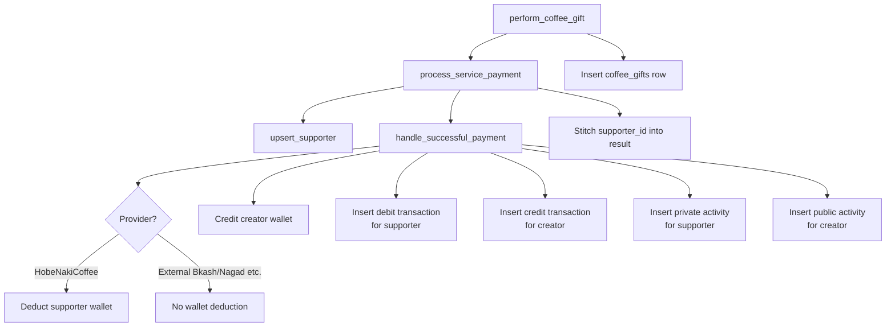

# Internal Payment Pipeline

The coffee gift service does not implement its own payment logic. Instead it delegates to a shared, reusable pipeline that every paid service on the platform uses. This page explains how that pipeline works.

## Pipeline Overview



---

## `process_service_payment`

This is the **internal orchestrator**. It is not called directly by clients. It wraps two lower-level calls into a single, consistent interface that service-specific RPCs (like `perform_coffee_gift`) can use.

### Responsibilities

1. **Upsert the supporter** — resolves or creates a `supporters` table record
2. **Run the payment** — wallet ops, transaction rows, activity rows
3. **Return a unified JSONB result** that includes the `supporter_id`

### Signature

```sql
create or replace function public.process_service_payment(
  p_creator_profile_id       uuid,
  p_supporter_profile_id     uuid,
  p_supporter_name           varchar,
  p_identity_hash            varchar,
  p_amount                   numeric(10,2),
  p_platform_fee             numeric(10,2),
  p_provider                 public.provider_enum,
  p_reference_type           public.reference_type_enum,
  p_provider_transaction_id  varchar,
  p_service_type             varchar,
  p_supporter_platform       public.supporter_platform_enum default null,
  p_metadata                 jsonb default '{}'::jsonb
)
returns jsonb
```

The `p_service_type` for coffee gifts is always `'gift'`.

---

## `upsert_supporter`

Creates or updates a `supporters` record for the (creator, supporter) pair. This is how the platform tracks cumulative support metrics (total amount given, support count, last service used, etc.).

### Key Logic

- For **authenticated supporters**: conflicts on `(user_profile_id, creator_id)`. If the supporter has gifted this creator before, metrics are incremented rather than replaced.
- For **anonymous supporters**: conflicts on `(creator_id, identity_hash)`. The same anonymous visitor gifting the same creator multiple times accumulates into one record.

```sql
-- Authenticated supporter upsert (simplified)
INSERT INTO public.supporters (user_profile_id, creator_id, name, ...)
VALUES (p_user_profile_id, p_creator_id, p_name, ...)
ON CONFLICT (user_profile_id, creator_id)
DO UPDATE SET
  last_supported_at      = now(),
  total_amount           = supporters.total_amount + excluded.total_amount,
  support_count          = supporters.support_count + 1,
  last_supported_service = excluded.last_supported_service;

-- Anonymous supporter upsert (simplified)
INSERT INTO public.supporters (user_profile_id, creator_id, name, ...)
VALUES (null, p_creator_id, p_name, ...)
ON CONFLICT (creator_id, identity_hash)
DO UPDATE SET
  total_amount  = supporters.total_amount + excluded.total_amount,
  support_count = supporters.support_count + 1;
```

The amount passed to `upsert_supporter` is the **net amount** (`p_amount - p_platform_fee`) — the actual value the creator receives.

---

## `handle_successful_payment`

This is the lowest-level function. It directly manipulates wallets, inserts transactions, and inserts activity records. It requires `auth.uid() IS NULL` (service role only).

### Step-by-Step

#### 1. Calculate net amount

```
net_amount = p_amount - p_platform_fee
```

#### 2. Handle supporter side (debit)

| Scenario | What Happens |
|---|---|
| Anonymous supporter (`supporter_profile_id IS NULL`) | No wallet operation. No debit transaction inserted. |
| Authenticated + `HobeNakiCoffee` provider | Wallet is locked (`SELECT ... FOR UPDATE`), balance checked, deducted. Debit transaction inserted. |
| Authenticated + external provider (Bkash, Nagad, etc.) | No wallet deduction (payment was external). Debit transaction still inserted for ledger history. |

#### 3. Credit creator wallet

Always runs — even for anonymous gifts. The creator's wallet is locked, credited with `net_amount`, and a credit transaction is inserted.

```sql
UPDATE public.wallets
SET balance   = balance + net_amount,
    updated_at = now()
WHERE profile_id = p_creator_profile_id;
```

#### 4. Insert transaction rows

Each payment produces **two transaction rows** — one per party:

| Row | `direction` | `user_profile_id` | `amount` | `net_amount` |
|---|---|---|---|---|
| Supporter (if authenticated) | `debit` | supporter | gross amount | net amount |
| Creator | `credit` | creator | gross amount | net amount |

Both rows share the same `reference_id` — this is the UUID that links back to `coffee_gifts.transaction_reference_id`.

The `metadata` JSONB column stores the gift-specific context (supporter_name, message, coffee_count, etc.) alongside a `role` key:

```json
// Supporter transaction metadata
{ "role": "supporter", "supporter_name": "John", "coffee_count": 3, ... }

// Creator transaction metadata
{ "role": "creator", "supporter_name": "John", "coffee_count": 3, ... }
```

#### 5. Insert activity records

Two activity rows are also inserted:

| Row | `role` | `visibility` | `user_profile_id` |
|---|---|---|---|
| Supporter (if authenticated) | `supporter` | `private` | supporter |
| Creator | `creator` | `public` | creator |

The creator's activity row is `public` and surfaces in their public gift feed. The supporter's row is `private` and visible only to them.

---

## Transaction Consistency

All the above operations happen in the same `BEGIN/COMMIT` block as `perform_coffee_gift` because PostgreSQL functions run within the caller's transaction by default. If any step fails:

- The wallet update is rolled back
- The transaction rows are rolled back
- The `coffee_gifts` insert is rolled back
- The exception propagates to the caller

This means you will **never** have a `coffee_gifts` row without corresponding `transactions` rows, and vice versa.

---

## Wallet Trigger: Sync `has_wallet_balance`

After any wallet balance change, a trigger fires to keep `profiles.has_wallet_balance` in sync:

```sql
create trigger on_wallet_balance_changed
  after insert or update of balance on public.wallets
  for each row
  execute procedure public.handle_wallet_balance_change();
```

`handle_wallet_balance_change()` sets `profiles.has_wallet_balance = (new.balance > 0)`. This allows the frontend to quickly check whether a creator has withdrawable funds without fetching the wallet record separately.

---

## Adding a New Payment Service

If you need to add another service (beyond gifts) that uses the payment pipeline, follow this pattern:

1. Create a new `public.perform_<service>()` RPC
2. Call `process_service_payment(...)` with the appropriate `p_service_type`
3. Insert into your service-specific table using the `reference_id` from the result
4. Return the merged JSONB response

Do **not** call `handle_successful_payment` or `upsert_supporter` directly from your new RPC — always go through `process_service_payment`.
