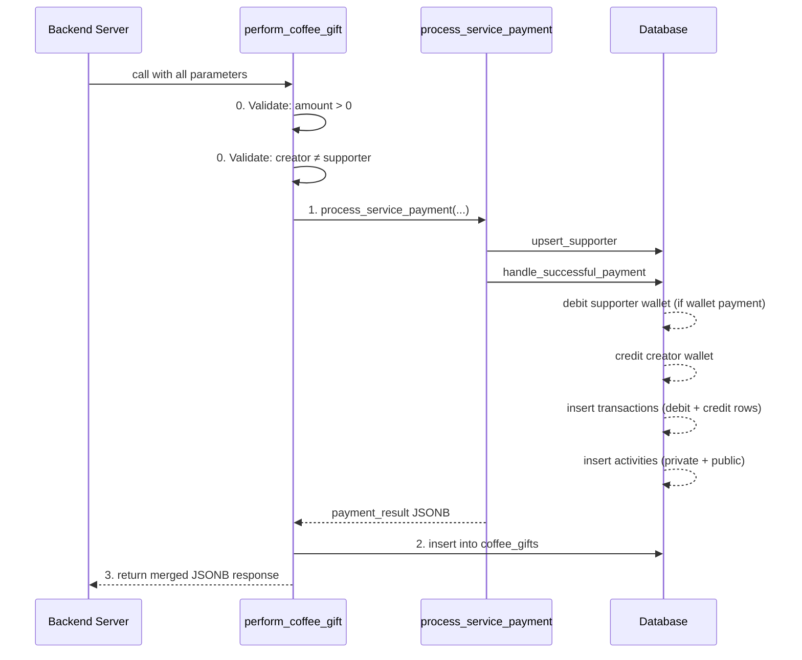

# RPC — `perform_coffee_gift`

`perform_coffee_gift` is the **canonical, atomic entry point** for all coffee gifting. It validates the request, runs the full payment pipeline, and inserts the `coffee_gifts` record — all inside a single database transaction.

::: warning Server-side only
This function is declared `SECURITY DEFINER` and can only be called via the **service role** (your backend server). Client-side calls will be rejected by the `handle_successful_payment` guard (`auth.uid() must be null`).
:::

## Function Signature

```sql
create or replace function public.perform_coffee_gift(
  p_creator_profile_id       uuid,
  p_supporter_profile_id     uuid,        -- NULL for anonymous supporters
  p_supporter_name           varchar,
  p_identity_hash            varchar,

  p_amount                   numeric(10,2),
  p_platform_fee             numeric(10,2),

  p_provider                 public.provider_enum,
  p_reference_type           public.reference_type_enum,
  p_provider_transaction_id  varchar,

  p_coffee_count             integer   default 1,
  p_message                  text      default null,
  p_supporter_platform       public.supporter_platform_enum default null,
  p_is_monthly               boolean   default false
)
returns jsonb
language plpgsql
security definer
set search_path = ''
```

## Parameter Reference

### Required Parameters

| Parameter | Type | Description |
|---|---|---|
| `p_creator_profile_id` | `uuid` | The profile ID of the creator receiving the gift. |
| `p_supporter_profile_id` | `uuid` | The profile ID of the authenticated supporter. Pass `NULL` for anonymous. |
| `p_supporter_name` | `varchar` | Display name used to identify the supporter (shown on creator's feed). |
| `p_identity_hash` | `varchar` | Deterministic hash for deduplication. See [Identity Hash](#identity-hash). |
| `p_amount` | `numeric(10,2)` | Total payment amount (gross). Must be `> 0`. |
| `p_platform_fee` | `numeric(10,2)` | Platform cut deducted from `p_amount`. `net = amount − fee`. |
| `p_provider` | `provider_enum` | Payment provider used. E.g. `'Bkash'`, `'HobeNakiCoffee'`. |
| `p_reference_type` | `reference_type_enum` | `'one-time'` or `'subscription'`. |
| `p_provider_transaction_id` | `varchar` | Provider's own transaction ID for reconciliation. |

### Optional Parameters

| Parameter | Type | Default | Description |
|---|---|---|---|
| `p_coffee_count` | `integer` | `1` | Number of coffees in this gift. |
| `p_message` | `text` | `null` | Optional message from the supporter. Max 500 chars enforced at the table level. |
| `p_supporter_platform` | `supporter_platform_enum` | `null` | Social platform the supporter came from. |
| `p_is_monthly` | `boolean` | `false` | `true` for a monthly recurring gift. |

## Return Value

The function returns a `jsonb` object merging the payment result with a `success` flag:

```json
{
  "success": true,
  "reference_id": "550e8400-e29b-41d4-a716-446655440000",
  "supporter_transaction_id": "a1b2c3d4-...",
  "creator_transaction_id": "e5f6g7h8-...",
  "supporter_balance_after": 350.00,
  "creator_balance_after": 1090.00,
  "supporter_id": "fa29c1e3-..."
}
```

| Field | Type | Description |
|---|---|---|
| `success` | `boolean` | Always `true` on success; exceptions are thrown on failure. |
| `reference_id` | `uuid` | The shared reference ID linking `coffee_gifts` to `transactions`. |
| `supporter_transaction_id` | `uuid` | ID of the debit transaction row (authenticated supporters only; `null` for anonymous). |
| `creator_transaction_id` | `uuid` | ID of the credit transaction row. |
| `supporter_balance_after` | `numeric` | Supporter's wallet balance after deduction (authenticated wallet payments only). |
| `creator_balance_after` | `numeric` | Creator's wallet balance after the credit. |
| `supporter_id` | `uuid` | The resolved or newly-created `supporters` table row ID. |

## Execution Flow



### Step 0 — Validation

Two guards run before any database writes:

```sql
-- Guard 1: Amount must be positive
if p_amount <= 0 then
  raise exception 'INVALID_AMOUNT'
    using errcode = 'P0001',
          detail  = 'Amount must be greater than zero.';
end if;

-- Guard 2: Self-gifting is not allowed
if p_creator_profile_id = p_supporter_profile_id then
  raise exception 'CANNOT_GIFT_SELF'
    using errcode = 'P0001',
          detail  = 'You cannot gift yourself.';
end if;
```

### Step 1 — Process Payment

Delegates to `process_service_payment` with `p_service_type = 'gift'`. This handles supporter upsert, wallet operations, transaction ledger rows, and activity feed entries. See [Payment Pipeline](./payment-pipeline) for a full breakdown.

The metadata stored in the transaction and activity rows is:

```json
{
  "supporter_name": "...",
  "supporter_platform": "...",
  "message": "...",
  "coffee_count": 3,
  "is_monthly": false,
  "identity_hash": "..."
}
```

### Step 2 — Insert Gift Record

```sql
insert into public.coffee_gifts (
  creator_profile_id,
  supporter_profile_id,
  supporter_name,
  supporter_platform,
  message,
  coffee_count,
  is_monthly,
  transaction_reference_id,
  supporter_identity_hash
) values (
  p_creator_profile_id,
  p_supporter_profile_id,
  p_supporter_name,
  p_supporter_platform,
  p_message,
  p_coffee_count,
  p_is_monthly,
  v_reference_id,           -- extracted from the payment result
  p_identity_hash
);
```

### Step 3 — Return Response

The final response merges the payment result JSONB with `{ "success": true, "reference_id": v_reference_id }`.

## Error Handling

| Error Message | When It's Raised |
|---|---|
| `INVALID_AMOUNT` | `p_amount <= 0` |
| `CANNOT_GIFT_SELF` | `p_creator_profile_id = p_supporter_profile_id` |
| `Insufficient wallet balance` | Supporter is using `HobeNakiCoffee` wallet and has insufficient funds |
| `Amount must be greater than zero` | Re-validated in `handle_successful_payment` |
| `Platform fee cannot exceed amount` | `p_platform_fee > p_amount` |

All errors propagate via `raise exception '%', sqlerrm` in the `exception` block, so the caller always receives a clean error message string.

## Identity Hash

The `p_identity_hash` is used to deduplicate supporters across gifts — especially important for anonymous visitors who send multiple gifts to the same creator. Your backend should generate this hash server-side using a stable combination of inputs:

```
identity_hash = hash(creator_id + display_name + client_ip + user_agent)
```

For authenticated users, the same hash logic applies; the `supporter_profile_id` additionally links to the user account.

::: tip
Never generate the identity hash client-side. It must come from your trusted backend so it cannot be spoofed.
:::

## Example Usage (from your backend)

```typescript
// TypeScript example using the Supabase service-role client
const { data, error } = await supabaseAdmin.rpc('perform_coffee_gift', {
  p_creator_profile_id: 'uuid-of-creator',
  p_supporter_profile_id: 'uuid-of-supporter',   // null for anonymous
  p_supporter_name: 'John Doe',
  p_identity_hash: computedIdentityHash,

  p_amount: 150.00,
  p_platform_fee: 15.00,

  p_provider: 'Bkash',
  p_reference_type: 'one-time',
  p_provider_transaction_id: 'TXN12345BKASH',

  p_coffee_count: 3,
  p_message: 'Keep up the great work!',
  p_supporter_platform: 'facebook',
  p_is_monthly: false,
});

if (error) {
  // error.message will contain e.g. "INVALID_AMOUNT" or "CANNOT_GIFT_SELF"
  throw new Error(error.message);
}

console.log(data.reference_id);         // UUID linking gift ↔ transactions
console.log(data.creator_balance_after); // Creator's new wallet balance
```

### Anonymous Supporter Example

```typescript
const { data, error } = await supabaseAdmin.rpc('perform_coffee_gift', {
  p_creator_profile_id: 'uuid-of-creator',
  p_supporter_profile_id: null,               // anonymous — no user account
  p_supporter_name: 'Anonymous Coffee Fan',
  p_identity_hash: computedIdentityHash,

  p_amount: 50.00,
  p_platform_fee: 5.00,

  p_provider: 'Nagad',
  p_reference_type: 'one-time',
  p_provider_transaction_id: 'NAGAD_TXN_9876',

  p_coffee_count: 1,
  p_message: null,
  p_supporter_platform: null,
  p_is_monthly: false,
});
```
