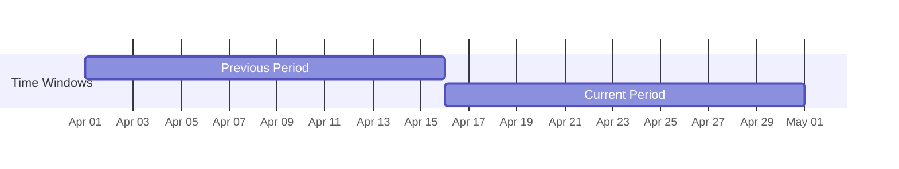
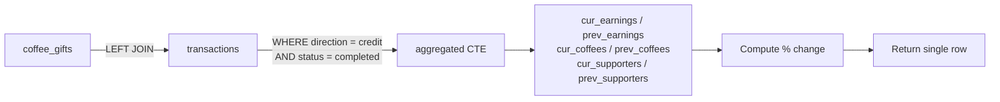

# Stats RPCs

Two analytics functions expose gift statistics for dashboards and reporting. Both are `SECURITY DEFINER` and scoped to a specific profile — no cross-user data leakage is possible.

---

## `get_creator_coffee_gifts_stats`

Returns aggregate metrics for a **creator's dashboard**: total earnings, coffee count, and unique supporter count — each with a period-over-period percentage change.

### Signature

```sql
CREATE OR REPLACE FUNCTION public.get_creator_coffee_gifts_stats(
  p_creator_profile_id uuid,
  p_from_date          timestamptz default null,
  p_to_date            timestamptz default null
)
RETURNS TABLE (
  total_earnings          numeric,
  total_earnings_change   numeric,
  total_coffees           bigint,
  total_coffees_change    numeric,
  unique_supporters       bigint,
  unique_supporters_change numeric
)
```

### Parameters

| Parameter | Type | Default | Description |
|---|---|---|---|
| `p_creator_profile_id` | `uuid` | — | The creator whose stats to fetch. |
| `p_from_date` | `timestamptz` | `null` | Start of the current period (inclusive). |
| `p_to_date` | `timestamptz` | `null` | End of the current period (inclusive). One day is added internally to make the range inclusive. |

### Return Columns

| Column | Type | Description |
|---|---|---|
| `total_earnings` | `numeric` | Sum of `net_amount` (credits) for completed transactions in the current period. |
| `total_earnings_change` | `numeric` | Percentage change vs the equivalent prior period. `100` if prior period was zero with current > 0. |
| `total_coffees` | `bigint` | Sum of `coffee_count` for all gifts in the current period. |
| `total_coffees_change` | `numeric` | Percentage change vs prior period. |
| `unique_supporters` | `bigint` | Count of distinct `supporter_identity_hash` values in the current period. |
| `unique_supporters_change` | `numeric` | Percentage change vs prior period. |

### How Period-Over-Period Works

The function computes the **previous period** automatically as the window of the same length immediately before `p_from_date`. For example, if you pass a 30-day range, the previous period is the prior 30 days.

```
Current:  [p_from_date  →  p_to_date + 1 day)
Previous: [p_from_date − duration  →  p_from_date)
```

Both periods are scanned in **a single query pass** for efficiency:



### Change Percentage Formula

| Case | Result |
|---|---|
| Both periods are `0` | `0` |
| Previous is `0`, current > `0` | `100` (new activity) |
| Otherwise | `ROUND((current - previous) / previous * 100, 2)` |

### Example Usage

```typescript
const { data, error } = await supabaseAdmin.rpc('get_creator_coffee_gifts_stats', {
  p_creator_profile_id: 'uuid-of-creator',
  p_from_date: '2026-04-01T00:00:00Z',
  p_to_date:   '2026-04-30T23:59:59Z',
});

// data[0] contains the single result row:
console.log(data[0].total_earnings);           // e.g. 2750.00
console.log(data[0].total_earnings_change);    // e.g. 14.29 (%)
console.log(data[0].total_coffees);            // e.g. 55
console.log(data[0].unique_supporters);        // e.g. 12
```

### Query Internals



The join uses `t.reference_id = cg.transaction_reference_id` and filters `direction = 'credit'` and `status = 'completed'`. This ensures only the creator's side of the ledger is counted — the supporter's debit row is excluded.

---

## `get_supporter_coffee_gifts_stats`

Returns aggregate metrics for a **supporter's profile**: total amount spent, coffees gifted, and number of unique creators supported.

### Signature

```sql
CREATE OR REPLACE FUNCTION public.get_supporter_coffee_gifts_stats(
  p_supporter_profile_id uuid,
  p_from_date            timestamptz,
  p_to_date              timestamptz
)
RETURNS TABLE (
  total_spent        numeric,
  coffees_gifted     bigint,
  creators_supported bigint
)
```

### Parameters

| Parameter | Type | Description |
|---|---|---|
| `p_supporter_profile_id` | `uuid` | The authenticated supporter's profile ID. |
| `p_from_date` | `timestamptz` | Start of the period (inclusive). |
| `p_to_date` | `timestamptz` | End of the period. One day is added internally for inclusivity. |

### Return Columns

| Column | Type | Description |
|---|---|---|
| `total_spent` | `numeric` | Sum of `transactions.amount` (gross, including platform fee) for completed debit transactions. |
| `coffees_gifted` | `bigint` | Total `coffee_count` across all gifts in the period. |
| `creators_supported` | `bigint` | Count of distinct `creator_profile_id` values — i.e., how many different creators were gifted. |

::: info Note on `total_spent`
This uses `t.amount` (gross), not `t.net_amount`, because from the supporter's perspective they paid the full amount. The creator receives `net_amount` after the platform fee.
:::

### Example Usage

```typescript
const { data, error } = await supabaseAdmin.rpc('get_supporter_coffee_gifts_stats', {
  p_supporter_profile_id: 'uuid-of-supporter',
  p_from_date: '2026-04-01T00:00:00Z',
  p_to_date:   '2026-04-30T23:59:59Z',
});

console.log(data[0].total_spent);          // e.g. 450.00
console.log(data[0].coffees_gifted);       // e.g. 9
console.log(data[0].creators_supported);   // e.g. 4
```

---

## Comparison: Creator vs Supporter Stats

| | Creator Stats | Supporter Stats |
|---|---|---|
| **Scoped to** | `creator_profile_id` | `supporter_profile_id` |
| **Amount column** | `net_amount` (after fee) | `amount` (gross paid) |
| **Transaction direction** | `credit` | `debit` |
| **Period comparison** | Yes (% change) | No |
| **Unique count** | Unique supporters (by hash) | Unique creators |

---

## Security Notes

Both functions are declared `SECURITY DEFINER` and `STABLE` (no writes):

- They do **not** use `auth.uid()` internally — the caller passes the profile ID explicitly.
- Your backend must validate that the requesting user is allowed to query the given profile ID before calling these RPCs.
- Both functions set `search_path = ''` to prevent search-path injection attacks.

---

## `get_supporters_with_profiles`

Defined in `supporters.sql` (not `coffee_gifts.sql` like the two functions above). Powers the **Supporters page list** — the creator's full, searchable, paginated list of everyone who has supported them.

Unlike the stats RPCs above, this function takes **no profile-id parameter**: it is always scoped internally to `creator_id = auth.uid()`, so the caller cannot request another creator's supporters.

### Signature

```sql
CREATE OR REPLACE FUNCTION public.get_supporters_with_profiles(
  p_search    varchar default null,
  p_from_date timestamptz default null,
  p_to_date   timestamptz default null,
  p_type      varchar default null,
  p_limit     int default 12,
  p_offset    int default 0
)
RETURNS TABLE (
  id, user_profile_id, creator_id, name, social_platform,
  first_supported_at, last_supported_at, total_amount, support_count,
  last_supported_service, is_monthly, conversation_id, identity_hash,
  metadata, created_at, updated_at,
  profile_id, profile_username, profile_display_name, profile_avatar_url,
  total_count
)
```

### Parameters

| Parameter | Type | Default | Description |
|---|---|---|---|
| `p_search` | `varchar` | `null` | Case-insensitive `ilike` match against `supporters.name`. |
| `p_from_date` / `p_to_date` | `timestamptz` | `null` | Filters on `last_supported_at`. |
| `p_type` | `varchar` | `null` | `'monthly'`, `'one_time'`, or `'all'`/`null` for no filter. |
| `p_limit` / `p_offset` | `int` | `12` / `0` | Pagination. |

### Return Columns

All columns from `public.supporters`, plus the supporter's public profile fields (`profile_id`, `profile_username`, `profile_display_name`, `profile_avatar_url`) joined in from `public.public_profiles` — avoiding a second client-side query or embedding the RLS-restricted base `profiles` table. `total_count` is a window-function (`count(*) over()`) count of the full matching set, independent of `p_limit`/`p_offset`, so the client can paginate without a separate count query.

### Example Usage

```typescript
const { data, error } = await supabase.rpc('get_supporters_with_profiles', {
  p_search: 'maria',
  p_type: 'monthly',
  p_limit: 12,
  p_offset: 0,
});

console.log(data[0].profile_username);  // joined from public_profiles
console.log(data[0].total_count);       // total matching rows, ignoring p_limit
```

### Security

`SECURITY DEFINER`, `STABLE`, `search_path = ''`. Scoped to `creator_id = (select auth.uid())` — `p_search`/`p_type`/the date range are filters only, never an identity parameter, so no creator can query another creator's supporters.

```sql
revoke execute on function public.get_supporters_with_profiles(varchar, timestamptz, timestamptz, varchar, int, int) from public, anon;
grant execute on function public.get_supporters_with_profiles(varchar, timestamptz, timestamptz, varchar, int, int) to authenticated;
```
