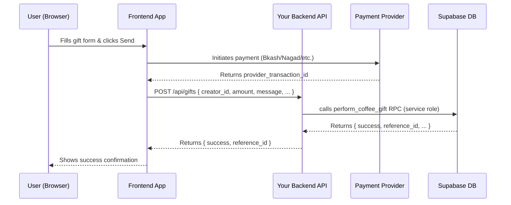

# Coffee Gifts Service — Frontend Overview

This section is for frontend developers building the gifting UI. You don't need to understand the database internals — your job is to call the right API routes and display the results correctly.

## What You Need to Know

The coffee gift flow is a **two-phase process**:

1. **Payment phase** — The user completes payment through an external provider (Bkash, Nagad, etc.) or the HobeNakiCoffee internal wallet. Your frontend initiates this and receives a provider transaction ID.
2. **Gift recording phase** — Your frontend calls your backend server (never Supabase directly), which calls `perform_coffee_gift` to record the gift atomically.



## Pages in This Section

| Page | What you'll learn |
|---|---|
| [Sending a Gift](./sending-a-gift) | How to build the gift form and call the backend API |
| [Anonymous vs Authenticated](./anonymous-vs-authenticated) | How to handle both supporter types |
| [Displaying Gifts](./displaying-gifts) | How to fetch and render a creator's gift feed |
| [Stats & Analytics](./stats) | How to show creator/supporter dashboard cards |

## Key Rules for Frontend Developers

**Never call Supabase RPCs directly for writes.** The `perform_coffee_gift` function requires the service role key, which must stay on the server. Always proxy through your backend API.

**For reads (SELECT), you can query Supabase directly** using the anon key or the user's session token. The RLS policies allow public reads on `coffee_gifts`.

**Validate before submitting.** Check the following client-side before the API call:
- `coffee_count >= 1`
- `amount > 0`
- `creator_id !== currentUser?.id` (prevent self-gifting)
- `message` is at most 500 characters

**Handle errors by message string.** Your backend will forward the database error messages. The ones you should handle explicitly are `INVALID_AMOUNT` and `CANNOT_GIFT_SELF`. Any other error is likely a network or server issue.

## Supabase Client Setup

For read-only queries you can use the public anon client:

```typescript
import { createClient } from '@supabase/supabase-js'

export const supabase = createClient(
  process.env.NEXT_PUBLIC_SUPABASE_URL!,
  process.env.NEXT_PUBLIC_SUPABASE_ANON_KEY!
)
```

Your backend server uses the service-role client — that config never goes to the browser.

## Environment Variables

| Variable | Where Used | Description |
|---|---|---|
| `NEXT_PUBLIC_SUPABASE_URL` | Frontend | Your Supabase project URL |
| `NEXT_PUBLIC_SUPABASE_ANON_KEY` | Frontend | Public anon key for read queries |
| `SUPABASE_SERVICE_ROLE_KEY` | **Backend only** | Service role key for RPC calls — never expose this |
