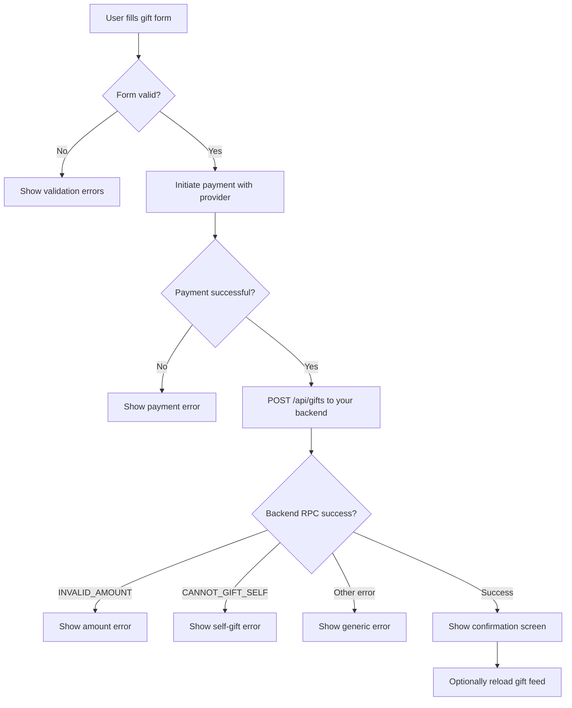

# Sending a Coffee Gift

This page walks through the complete flow for submitting a coffee gift from the frontend — from the gift form to the success screen.

## The Gift Form

A minimal gift form needs to collect:

- **Coffee count** — how many coffees to send (default: 1)
- **Supporter name** — display name (pre-filled for logged-in users)
- **Message** — optional (max 500 chars)
- **Social platform** — optional (where the supporter is coming from)
- **Payment method** — Bkash, Nagad, internal wallet, etc.

```typescript
interface GiftFormValues {
  coffeeCount: number        // >= 1
  supporterName: string      // required
  message?: string           // max 500 chars
  supporterPlatform?: string // e.g. 'facebook', 'github'
  paymentMethod: string      // e.g. 'bkash', 'nagad', 'wallet'
  isMonthly: boolean         // default: false
}
```

## Step 1 — Initiate Payment with Provider

Before calling your backend, initiate the payment with the external provider. Each provider has its own SDK/API, but the result you need is a `providerTransactionId` that proves the payment was made.

```typescript
// Example: Bkash payment initiation (pseudocode)
async function initiateBkashPayment(amount: number): Promise<string> {
  const response = await fetch('/api/payments/bkash/create', {
    method: 'POST',
    body: JSON.stringify({ amount }),
  })
  const { transactionId } = await response.json()
  return transactionId // e.g. "TXN8PK2BKASH"
}
```

For **internal wallet** payments, you skip the external provider step entirely and set `provider = 'HobeNakiCoffee'`.

## Step 2 — Call Your Backend API

Once you have the `providerTransactionId`, call your backend. Your backend will compute the `identityHash`, apply the platform fee, and call the Supabase RPC.

```typescript
interface SendGiftPayload {
  creatorId: string
  coffeeCount: number
  amount: number
  supporterName: string
  message?: string
  supporterPlatform?: string
  isMonthly: boolean
  provider: string
  providerTransactionId: string
}

async function sendCoffeeGift(payload: SendGiftPayload) {
  const response = await fetch('/api/gifts', {
    method: 'POST',
    headers: { 'Content-Type': 'application/json' },
    body: JSON.stringify(payload),
  })

  if (!response.ok) {
    const error = await response.json()
    throw new GiftError(error.message, error.code)
  }

  return response.json() // { success, referenceId }
}
```

## Step 3 — Handle the Response

```typescript
try {
  const result = await sendCoffeeGift({
    creatorId: creator.id,
    coffeeCount: form.coffeeCount,
    amount: calculateTotal(form.coffeeCount),
    supporterName: form.supporterName,
    message: form.message,
    supporterPlatform: form.supporterPlatform,
    isMonthly: form.isMonthly,
    provider: form.paymentMethod,
    providerTransactionId: txId,
  })

  // Success: show confirmation
  showConfirmation(result.referenceId)

} catch (error) {
  if (error.code === 'INVALID_AMOUNT') {
    showError('Gift amount must be greater than zero.')
  } else if (error.code === 'CANNOT_GIFT_SELF') {
    showError('You cannot send a coffee gift to yourself.')
  } else {
    showError('Something went wrong. Please try again.')
    reportError(error)
  }
}
```

## Backend API Handler (Reference)

This is what your backend API route should do when it receives the frontend request. It lives on your server, never in the browser.

```typescript
// pages/api/gifts.ts  (Next.js example)
import { createClient } from '@supabase/supabase-js'
import { generateIdentityHash } from '@/lib/identity'
import { PLATFORM_FEE_RATE } from '@/lib/constants'

const supabaseAdmin = createClient(
  process.env.SUPABASE_URL!,
  process.env.SUPABASE_SERVICE_ROLE_KEY!  // ← server-side only!
)

export async function POST(req: Request) {
  const body = await req.json()
  const session = await getSession(req) // your auth helper

  const platformFee = parseFloat(
    (body.amount * PLATFORM_FEE_RATE).toFixed(2)
  )

  // Generate identity hash server-side
  const identityHash = generateIdentityHash({
    creatorId: body.creatorId,
    name: body.supporterName,
    ip: req.headers['x-forwarded-for'],
    userAgent: req.headers['user-agent'],
  })

  // Platform fee is computed server-side inside perform_coffee_gift — do NOT pass it.
  const { data, error } = await supabaseAdmin.rpc('perform_coffee_gift', {
    p_creator_profile_id:      body.creatorId,
    p_supporter_profile_id:    session?.user?.id ?? null,
    p_supporter_name:          body.supporterName,
    p_identity_hash:           identityHash,
    p_amount:                  body.amount,
    p_provider:                body.provider,
    p_reference_type:          body.isMonthly ? 'subscription' : 'one-time',
    p_provider_transaction_id: body.providerTransactionId,
    p_coffee_count:            body.coffeeCount,
    p_message:                 body.message ?? null,
    p_supporter_platform:      body.supporterPlatform ?? null,
    p_is_monthly:              body.isMonthly,
  })

  if (error) {
    return Response.json(
      { message: error.message, code: extractErrorCode(error.message) },
      { status: 400 }
    )
  }

  return Response.json({ success: true, referenceId: data.reference_id })
}
```

## Coffee Price Calculation

The `amount` sent to the backend should already be in the smallest unit your backend expects (e.g. taka). The platform fee is computed server-side — don't send it from the frontend.

A typical price table might look like:

| Coffees | Price |
|---|---|
| 1 | ৳50 |
| 3 | ৳150 |
| 5 | ৳250 |
| 10 | ৳500 |

```typescript
const COFFEE_PRICE = 50 // in taka

function calculateTotal(coffeeCount: number): number {
  return coffeeCount * COFFEE_PRICE
}
```

## Validation Checklist (Client-Side)

Run these checks before initiating the payment, to give fast feedback:

```typescript
function validateGiftForm(form: GiftFormValues, currentUserId?: string, creatorId?: string): string[] {
  const errors: string[] = []

  if (form.coffeeCount < 1) {
    errors.push('You must send at least one coffee.')
  }
  if (!form.supporterName.trim()) {
    errors.push('Please enter your name.')
  }
  if (form.message && form.message.length > 500) {
    errors.push('Message must be 500 characters or less.')
  }
  if (currentUserId && currentUserId === creatorId) {
    errors.push('You cannot gift yourself.')
  }

  return errors
}
```

## Complete Flow Diagram


