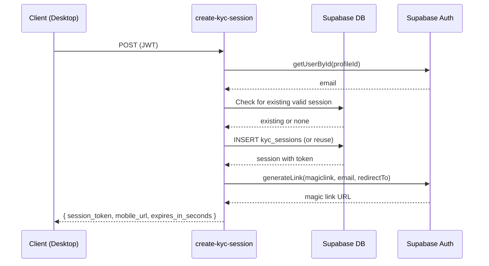

# Edge Function: `create-kyc-session`

Creates a KYC (Know Your Creator) verification session for the mobile document capture flow. The session generates a magic link that the creator opens on their phone to upload identity documents.

## Configuration

| Property | Value |
|---|---|
| **Method** | `POST` |
| **Auth Required** | Yes |
| **Rate Limit Tier** | `strict` (2 req / 60s) |

```
withMiddleware(handler, { requireAuth: true, rateLimit: { tier: "strict" } })
```

## Flow



## Request

### Headers

| Header | Required | Value |
|---|---|---|
| `Authorization` | Yes | `Bearer <supabase-jwt>` |

### Body

None. The authenticated user is identified via JWT claims (`claims.sub`).

## Response

### Success (200)

```json
{
  "session_token": "550e8400-e29b-41d4-a716-446655440000",
  "mobile_url": "https://<project>.supabase.co/auth/v1/verify?token=xxx&type=magiclink&redirect_to=https://app.hobenakicoffee.com/kyc/mobile?session_token=550e8400-e29b-41d4-a716-446655440000",
  "expires_in_seconds": 1800
}
```

| Field | Type | Description |
|---|---|---|
| `session_token` | `string` (uuid) | Unique token identifying this KYC session |
| `mobile_url` | `string` (url) | Full magic link URL for the creator to open on mobile |
| `expires_in_seconds` | `number` | Session TTL (always 1800 = 30 minutes) |

## Implementation Details

### Session Reuse

Before creating a new session, the function checks for an existing session with status `pending` or `opened` that has not expired. If one exists, it is reused (same token, same magic link). Otherwise, a new row is inserted.

### Session Expiry

Sessions have an `expires_at` constraint (`now() + 30 minutes`). Expired sessions are automatically marked by a `pg_cron` job:

```sql
select cron.schedule(
  'expire-kyc-sessions', '0 * * * *',
  $$
    update public.kyc_sessions
    set status = 'expired', updated_at = now()
    where status in ('pending','opened') and expires_at < now();
  $$
);
```

The edge function also checks expiry at creation time — if the user's only existing session is expired, it creates a new one.

### Magic Link Generation

```typescript
const { data, error } = await supabaseAdmin.auth.admin.generateLink({
  type: "magiclink",
  email: user.email,
  options: {
    redirectTo: `${APP_URL}/kyc/mobile?session_token=${session.token}`,
    shouldCreateUser: false,
  },
});
```

- `shouldCreateUser: false` — prevents account creation if the email doesn't exist
- The `session_token` is embedded in the redirect URL query string

### Email Lookup

The `JwtClaims` object does **not** include the user's email. The function fetches it via:

```typescript
const { data: user } = await supabaseAdmin.auth.admin.getUserById(profileId);
const email = user?.email;
```

## Errors

| Status | Condition |
|---|---|
| 401 | Missing or invalid JWT |
| 429 | Rate limit exceeded |
| 500 | Failed to fetch user, generate magic link, or create session |

## Environment Variables

| Variable | Required | Description |
|---|---|---|
| `APP_URL` | Yes | Base URL of the application (e.g. `https://app.hobenakicoffee.com`) |

## Dependencies

- Supabase Auth Admin API — `getUserById`, `generateLink`
- `kyc_sessions` table — stores session rows
- `crypto.randomUUID()` — token generation

## Related

- [KYC Backend Implementation Guide](../../kyc/index.md) — full KYC system documentation
- `generate-kyc-upload-urls` — generates signed upload URLs for mobile document capture
- `submit-kyc` — final submission of KYC data after document upload
