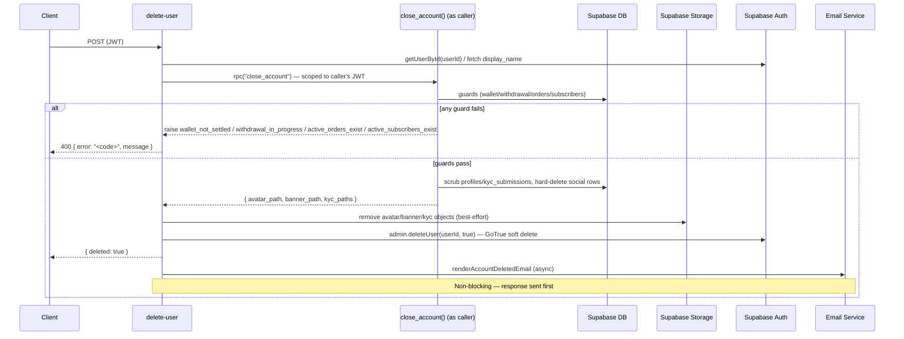

# Edge Function: `delete-user`

Closes a user account via **anonymize-in-place**, not a hard delete. `profiles.id` is the same value as `auth.users.id` (`profiles.id references auth.users on delete cascade`), and a large set of financial tables (`transactions`, `wallets`, `withdrawal_requests`, `refunds`, `shop_orders`, `creator_platform_subscriptions`, `profile_memberships`, `supporters`, ...) reference `profiles(id)` and must be retained for money-flow/legal reasons. Hard-deleting `auth.users` would cascade away `profiles` and, with it, every one of those financial rows — so this function never calls a plain `auth.admin.deleteUser(id)`.

Instead: `public.close_account()` scrubs PII on the `profiles` row in place (kept as a tombstone, so every financial FK stays valid unchanged) and hard-deletes pure social/content rows. The edge function then deletes the returned Storage objects and disables sign-in via GoTrue's native soft-delete (`auth.admin.deleteUser(id, true)`), which keeps `auth.users`/`profiles.id` intact while permanently revoking authentication (password, magic link, and any linked OAuth identity).

## Configuration

| Property | Value |
|---|---|
| **Method** | `POST` |
| **Auth Required** | Yes |
| **Rate Limit Tier** | `strict` (2 req / 60s) |

```
withMiddleware(handler, { requireAuth: true, rateLimit: { tier: "strict" } })
```

## Flow



## Request

### Headers

| Header | Required | Value |
|---|---|---|
| `Authorization` | Yes | `Bearer <supabase-jwt>` |

### Body

None. The authenticated user is identified via JWT claims (`claims.sub`), and `close_account()` acts only on `auth.uid()` — there is no target-user parameter.

## Response

### Success (200)

```json
{
  "deleted": true
}
```

### Guard failure (400)

```json
{
  "error": "wallet_not_settled",
  "message": "Withdraw your balance and settle any COD debt before closing your account."
}
```

`error` is a stable, lowercase snake_case code the frontend can switch on for localization — matching the convention already used by `rate_limit_exceeded`, `unauthorized`, etc. Possible codes:

| Code | Meaning |
|---|---|
| `wallet_not_settled` | `wallets.balance`, `locked_balance`, or `cod_debt` is non-zero |
| `withdrawal_in_progress` | A `withdrawal_requests` row is `requested`/`approved`/`processing` |
| `active_orders_exist` | A `shop_order_items` row (as buyer or seller) is not yet `fulfilled`/`delivered`/`cancelled`/`refunded` |
| `active_subscribers_exist` | An owned `membership_plans` row still has an `active` `profile_memberships` subscriber |

None of these guards auto-forfeit balances or auto-cancel obligations — the user must resolve them first, then retry.

## Implementation Details

### User Lookup

Identity is fetched **before** anonymization scrubs `display_name`, purely for the win-back email:

```typescript
const [{ data: userData }, { data: profileData }] = await Promise.all([
  supabaseAdmin.auth.admin.getUserById(userId),
  supabaseAdmin.from("profiles").select("display_name").eq("id", userId).maybeSingle(),
]);
```

### `close_account()` RPC

Called via a client scoped to the caller's own JWT (not the service-role client), so `auth.uid()` resolves inside the function:

```typescript
const supabaseAsCaller = createClient(SUPABASE_URL, SUPABASE_ANON_KEY, {
  global: { headers: { Authorization: authHeader } },
});
const { data, error } = await supabaseAsCaller.rpc("close_account");
```

Defined in `supabase/schemas/account_closure.sql`. In one transaction it:
- Blocks entirely (see guard table above) if there's any unsettled wallet balance, in-flight withdrawal, non-terminal order, or active subscriber — no partial effects.
- Captures `avatar_url`/`banner_url` from `profiles` and all non-null KYC document paths from `kyc_submissions` for later Storage cleanup (SQL never touches `storage.objects`).
- Hard-deletes pure social/content rows: feed likes/comments/bookmarks/shares/items, follows, own messages/conversation participation, reviews, service requests, notification preferences, addresses, payout methods, KYC sessions, own-filed creator reports.
- Deletes non-financial `activities` rows (`transaction_id is null`); keeps financial ones.
- Hard-deletes newsletter posts / shop products only if no third-party purchase evidence exists (`post_access_grants` / `shop_order_items`); otherwise scrubs content and flips the existing soft-delete flag, since hard-deleting would cascade away another user's purchase record.
- Purges `kyc_submissions` PII (`nid_number`, `nid_front_path`, `nid_back_path`, `selfie_path`) but keeps the row as a compliance stub (status, timestamps, consent fields).
- Scrubs `profiles` PII in place (`display_name → 'Deleted User'`, avatar/banner/bio/social links/tax numbers cleared, `is_page_active`/`allow_gifting`/`allow_subscriptions` set false) — **the row is never deleted**.

### Storage Cleanup

Best-effort, logged but never blocks the response:

```typescript
if (result.avatar_path) await supabaseAdmin.storage.from("avatars").remove([result.avatar_path]);
if (result.banner_path) await supabaseAdmin.storage.from("banners").remove([result.banner_path]);
if (result.kyc_paths?.length) await supabaseAdmin.storage.from("kyc-documents").remove(result.kyc_paths);
```

### Auth Soft Delete

```typescript
const { error } = await supabaseAdmin.auth.admin.deleteUser(userId, true);
```

GoTrue's `shouldSoftDelete = true` mode keeps the `auth.users` row/id intact (so `profiles.id` and every financial FK stay valid) while permanently scrambling credentials and disabling sign-in through any provider — password, magic link, Google, Facebook. This is not a fallback path; it's the only auth-deletion call this function makes.

### Win-Back Email

Unchanged: sent asynchronously after everything else succeeds, never blocks the response.

```typescript
sendEmail({ to: userEmail, subject, html }).catch(console.error);
```

## Errors

| Status | Condition |
|---|---|
| 400 | A `close_account()` guard fired (see codes above) |
| 401 | Missing or invalid JWT |
| 405 | Method other than `POST` |
| 429 | Rate limit exceeded |
| 500 | Unexpected RPC error, or Supabase Admin API failure |

## Security Notes

- **Requires authentication**: `close_account()` only ever acts on `auth.uid()` — there is no way to close another user's account, and the function is revoked from `anon`/`public`.
- **Strict rate limit**: 2 requests per 60 seconds.
- **Never hard-deletes**: `profiles`/`auth.users` rows are always retained (anonymized), because deleting them would break every financial table's foreign key. This is a deliberate legal-retention design, not an oversight.
- **No auto-forfeiture**: guards block closure rather than silently writing off a balance or cancelling an obligation on the user's behalf.
- **Win-back email**: Provides a last touchpoint with the user, but does not prevent or delay the closure.
