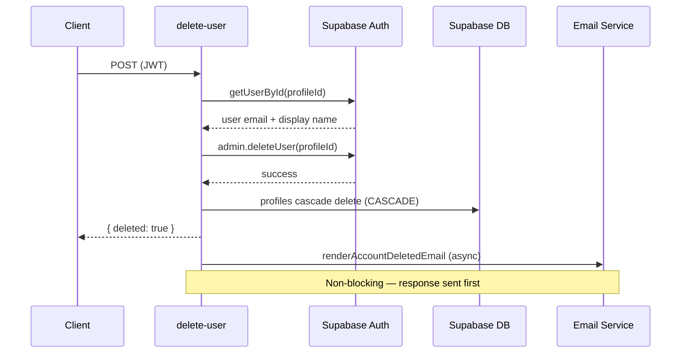

# Edge Function: `delete-user`

Permanently deletes a user account. This is a destructive operation that removes the auth user and cascades to all related data.

## Configuration

| Property | Value |
|---|---|
| **Method** | `POST` |
| **Auth Required** | Yes |
| **Rate Limit Tier** | `strict` (2 req / 60s) |

```
withMiddleware(handler, { requireAuth: true, rateLimit: { tier: "strict" } })
```

## Flow



## Request

### Headers

| Header | Required | Value |
|---|---|---|
| `Authorization` | Yes | `Bearer <supabase-jwt>` |

### Body

None. The authenticated user is identified via JWT claims (`claims.sub`).

## Response

### Success (200)

```json
{
  "deleted": true
}
```

## Implementation Details

### User Lookup

The function fetches the user's profile data before deletion:

```typescript
const profileId = claims!.sub;
const { data: user } = await supabaseAdmin.auth.admin.getUserById(profileId);
const email = user?.email;
const displayName = user?.user_metadata?.display_name;
```

### Auth Deletion

```typescript
const { error } = await supabaseAdmin.auth.admin.deleteUser(profileId);
```

This removes the user from `auth.users`, which triggers cascading deletes on `public.profiles` (configured with `ON DELETE CASCADE`).

### Data Cleanup

Cascading deletes on `profiles` handle cleanup of all related data:
- `kyc_sessions` (ON DELETE CASCADE)
- `kyc_submissions` (ON DELETE CASCADE)
- `wallets` (ON DELETE CASCADE)
- `payout_methods` (ON DELETE CASCADE)
- `newsletter_posts` (ON DELETE CASCADE)
- `feed_items` (ON DELETE CASCADE)
- And all other tables referencing `profiles(id)`

### Win-Back Email

After successful deletion, the function sends a win-back email asynchronously (non-blocking). This means the response `{ deleted: true }` is returned immediately — the email fires in the background.

```typescript
// Non-blocking — fire and forget
renderAccountDeletedEmail({ email, displayName }).catch(console.error);
```

The email is rendered using a template and sent through the project's email infrastructure.

## Errors

| Status | Condition |
|---|---|
| 400 | Invalid request |
| 401 | Missing or invalid JWT |
| 429 | Rate limit exceeded |
| 500 | Supabase Admin API failure or database error |

## Security Notes

- **Requires authentication**: Only the authenticated user can delete their own account
- **Strict rate limit**: 2 requests per 60 seconds prevents accidental mass deletion
- **Service role**: Uses `supabaseAdmin` with service role key to call `admin.deleteUser()`
- **No soft delete**: This is a hard, irreversible deletion — the account and all associated data are permanently removed
- **Win-back email**: Provides a last touchpoint with the user, but does not prevent or delay the deletion
