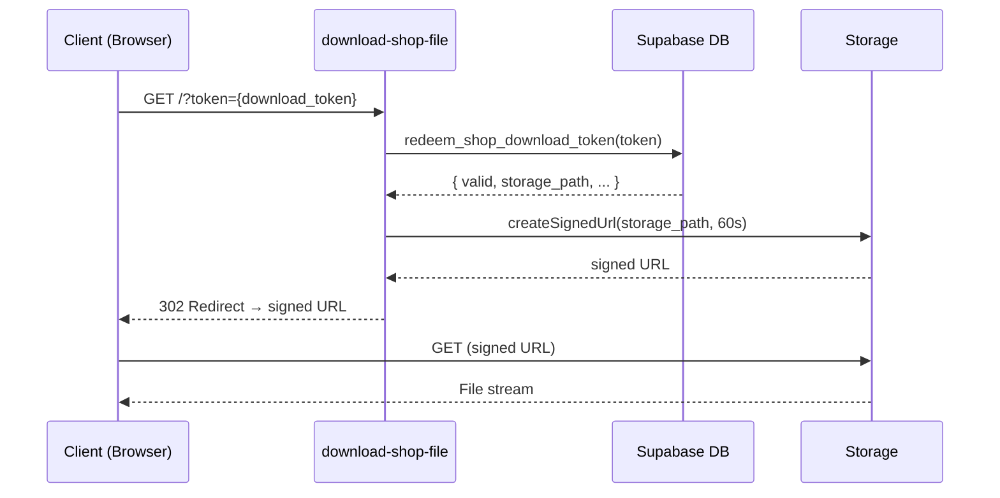

# Edge Function: `download-shop-file`

Secure file download for purchased shop products. Uses a one-time token-based authentication system — the function does not require a JWT. Access is validated through a database RPC that checks token validity, expiry, and download limits before generating a temporary signed URL.

## Configuration

| Property | Value |
|---|---|
| **Method** | `GET` |
| **Auth Required** | No (token-based) |
| **Rate Limit** | None |

```
withMiddleware(handler, { requireAuth: false })
```

## Flow



## Request

### Query Parameters

| Parameter | Required | Description |
|---|---|---|
| `token` | Yes | One-time download token from `shop_download_tokens` table |

### Example

```
GET https://<project>.supabase.co/functions/v1/download-shop-file?token=550e8400-e29b-41d4-a716-446655440000
```

## Response

### Success (302 Redirect)

Redirects the client to a time-limited signed URL for the storage object. The signed URL is valid for **60 seconds**.

### Errors

| Status | Code | Condition |
|---|---|---|
| 404 | `INVALID_TOKEN` | Token does not exist or has already been redeemed |
| 410 | `TOKEN_EXPIRED` | Token's valid window has passed |
| 403 | `DOWNLOAD_LIMIT_REACHED` | Maximum number of downloads for this token exceeded |

## Implementation Details

### Token Redemption

The function parses the `token` query parameter and calls the `redeem_shop_download_token` RPC:

```typescript
const token = url.searchParams.get("token");
if (!token) return badRequestError("Missing token");

const { data, error } = await supabaseAdmin.rpc("redeem_shop_download_token", {
  p_token: token,
});

if (error?.message === "INVALID_TOKEN") return notFoundError("Invalid token");
if (error?.message === "TOKEN_EXPIRED") return goneError("Token expired");
if (error?.message === "DOWNLOAD_LIMIT_REACHED") return forbiddenError("Download limit reached");
```

### Signed URL Generation

After successful token validation, the function generates a short-lived signed URL:

```typescript
const { data: signedUrl } = await supabaseAdmin.storage
  .from("shop-files")
  .createSignedUrl(data.storage_path, 60);

return Response.redirect(signedUrl.signedUrl, 302);
```

### Token Table

Download tokens are stored in the `shop_download_tokens` table, which tracks:

| Column | Description |
|---|---|
| `id` | UUID primary key |
| `token` | Unique one-time token |
| `storage_path` | Path to the file in storage |
| `expires_at` | Token validity window |
| `max_downloads` | Maximum allowed downloads |
| `download_count` | Current download count |
| `redeemed_at` | When the token was last used |

The `redeem_shop_download_token` RPC atomically validates and increments the download count.

## Security Notes

- **No JWT required**: The token itself is the authentication mechanism — no Supabase session needed
- **One-time use**: Tokens are single-use by default (configurable via `max_downloads`)
- **Time-limited signed URL**: Even after token redemption, the storage URL expires in 60 seconds
- **No rate limiting**: Download speed is constrained by the token validation RPC and storage bandwidth
- **Storage bucket**: Files are stored in the `shop-files` private bucket

## Dependencies

- `redeem_shop_download_token` RPC — validates and redeems the download token
- `shop_download_tokens` table — stores token metadata
- Supabase Storage — `createSignedUrl()` for temporary file access
