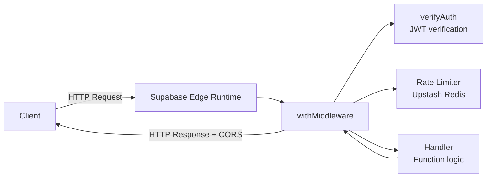

# Edge Functions — Backend Overview

This section documents every Supabase Edge Function in the project: their HTTP interface, auth requirements, rate limit tiers, and the shared middleware that wraps them all.

## Architecture

Every edge function follows the same request lifecycle:



The client sends an HTTP request to `https://{project}.supabase.co/functions/v1/{name}`. Supabase routes it to the Deno Edge Runtime, which executes the function. Every function wraps its handler with `withMiddleware()` — a shared composer that handles CORS preflight, JWT authentication, and rate limiting before the handler runs, then attaches CORS headers to the response.

## Functions Overview

| Function | Method | Auth Required | Rate Limit Tier | Purpose |
|---|---|---|---|---|
| `ai-editor-chat` | POST | Yes | `ai` | OpenAI streaming chat for the AI editor assistant |
| `create-kyc-session` | POST | Yes | `strict` | Creates a KYC verification session with magic link auth |
| `delete-user` | POST | Yes | `strict` | Closes a user account (anonymize-in-place; financial records retained) and sends win-back email |
| `download-shop-file` | GET | No (token auth) | none | One-time token-based secure file download |
| `export-shop-products` | POST | Yes | `strict` | CSV export of creator's shop products with filters |
| `moderate-content` | POST | Yes | `ai` | Content moderation via OpenAI + local profanity filter |
| `wishlist-signup` | POST | No | `public` | Pre-launch wishlist signup + founder-discount welcome email — see [Wishlist](../../wishlist/index) |
| `impersonate-user` | POST | Yes (manual, not `withMiddleware`) | none | Manager-gated (`users.impersonate`): starts a "log in as this user" support session, mints a short-lived JWT, returns a one-time exchange code. See [Manager RBAC](../../managers-and-rbac/backend/index) and `docs/user-impersonation-implementation.md` in the backend repo. |
| `impersonation-exchange` | POST | No (code is the credential) | none | Swaps the one-time code from `impersonate-user` for the minted JWT via Redis `GETDEL`, then burns it. |
| `end-impersonation-session` | POST | Yes (manual, not `withMiddleware`) | none | Manager-only (v1): ends an impersonation session's audit row. Does not revoke an already-issued token. |

## Shared Infrastructure

All functions live under `supabase/functions/` and share code from `_shared/`:

```
_shared/
  arcjet/index.ts                    -- Arcjet bot protection (secondary rate limit)
  constants/index.ts                 -- corsHeaders, platform fees, etc.
  middelware/
    index.ts                         -- withMiddleware() composer
    auth.ts                          -- verifyAuth() JWT verification
    rate-limit-upstash.ts            -- Upstash Redis sliding-window rate limiter
    rate-limit-arcjet.ts             -- Arcjet rate limiter (secondary)
  types/index.ts                     -- Shared TypeScript types
  upstash/index.ts                   -- Upstash Redis client
  utils/
    index.ts                         -- Misc helpers
    response.ts                      -- Standardized HTTP response helpers
    moderation.ts                    -- Content moderation (profanity filter)
    csv.ts                           -- Generic CSV builder
```

## Deployment Notes

- **Supabase CLI**: Deploy with `supabase functions deploy <name> --project-ref <ref>`
- **`verify_jwt = false`**: All functions set this in `supabase/config.toml` — JWT verification is handled by custom `verifyAuth()` middleware instead of Supabase's built-in gateway. This is necessary because the middleware also handles rate limiting and CORS before auth.
- **Environment variables**: Secrets are set via `supabase secrets set KEY=value` and accessed via `Deno.env.get()` in the function runtime.
- **Local development**: Run `supabase functions serve <name>` for local testing.

## Security: SIP (Service Identity Prevention)

The `SUPABASE_SECRET_KEYS` environment variable is used to validate that requests originate from trusted services (the Supabase backend itself). This prevents external actors from impersonating the service role.

## Table of Contents

| Page | What you'll learn |
|---|---|
| [Middleware Infrastructure](./middleware) | `withMiddleware`, auth flow, rate limiting, CORS |
| [ai-editor-chat](./ai-editor-chat) | OpenAI streaming chat for the AI editor |
| [moderate-content](./moderate-content) | Content moderation pipeline |
| [create-kyc-session](./create-kyc-session) | KYC session creation with magic link |
| [delete-user](./delete-user) | User account deletion |
| [download-shop-file](./download-shop-file) | Secure one-time file download |
| [export-shop-products](./export-shop-products) | CSV export of shop products |
