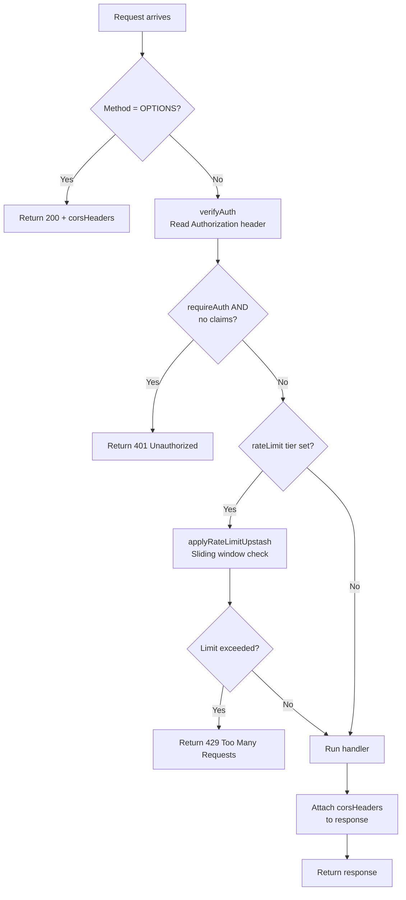

# Middleware Infrastructure

Every edge function in this project is wrapped with `withMiddleware()` — a shared composer that standardises CORS, authentication, and rate limiting across all functions.

## `withMiddleware()` Composer

```typescript
import { withMiddleware } from "../_shared/middelware/index.ts";

Deno.serve(
  withMiddleware(async (req, { claims }) => {
    // handler logic
    return okResponse({ result });
  }, {
    requireAuth: true,
    rateLimit: { tier: "strict" },
  }),
);
```

### Execution Order



## Authentication Flow

The `verifyAuth()` function (from `_shared/middelware/auth.ts`) handles JWT verification:

1. Reads the `Authorization` header from the incoming request
2. Extracts the Bearer token
3. Calls `supabase.auth.getClaims(token)` to parse and verify the JWT
4. Returns `JwtClaims` (containing `sub` — the user UUID) on success, or `null` on failure

```typescript
export async function verifyAuth(req: Request): Promise<JwtClaims | null> {
  const authHeader = req.headers.get("Authorization");
  if (!authHeader?.startsWith("Bearer ")) return null;

  const token = authHeader.slice(7);
  const { data, error } = await supabaseClient.auth.getClaims(token);
  if (error || !data?.claims) return null;

  return data.claims as JwtClaims;
}
```

**Note:** `verify_jwt = false` is set for all functions in `supabase/config.toml`. This disables Supabase's built-in JWT gateway because the custom `verifyAuth()` middleware is used instead — allowing the middleware chain to handle CORS and rate limiting before auth.

### `JwtClaims` Shape

```typescript
type JwtClaims = {
  sub: string;        // user UUID (profile_id)
  aud: string;        // audience
  exp: number;        // expiry timestamp
  iat: number;        // issued at timestamp
  // ... optional custom claims
};
```

## Rate Limiting

### Primary: Upstash Redis (Sliding Window)

The primary rate limiter (`_shared/middelware/rate-limit-upstash.ts`) uses Upstash Redis with a sliding-window algorithm. The rate limit key is `{tier}:{userId or IP}`.

When a request exceeds the limit, it returns a `429 Too Many Requests` response with retry headers. When Upstash itself cannot be reached, the outcome depends on the tier — see [Behaviour when Upstash is unreachable](#behaviour-when-upstash-is-unreachable).

### Secondary: Arcjet

Arcjet (`_shared/arcjet/index.ts`) is available as a secondary rate-limiting and bot-detection backend (`rate-limit-arcjet.ts`). It is primarily used for functions exposed to public/unauthenticated traffic. Currently commented as **not** the primary rate limiter in the middleware — Upstash handles all rate limiting by default.

### Rate Limit Tiers

| Tier | Window | Max Requests | On Upstash outage | Used By |
|---|---|---|---|---|
| `public` | 10 seconds | 10 | fail **open** | Public-facing endpoints |
| `auth` | 60 seconds | 5 | fail **open** | Authenticated read operations |
| `download` | 60 seconds | 20 | fail **open** | File downloads (PDF documents, CSV exports) |
| `ai` | 60 seconds | 3 | fail **closed** | AI/LLM calls (expensive) |
| `strict` | 60 seconds | 2 | fail **open** | Destructive/rare operations |

### Behaviour when Upstash is unreachable

The limiter runs *before* the handler, so a naive implementation makes Upstash a
single point of failure for all 16 rate-limited functions — payments, KYC,
account deletion and every AI feature go down together. The failure policy is
therefore declared per tier as `failOpen` in `UPSTASH_RATE_LIMIT_CONFIG`
(`_shared/upstash/index.ts`):

- **Fail open (default).** The limiter is defence-in-depth; the endpoints behind
  it are authenticated and have their own DB-level guards (RLS, status checks,
  `SECURITY DEFINER` RPCs). Failing closed on `strict` would mean nobody can pay
  during an Upstash outage — strictly worse than a brief window of unthrottled
  *authenticated* traffic.
- **Fail closed — `ai` only.** Those five functions each spend real money
  upstream per call, so an outage must not become an unmetered LLM budget. They
  return `503 rate_limit_unavailable` with `Retry-After`, deliberately **not**
  `429`: a client backing off from a `429` would wrongly conclude it sent too
  many requests.

Any request let through unenforced is stamped `X-RateLimit-Enforced: false` and
logged as `[rate-limit] Upstash unreachable for tier "<tier>"`. The header is
absent on normally-enforced responses, so its presence is what to alert on — a
silent permanent bypass is the real risk here, not the outage itself.

> **Note on the library's own `timeout`.** `@upstash/ratelimit` accepts a
> `timeout` (set to **1500ms** here, down from its 5000ms default) implemented as
> a `Promise.race`. That covers a *hang* only — a fast rejection (DNS failure,
> connection refused, rotated token) wins the race and throws, which is why the
> explicit `try`/`catch` in `applyRateLimitUpstash` is load-bearing rather than
> belt-and-braces.

### Unconfigured environments

If `UPSTASH_REDIS_REST_URL` / `UPSTASH_REDIS_REST_TOKEN` are missing — or the URL
is the `placeholder.upstash.io` host checked into `supabase/functions/.env.test`
— `isUpstashConfigured` is `false`, no limiter clients are constructed, and
enforcement is skipped for every tier including `ai`. A warning is logged once
per isolate at module load.

This is what lets the integration tests run without real credentials. Before it,
every test reaching a rate-limited endpoint failed with an unlogged `500` from a
DNS error inside the limiter.

Note that `redis` itself is still constructed unconditionally: `impersonate-user`
and `impersonation-exchange` use it as a real data store for one-time codes, not
as a protective control, so they should fail loudly rather than silently mint or
fail to find a code.

### `MiddlewareOptions` Type

```typescript
type MiddlewareOptions = {
  requireAuth?: boolean;
  rateLimit?: {
    tier: "public" | "auth" | "download" | "ai" | "strict";
    customKey?: string;   // override the rate limit key (default: `${tier}:${userId || IP}`)
  };
};
```

## CORS Handling

CORS headers are defined in `_shared/constants/index.ts` and applied in two places:

1. **Preflight** (`OPTIONS`): Returns `200 OK` with `corsHeaders` immediately — the handler never runs.
2. **Every response**: After the handler executes, `corsHeaders` are attached to the response via `Object.entries(corsHeaders).forEach(([k, v]) => res.headers.set(k, v))`.

```typescript
const corsHeaders = {
  "Access-Control-Allow-Origin": "*",
  "Access-Control-Allow-Methods": "GET, POST, OPTIONS",
  "Access-Control-Allow-Headers": "authorization, content-type",
};
```

## Response Helpers

From `_shared/utils/response.ts` — always use these instead of raw `new Response()`:

| Helper | Status | Use Case |
|---|---|---|
| `okResponse(data)` | 200 | Successful JSON response |
| `badRequestError(msg)` | 400 | Invalid input |
| `unauthorizedError()` | 401 | Missing/invalid auth |
| `methodNotAllowedError()` | 405 | Wrong HTTP method |
| `internalError(msg)` | 500 | Unexpected server error |
| `csvResponse(csv, filename)` | 200 | CSV file download |

## Security Notes

- **SIP (Service Identity Prevention)**: The `SUPABASE_SECRET_KEYS` environment variable validates request origin — prevents external impersonation of the service role.
- **Service role usage**: Functions use `supabaseAdmin` (service role client) only when RLS genuinely cannot express the access pattern. When querying user-scoped data, the anon/client with RLS is preferred and queries are manually scoped by `claims.sub`.
