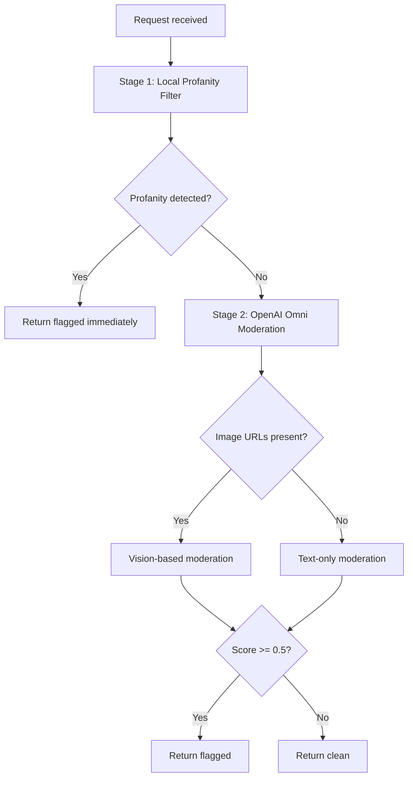

# Edge Function: `moderate-content`

Two-stage content moderation pipeline combining a local profanity filter (English + Bengali) with OpenAI Omni Moderation for deep analysis. Used to screen newsletter posts, comments, and other user-generated content before publication.

## Configuration

| Property | Value |
|---|---|
| **Method** | `POST` |
| **Auth Required** | Yes |
| **Rate Limit Tier** | `ai` (3 req / 60s) |

```
withMiddleware(handler, { requireAuth: true, rateLimit: { tier: "ai" } })
```

## Request

### Headers

| Header | Required | Value |
|---|---|---|
| `Authorization` | Yes | `Bearer <supabase-jwt>` |
| `Content-Type` | Yes | `application/json` |

### Body

```json
{
  "content": "Some text to moderate",
  "image_urls": ["https://example.com/photo.jpg"],
  "content_id": "post_123",
  "content_type": "newsletter_post"
}
```

| Field | Type | Required | Description |
|---|---|---|---|
| `content` | `string \| string[]` | No | Text content(s) to moderate |
| `image_urls` | `string[]` | No | URLs of images to moderate via vision |
| `content_id` | `string` | No | Optional identifier for audit trail |
| `content_type` | `string` | No | Optional content type for audit trail |

> **Max 32 inputs per request** — `content` items + `image_urls` combined count must not exceed 32.

## Moderation Pipeline



### Stage 1: Local Profanity Filter

The first stage runs synchronously against the input text. It checks for profanity in **English** (using the `obscenity` npm package) and **Bengali** (using a custom list of 500+ bad words).

**Bengali profanity detection** works by:
- Normalising text to NFC (Normalization Form Canonical Composition)
- Running regex matching against the curated `BANGLA_BAD_WORDS` list

If either filter triggers, the function returns a flagged result **immediately** without calling OpenAI — saving cost and latency.

Source: `_shared/utils/moderation.ts` + `_shared/constants/bangla-bad-words.ts`

### Stage 2: OpenAI Omni Moderation

If the local filter passes, text is sent to OpenAI's `omni-moderation-latest` model for deep analysis.

**Image moderation**: If `image_urls` are provided, the request includes them for vision-based moderation. If images are unavailable (e.g., URL returns 403), the function falls back to text-only moderation for those inputs.

## Response

### Success (200)

```json
{
  "flagged": false,
  "results": [
    {
      "input_index": 0,
      "flagged": false,
      "categories": {
        "harassment": false,
        "hate": false,
        "self_harm": false,
        "sexual": false,
        "violence": false,
        "...": false
      },
      "category_scores": {
        "harassment": 0.001,
        "violence": 0.0002
      }
    }
  ],
  "summary": {
    "categories": ["violence"],
    "max_score": 0.95,
    "flagged_count": 1,
    "total_inputs": 3
  }
}
```

| Field | Type | Description |
|---|---|---|
| `flagged` | `boolean` | Whether any input was flagged |
| `results` | `object[]` | Per-input moderation results |
| `results[].flagged` | `boolean` | Whether this specific input was flagged |
| `results[].categories` | `object` | Per-category boolean flags |
| `results[].category_scores` | `object` | Per-category raw scores |
| `summary.categories` | `string[]` | Unique flagged category names across all inputs |
| `summary.max_score` | `number` | Highest score across all inputs |
| `summary.flagged_count` | `number` | Count of flagged inputs |
| `summary.total_inputs` | `number` | Total inputs processed |

### Score Threshold

The `flagged` field is set to `true` when any category score exceeds **0.5**.

## Errors

| Status | Condition |
|---|---|
| 400 | Invalid JSON, missing both `content` and `image_urls`, or exceeds 32 inputs |
| 401 | Missing or invalid JWT |
| 429 | Rate limit exceeded |
| 500 | OpenAI API failure or unexpected error |

## Dependencies

- `obscurity` (npm) — English profanity detection
- `_shared/constants/bangla-bad-words.ts` — Custom Bengali bad words list (500+ words)
- OpenAI SDK — `omni-moderation-latest` model

## Security Notes

- The local filter saves cost by catching obvious violations without calling the OpenAI API
- Image moderation uses OpenAI vision — sensitive to image availability
- All moderation decisions are returned to the caller; the function does not auto-censor or block content
