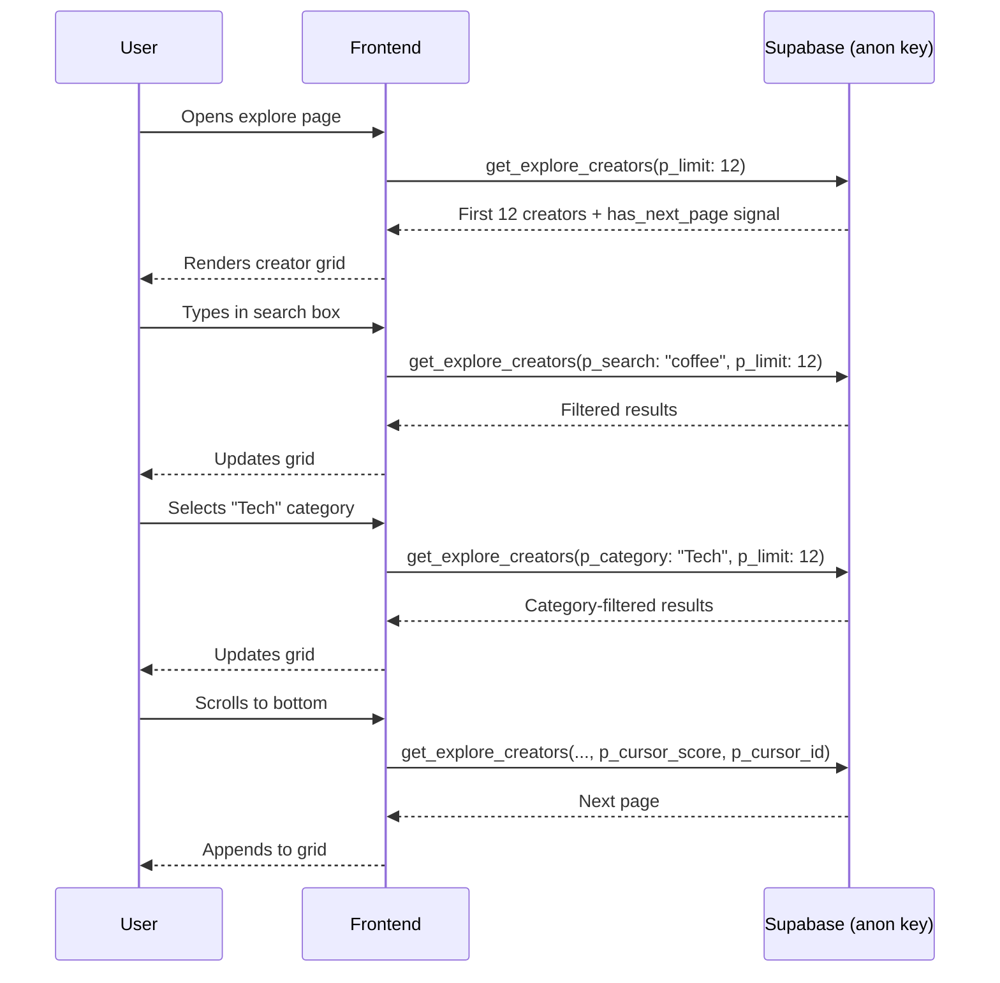

# Explore Page — Frontend Guide

The explore page lets visitors browse the creator directory with search, category filtering, and infinite scroll. All data comes from a single public RPC — no authentication required.

## Architecture at a Glance



## Calling the RPC

Use the public anon client — no auth needed:

```typescript
import { createClient } from '@supabase/supabase-js'
import type { Database } from '@hobenakicoffee/libraries/types'

const supabase = createClient<Database>(
  process.env.NEXT_PUBLIC_SUPABASE_URL!,
  process.env.NEXT_PUBLIC_SUPABASE_ANON_KEY!
)

type ExploreCreator = Awaited<
  ReturnType<typeof supabase.rpc<'get_explore_creators'>>
>['data'][number]
```

## Fetching the First Page

```typescript
async function fetchCreators(params?: {
  search?: string
  category?: string
}) {
  const { data, error } = await supabase.rpc('get_explore_creators', {
    p_search: params?.search ?? null,
    p_category: params?.category ?? null,
    p_limit: 12,
  })

  if (error) throw error
  return data ?? []
}
```

## Infinite Scroll — Next Page

The RPC returns `p_limit + 1` rows. Use the extra item to detect whether there are more pages, then slice it off before rendering.

```typescript
const PAGE_SIZE = 12

async function fetchNextPage(
  lastItem: ExploreCreator,
  params?: { search?: string; category?: string }
) {
  const { data, error } = await supabase.rpc('get_explore_creators', {
    p_search: params?.search ?? null,
    p_category: params?.category ?? null,
    p_limit: PAGE_SIZE,
    p_cursor_score: lastItem.popularity_score,
    p_cursor_id: lastItem.id,
  })

  if (error) throw error

  const rows = data ?? []
  const hasNextPage = rows.length > PAGE_SIZE
  return {
    creators: hasNextPage ? rows.slice(0, PAGE_SIZE) : rows,
    hasNextPage,
  }
}
```

## Resetting on Filter/Search Change

When the user changes the search query or selected category, reset the cursor and refetch from page 1:

```typescript
// React example (adapt to your framework)
const [creators, setCreators] = useState<ExploreCreator[]>([])
const [cursor, setCursor] = useState<ExploreCreator | null>(null)
const [hasNextPage, setHasNextPage] = useState(false)

async function reset(search?: string, category?: string) {
  const data = await fetchCreators({ search, category })
  const hasNext = data.length > PAGE_SIZE
  setCreators(hasNext ? data.slice(0, PAGE_SIZE) : data)
  setCursor(hasNext ? data[PAGE_SIZE - 1] : null)
  setHasNextPage(hasNext)
}

async function loadMore(search?: string, category?: string) {
  if (!cursor) return
  const { creators: next, hasNextPage: more } = await fetchNextPage(cursor, { search, category })
  setCreators(prev => [...prev, ...next])
  setCursor(more ? next[next.length - 1] : null)
  setHasNextPage(more)
}
```

## Category Filter Bar

Categories are free-form strings stored on each creator's profile. Build the filter bar from a predefined list agreed upon with the product team (there is no server endpoint that lists all categories in use).

```typescript
// Suggested set — expand as needed
const EXPLORE_CATEGORIES = [
  'All',
  'Tech',
  'Comedy',
  'Podcast',
  'Business',
  'Art',
  'Music',
  'Education',
  'Gaming',
  'Lifestyle',
]
```

Pass `null` (not `'All'`) to the RPC when "All" is selected.

## Rendering a Creator Card

Each row from the RPC contains everything needed for the card shown in the design:

```typescript
interface CreatorCardProps {
  creator: ExploreCreator
}

function CreatorCard({ creator }: CreatorCardProps) {
  const {
    display_name,
    full_name,
    username,
    bio,
    avatar_url,
    banner_url,
    is_verified,
    categories,
    follower_count,
    supporter_count,
    services,   // may be null — map to [] before use
    page_slug,
  } = creator

  const offerings = services ?? []
  const primaryCategory = categories?.[0] ?? null
  const name = display_name ?? full_name ?? username

  // ... render
}
```

### Displaying the Supporter Count

```typescript
import { formatCount } from '@hobenakicoffee/libraries/utils'

// "1.2k" style formatting
<span>{formatCount(supporter_count)}</span>
```

### Offerings Chips

Map service identifiers to human-readable labels:

```typescript
import { ServiceTypes } from '@hobenakicoffee/libraries/constants'

const SERVICE_LABELS: Record<string, string> = {
  [ServiceTypes.GIFT]: 'Tipping',
  [ServiceTypes.SHOP]: 'Digital Products',
  [ServiceTypes.MEMBERSHIP]: 'Memberships',
  [ServiceTypes.NEWSLETTER]: 'Newsletter',
}
```

## Key Rules

**Use the anon client** — `get_explore_creators` is granted to `anon`. You do not need to wait for a user session before fetching.

**Always pass `null` explicitly** for unused params — some Supabase client versions treat `undefined` differently from `null` in RPC calls.

**`services` can be `null`** when a creator has no enabled services. Always default it to `[]` before mapping.

**Reset cursor on any filter change** — search + category changes must restart pagination from the beginning, or you'll get incorrect results.

**Debounce the search input** — add ~300 ms debounce before calling the RPC to avoid a request on every keystroke.
