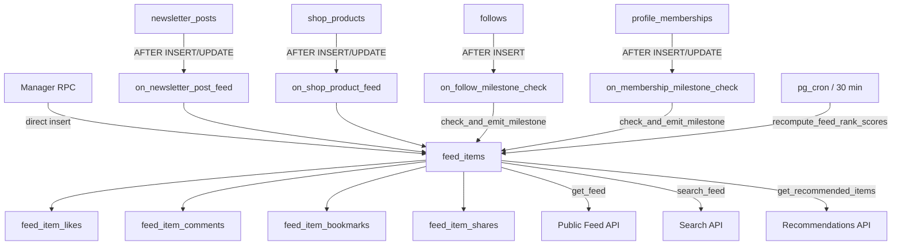

# Feed Discovery — Backend Overview

The **Feed Discovery** page is a public, algorithm-ranked feed of creator activity that anyone can browse. It surfaces newsletter posts, shop products, milestones, and platform announcements automatically — creators never post manually. This section covers the full backend: tables, triggers, ranking, and RPCs.

## Architecture

## What Was Added

| Addition | File | Purpose |
|---|---|---|
| `feed_items` table | `feed.sql` | Public discovery feed surface |
| `feed_item_likes` | `feed.sql` | Like tracking |
| `feed_item_comments` | `feed.sql` | One-level threaded comments |
| `feed_item_bookmarks` | `feed.sql` | Private save-for-later |
| `feed_item_shares` | `feed.sql` | Share event tracking |
| Counter-cache triggers | `feed.sql` | Keep `interaction_counts` in sync |
| `handle_newsletter_post_feed()` | `newsletter_service.sql` | Auto-populate feed from posts |
| `handle_shop_product_feed()` | `shop_service.sql` | Auto-populate feed from products (2h batching) |
| `check_and_emit_milestone()` | `feed.sql` | Emit milestone feed items |
| `handle_follower_milestone()` | `follows.sql` | Trigger milestone on follower count |
| `handle_subscriber_milestone()` | `memberships.sql` | Trigger milestone on subscriber count |
| `handle_feed_item_search_vector()` | `feed.sql` | Populate `tsvector` for search |
| `recompute_feed_rank_scores()` | `feed.sql` | Periodic ranking recomputation |
| `get_platform_setting_jsonb()` | `platform_settings.sql` | Read JSONB config for milestones |
| `get_feed()` RPC | `feed.sql` | Paginated public feed |
| `search_feed()` RPC | `feed.sql` | Full-text + trigram search |
| `toggle_feed_item_like()` RPC | `feed.sql` | Like / unlike |
| `toggle_feed_item_bookmark()` RPC | `feed.sql` | Bookmark / unbookmark |
| `add_feed_comment()` RPC | `feed.sql` | Add comment (one-level depth) |
| `delete_feed_comment()` RPC | `feed.sql` | Soft-delete comment |
| `record_feed_item_share()` RPC | `feed.sql` | Track share event |
| `get_recommended_creators()` RPC | `feed.sql` | Authenticated-only aside panel |
| `get_recommended_items()` RPC | `feed.sql` | Authenticated-only aside panel |
| `get_my_active_memberships()` RPC | `feed.sql` | Authenticated-only aside panel |
| `create_manager_feed_post()` RPC | `feed.sql` | Manager-only announcement post |

## Key Design Decisions

**Separate from `activities`** — `feed_items` is a distinct table from the existing `activities` table. `activities` is a private per-user notification ledger tied to transactions. `feed_items` is the public discovery surface — different concerns, different table.

**Content types** — Each feed item has a `content_type` that drives card rendering on the frontend. Adding a new service type means adding a trigger, not touching `feed_items` schema.

**No creator toggle** — Creators cannot hide items from the feed. The algorithm surfaces public content automatically. There is no "post to feed" button.

**Counter-cache** — `interaction_counts` on `feed_items` is a JSONB column maintained by `AFTER INSERT/DELETE` triggers. This avoids `COUNT(*)` joins on every feed query. The `recompute_feed_rank_scores()` function recounts from source tables every 30 minutes as a consistency check.

## Access Control Summary

| Action | Anonymous | Authenticated | Manager |
|---|---|---|---|
| View feed (`get_feed`) | ✅ | ✅ | ✅ |
| Search (`search_feed`) | ✅ | ✅ | ✅ |
| Like / Bookmark / Comment / Share | ❌ | ✅ | ✅ |
| View recommended sidebar | ❌ | ✅ | ✅ |
| View active memberships | ❌ | ✅ | ✅ |
| Create announcement | ❌ | ❌ | ✅ |
| Pin a feed item | ❌ | ❌ | ✅ |
| Soft-delete any comment | ❌ | ❌ | ✅ |

## Table of Contents

| Page | What you'll learn |
|---|---|
| [Data Model](./data-model) | Tables, columns, RLS, indexes |
| [Feed Population](./feed-population) | Triggers, batching, milestones, manager posts |
| [Ranking](./ranking) | Rank score formula, boost tiers, pg_cron |
| [RPC: get_feed](./rpc-get-feed) | Main feed pagination |
| [RPC: search_feed](./rpc-search-feed) | Full-text + trigram search |
| [RPC: Social Interactions](./rpc-social) | Like, bookmark, comment, share |
| [RPC: Aside Panels](./rpc-aside) | Recommended creators, items, active memberships |
