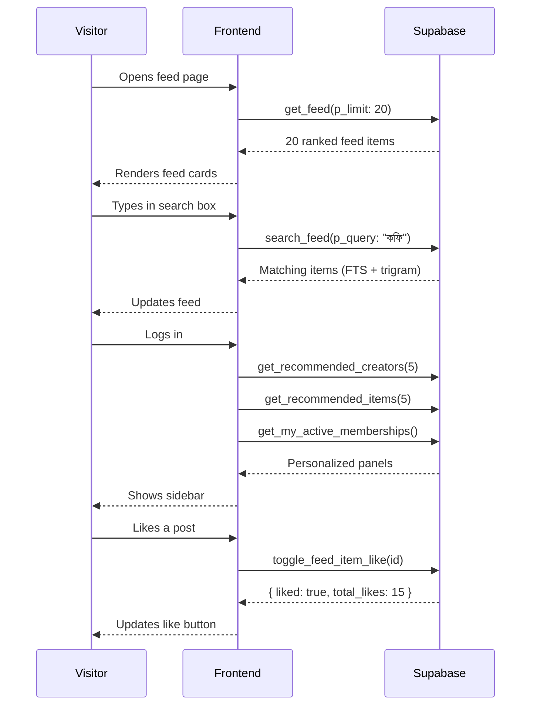

# Feed Discovery — Frontend Guide

The feed discovery page is public — no authentication required to browse or search. Login is prompted only when a user tries to like, comment, bookmark, share, follow, or purchase.

## Architecture at a Glance



## Client Setup

Use the public anon client for the feed. No session needed:

```typescript
import { createClient } from '@supabase/supabase-js'
import type { Database } from '@hobenakicoffee/libraries/types'

const supabase = createClient<Database>(
  process.env.NEXT_PUBLIC_SUPABASE_URL!,
  process.env.NEXT_PUBLIC_SUPABASE_ANON_KEY!
)
```

## Fetching the Feed

```typescript
type FeedItem = Awaited<
  ReturnType<typeof supabase.rpc<'get_feed'>>
>['data'][number]

async function fetchFeed(options?: {
  cursorScore?: number
  cursorId?: number
  contentTypes?: string[]
}) {
  const { data, error } = await supabase.rpc('get_feed', {
    p_limit: 20,
    p_cursor_score: options?.cursorScore ?? null,
    p_cursor_id: options?.cursorId ?? null,
    p_content_types: options?.contentTypes ?? null,
  })
  if (error) throw error
  return data ?? []
}
```

## Infinite Scroll

```typescript
const PAGE_SIZE = 20

const [items, setItems] = useState<FeedItem[]>([])
const [cursor, setCursor] = useState<FeedItem | null>(null)
const [hasMore, setHasMore] = useState(true)

async function loadMore() {
  const page = await fetchFeed(
    cursor ? { cursorScore: cursor.rank_score, cursorId: cursor.id } : undefined
  )
  const more = page.length === PAGE_SIZE
  setItems(prev => [...prev, ...page])
  setCursor(more ? page[page.length - 1] : null)
  setHasMore(more)
}
```

## Rendering Feed Cards

Use `content_type` to select the right card component — never conditionally render based on `metadata` shape alone:

```typescript
const CARD_MAP: Partial<Record<string, React.ComponentType<{ item: FeedItem }>>> = {
  newsletter_post:     NewsletterPostCard,
  shop_product:        ShopProductCard,
  shop_batch:          ShopBatchCard,
  system_milestone:    MilestoneCard,
  system_announcement: AnnouncementCard,
}

function FeedCard({ item }: { item: FeedItem }) {
  const Card = CARD_MAP[item.content_type]
  if (!Card) return null  // unknown type — safe to skip
  return <Card item={item} />
}
```

### Pinned Items

Pinned items appear first in the result set. Render them with a distinct visual treatment:

```typescript
function FeedCard({ item }: { item: FeedItem }) {
  return (
    <div className={item.is_pinned ? 'feed-card feed-card--pinned' : 'feed-card'}>
      {item.is_pinned && <PinnedBadge />}
      {/* ... */}
    </div>
  )
}
```

## Search

Debounce the search input and reset pagination on every new query:

```typescript
const [query, setQuery] = useState('')
const [searchResults, setSearchResults] = useState<SearchResult[]>([])

const debouncedSearch = useMemo(
  () => debounce(async (q: string) => {
    if (!q.trim()) { setSearchResults([]); return }
    const { data } = await supabase.rpc('search_feed', { p_query: q, p_limit: 20 })
    setSearchResults(data ?? [])
  }, 300),
  []
)

// On input change
<input onChange={e => { setQuery(e.target.value); debouncedSearch(e.target.value) }} />
```

Search supports Bangla: `"ঢাকা কফি"`, `"dhaka coffee"`, partial matches all work.

## Social Interactions

Gate interaction calls behind an auth check. Redirect to login if the user is not signed in:

```typescript
async function handleLike(itemId: number) {
  const { data: { session } } = await supabase.auth.getSession()
  if (!session) { router.push('/login'); return }

  const { data } = await supabase.rpc('toggle_feed_item_like', {
    p_feed_item_id: itemId,
  })
  // data: { liked: boolean, total_likes: number }
}

async function handleBookmark(itemId: number) {
  const { data: { session } } = await supabase.auth.getSession()
  if (!session) { router.push('/login'); return }

  const { data } = await supabase.rpc('toggle_feed_item_bookmark', {
    p_feed_item_id: itemId,
  })
  // data: { bookmarked: boolean }
}
```

`is_liked` and `is_bookmarked` fields on each feed item reflect the current user's state — optimistic updates work well here.

## Comments

```typescript
// Fetch comments for a feed item
const { data: comments } = await supabase
  .from('feed_item_comments')
  .select('*')
  .eq('feed_item_id', itemId)
  .eq('is_deleted', false)
  .order('created_at', { ascending: true })

// Root comments only
const roots = comments?.filter(c => c.parent_comment_id === null) ?? []
// Replies grouped by parent
const replies = comments?.filter(c => c.parent_comment_id !== null) ?? []

// Add a root comment
await supabase.rpc('add_feed_comment', {
  p_feed_item_id: itemId,
  p_body: 'Great post!',
})

// Add a reply (one level only)
await supabase.rpc('add_feed_comment', {
  p_feed_item_id: itemId,
  p_body: 'Agreed!',
  p_parent_comment_id: rootCommentId,
})

// Soft-delete own comment
await supabase.rpc('delete_feed_comment', { p_comment_id: commentId })
```

## Sidebar Panels (Authenticated Only)

Show the sidebar only after confirming the user is logged in:

```typescript
const { data: { session } } = await supabase.auth.getSession()
if (!session) return null

// Fetch all three panels in parallel
const [creators, items, memberships] = await Promise.all([
  supabase.rpc('get_recommended_creators', { p_limit: 5 }),
  supabase.rpc('get_recommended_items', { p_limit: 5 }),
  supabase.rpc('get_my_active_memberships'),
])
```

### Active Memberships Display

```typescript
type Membership = Awaited<
  ReturnType<typeof supabase.rpc<'get_my_active_memberships'>>
>['data'][number]

function MembershipCard({ m }: { m: Membership }) {
  const daysLeft = m.period_end
    ? Math.ceil((new Date(m.period_end).getTime() - Date.now()) / 86400000)
    : null

  return (
    <div>
      <span>@{m.creator_username}</span>
      <span>{m.plan_name} · {m.billing_cycle}</span>
      {daysLeft !== null && <span>{daysLeft} days left</span>}
    </div>
  )
}
```

## Canonical URLs

Build deep-link URLs for individual feed items:

```typescript
function feedItemUrl(item: FeedItem): string {
  if (item.content_type === 'system_announcement' || !item.creator_username) {
    return `/feed/${item.id}`
  }
  const serviceSlug = CONTENT_TYPE_TO_SLUG[item.content_type] ?? item.content_type
  return `/@${item.creator_username}/${serviceSlug}/feed/${item.id}`
}

const CONTENT_TYPE_TO_SLUG: Record<string, string> = {
  newsletter_post:     'newsletter',
  shop_product:        'shop',
  shop_batch:          'shop',
  one_on_one:          'one-on-one',
  hire:                'hire',
  system_milestone:    'milestone',
  system_announcement: 'announcement',
}
```

## SEO

The feed is fully public. For SSR frameworks (Next.js App Router, Nuxt, SvelteKit):

1. Fetch `get_feed()` server-side on the initial render
2. Extract `metadata.title`, `metadata.excerpt`, and `metadata.thumbnail_url` from each item for OG tags
3. Use `feedItemUrl()` to build canonical `<link rel="canonical">` per item

```typescript
// Next.js App Router example
export async function generateMetadata({ params }: { params: { id: string } }) {
  const { data } = await supabase.rpc('get_feed', { p_limit: 1 })
  const item = data?.[0]
  if (!item) return {}

  return {
    title: item.metadata.title,
    description: item.metadata.excerpt,
    openGraph: {
      images: item.metadata.thumbnail_url ? [item.metadata.thumbnail_url] : [],
    },
  }
}
```

## Key Rules

**Never block the feed on auth** — `get_feed` and `search_feed` work with the anon client. Fetch immediately on page load.

**Always pass `null` explicitly** — some Supabase client versions treat `undefined` differently from `null` in RPC calls. Pass `null` for unused optional params.

**Debounce search** — 300 ms before calling `search_feed`, or you'll fire a request on every keystroke.

**Reset pagination on filter change** — when `content_types` filter or search query changes, clear the cursor and fetch from page 1.

**`is_liked` / `is_bookmarked` are always `false` for anon** — safe to use directly without a null check; they just won't reflect state until the user signs in.
