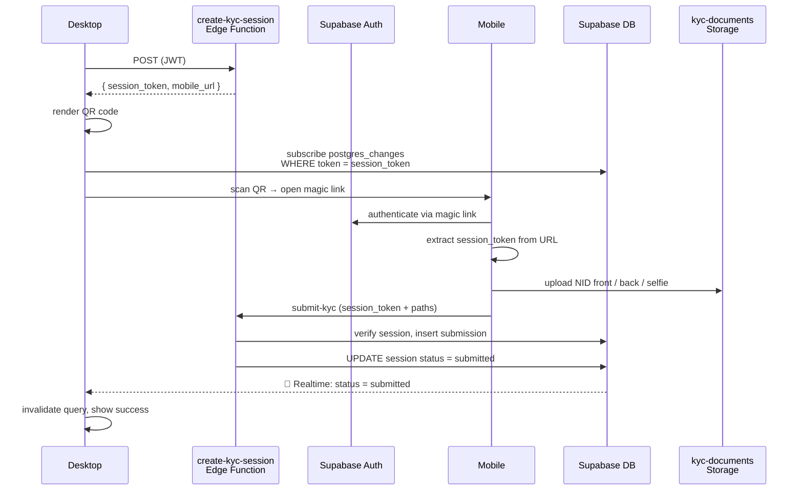
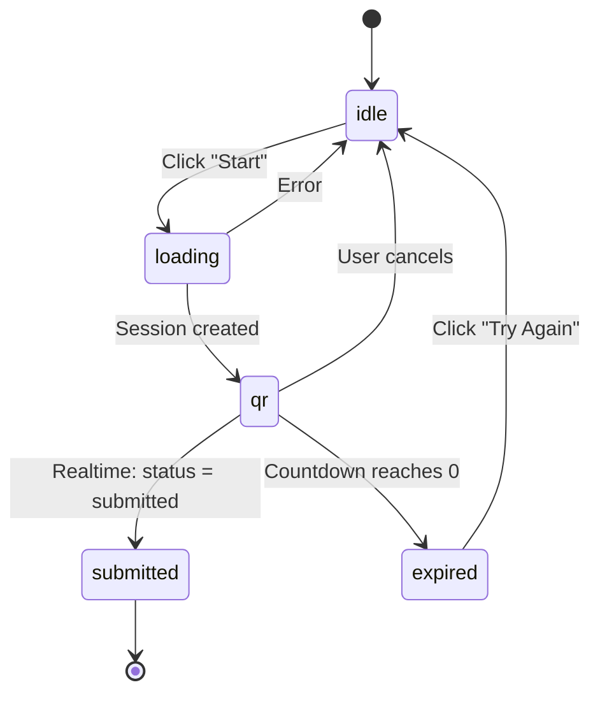
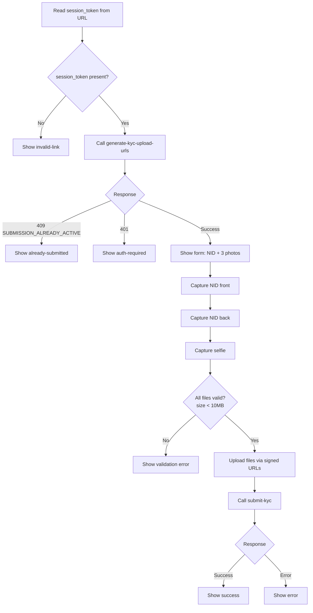

# KYC — Frontend Implementation Guide

Creators must pass identity verification (KYC) before withdrawing funds. The flow spans two surfaces:

- **Desktop** (`/settings/verification`) — creator initiates KYC, sees a QR code, and subscribes to realtime status updates
- **Mobile** (`/kyc/mobile`) — creator scans the QR, captures NID photos on their phone, and submits

The session bridges both devices: the desktop creates a session and listens for status changes via Realtime; the mobile page submits and flips the session to `submitted`, which wakes the Realtime listener on the desktop.

## Desktop ↔ Mobile Handoff



## Backend Reference

| Function | Auth | Key inputs | Key outputs |
|---|---|---|---|
| `create-kyc-session` | JWT | — | `session_token`, `mobile_url` (magic link), `expires_in_seconds: 1800` |
| `generate-kyc-upload-urls` | JWT | — | `path_prefix`, `upload_urls.{nid_front,nid_back,selfie}`, `paths.{...}` |
| `submit-kyc` | JWT or `session_token` | `session_token`, `path_prefix`, `nid_number`, `paths`, `consent_ip?` | `{ status: "pending", submission_id }` |

**Error codes:** `SUBMISSION_ALREADY_ACTIVE` (409), `INVALID_SESSION` (400), `SESSION_EXPIRED` (400), `INVALID_NID_FORMAT` (400), `MISSING_FILES` (400).

**Status flows:**
- `kyc_submissions.status`: `pending` → `under_review` → `approved` / `rejected` / `resubmit_requested`
- `kyc_sessions.status`: `pending` → `submitted` | `expired`

> **Note:** Confirm `kyc_sessions` is added to the `supabase_realtime` publication before deploying — `postgres_changes` won't work otherwise.

## Route Structure

```
src/routes/
├── (app)/_settings/
│   ├── -route.content.tsx          MODIFY: add "verification" nav item
│   ├── route.tsx                   MODIFY: add nav item + icon
│   └── settings/verification/
│       ├── -index.content.tsx      NEW
│       ├── index.tsx               NEW
│       ├── -components/
│       │   ├── kyc-status-card.tsx + .content.ts   NEW
│       │   └── kyc-qr-session.tsx  + .content.ts   NEW
│       ├── -hooks/
│       │   ├── use-kyc-submission.ts               NEW
│       │   ├── use-create-kyc-session.ts           NEW
│       │   └── use-kyc-session-realtime.ts         NEW
│       ├── -services/
│       │   ├── get-kyc-submission.service.ts       NEW
│       │   └── create-kyc-session.service.ts       NEW
│       └── -constants/index.ts                     NEW
└── kyc/mobile/
    ├── -index.content.tsx          NEW
    ├── index.tsx                   NEW
    ├── -components/
    │   ├── photo-capture.tsx + .content.ts         NEW
    │   └── submission-result.tsx + .content.ts     NEW
    ├── -hooks/
    │   ├── use-generate-kyc-upload-urls.ts         NEW
    │   └── use-submit-kyc.ts                       NEW
    ├── -services/
    │   ├── generate-kyc-upload-urls.service.ts     NEW
    │   └── submit-kyc.service.ts                   NEW
    ├── -utils/nid-validation.ts                    NEW
    └── -nuqs/index.ts                              NEW
```

---

## 1. Settings Nav — Add Verification Entry

### `-route.content.tsx`

Add to the navigation content object:

```typescript
verification: {
  label: t({ en: "Verification", "bn-BD": "যাচাইকরণ" }),
  description: t({ en: "Verify your identity to unlock withdrawals.", "bn-BD": "উত্তোলন সক্রিয় করতে পরিচয় যাচাই করুন।" }),
},
```

### `route.tsx`

Add to `getNavItems`:

```typescript
{
  url: "/settings/verification",
  label: content.verification.label,
  description: content.verification.description,
  icon: Shield01Icon,
}
```

Import `Shield01Icon` from `@hugeicons/core-free-icons`.

---

## 2. Desktop: `/settings/verification`

### `index.tsx`

Two sections:
- `<KycStatusCard />` — always shown; fetches current submission status
- `<KycQrSession />` — shown when user clicks "Start Verification" or "Resubmit"

### Constants

```typescript
// -constants/index.ts
export const kycKeys = {
  submission: (profileId: string) => ["kyc", "submission", profileId] as const,
};
```

### Services

```typescript
// -services/get-kyc-submission.service.ts
export async function getKycSubmission(client: TypedSupabaseClient, profileId: string) {
  return client
    .from("kyc_submissions")
    .select("id, status, rejection_reason, attempt_number, created_at, updated_at")
    .eq("profile_id", profileId)
    .order("created_at", { ascending: false })
    .limit(1)
    .maybeSingle();
}
```

```typescript
// -services/create-kyc-session.service.ts
export async function createKycSession(client: TypedSupabaseClient) {
  const { data, error } = await client.functions.invoke("create-kyc-session");
  if (error) throw error;
  return data as { session_token: string; mobile_url: string; expires_in_seconds: number };
}
```

### Hooks

```typescript
// -hooks/use-kyc-submission.ts
// useQuery wrapping getKycSubmission, keyed with kycKeys.submission(profileId)
```

```typescript
// -hooks/use-create-kyc-session.ts
// useMutation wrapping createKycSession.
// On success, store session_token + mobile_url + expires_at in local component state
// passed up via onSuccess callback
```

```typescript
// -hooks/use-kyc-session-realtime.ts
// Subscribes to postgres_changes on kyc_sessions WHERE token=eq.{token}
export function useKycSessionRealtime(
  token: string | null,
  onStatusChange: (status: string) => void
) {
  const client = useSupabaseBrowser();

  useEffect(() => {
    if (!token) return;
    const channel = client
      .channel(`kyc-session:${token}`)
      .on("postgres_changes", {
        event: "UPDATE",
        schema: "public",
        table: "kyc_sessions",
        filter: `token=eq.${token}`,
      }, (payload) => {
        onStatusChange((payload.new as { status: string }).status);
      })
      .subscribe();

    return () => { client.removeChannel(channel); };
  }, [token, client, onStatusChange]);
}
```

### Components

**`kyc-status-card.tsx`** — renders based on `submission.status`:

| Status | Display |
|---|---|
| No submission | "Not verified" + "Start Verification" button |
| `pending` | Spinner + "Submitted — under review" |
| `under_review` | "Being reviewed by our team" |
| `approved` | Green badge + "Verified" |
| `rejected` | Red badge + rejection reason + disabled "Start Over" |
| `resubmit_requested` | Orange badge + rejection reason + "Resubmit" button |

**`kyc-qr-session.tsx`** — local state machine:



1. **idle** — "Start Verification" / "Resubmit" button
2. **loading** — spinner while `createKycSession` runs
3. **qr** — QR code (`react-qr-code`), copyable link, countdown timer, instructions, "Cancel" button. Uses `useKycSessionRealtime`.
4. **submitted** — "Verified on mobile! Refreshing…" → invalidate query
5. **expired** — "QR expired. Try again." button

**Countdown:** `expires_in_seconds` → `useEffect` with 1-second interval, shows `MM:SS`. At 0, transition to expired.

---

## 3. Mobile: `/kyc/mobile`

Public route — outside `_authenticated` and `_settings` wrappers. Supabase magic link sets the session automatically before React renders.

### nuqs

```typescript
// -nuqs/index.ts
import { parseAsString } from "nuqs";
export const mobileParsers = { session_token: parseAsString };
```

### Flow (`index.tsx`)



1. Read `session_token` from URL via `useQueryStates(mobileParsers)`
2. No `session_token` → `<SubmissionResult type="invalid-link" />`
3. On mount: call `generate-kyc-upload-urls`
   - `SUBMISSION_ALREADY_ACTIVE` → `<SubmissionResult type="already-submitted" />`
   - 401 → `<SubmissionResult type="auth-required" />`
4. Show form: NID input + 3 photo captures
5. On submit: upload files → call `submit-kyc` → `<SubmissionResult type="success" />`

### NID Validation

```typescript
// -utils/nid-validation.ts
export function validateNidNumber(raw: string): boolean {
  const cleaned = raw.replace(/[\s-]/g, "");
  return /^\d{10}$/.test(cleaned) || /^\d{17}$/.test(cleaned);
}

export function cleanNidNumber(raw: string): string {
  return raw.replace(/[\s-]/g, "");
}
```

### Photo Capture

```typescript
// Camera-friendly file picker
<input
  type="file"
  accept="image/jpeg,image/png,image/webp,image/heic"
  capture="environment"
  onChange={handleFile}
/>
```

- Client-side size check: `file.size > 10 * 1024 * 1024` → reject
- Show thumbnail preview after capture

### File Upload

After receiving `upload_urls`, upload directly via `fetch`:

```typescript
await fetch(upload_urls.nid_front, {
  method: "PUT",
  body: nidFrontFile,
  headers: { "Content-Type": nidFrontFile.type },
});
```

### Submit Service

```typescript
// -services/submit-kyc.service.ts
export async function submitKyc(client: TypedSupabaseClient, params: SubmitKycParams) {
  const { data, error } = await client.functions.invoke("submit-kyc", { body: params });
  if (error) throw error;
  return data as { status: string; submission_id: number };
}
```

Parse backend error codes using `parse-supabase-function-error.ts` if available, otherwise check `error.message` for known strings.

### Submission Result

`<SubmissionResult />` renders different states: `success`, `already-submitted`, `invalid-link`, `auth-required`, generic error.
