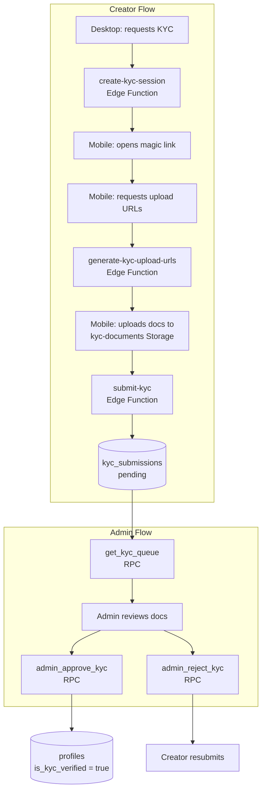
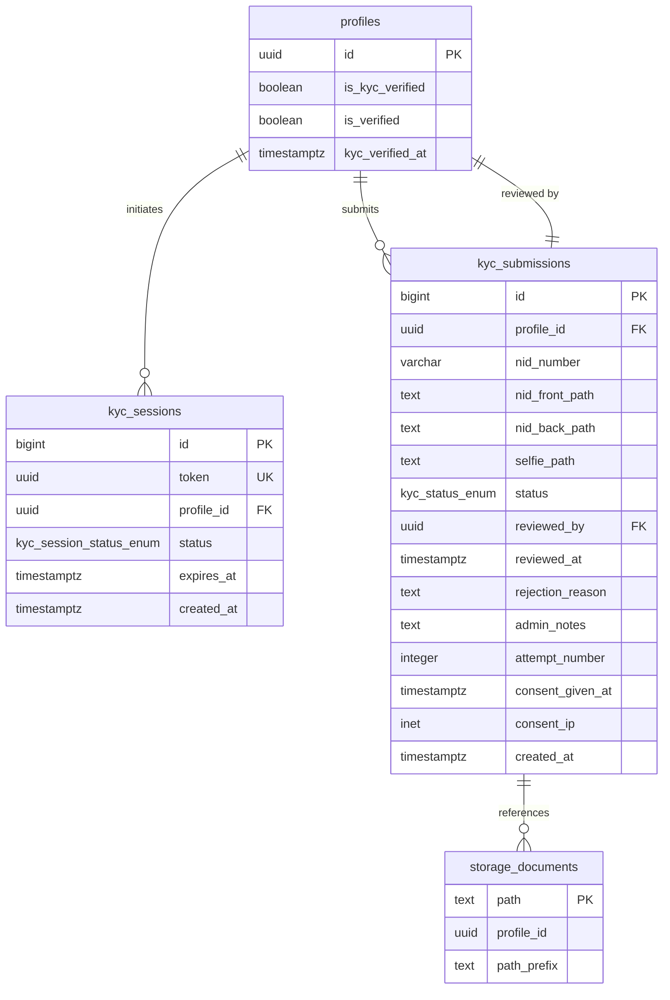
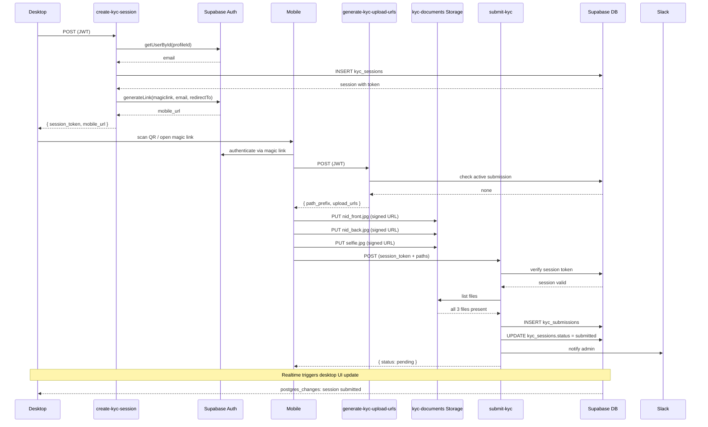

# KYC — Backend Implementation Guide

Know Your Creator (KYC) is the identity verification system. Creators must pass KYC before they can withdraw earnings. The system uses a mobile capture flow: the creator scans a QR code on their desktop, completes document uploads on their phone, and submits for admin review. No automated vendor — all approvals/rejections go through the admin panel. Approved creators get `is_kyc_verified = true` + `is_verified = true` (blue badge).

## Architecture



## Entity Relationship



## Edge Function Sequence



## Source Files

| File | Location |
|---|---|
| Schema | `backend/supabase/schemas/kyc.sql` |
| Profiles additions | `backend/supabase/schemas/profiles.sql` |
| Withdrawal gate | `backend/supabase/schemas/withdrawal_requests.sql` |
| Create session | `backend/supabase/functions/create-kyc-session/index.ts` |
| Generate upload URLs | `backend/supabase/functions/generate-kyc-upload-urls/index.ts` |
| Submit KYC | `backend/supabase/functions/submit-kyc/index.ts` |

## Key Design Decisions

| Concern | Decision |
|---|---|
| Mobile may not be authenticated | `submit-kyc` does not require JWT; validates via `session_token` instead |
| PKs follow project convention | `bigint generated always as identity` for both tables |
| Session security (QR token guessability) | Separate `token uuid DEFAULT gen_random_uuid()` column on `kyc_sessions` — this is the URL param, not the `bigint` id |
| No migration files | Schema files only; developer runs `supabase db diff` |
| No automated vendor | All submissions → `pending` → manager review queue |
| `JwtClaims` has no email field | Fetch via `supabaseAdmin.auth.admin.getUserById(claims.sub)` in `create-kyc-session` |

## Profiles — Column Additions

Append to `profiles.sql`:

```sql
is_kyc_verified  boolean      not null default false,
is_verified      boolean      not null default false,
kyc_verified_at  timestamptz
```

## Database Schema

### Enums

| Enum | Values |
|---|---|
| `kyc_status_enum` | `pending`, `under_review`, `approved`, `rejected`, `resubmit_requested` |
| `kyc_session_status_enum` | `pending`, `opened`, `submitted`, `expired` |

### `kyc_sessions`

Short-lived session linking the desktop QR display to the mobile capture flow. Realtime on this table drives the desktop UI when the mobile submits.

| Column | Type | Notes |
|---|---|---|
| `id` | `bigint generated always as identity PK` | internal |
| `token` | `uuid NOT NULL DEFAULT gen_random_uuid() UNIQUE` | embedded in QR URL — unpredictable |
| `profile_id` | `uuid NOT NULL REFERENCES profiles(id) ON DELETE CASCADE` | |
| `status` | `kyc_session_status_enum NOT NULL DEFAULT 'pending'` | |
| `expires_at` | `timestamptz NOT NULL DEFAULT now() + interval '30 minutes'` | |
| `created_at` | `timestamptz NOT NULL DEFAULT now()` | |
| `updated_at` | `timestamptz NOT NULL DEFAULT now()` | |

```sql
create table public.kyc_sessions (
  id         bigint generated always as identity primary key,
  token      uuid not null default gen_random_uuid() unique,
  profile_id uuid not null references public.profiles (id) on delete cascade,
  status     public.kyc_session_status_enum not null default 'pending',
  expires_at timestamptz not null default now() + interval '30 minutes',
  created_at timestamptz not null default now(),
  updated_at timestamptz not null default now()
);
```

**Indexes:**
- Partial unique: `(profile_id) WHERE status IN ('pending','opened')` — one active session per profile
- `idx_kyc_sessions_expires_at` — for pg_cron cleanup

**RLS:**
- SELECT authenticated: `profile_id = auth.uid()` — required for Realtime
- INSERT authenticated: `profile_id = auth.uid()`
- UPDATE authenticated: `USING (false)` — service role only

**Realtime:** `alter publication supabase_realtime add table public.kyc_sessions;`

### `kyc_submissions`

Permanent audit record per verification attempt. Storage paths stored here — never raw URLs.

| Column | Type | Notes |
|---|---|---|
| `id` | `bigint generated always as identity PK` | |
| `profile_id` | `uuid NOT NULL REFERENCES profiles(id) ON DELETE CASCADE` | |
| `nid_number` | `varchar(17) NOT NULL` | Bangladesh NID: 10 or 17 digits |
| `nid_front_path` | `text NOT NULL` | Storage path — never raw URL |
| `nid_back_path` | `text NOT NULL` | Storage path |
| `selfie_path` | `text NOT NULL` | Storage path |
| `status` | `kyc_status_enum NOT NULL DEFAULT 'pending'` | |
| `reviewed_by` | `uuid REFERENCES profiles(id) ON DELETE SET NULL` | manager who acted |
| `reviewed_at` | `timestamptz` | |
| `rejection_reason` | `text` | shown to creator |
| `admin_notes` | `text` | internal only |
| `attempt_number` | `integer NOT NULL DEFAULT 1` | |
| `consent_given_at` | `timestamptz NOT NULL DEFAULT now()` | PDPO 2025 |
| `consent_ip` | `inet` | |
| `created_at` | `timestamptz NOT NULL DEFAULT now()` | |
| `updated_at` | `timestamptz NOT NULL DEFAULT now()` | |

```sql
create table public.kyc_submissions (
  id               bigint generated always as identity primary key,
  profile_id       uuid not null references public.profiles (id) on delete cascade,
  nid_number       varchar(17) not null,
  nid_front_path   text not null,
  nid_back_path    text not null,
  selfie_path      text not null,
  status           public.kyc_status_enum not null default 'pending',
  reviewed_by      uuid references public.profiles (id) on delete set null,
  reviewed_at      timestamptz,
  rejection_reason text,
  admin_notes      text,
  attempt_number   integer not null default 1,
  consent_given_at timestamptz not null default now(),
  consent_ip       inet,
  created_at       timestamptz not null default now(),
  updated_at       timestamptz not null default now()
);
```

**Indexes:**
- Partial unique: `(profile_id) WHERE status IN ('pending','under_review')` — one active submission per profile
- `idx_kyc_submissions_profile_id`, `idx_kyc_submissions_status`, `idx_kyc_submissions_created_at`

**RLS:**
- SELECT authenticated: own rows — creator sees status + rejection_reason
- INSERT: `WITH CHECK (false)` — service role (edge function) only
- UPDATE: `USING (false)` — service role only

### Storage: `kyc-documents` (private bucket)

```sql
insert into storage.buckets (id, name, public, file_size_limit, allowed_mime_types)
values (
  'kyc-documents', 'kyc-documents', false, 10485760,
  array['image/jpeg','image/png','image/webp','image/heic']
)
on conflict (id) do nothing;
```

- RLS: creators upload and read only within `{auth.uid()}/` folder prefix
- Path convention: `{profile_id}/{path_prefix}/{nid_front|nid_back|selfie}.jpg`

### RLS Policy Summary

| Table | anon | authenticated (own) | service role |
|---|---|---|---|
| `kyc_sessions` | ✗ | SELECT, INSERT | Full |
| `kyc_submissions` | ✗ | SELECT | Full (edge fn + RPCs) |
| `storage.objects` (kyc-documents) | ✗ | INSERT, SELECT (own folder) | Full |

## Edge Functions

### `create-kyc-session`

`withMiddleware(handler, { requireAuth: true, rateLimit: { tier: "strict" } })`

- **Method:** `POST`
- **Auth:** JWT
- **Response:**
  ```json
  {
    "session_token": "uuid",
    "mobile_url": "https://...",
    "expires_in_seconds": 1800
  }
  ```

**Flow:**
1. Authenticates via JWT; fetches user email via `supabaseAdmin.auth.admin.getUserById(profileId)` — no email in `JwtClaims`
2. Upsert: if active unexpired session exists for profile, reuse it; else insert new row
3. The returned token (UUID on session row) is embedded in the QR URL
4. Generates a Supabase magic link via `generateLink({ type: 'magiclink', email, options: { redirectTo: '${APP_URL}/kyc/mobile?session_token=${session.token}', shouldCreateUser: false } })`

**Required env vars:** `APP_URL`

### `generate-kyc-upload-urls`

`withMiddleware(handler, { requireAuth: true, rateLimit: { tier: "strict" } })`

- **Method:** `POST`
- **Auth:** JWT
- **Response:**
  ```json
  {
    "path_prefix": "uuid",
    "upload_urls": {
      "nid_front": "https://...",
      "nid_back": "https://...",
      "selfie": "https://..."
    },
    "paths": {
      "nid_front": "{profileId}/{pathPrefix}/nid_front.jpg",
      "nid_back": "{profileId}/{pathPrefix}/nid_back.jpg",
      "selfie": "{profileId}/{pathPrefix}/selfie.jpg"
    }
  }
  ```

**Flow:**
1. `profileId = claims!.sub`
2. Generates a `crypto.randomUUID()` as a temporary path prefix (submission id isn't known until after insert)
3. Creates three `createSignedUploadUrl` calls in `Promise.all`
4. Returns the upload URLs and paths

### `submit-kyc`

`withMiddleware(handler, { requireAuth: false, rateLimit: { tier: "strict" } })`

- **Method:** `POST`
- **Auth:** JWT or `session_token` (two valid auth paths)
  1. Authenticated user (magic link worked): `claims?.sub` provides `profileId`
  2. Unauthenticated mobile (JWT absent): `session_token` in body → look up `kyc_sessions` by token to get `profile_id`
- **Request body:**
  ```json
  {
    "session_token": "uuid (optional)",
    "path_prefix": "uuid",
    "nid_number": "1234567890",
    "paths": {
      "nid_front": "{profileId}/{pathPrefix}/nid_front.jpg",
      "nid_back": "{profileId}/{pathPrefix}/nid_back.jpg",
      "selfie": "{profileId}/{pathPrefix}/selfie.jpg"
    },
    "consent_ip": "::1 (optional)"
  }
  ```

**Flow:**
1. Parse body, POST only
2. Resolve `profileId` from claims or session token (if neither → `unauthorizedError()`)
3. If `session_token`: verify token exists, matches resolved profile, not expired → `badRequestError('INVALID_SESSION' | 'SESSION_EXPIRED')`
4. Validate Bangladesh NID (10 or 17 digits, strip spaces/dashes) → `badRequestError('INVALID_NID_FORMAT')`
5. Verify all three files exist in Storage → `badRequestError('MISSING_FILES')`
6. Check for existing active submission → 409 `SUBMISSION_ALREADY_ACTIVE`
7. Count previous submissions for `attempt_number`
8. Insert `kyc_submissions` with `status = 'pending'`
9. If `session_token` present: update `kyc_sessions.status = 'submitted'` — triggers Realtime on desktop
10. Notify managers via Slack (`SLACK_WEBHOOK_URL`, `ADMIN_URL` env vars; silent no-op if missing)
11. Return `successResponse({ status: 'pending', submission_id: row.id })`

**Required env vars:** `SLACK_WEBHOOK_URL`, `ADMIN_URL`

## Admin RPCs (Service Role Only)

All guarded with `IF auth.uid() IS NOT NULL THEN RAISE EXCEPTION 'Not allowed'`. All are `SECURITY DEFINER SET search_path = ''`.

### `admin_approve_kyc`

```sql
admin_approve_kyc(
  p_submission_id bigint,
  p_reviewed_by   uuid,
  p_admin_notes   text default null
)
```

- Updates submission: `status = 'approved'`, `reviewed_by`, `reviewed_at = now()`
- Updates profiles: `is_kyc_verified = true`, `is_verified = true`, `kyc_verified_at = now()`
- Revoked from `public`, `anon`, `authenticated` — service role only

### `admin_reject_kyc`

```sql
admin_reject_kyc(
  p_submission_id    bigint,
  p_reviewed_by      uuid,
  p_rejection_reason text,
  p_admin_notes      text default null,
  p_request_resubmit boolean default false
)
```

- Validates rejection reason non-empty
- Sets status to `rejected` or `resubmit_requested` (allows creator to retry)
- Revoked from `public`, `anon`, `authenticated` — service role only

### `get_kyc_queue`

```sql
get_kyc_queue(
  p_status  public.kyc_status_enum default 'pending',
  p_limit   integer default 20,
  p_cursor  timestamptz default null
) returns table (
  submission_id  bigint,
  profile_id     uuid,
  username       text,
  display_name   text,
  nid_number     varchar,
  attempt_number integer,
  status         public.kyc_status_enum,
  created_at     timestamptz
)
```

- Joins `profiles` for username/display_name
- Cursor-paginated on `created_at ASC`
- Revoked from `public`, `anon`, `authenticated` — service role only

## Withdrawal Gate

Inside `request_withdrawal` in `withdrawal_requests.sql`, add KYC gate immediately after the existing auth null check:

```sql
if not exists (
  select 1 from public.profiles
  where id = v_user_id and is_kyc_verified = true
) then
  raise exception 'KYC_VERIFICATION_REQUIRED'
    using errcode = 'P0001',
          detail  = 'Identity verification required before first withdrawal.';
end if;
```

## pg_cron: Session Expiry

```sql
select cron.schedule(
  'expire-kyc-sessions', '0 * * * *',
  $$
    update public.kyc_sessions
    set status = 'expired', updated_at = now()
    where status in ('pending','opened') and expires_at < now();
  $$
);
```

Disabled by default — ops must enable via Supabase console.

## Verification Checklist

1. Schema: `kyc.sql` added, profiles + withdrawal schemas updated — developer runs `supabase db diff` to generate migration
2. Withdrawal gate: `request_withdrawal` RPC called with `is_kyc_verified = false` → raises `KYC_VERIFICATION_REQUIRED`
