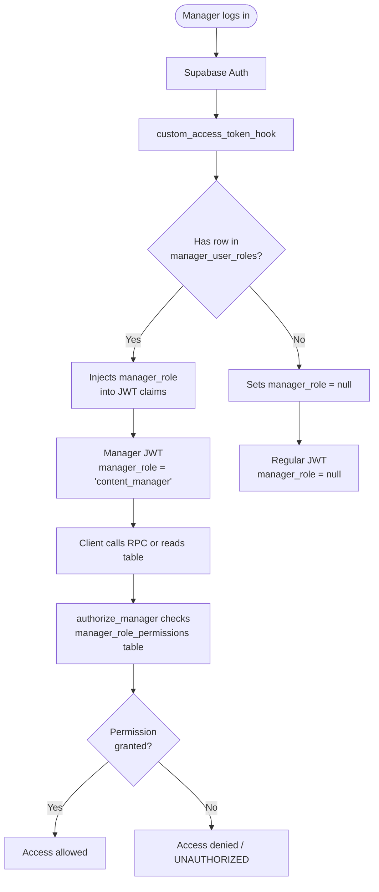

# Manager RBAC — Overview

The platform has a separate manager/admin layer built on top of Supabase Auth. Manager accounts are stored in the `managers` table (not the `profiles` table), have no public presence, and authenticate through the same JWT flow as regular users — but their tokens carry an extra `manager_role` claim injected by a custom auth hook.

---

## Architecture



---

## Core Tables

| Table | Purpose |
|---|---|
| `managers` | Profile data for manager accounts (linked 1:1 to `auth.users`) |
| `manager_user_roles` | Maps each manager to exactly one role |
| `manager_role_permissions` | Which permissions each role has — the source of truth |
| `impersonation_sessions` | Audit/TTL record for manager "log in as user" support sessions, gated by `users.impersonate` |

---

## Key Function: `authorize_manager`

```sql
public.authorize_manager(requested_permission manager_permission) RETURNS BOOLEAN
```

Reads `manager_role` from `auth.jwt()`, looks it up in `manager_role_permissions`, and returns `true` if the permission is granted. Called inside every manager-gated RLS policy and RPC.

Always use the **subselect form** in RLS policies to avoid per-row re-evaluation:

```sql
-- Correct (evaluated once per query)
using ((select public.authorize_manager('transactions.view')));

-- Avoid (evaluated per row — expensive on large tables)
using (public.authorize_manager('transactions.view'));
```

---

## Manager Roles

| Role | Intended for |
|---|---|
| `super_admin` | Full access to everything |
| `content_manager` | Content moderation: newsletter, shop, user page flags |
| `support_manager` | User account management, support tickets, user services |
| `finance_manager` | Transactions, withdrawals, payouts |
| `developer_manager` | Service requests, developer accounts |

See [Roles & Permissions](./roles-and-permissions.md) for the full permission matrix.

---

## Next

- [Roles & Permissions →](./roles-and-permissions.md)
- [RLS Policies →](./rls-policies.md)
- [Manager RPCs →](./rpcs.md)
