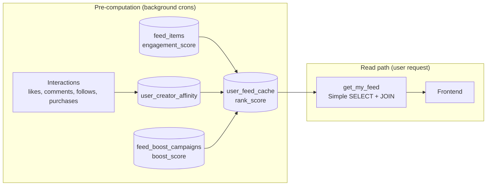
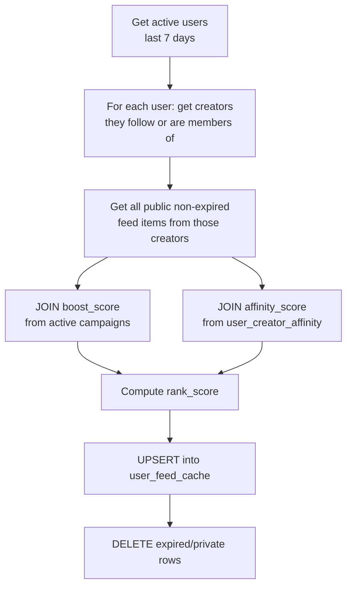

# Affinity & Feed Ranking

This page covers how the feed is ranked — the affinity scoring system, the pre-computed feed cache, and the ranking formula that combines all signals.

## The Ranking Problem

Computing a personalised ranked feed for every user on every page load would require joining follows, purchases, memberships, boost scores, engagement counts, and recency — all at query time. At scale this becomes very expensive.

The solution: **pre-compute everything**. Three cron jobs run in the background and write results into pre-computed tables. When a user requests their feed, the query is a simple paginated `SELECT` with no aggregation.



## Affinity Scores

### Table: `user_creator_affinity`

Stores a pre-computed score for every (user, creator) pair where interaction has occurred. Scores range from 0 to 10.

```sql
create table public.user_creator_affinity (
  user_profile_id     uuid not null references public.profiles(id) on delete cascade,
  creator_profile_id  uuid not null references public.profiles(id) on delete cascade,
  affinity_score      numeric(6,4) not null default 0 check (affinity_score between 0 and 10),
  last_computed_at    timestamptz not null default now(),
  constraint user_creator_affinity_pk primary key (user_profile_id, creator_profile_id),
  constraint user_creator_affinity_no_self check (user_profile_id <> creator_profile_id)
);
```

### Signal Weights

| Signal | Score | Cap |
|---|---|---|
| Active membership with creator | +4.0 | (one membership = max 4.0) |
| Purchase from creator | +2.0 per purchase | max 6.0 |
| Like on creator's feed item | +0.5 per like | max 2.0 |
| Comment on creator's feed item | +0.3 per comment | max 1.2 |
| Shared follow (mutual network) | +0.5 per shared follow | max 1.0 |
| **Total** | | **max 10.0** |

**Example:** A user with an active membership (4.0) who has made 2 purchases (4.0) and liked 3 posts (1.5) has an affinity score of `min(4.0 + 4.0 + 1.5, 10.0) = 9.5`.

### Cron: `cron_refresh_affinity_scores` — Every 2 Hours

Rebuilds affinity for all users who have been active in the last 7 days (configurable via `feed_cache_active_user_window_days` in `platform_settings`).

Uses an `INSERT ... ON CONFLICT DO UPDATE` (upsert), so it creates new rows for new interactions and updates existing ones. Rows with a score of 0 that haven't been updated in a day are deleted (cleanup for inactive relationships).

---

## Feed Cache

### Table: `user_feed_cache`

The pre-computed ranked feed. One row per (user, feed_item) pair. Read by `get_my_feed()`.

```sql
create table public.user_feed_cache (
  id               bigint generated always as identity primary key,
  user_profile_id  uuid not null references public.profiles(id) on delete cascade,
  feed_item_id     uuid not null references public.feed_items(id) on delete cascade,
  rank_score       numeric(14,6) not null default 0,
  is_boosted       boolean not null default false,  -- UI "Promoted" badge
  cached_at        timestamptz not null default now(),
  constraint user_feed_cache_unique unique (user_profile_id, feed_item_id)
);
```

### Rank Score Formula

```
rank_score =
  (boost_score    × 0.40)   -- 0 if no active campaign
  + (affinity_score × 0.30)   -- scaled: affinity/10 * 0.30
  + (recency_score  × 0.20)   -- linear decay 1.0→0.0 over 90 days
  + (engagement_score × 0.10) -- normalised: min(engagement/100, 1.0) * 0.10
```

**Signal breakdown:**

| Signal | Weight | Source | Range |
|---|---|---|---|
| Boost | 40% | `feed_boost_campaigns.boost_score` | 0–10 |
| Affinity | 30% | `user_creator_affinity.affinity_score` | 0–10 |
| Recency | 20% | Computed from `feed_items.created_at` / `expires_at` | 0–1 |
| Engagement | 10% | `feed_items.engagement_score` / 100 | 0–1 |

**Recency decay** is linear: a post published today scores 1.0, a post published 45 days ago scores ~0.5, and a post published 90 days ago (at expiry) scores 0.0.

```
recency_score = 1.0 - (age_seconds / total_lifetime_seconds)
```

### Cron: `cron_refresh_user_feed_cache` — Every 30 min

Rebuilds feed cache for users who have been active in the last 7 days. "Active" is approximated by checking for recent follows, likes, comments, or active memberships.

**Candidate items:** Only feed items from creators the user **follows** or has an **active membership** with appear in the cache. A new user with no follows will see an empty feed.



After the upsert, the cron also cleans up cache rows for feed items that have since expired or been set to private.

### Why Users Only See Followed Creators

The cache only includes content from creators the user follows or has a membership with. This is intentional:
- Keeps the cache table size manageable
- Prevents spam from random creators
- Recommended creators (from `get_recommended_creators`) fill the discovery gap

---

## `get_my_feed` RPC

The primary read endpoint. Reads from `user_feed_cache` with a `JOIN` to `feed_items` and `profiles` for display data.

### Cursor-based Pagination

The feed uses **keyset pagination** on `(rank_score DESC, cache_id DESC)` for stable ordering. This is more reliable than offset pagination because inserting/updating rows in the cache won't cause items to shift position mid-scroll.

```typescript
// First page
const { data: page1 } = await supabase.rpc('get_my_feed', {
  p_limit: 20
})

// Next page — pass cursor values from the last item in page1
const lastItem = page1[page1.length - 1]
const { data: page2 } = await supabase.rpc('get_my_feed', {
  p_limit: 20,
  p_cursor_score: lastItem.rank_score,
  p_cursor_id: lastItem.cache_id
})
```

Maximum 50 items per page (hard cap enforced in the RPC).

### Return Shape

Each row contains everything needed to render a feed card:

```typescript
interface FeedItem {
  // Cache metadata
  cache_id: number
  rank_score: number
  is_boosted: boolean
  cached_at: string

  // Feed item
  feed_item_id: string
  content_type: 'newsletter_post' | 'membership_plan' | 'shop_product' | ...
  content_id: string
  is_paywalled: boolean
  like_count: number
  comment_count: number
  impression_count: number
  metadata: Record<string, unknown>  // service-specific fields
  expires_at: string
  created_at: string

  // Creator
  creator_profile_id: string
  creator_username: string
  creator_display_name: string
  creator_avatar_url: string | null

  // Viewer context
  viewer_has_liked: boolean
}
```

The `metadata` field shape varies by `content_type`. See [Feed Items — The metadata Column](./feed-items.md#the-metadata-column) for per-service shapes.
