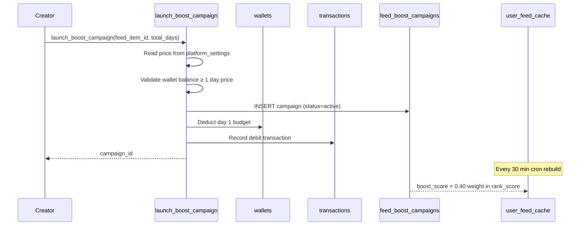
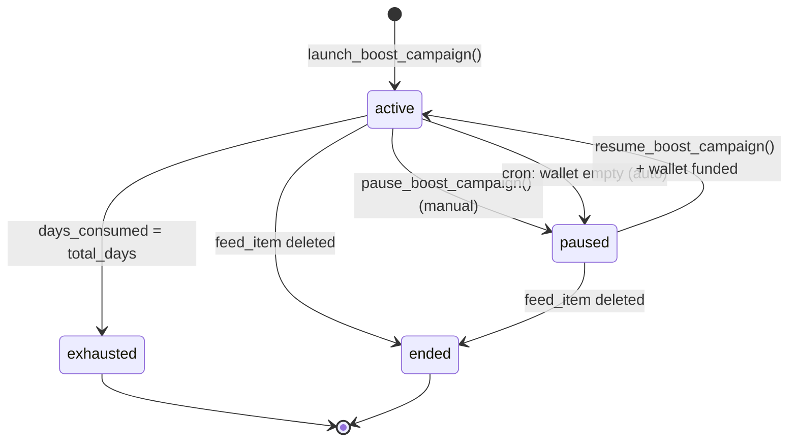
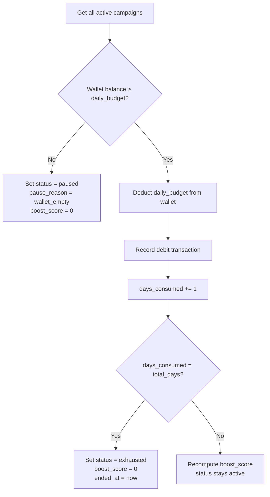

# Boost Campaigns

Creators can pay to boost their feed items, making them appear more prominently and more frequently in other users' feeds. Boost campaigns are self-serve, immediate, and funded from the creator's wallet.

## How Boosting Works



## Campaign Lifecycle



| Status | Meaning | Wallet charged? |
|---|---|---|
| `active` | Running, daily charge applies | Yes |
| `paused` | Halted (manual or wallet empty) | No |
| `exhausted` | All paid days consumed, campaign complete | No |
| `ended` | Feed item was deleted mid-campaign | No |

## Boost Score Formula

The `boost_score` is what gets added to the ranking formula. It's designed to:
- Give a higher score to fresher campaigns (more days remaining = more value)
- Scale with spend (a creator paying more per day gets a higher score)

```
boost_score = (daily_budget / platform_price_per_day) × (days_remaining / total_days) × 10
```

**Example:** Platform price is ৳50/day. Creator runs a 10-day campaign.

| Day | days_remaining | boost_score |
|---|---|---|
| Day 1 | 9/10 | `(50/50) × (9/10) × 10 = 9.0` |
| Day 5 | 5/10 | `(50/50) × (5/10) × 10 = 5.0` |
| Day 9 | 1/10 | `(50/50) × (1/10) × 10 = 1.0` |
| Day 10 | 0/10 | `exhausted, boost_score = 0` |

The score naturally decays each day. There is no separate decay cron — the daily charge cron recalculates it.

## Table Schema

```sql
create table public.feed_boost_campaigns (
  id                  uuid primary key default gen_random_uuid(),
  feed_item_id        uuid not null references public.feed_items(id) on delete cascade,
  creator_profile_id  uuid not null references public.profiles(id) on delete cascade,
  daily_budget        numeric(10,2) not null,   -- BDT, from platform_settings
  total_days          integer not null,          -- creator-configured
  days_consumed       integer not null default 0,
  status              public.boost_status_enum not null default 'active',
  boost_score         numeric(12,4) not null default 0,
  pause_reason        varchar(20),               -- 'manual' | 'wallet_empty'
  started_at          timestamptz not null default now(),
  paused_at           timestamptz,
  ended_at            timestamptz,
  created_at          timestamptz not null default now(),
  updated_at          timestamptz not null default now(),

  -- only one active or paused campaign per feed item at a time
  constraint feed_boost_campaigns_one_active_per_item
    exclude using btree (feed_item_id with =)
    where (status in ('active', 'paused'))
);
```

The exclusion constraint prevents launching a second campaign while one is still active or paused. A creator must wait for exhaustion or manually end (delete the feed item) before starting fresh.

## RPCs

### `launch_boost_campaign`

```typescript
const { data: campaignId, error } = await supabase.rpc('launch_boost_campaign', {
  p_feed_item_id: feedItemId,
  p_total_days: 7
})
```

**Validations (in order):**
1. Feed item belongs to the calling user and is not expired
2. `total_days` is within `feed_boost_min_days` and `feed_boost_max_days` from `platform_settings`
3. No existing `active` or `paused` campaign for this feed item
4. Wallet balance ≥ `feed_boost_price_per_day` (enough for at least 1 day)

**On success:**
- Inserts campaign row with `status = 'active'`
- Deducts day 1 budget from wallet immediately
- Records a `debit` transaction with `service_type = 'boost'`
- Sets `days_consumed = 1` and computes initial `boost_score`

**Total campaign cost:** `platform_price_per_day × total_days` (e.g. ৳50 × 7 days = ৳350 total, charged ৳50/day)

**Errors:**

| Code | Message |
|---|---|
| `P0002` | Feed item not found or does not belong to you |
| `P0001` | total_days must be between X and Y |
| `P0001` | An active or paused campaign already exists for this feed item |
| `P0002` | Wallet not found |
| `P0001` | Insufficient wallet balance. Need at least ৳50 to launch a boost. |

### `pause_boost_campaign`

```typescript
const { error } = await supabase.rpc('pause_boost_campaign', {
  p_campaign_id: campaignId
})
```

Creator manually pauses an active campaign. Sets `pause_reason = 'manual'`. No wallet deduction while paused.

**Errors:**

| Code | Message |
|---|---|
| `P0002` | Active campaign not found or does not belong to you |

### `resume_boost_campaign`

```typescript
const { error } = await supabase.rpc('resume_boost_campaign', {
  p_campaign_id: campaignId
})
```

Resumes a paused campaign. Re-checks wallet balance before resuming — if the wallet is still empty, this returns an error rather than resuming.

**Errors:**

| Code | Message |
|---|---|
| `P0002` | Paused campaign not found or does not belong to you |
| `P0001` | Insufficient wallet balance. Need at least ৳50 to resume boost. |

## Daily Charge Cron

`cron_process_boost_daily_charges` runs **every day at midnight**. For each `active` campaign:



Each transaction record includes a `metadata` field:
```json
{
  "campaign_id": "...",
  "feed_item_id": "...",
  "day": 3,
  "total_days": 7,
  "action": "daily_charge"
}
```

This makes it easy to audit exactly which day of a campaign generated each charge.

## When a Feed Item is Deleted

A `BEFORE DELETE` trigger on `feed_items` fires before the cascade. It sets any `active` or `paused` campaigns to `ended` and stamps `ended_at`. The cascade then deletes the campaign rows. This ensures the `ended` state is recorded in the transaction history before the campaign row disappears.

## Row Level Security

| Operation | Who | Rule |
|---|---|---|
| SELECT | `authenticated` | Creator sees own campaigns only |
| INSERT | `authenticated` | Blocked — use `launch_boost_campaign()` |
| UPDATE | `authenticated` | Blocked — use RPCs |
| DELETE | `authenticated` | Blocked |

All writes go through SECURITY DEFINER RPCs which bypass RLS.
