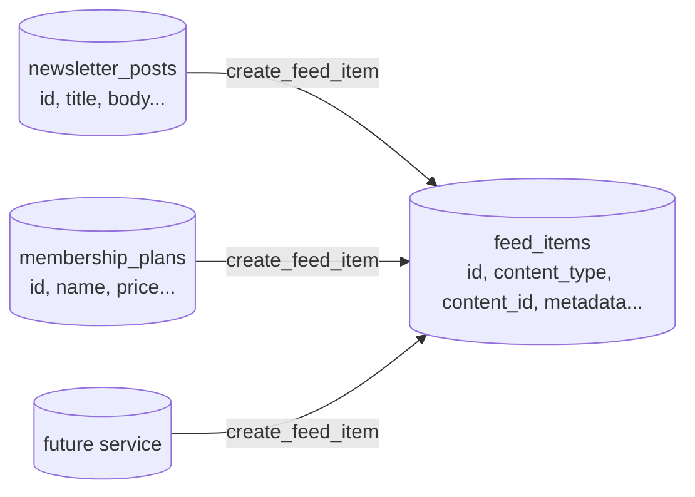

# Feed Items

The `feed_items` table is the foundation of the entire feed system. It is a **service-agnostic broadcast layer** — one row per piece of published content, regardless of which service produced it.

## Design Principle

Source content (a newsletter post, a shop product, a membership plan) lives in its own table. When a creator publishes that content, a corresponding `feed_items` row is created. The feed item is what gets ranked, liked, boosted, and delivered to followers.



**Why not put everything in one table?** Each service has completely different data shapes. A newsletter post has a slug and read time. A shop product has SKU and stock. Rather than adding columns for every possible service, `feed_items` keeps a minimal universal schema and stores service-specific fields in a `metadata jsonb` column.

## Table Schema

```sql
create table public.feed_items (
  id                  uuid primary key default gen_random_uuid(),
  creator_profile_id  uuid not null references public.profiles(id) on delete cascade,
  content_type        public.feed_content_type_enum not null,
  content_id          uuid not null,           -- soft FK to source content row
  is_paywalled        boolean not null default false,
  visibility          public.visibility_enum not null default 'public',
  engagement_score    numeric(12,4) not null default 0,
  like_count          integer not null default 0,
  comment_count       integer not null default 0,
  impression_count    integer not null default 0,
  metadata            jsonb not null default '{}',
  expires_at          timestamptz not null,    -- set to now() + 90 days on insert
  created_at          timestamptz not null default now(),
  updated_at          timestamptz not null default now(),

  constraint feed_items_content_unique unique (content_type, content_id)
);
```

### Key Design Decisions

**`content_id` is not a hard foreign key.** It references whichever source table matches `content_type`. Hard FKs across multiple tables aren't possible in PostgreSQL. Integrity is enforced at the RPC level in `create_feed_item()`.

**Unique constraint on `(content_type, content_id)`.** One feed item per source content object. `create_feed_item()` is idempotent — calling it again on an already-published post just updates the metadata.

**Counters are denormalized.** `like_count`, `comment_count`, and `impression_count` are kept in sync by triggers and cron rather than computed by joins at read time. This keeps `get_my_feed()` fast.

**`engagement_score` is pre-computed.** Updated every 30 minutes by `cron_refresh_engagement_scores()`. Formula:

```
engagement_score = like_count + (comment_count × 2) + (impression_count × 0.1)
```

## The `metadata` Column

All service-specific display fields live here. Every feed card needs at minimum:

| Key | Type | Description |
|---|---|---|
| `title` | `string` | Display name of the content |
| `excerpt` | `string` | Teaser text (shown behind paywalls too) |
| `banner_image_url` | `string \| null` | Hero image URL |

Service-specific extensions:

```jsonc
// newsletter_post
{
  "title": "My Post",
  "excerpt": "A short teaser...",
  "banner_image_url": "https://...",
  "slug": "my-post",
  "read_time_minutes": 4,
  "tags": ["coffee", "brewing"],
  "is_members_only": true,
  "is_pay_per_post": false,
  "price": null
}

// membership_plan
{
  "title": "Pro Supporter",
  "excerpt": "Get access to all posts...",
  "banner_image_url": null,
  "price": 500,
  "billing_cycle": "monthly"
}

// shop_product
{
  "title": "Hobenaki Mug",
  "excerpt": "Handcrafted ceramic...",
  "banner_image_url": "https://...",
  "price": 800,
  "sku": "MUG-001"
}
```

## Content Types

```sql
create type public.feed_content_type_enum as enum (
  'newsletter_post',
  'membership_plan',
  'shop_product',
  'coffee_page',
  'course',
  'podcast_episode',
  'event',
  'announcement'
);
```

To add a new type, add the value to this enum and write a publish trigger for the new service table.

## Row Level Security

| Operation | Who | Rule |
|---|---|---|
| SELECT | `authenticated` | Public non-expired items, OR own items (any state) |
| SELECT | `anon` | Public non-expired items only |
| INSERT | `authenticated` | Blocked — use `create_feed_item()` RPC |
| UPDATE | `authenticated` | Creator can update own item's `metadata`/`visibility` |
| DELETE | `authenticated` | Blocked — use `delete_feed_item()` RPC |

## RPCs

### `create_feed_item()` — Internal

Called by service publish triggers. Never called directly from the frontend.

```sql
select public.create_feed_item(
  p_creator_profile_id => '<uuid>',
  p_content_type       => 'newsletter_post',
  p_content_id         => '<source_row_uuid>',
  p_is_paywalled       => true,
  p_visibility         => 'public',
  p_metadata           => '{"title": "...", "excerpt": "...", "slug": "..."}'
);
-- returns: uuid of the feed_item (created or updated)
```

**Idempotent:** uses `ON CONFLICT (content_type, content_id) DO UPDATE`. Calling it a second time (e.g. if creator edits and re-publishes) updates `metadata`, `is_paywalled`, and `visibility` silently. The feed item's `created_at` does not change — the edit surfaces no "bump" in the feed.

**Reads `feed_item_max_age_days` from `platform_settings`** to set `expires_at`. Defaults to 90 days if the key is missing.

### `delete_feed_item(p_feed_item_id uuid)` — Creator

```typescript
const { error } = await supabase.rpc('delete_feed_item', {
  p_feed_item_id: '...'
})
```

Validates that the calling user owns the feed item, then hard-deletes it. Cascade removes:
- `feed_item_likes`
- `feed_item_comments` (and replies)
- `feed_item_impression_buffer`
- `feed_boost_campaigns` (marked `ended` by BEFORE DELETE trigger first)
- `user_feed_cache` rows

**Errors:**

| Code | Message |
|---|---|
| `P0002` | Feed item not found |
| `42501` | Not authorised to delete this feed item |

## Adding a New Service {#adding-a-new-service}

To wire a new service table (e.g. `courses`) into the feed:

**Step 1.** Add the type to `feed_content_type_enum`:

```sql
alter type public.feed_content_type_enum add value 'course';
```

**Step 2.** Write a trigger function following this pattern:

```sql
create or replace function public.handle_course_feed_item()
returns trigger
language plpgsql
security definer
set search_path = ''
as $$
begin
  if new.status = 'published' and new.visibility = 'public' then
    perform public.create_feed_item(
      p_creator_profile_id => new.profile_id,
      p_content_type       => 'course'::public.feed_content_type_enum,
      p_content_id         => new.id,
      p_is_paywalled       => new.is_paid,
      p_visibility         => new.visibility,
      p_metadata           => jsonb_build_object(
        'title',            new.title,
        'excerpt',          new.short_description,
        'banner_image_url', new.cover_image_url,
        -- course-specific fields:
        'lesson_count',     new.lesson_count,
        'duration_minutes', new.total_duration_minutes,
        'price',            new.price
      )
    );
  end if;

  -- expire feed item when course is unpublished
  if new.status = 'draft' and old.status = 'published' then
    update public.feed_items
    set expires_at = now(), updated_at = now()
    where content_type = 'course' and content_id = new.id;
  end if;

  return new;
end;
$$;

create trigger on_course_feed_item
after insert or update of status, visibility
on public.courses
for each row
execute procedure public.handle_course_feed_item();
```

That's it. The feed ranking, impression tracking, likes, comments, and boost system all work automatically for the new content type.

## Cron Jobs

### `cron_refresh_engagement_scores` — Every 30 min

Updates `engagement_score` on all non-expired `feed_items`:

```sql
update public.feed_items
set engagement_score = (
  like_count + (comment_count * 2) + (impression_count * 0.1)
), updated_at = now()
where expires_at > now();
```

No joins. Reads only pre-computed counters on the same row. Very fast.

### `cron_expire_and_cleanup_feed` — Daily 1am

Hard-deletes all `feed_items` where `expires_at <= now()`. Cascade handles all child rows across every related table.

```sql
delete from public.feed_items where expires_at <= now();
```
