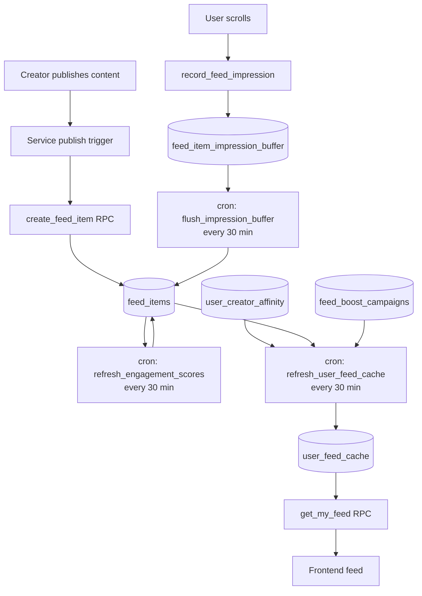
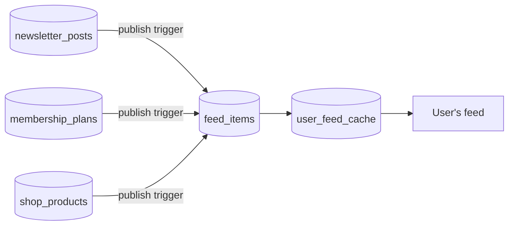

# Memberships Hub — Backend Overview

The Memberships Hub is a single page in the Hobenaki Coffee platform that surfaces a **personalised content feed**, **active memberships**, **following/followers lists**, and a **creator membership dashboard** — all in one place.

## Architecture

The system is built entirely on Supabase (PostgreSQL + Edge Functions). There is no separate feed microservice. All ranking, scoring, and caching happens inside the database via pg_cron jobs and pre-computed tables.



## Core Concept: Separation of Content and Broadcast

Source content (newsletter posts, shop products, membership plans) stays in its own table. When a creator **publishes** content, a separate `feed_items` row is created as the public broadcast of that content. The feed item is what gets ranked, liked, commented on, and boosted — not the source content directly.



This separation means:
- Updating source content silently updates the feed item's metadata
- The same source content always maps to exactly one feed item (enforced by unique constraint on `content_type, content_id`)
- Adding a new service only requires writing one new trigger — no schema changes

## Database Tables

| Table | Purpose |
|---|---|
| `feed_items` | Core published content records |
| `feed_item_likes` | One like per user per item |
| `feed_item_comments` | Comments + one level of replies |
| `feed_item_impression_buffer` | Append-only scroll event buffer |
| `feed_boost_campaigns` | Creator-funded boost campaigns |
| `user_creator_affinity` | Pre-computed user↔creator interest scores |
| `user_feed_cache` | Pre-computed ranked feed per user |
| `platform_settings` | Platform-wide configuration key-value store |

## Cron Jobs

All cron jobs run via `pg_cron`. They operate on pre-computed counters — no heavy aggregation at read time.

| Job | Schedule | What it does |
|---|---|---|
| `flush_impression_buffer` | Every 30 min | Flushes buffered impressions → `feed_items.impression_count` |
| `refresh_engagement_scores` | Every 30 min | Recomputes `engagement_score` from counters |
| `refresh_affinity_scores` | Every 2 hours | Recomputes `user_creator_affinity` from interactions |
| `refresh_user_feed_cache` | Every 30 min | Rebuilds ranked feed for active users |
| `process_boost_daily_charges` | Daily midnight | Deducts wallet, advances campaign day count |
| `expire_and_cleanup_feed` | Daily 1am | Deletes expired feed items + cascades |

> **Staleness is acceptable.** Feed data can be up to 30 minutes behind. This is an intentional design decision — real-time ranking would require expensive aggregation on every page load.

## Migration Order

Run migrations in this exact order. Each file depends on the previous ones.

```
1. platform_settings.sql       ← no dependencies
2. memberships_hub.sql         ← depends on platform_settings + all existing tables
```

Within `memberships_hub.sql`, parts run in order:

```
Part 1: feed_items              ← depends on profiles, platform_settings
Part 2: feed_interactions       ← depends on feed_items
Part 3: feed_boost_campaigns    ← depends on feed_items, wallets, transactions
Part 4: feed_affinity           ← depends on feed_items, follows, memberships
Part 5: user_feed_cache         ← depends on all above
Part 6: feed_recommendations    ← depends on all above (RPCs only, no new tables)
```

## Prerequisites

These must exist before running the migration:

- `public.profiles`
- `public.follows`
- `public.wallets`
- `public.transactions`
- `public.profile_memberships`
- `public.membership_plans`
- `public.newsletter_posts`
- `public.visibility_enum`
- `public.membership_billing_cycle_enum`
- `public.membership_status_enum`
- `public.handle_updated_at()`
- `pg_cron` extension enabled

## Security Model

All tables use Row Level Security. The general pattern across every table:

- **Reads**: Users see only their own data (feed cache, affinity) or public content (feed items, likes, comments)
- **Writes**: All writes go through `SECURITY DEFINER` RPCs — direct client inserts/updates are blocked by RLS `with check (false)` policies
- **Cron functions**: All cron target functions are `SECURITY DEFINER` so they bypass RLS and operate on all rows

## Adding a New Service

To make a new service (e.g. courses, podcasts) appear in the feed, you only need to:

1. Add the new content type to `feed_content_type_enum`
2. Write a trigger on the new content table that calls `create_feed_item()` with the appropriate metadata shape

See [Feed Items — Service Hooks](./feed-items.md#adding-a-new-service) for the full pattern.
