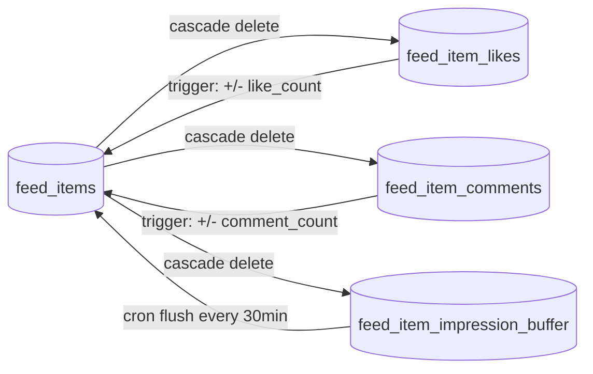
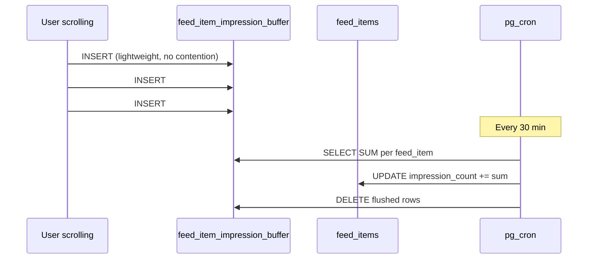

# Interactions — Likes, Comments & Impressions

This covers the three interaction surfaces on feed items: likes, comments, and impression tracking.

## Overview



All three tables cascade-delete from `feed_items`. If a feed item is deleted, all its likes, comments, and buffered impressions go with it.

---

## Likes

### Table: `feed_item_likes`

```sql
create table public.feed_item_likes (
  id               bigint generated always as identity primary key,
  feed_item_id     uuid not null references public.feed_items(id) on delete cascade,
  user_profile_id  uuid not null references public.profiles(id) on delete cascade,
  created_at       timestamptz not null default now(),
  constraint feed_item_likes_unique unique (feed_item_id, user_profile_id)
);
```

One like per user per feed item. Triggers keep `feed_items.like_count` in sync — no need to count rows at query time.

### RPC: `toggle_feed_like`

```typescript
const { data: isNowLiked, error } = await supabase.rpc('toggle_feed_like', {
  p_feed_item_id: feedItemId
})
// returns: true (liked) | false (unliked)
```

**What it does:**
1. Validates the feed item exists, is public, and hasn't expired
2. Checks if the current user already has a like row
3. Deletes the like (unlike) or inserts a new one (like)
4. Returns the new like state

The trigger fires automatically after insert/delete and adjusts `like_count` using `greatest(..., 0)` to prevent negative counts.

**Errors:**

| Code | Message |
|---|---|
| `P0002` | Feed item not found or expired |

---

## Comments

### Table: `feed_item_comments`

```sql
create table public.feed_item_comments (
  id                uuid primary key default gen_random_uuid(),
  feed_item_id      uuid not null references public.feed_items(id) on delete cascade,
  parent_comment_id uuid references public.feed_item_comments(id) on delete cascade,
  user_profile_id   uuid not null references public.profiles(id) on delete cascade,
  body              text not null check (char_length(body) > 0 and char_length(body) <= 2000),
  is_hidden         boolean not null default false,
  created_at        timestamptz not null default now(),
  updated_at        timestamptz not null default now()
);
```

### Comment Depth

Only **one level of replies** is supported. The `add_feed_comment()` RPC enforces this by checking that the parent comment is itself a root comment (`parent_comment_id IS NULL`).

```
root comment          (parent_comment_id = NULL)
  └── reply           (parent_comment_id = root.id)
       └── ❌ not allowed
```

### Hiding vs Deleting

| Action | Who can do it | What happens |
|---|---|---|
| Hard delete | Comment author | Row deleted, replies cascade-deleted, `comment_count` decremented |
| Hide | Feed item creator | `is_hidden = true`, excluded from reads, `comment_count` decremented |

The creator cannot delete comments outright — only hide them. Hidden comments remain in the database (visible to admins) but are excluded from all client-facing RLS policies.

### `comment_count` Sync

Three triggers keep `feed_items.comment_count` accurate:

| Trigger | Condition | Effect |
|---|---|---|
| `on_feed_item_comment_insert` | New comment with `is_hidden = false` | `+1` |
| `on_feed_item_comment_hide` | `is_hidden` flipped `false → true` | `-1` |
| `on_feed_item_comment_hide` | `is_hidden` flipped `true → false` (un-hide) | `+1` |
| `on_feed_item_comment_delete` | Deleted comment was visible | `-1` |

### RPC: `add_feed_comment`

```typescript
// Root comment
const { data: commentId, error } = await supabase.rpc('add_feed_comment', {
  p_feed_item_id: feedItemId,
  p_body: 'Great post!',
  p_parent_comment_id: null   // optional, omit for root comment
})

// Reply
const { data: replyId, error } = await supabase.rpc('add_feed_comment', {
  p_feed_item_id: feedItemId,
  p_body: 'I agree!',
  p_parent_comment_id: rootCommentId
})
```

Returns the new comment's `uuid`.

**Validations:**
- Feed item must exist, be public, and not expired
- Body cannot be empty or exceed 2000 characters
- If `p_parent_comment_id` is provided, it must be a root comment (`parent_comment_id IS NULL`) on the same feed item that is not hidden

**Errors:**

| Code | Message |
|---|---|
| `P0002` | Feed item not found or expired |
| `P0001` | Comment body cannot be empty |
| `P0001` | Comment body exceeds 2000 characters |
| `P0002` | Parent comment not found or is already a reply |

### RPC: `hide_feed_comment`

Creator-only. Soft-deletes a comment on their own feed item.

```typescript
const { error } = await supabase.rpc('hide_feed_comment', {
  p_comment_id: commentId
})
```

**Errors:**

| Code | Message |
|---|---|
| `P0002` | Comment not found |
| `42501` | Only the feed item creator can hide comments |

### RPC: `delete_feed_comment`

Author-only. Hard-deletes their own comment. Cascade removes any replies.

```typescript
const { error } = await supabase.rpc('delete_feed_comment', {
  p_comment_id: commentId
})
```

**Errors:**

| Code | Message |
|---|---|
| `P0002` | Comment not found |
| `42501` | Only the comment author can delete their comment |

---

## Impression Tracking

### Why a Buffer?

When many users scroll through a feed simultaneously, writing directly to `feed_items.impression_count` on every scroll event would create **write contention** — multiple transactions fighting to update the same row. A buffer table solves this:



### Table: `feed_item_impression_buffer`

```sql
create table public.feed_item_impression_buffer (
  id               bigint generated always as identity primary key,
  feed_item_id     uuid not null references public.feed_items(id) on delete cascade,
  user_profile_id  uuid not null references public.profiles(id) on delete cascade,
  created_at       timestamptz not null default now()
  -- no unique constraint: multiple impressions per user are valid
);
```

No unique constraint. A user scrolling past the same item multiple times generates multiple rows. This is intentional — repeat exposure is a valid engagement signal.

### RPC: `record_feed_impression`

Called by the frontend whenever a feed card enters the viewport. Designed to be fast and fire-and-forget.

```typescript
// Fire-and-forget — don't await this in the critical path
supabase.rpc('record_feed_impression', { p_feed_item_id: feedItemId })
```

**What it does:**
- Checks that the feed item exists and hasn't expired (silent no-op if not found — avoids errors on race conditions)
- Inserts one row into the buffer

No return value. No error thrown if item is not found.

### Cron: `cron_flush_impression_buffer` — Every 30 min

```sql
-- Aggregate + update
with buffered as (
  select feed_item_id, count(*) as new_impressions
  from public.feed_item_impression_buffer
  where created_at <= now() - interval '1 minute'  -- 1-min lag to avoid flushing live writes
  group by feed_item_id
)
update public.feed_items fi
set impression_count = fi.impression_count + b.new_impressions
from buffered b
where fi.id = b.feed_item_id;

-- Clean up
delete from public.feed_item_impression_buffer
where created_at <= now() - interval '1 minute';
```

The 1-minute cutoff avoids flushing rows that are still being written in the current moment.
