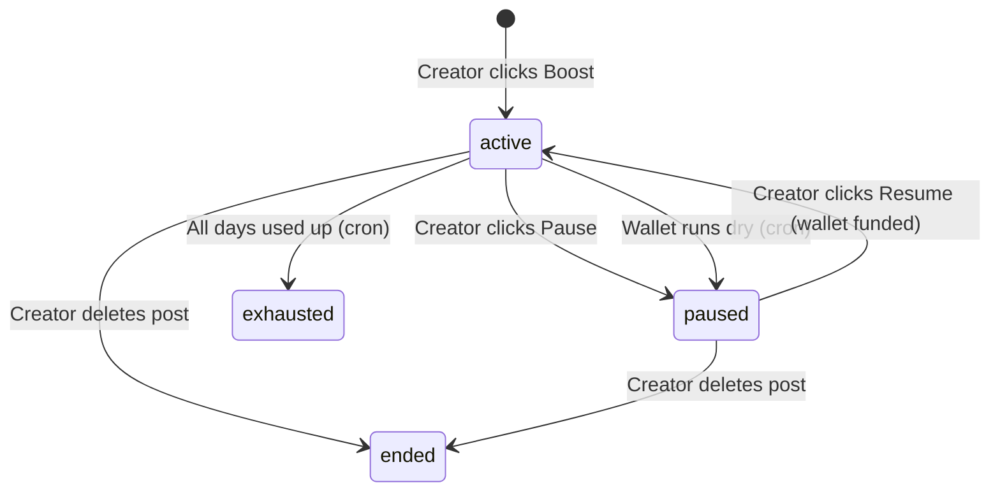

# Boost Campaigns — UI Flow

This page covers the complete creator-facing boost UI: reading the platform price, launching, pausing, and resuming campaigns.

## Reading the Platform Price

Before showing the boost UI, fetch `feed_boost_price_per_day` and the min/max day settings from `platform_settings`. This makes the pricing display dynamic and admin-controllable.

```typescript
// hooks/use-boost-settings.ts
import { useQuery } from '@tanstack/react-query'
import { useSupabaseClient } from '@/lib/supabase'

interface BoostSettings {
  pricePerDay: number
  minDays: number
  maxDays: number
}

export function useBoostSettings(): { data: BoostSettings | undefined; isLoading: boolean } {
  const supabase = useSupabaseClient()

  const { data, isLoading } = useQuery({
    queryKey: ['platform-settings', 'boost'],
    queryFn: async () => {
      const { data, error } = await supabase
        .from('platform_settings')
        .select('key, value')
        .in('key', ['feed_boost_price_per_day', 'feed_boost_min_days', 'feed_boost_max_days'])

      if (error) throw error

      const map = Object.fromEntries(data.map(s => [s.key, Number(s.value)]))
      return {
        pricePerDay: map.feed_boost_price_per_day,
        minDays: map.feed_boost_min_days,
        maxDays: map.feed_boost_max_days,
      } satisfies BoostSettings
    },
    staleTime: 5 * 60 * 1000, // cache for 5 min — settings rarely change
  })

  return { data, isLoading }
}
```

## Launch Boost Campaign

### Hook

```typescript
// hooks/use-launch-boost.ts
import { useMutation, useQueryClient } from '@tanstack/react-query'
import { useSupabaseClient } from '@/lib/supabase'

export function useLaunchBoost() {
  const supabase = useSupabaseClient()
  const queryClient = useQueryClient()

  return useMutation({
    mutationFn: async ({
      feedItemId,
      totalDays,
    }: {
      feedItemId: string
      totalDays: number
    }) => {
      const { data, error } = await supabase.rpc('launch_boost_campaign', {
        p_feed_item_id: feedItemId,
        p_total_days: totalDays,
      })
      if (error) throw error
      return data as string // campaign id
    },
    onSuccess: () => {
      // Wallet balance changed — invalidate wallet query if you have one
      queryClient.invalidateQueries({ queryKey: ['wallet'] })
    },
  })
}
```

### Boost Launch Dialog

The launch UI should clearly show the cost breakdown before the creator confirms:

```tsx
// components/boost-launch-dialog.tsx
import { useState } from 'react'
import { useBoostSettings } from '@/features/feed/hooks/use-boost-settings'
import { useLaunchBoost } from '@/features/feed/hooks/use-launch-boost'
import { useWalletBalance } from '@/features/wallet/hooks/use-wallet-balance'

interface BoostLaunchDialogProps {
  feedItemId: string
  feedItemTitle: string
  open: boolean
  onOpenChange: (open: boolean) => void
}

export function BoostLaunchDialog({
  feedItemId,
  feedItemTitle,
  open,
  onOpenChange,
}: BoostLaunchDialogProps) {
  const [days, setDays] = useState(7)
  const { data: settings } = useBoostSettings()
  const { data: walletBalance } = useWalletBalance()
  const { mutate: launch, isPending, error } = useLaunchBoost()

  const totalCost = (settings?.pricePerDay ?? 0) * days
  const hasEnoughBalance = (walletBalance ?? 0) >= (settings?.pricePerDay ?? 0)

  const handleLaunch = () => {
    launch(
      { feedItemId, totalDays: days },
      { onSuccess: () => onOpenChange(false) }
    )
  }

  return (
    <Dialog open={open} onOpenChange={onOpenChange}>
      <DialogContent>
        <DialogHeader>
          <DialogTitle>Boost this post</DialogTitle>
          <DialogDescription className="text-sm text-muted-foreground">
            {feedItemTitle}
          </DialogDescription>
        </DialogHeader>

        <div className="space-y-4 py-2">
          {/* Days slider */}
          <div className="space-y-2">
            <label className="text-sm font-medium">Duration: {days} days</label>
            <input
              type="range"
              min={settings?.minDays ?? 1}
              max={settings?.maxDays ?? 90}
              value={days}
              onChange={(e) => setDays(Number(e.target.value))}
              className="w-full"
            />
            <div className="flex justify-between text-xs text-muted-foreground">
              <span>{settings?.minDays ?? 1} day</span>
              <span>{settings?.maxDays ?? 90} days</span>
            </div>
          </div>

          {/* Cost breakdown */}
          <div className="rounded-md bg-muted p-3 space-y-1 text-sm">
            <div className="flex justify-between">
              <span>Price per day</span>
              <span>৳{settings?.pricePerDay}</span>
            </div>
            <div className="flex justify-between">
              <span>Duration</span>
              <span>{days} days</span>
            </div>
            <div className="flex justify-between font-semibold border-t pt-1 mt-1">
              <span>Total cost</span>
              <span>৳{totalCost}</span>
            </div>
          </div>

          {/* Wallet balance warning */}
          {!hasEnoughBalance && (
            <p className="text-sm text-destructive">
              Your wallet balance (৳{walletBalance}) is too low. You need at least
              ৳{settings?.pricePerDay} to launch a boost.{' '}
              <Link to="/wallet/topup">Top up →</Link>
            </p>
          )}

          {/* API error */}
          {error && (
            <p className="text-sm text-destructive">
              {getBoostErrorMessage(error)}
            </p>
          )}
        </div>

        <DialogFooter>
          <Button variant="outline" onClick={() => onOpenChange(false)}>Cancel</Button>
          <Button
            onClick={handleLaunch}
            disabled={isPending || !hasEnoughBalance}
          >
            {isPending ? 'Launching...' : `Boost for ৳${totalCost}`}
          </Button>
        </DialogFooter>
      </DialogContent>
    </Dialog>
  )
}
```

## Pause & Resume

### Hooks

```typescript
// hooks/use-pause-boost.ts
export function usePauseBoost() {
  const supabase = useSupabaseClient()
  const queryClient = useQueryClient()

  return useMutation({
    mutationFn: async (campaignId: string) => {
      const { error } = await supabase.rpc('pause_boost_campaign', {
        p_campaign_id: campaignId,
      })
      if (error) throw error
    },
    onSuccess: () => {
      queryClient.invalidateQueries({ queryKey: ['boost-campaigns'] })
    },
  })
}

// hooks/use-resume-boost.ts
export function useResumeBoost() {
  const supabase = useSupabaseClient()
  const queryClient = useQueryClient()

  return useMutation({
    mutationFn: async (campaignId: string) => {
      const { error } = await supabase.rpc('resume_boost_campaign', {
        p_campaign_id: campaignId,
      })
      if (error) throw error
    },
    onSuccess: () => {
      queryClient.invalidateQueries({ queryKey: ['boost-campaigns'] })
      queryClient.invalidateQueries({ queryKey: ['wallet'] })
    },
  })
}
```

### Campaign Status Display

Show a status badge + action button for each campaign:

```tsx
// components/boost-campaign-status.tsx
interface BoostCampaignStatusProps {
  campaignId: string
  status: 'active' | 'paused' | 'exhausted' | 'ended'
  pauseReason: string | null
  daysConsumed: number
  totalDays: number
  boostScore: number
}

export function BoostCampaignStatus({
  campaignId, status, pauseReason, daysConsumed, totalDays
}: BoostCampaignStatusProps) {
  const { mutate: pause, isPending: isPausing } = usePauseBoost()
  const { mutate: resume, isPending: isResuming } = useResumeBoost()

  return (
    <div className="flex items-center justify-between text-sm">
      <div className="flex items-center gap-2">
        <StatusBadge status={status} />
        <span className="text-muted-foreground">
          Day {daysConsumed} of {totalDays}
        </span>
        {status === 'paused' && pauseReason === 'wallet_empty' && (
          <span className="text-xs text-amber-600">Wallet empty</span>
        )}
      </div>

      <div>
        {status === 'active' && (
          <Button
            size="sm"
            variant="outline"
            onClick={() => pause(campaignId)}
            disabled={isPausing}
          >
            Pause
          </Button>
        )}
        {status === 'paused' && (
          <Button
            size="sm"
            onClick={() => resume(campaignId)}
            disabled={isResuming}
          >
            Resume
          </Button>
        )}
      </div>
    </div>
  )
}

function StatusBadge({ status }: { status: string }) {
  const config = {
    active:    { label: 'Active',    className: 'bg-green-100 text-green-700' },
    paused:    { label: 'Paused',    className: 'bg-amber-100 text-amber-700' },
    exhausted: { label: 'Completed', className: 'bg-muted text-muted-foreground' },
    ended:     { label: 'Ended',     className: 'bg-muted text-muted-foreground' },
  }[status] ?? { label: status, className: '' }

  return (
    <span className={`rounded-full px-2 py-0.5 text-xs font-medium ${config.className}`}>
      {config.label}
    </span>
  )
}
```

## Error Messages

```typescript
function getBoostErrorMessage(error: unknown): string {
  if (error instanceof Error) {
    if (error.message.includes('Insufficient wallet')) {
      return 'Your wallet balance is too low. Please top up and try again.'
    }
    if (error.message.includes('already exists')) {
      return 'This post already has an active or paused boost campaign.'
    }
    if (error.message.includes('total_days must be between')) {
      return 'Please select a valid duration for your campaign.'
    }
    if (error.message.includes('does not belong to you')) {
      return 'You can only boost your own posts.'
    }
  }
  return 'Something went wrong. Please try again.'
}
```

## Campaign Lifecycle Summary



When a campaign is `paused` with `pause_reason = 'wallet_empty'`, show the user a prompt to top up their wallet alongside the Resume button.
