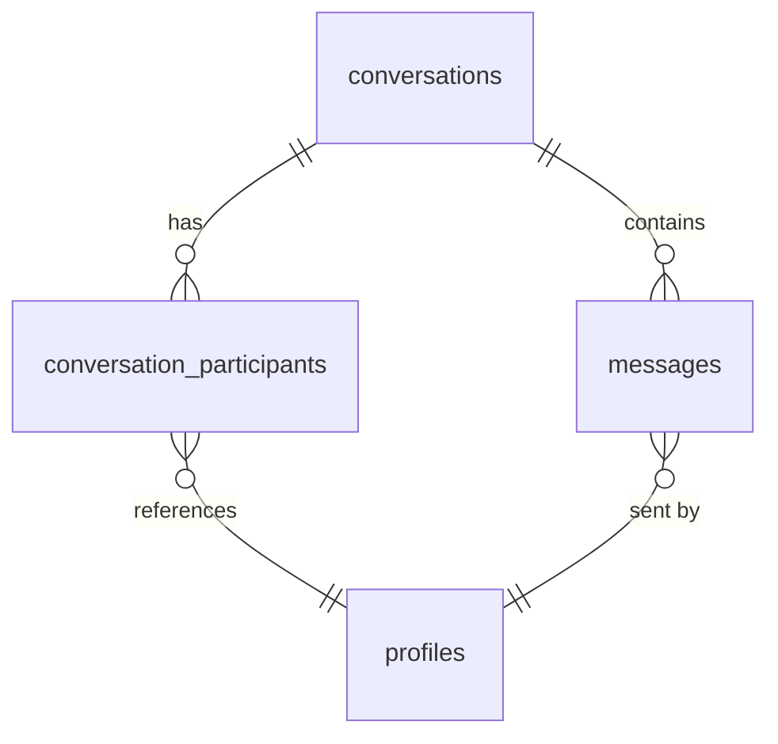

# Messaging — Backend Reference

Real-time messaging system with monthly DATE-range partitioning for the
`messages` table. Defined in `supabase/schemas/messaging.sql`.

---

## Architecture

Messages are stored in a **partitioned** table using monthly date ranges.
Partitions are created proactively and old ones are dropped automatically via
`pg_cron`. Realtime broadcasts are powered by Supabase Realtime using
channel topics named `conversation:{conversation_id}`.



---

## Tables

### `conversations`

```sql
create table public.conversations (
  id                 uuid primary key default gen_random_uuid(),
  type               text not null default 'direct',
  name               text,
  created_at         timestamptz not null default now(),
  last_message_at    timestamptz,
  last_message_preview text
);
```

| Column | Type | Description |
|---|---|---|
| `id` | `uuid PK` | Default `gen_random_uuid()` |
| `type` | `text` | `'direct'` or `'group'` |
| `name` | `text` | Display name for group conversations |
| `created_at` | `timestamptz` | Row creation timestamp |
| `last_message_at` | `timestamptz` | Timestamp of the most recent message |
| `last_message_preview` | `text` | Preview text (first 100 chars of last message) |

### `conversation_participants`

```sql
create table public.conversation_participants (
  conversation_id uuid not null references public.conversations(id) on delete cascade,
  profile_id      uuid not null references public.profiles(id) on delete cascade,
  last_read_at    timestamptz,
  joined_at       timestamptz not null default now(),
  primary key (conversation_id, profile_id)
);
```

| Column | Type | Description |
|---|---|---|
| `conversation_id` | `uuid` | FK to `conversations(id)` |
| `profile_id` | `uuid` | FK to `profiles(id)` |
| `last_read_at` | `timestamptz` | When the participant last read the conversation (for unread counts) |
| `joined_at` | `timestamptz` | When the participant joined |

### `messages` (Partitioned)

```sql
create sequence public.messages_id_seq;

create table public.messages (
  id              bigint not null default nextval('public.messages_id_seq'),
  conversation_id uuid not null references public.conversations(id) on delete cascade,
  sender_id       uuid not null references public.profiles(id) on delete cascade,
  content         text not null check (length(content) <= 5000),
  created_at      timestamptz not null default now(),
  primary key (id, created_at)
) partition by range (created_at);

alter sequence public.messages_id_seq owned by public.messages.id;
```

---

## Partitioning

Monthly partitions by `created_at` range. Partitions must have their own RLS
policies applied manually (not inherited from parent after creation).

### Active Partitions

| Partition | Range |
|---|---|
| `messages_2026_04` | `2026-04-01` to `2026-05-01` |
| `messages_2026_05` | `2026-05-01` to `2026-06-01` |
| `messages_2026_06` | `2026-06-01` to `2026-07-01` |
| `messages_default` | Default catch-all |

### `create_next_month_partition()`

```sql
public.create_next_month_partition() RETURNS void
```

Creates a partition for the month *two months ahead* of the current date
(e.g., on June 25, creates the August partition). This proactive window
ensures partitions exist before data arrives. Also applies RLS and manager
policies to the new partition.

Called via `pg_cron` on the 25th of each month.

### `drop_old_partitions()`

```sql
public.drop_old_partitions() RETURNS void
```

Drops the partition for the month *two months before* the current date (e.g.,
in June, drops the April partition). This retains approximately 3 months of
message history.

Called via `pg_cron` daily at 2:00 AM.

### Cron Jobs

```sql
-- Create next partition on the 25th at midnight
SELECT cron.schedule(
  'create-next-month-messages-partition',
  '0 0 25 * *',
  $$ SELECT public.create_next_month_partition(); $$
);

-- Drop old partitions daily at 2 AM
SELECT cron.schedule(
  'drop-old-message-partitions',
  '0 2 * * *',
  $$ SELECT public.drop_old_partitions(); $$
);
```

Alternatively, set up in Supabase Dashboard:
- **Job 1**: Name `create-next-month-messages-partition`, Schedule `0 0 25 * *`, SQL `SELECT public.create_next_month_partition();`
- **Job 2**: Name `drop-old-message-partitions`, Schedule `0 2 * * *`, SQL `SELECT public.drop_old_partitions();`

---

## Triggers

### `trg_update_last_message_at`

After insert on `messages`, for each row — calls `update_last_message_at()`
to update `conversations.last_message_at` and `conversations.last_message_preview`.

### `trg_broadcast_message_insert`

After insert on `messages`, for each row — calls `broadcast_message_insert()`
which uses `realtime.broadcast_changes()` to push the new message to channel
`conversation:{conversation_id}`.

---

## RLS Policies

### `conversations`

| Policy | Operation | Scope |
|---|---|---|
| Users can view their conversations | `SELECT` | Exists participant row with `profile_id = auth.uid()` |

### `conversation_participants`

| Policy | Operation | Scope |
|---|---|---|
| Users can view their participant rows | `SELECT` | `profile_id = auth.uid()` |
| Users can insert themselves as participant | `INSERT` | `profile_id = auth.uid()` |

### `messages`

| Policy | Operation | Scope |
|---|---|---|
| Users can view messages in their conversations | `SELECT` | Exists participant row for user in the same conversation |
| Users can send messages in their conversations | `INSERT` | `sender_id = auth.uid()` AND user is a participant |
| Managers can view all messages | `SELECT` | `authorize_manager('content.moderate')` |
| Managers can delete messages | `DELETE` | `authorize_manager('content.delete')` |

### Realtime Broadcast Policies

| Policy | Direction | Scope |
|---|---|---|
| Conversation participants can receive broadcasts | `SELECT` on `realtime.messages` | User is participant of topic `conversation:{id}` |
| Conversation participants can send broadcasts | `INSERT` on `realtime.messages` | User is participant of topic `conversation:{id}` |

---

## Functions

### `get_or_create_direct_conversation()`

```sql
public.get_or_create_direct_conversation(p_recipient_id uuid) RETURNS uuid
```

Returns existing direct conversation ID between the current user and
`p_recipient_id`, or creates a new one. Raises an exception if
`p_recipient_id` is null or identical to the current user.

### `get_conversations()`

```sql
public.get_conversations(
  p_limit  int DEFAULT 20,
  p_offset int DEFAULT 0
) RETURNS TABLE (
  id                  uuid,
  type                text,
  name                text,
  last_message_at     timestamptz,
  last_message_preview text,
  participants        jsonb,
  unread_count        bigint
)
```

Returns paginated conversations for the current user. Participants are
returned as a JSON array of `{ id, username, display_name, avatar_url }`.
For direct conversations, only the *other* participant is included (current
user is excluded). Unread count is calculated from `last_read_at` in
`conversation_participants`.

### `get_messages()`

```sql
public.get_messages(
  p_conversation_id uuid,
  p_limit           int DEFAULT 50,
  p_offset          int DEFAULT 0
) RETURNS TABLE (
  id                 bigint,
  conversation_id    uuid,
  sender_id          uuid,
  sender_username    text,
  sender_display_name text,
  sender_avatar_url  text,
  content            text,
  created_at         timestamptz,
  is_mine            boolean
)
```

Returns paginated messages for a conversation, ordered by `created_at DESC`.
Joins `profiles` to include sender display info. `is_mine` is `true` when
`sender_id = auth.uid()`.

### `send_message()`

```sql
public.send_message(
  p_conversation_id uuid,
  p_content         text
) RETURNS TABLE (
  id              bigint,
  conversation_id uuid,
  sender_id       uuid,
  content         text,
  created_at      timestamptz
)
```

Sends a message with rate limiting (max 5 messages per 10 seconds per
conversation). Validates content is non-empty and ≤ 5000 characters. Checks
the user is a participant. Updates `last_message_at` and
`last_message_preview` on the conversation. Returns the created message row.

### `mark_conversation_as_read()`

```sql
public.mark_conversation_as_read(p_conversation_id uuid) RETURNS void
```

Sets `last_read_at = now()` for the current user's participant row in the
given conversation.

---

## Indexes

| Index | Table | Type | Columns |
|---|---|---|---|
| `idx_messages_conversation_created_at` | `messages` | B-tree | `(conversation_id, created_at DESC)` — pagination |
| `idx_conversations_last_message_at` | `conversations` | B-tree | `(last_message_at DESC)` — inbox ordering |
| `idx_participants_profile` | `conversation_participants` | B-tree | `(profile_id)` — user's conversations lookup |
| `idx_participants_conversation` | `conversation_participants` | B-tree | `(conversation_id)` — participant lookup |

---

## Permission Revocations

All internal/management functions are revoked from client-facing roles:

| Function | Revoked from |
|---|---|
| `update_last_message_at()` | `public`, `anon`, `authenticated` |
| `broadcast_message_insert()` | `public`, `anon`, `authenticated` |
| `create_next_month_partition()` | `public`, `anon`, `authenticated` |
| `drop_old_partitions()` | `public`, `anon`, `authenticated` |

Client-facing RPCs are revoked from `public` and `anon`, but granted to
`authenticated`:
- `get_conversations()`
- `get_messages()`
- `send_message()`
- `mark_conversation_as_read()`
- `get_or_create_direct_conversation()`
