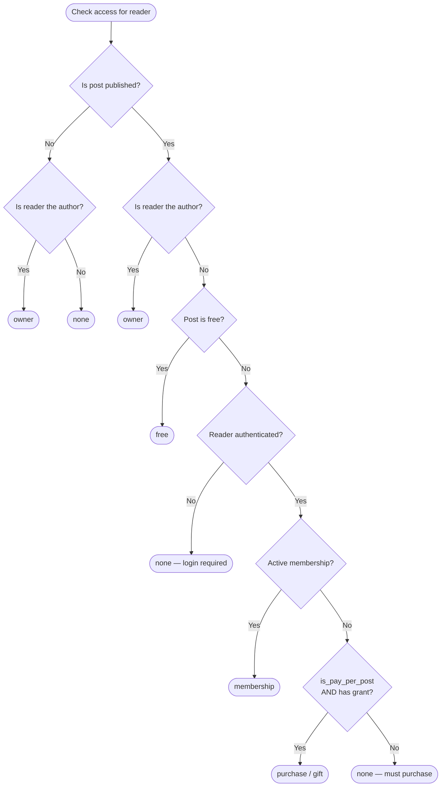

# Reader Engagement — Likes & Access Grants

Two tables power reader engagement: `newsletter_post_likes` (heart button) and `post_access_grants` (purchased or gifted article access). Together they drive the **All / Liked / Owned** filter tabs in the reader feed.

## `newsletter_post_likes`

### Purpose

One row per reader per post. A reader can only like a post once (enforced by a unique constraint). The `toggle_newsletter_post_like()` RPC inserts or deletes the row atomically and returns the new state.

### Schema

```sql
CREATE TABLE public.newsletter_post_likes (
  id         uuid        PRIMARY KEY DEFAULT gen_random_uuid(),
  post_id    uuid        NOT NULL REFERENCES public.newsletter_posts(id)  ON DELETE CASCADE,
  profile_id uuid        NOT NULL REFERENCES public.profiles(id)           ON DELETE CASCADE,
  created_at timestamptz NOT NULL DEFAULT now(),
  CONSTRAINT newsletter_post_likes_unique UNIQUE (post_id, profile_id)
);
```

### Counter Sync Trigger

Inserting or deleting a like row automatically updates `newsletter_posts.like_count` via `trg_post_like_count`:

```sql
-- On INSERT:  like_count + 1
-- On DELETE:  like_count - 1  (floored at 0 via GREATEST)
```

The `GREATEST(like_count - 1, 0)` guard prevents the counter going negative if a row is deleted without a prior insert (e.g. during data migrations).

### RLS Policies

| Policy | Roles | Rule |
|---|---|---|
| `Select newsletter post likes` | `anon`, `authenticated` | `true` — everyone can read all likes (needed for per-post counts and to check own like state) |
| `Profiles insert own likes` | `authenticated` | `profile_id = auth.uid()` |
| `Profiles delete own likes` | `authenticated` | `profile_id = auth.uid()` |

### Indexes

```sql
idx_post_likes_post_id    (post_id)             -- count likes per post
idx_post_likes_profile_id (profile_id)          -- all posts a reader has liked
idx_post_likes_composite  (profile_id, post_id) -- fast EXISTS check in feed query
```

---

## `post_access_grants`

### Purpose

One row per reader per post, representing a **purchased** or **gifted** access right. This is the "Owned" filter in the reader feed — a reader's feed shows owned posts when they have an active (non-expired) grant row here.

Membership-based access is **not** stored here; it is resolved at query time via `has_active_membership()`.

### Schema

```sql
CREATE TABLE public.post_access_grants (
  id                       uuid        PRIMARY KEY DEFAULT gen_random_uuid(),
  post_id                  uuid        NOT NULL REFERENCES public.newsletter_posts(id)  ON DELETE CASCADE,
  grantee_profile_id       uuid        NOT NULL REFERENCES public.profiles(id)          ON DELETE CASCADE,
  granted_by_profile_id    uuid        REFERENCES public.profiles(id)                  ON DELETE SET NULL,
  grant_type               public.access_grant_type_enum NOT NULL,
  transaction_reference_id uuid        REFERENCES public.transactions(reference_id)    ON DELETE SET NULL,
  expires_at               timestamptz,
  gift_message             varchar(500),
  is_redeemed              boolean     NOT NULL DEFAULT false,
  redeemed_at              timestamptz,
  created_at               timestamptz NOT NULL DEFAULT now(),
  updated_at               timestamptz NOT NULL DEFAULT now(),
  CONSTRAINT post_access_grants_unique UNIQUE (post_id, grantee_profile_id)
);
```

### Grant Types

| `grant_type` | Created by | `granted_by_profile_id` | `expires_at` |
|---|---|---|---|
| `'purchase'` | `purchase_newsletter_post()` RPC | Set to `p_buyer_profile_id` (self) | `NULL` — never expires |
| `'gift'` | `gift_newsletter_post()` RPC | Set to the gifter | Optional — set by gifter |

### Access Resolution Flow



### Important RLS Design

Direct INSERT and DELETE on `post_access_grants` are **blocked** for all authenticated users:

```sql
-- Block direct inserts
CREATE POLICY "Block direct inserts"
ON public.post_access_grants FOR INSERT
TO authenticated WITH CHECK (false);

-- Block direct deletes
CREATE POLICY "Block direct deletes"
ON public.post_access_grants FOR DELETE
TO authenticated USING (false);
```

Grants are written only by `SECURITY DEFINER` RPCs (`purchase_newsletter_post`, `gift_newsletter_post`) running with elevated privileges. This ensures the payment flow is always validated before access is granted.

The only update allowed for authenticated users is a grantee **redeeming** their own gift:

```sql
CREATE POLICY "Grantees redeem own grants"
ON public.post_access_grants FOR UPDATE
TO authenticated
USING  (grantee_profile_id = auth.uid())
WITH CHECK (grantee_profile_id = auth.uid() AND is_redeemed = true);
```

### SELECT Policy

A user can see their own grants (as grantee), grants they have sent (as gifter), and grants on posts they authored:

```sql
CREATE POLICY "Select post access grants"
ON public.post_access_grants FOR SELECT
TO authenticated
USING (
  grantee_profile_id    = auth.uid()
  OR granted_by_profile_id = auth.uid()
  OR post_id IN (
    SELECT id FROM public.newsletter_posts
    WHERE profile_id = auth.uid()
  )
);
```

### Indexes

```sql
idx_pag_post_id    (post_id)
idx_pag_grantee    (grantee_profile_id)
idx_pag_granted_by (granted_by_profile_id)
idx_pag_composite  (grantee_profile_id, post_id)
idx_pag_unredeemed (grantee_profile_id, is_redeemed) WHERE is_redeemed = false
```

The partial index `idx_pag_unredeemed` speeds up the gift-redemption flow where the UI needs to list unredeemed gifts for a reader.

---

**Next:** [Analytics Tables](./analytics.md)
