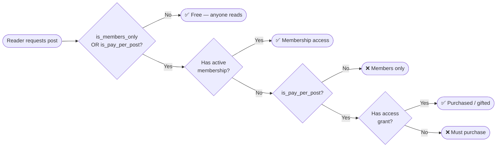

# `newsletter_posts` — Deep Dive

The `newsletter_posts` table is the heart of the service. This page covers the access-control model, slug generation, draft limit enforcement, version history, and all indexes in detail.

## Access Control Flags

Access is governed by two independent booleans. The important thing to understand is that they are **not mutually exclusive** — both can be `true` at the same time.



### Access Badge Derivation

The UI badge is **computed at query time** — there is no stored badge column.

```sql
CASE
  WHEN NOT is_members_only AND NOT is_pay_per_post THEN 'free'
  WHEN     is_members_only AND NOT is_pay_per_post THEN 'members_only'
  WHEN NOT is_members_only AND     is_pay_per_post THEN 'paid'
  WHEN     is_members_only AND     is_pay_per_post THEN 'members_only_and_paid'
END
```

### Price Integrity Constraint

When `is_pay_per_post = true`, `price` must be set and must be positive. This is enforced by a `CHECK` constraint in the table definition:

```sql
price numeric(10,2) check (
  (is_pay_per_post = true  AND price IS NOT NULL AND price > 0)
  OR is_pay_per_post = false
)
```

If you try to insert or update a post with `is_pay_per_post = true` but no price (or `price = 0`), Postgres will reject it at the DB level — the client never needs to duplicate this validation.

## Slug Generation

Slugs are auto-generated by the `trg_newsletter_post_lifecycle` trigger. The rules are:

1. **On INSERT** — always generate from the title.
2. **On UPDATE while `status = 'draft'`** — regenerate if the title changed.
3. **On UPDATE once `status = 'published'`** — slug is frozen; the trigger skips it.

The slugification algorithm:

```sql
-- 1. Lowercase the title
-- 2. Strip non-alphanumeric characters (keep spaces and hyphens)
-- 3. Replace runs of whitespace with a single hyphen
v_base_slug := lower(
  regexp_replace(
    regexp_replace(trim(new.title), '[^a-z0-9\s\-]', '', 'gi'),
    '\s+', '-', 'g'
  )
);
```

If the base slug already exists for the same profile, the trigger appends `-1`, `-2`, etc. until it finds a free slot.

### Why Slugs Are Frozen on Publish

Once a post is published, its URL is public and may be shared or indexed. Changing the slug would break every existing link. If a creator renames a published post, only the `title` column changes — the slug stays the same.

## Draft Limit (50 per Profile)

The `trg_newsletter_draft_limit` trigger fires `BEFORE INSERT OR UPDATE`. It counts existing drafts for the profile and raises a Postgres exception with a custom error code when the limit would be exceeded:

```sql
RAISE EXCEPTION 'DRAFT_LIMIT_REACHED'
  USING detail  = 'Maximum 50 drafts per profile. Publish or delete a draft first.',
        errcode = 'P0001';
```

The trigger fires for two cases:
- A new row is inserted with `status = 'draft'`.
- An existing row's status is changed **to** `'draft'` (e.g. unpublishing).

The `unpublish_newsletter_post()` RPC also checks the quota **before** running the `UPDATE` so it can return a structured JSON error (rather than letting Postgres throw an unformatted exception to the client).

## Version History Ring Buffer

`newsletter_post_versions` stores the last **20 snapshots** per post. The ring buffer is maintained by the `trg_prune_post_versions` trigger, which fires **after each INSERT** and deletes all but the 20 most recent rows for that post:

```sql
DELETE FROM public.newsletter_post_versions
WHERE post_id = new.post_id
  AND id NOT IN (
    SELECT id FROM public.newsletter_post_versions
    WHERE post_id = new.post_id
    ORDER BY version_number DESC
    LIMIT 20
  );
```

### Version Sources

| `source` | When it is saved |
|---|---|
| `autosave` | Periodic background save while editing |
| `ai_polish` | Snapshot saved *before* the AI rewrites the content — this is the undo target |
| `manual_save` | Explicit Cmd/Ctrl+S by the author |
| `pre_publish` | Final snapshot taken just before the post goes live |

To implement "undo AI polish", fetch the most recent `source = 'ai_polish'` version for the post and restore its `title` + `content`.

## Indexes

| Index | Columns | Purpose |
|---|---|---|
| `idx_nl_posts_profile_id` | `(profile_id)` | List all posts for a profile |
| `idx_nl_posts_profile_status` | `(profile_id, status)` | Filter by status on the Creator Studio tabs |
| `idx_nl_posts_profile_drafts` | `(profile_id) WHERE status = 'draft'` | Partial index — draft count queries |
| `idx_nl_posts_published_at` | `(published_at DESC) WHERE status = 'published'` | Reader feed chronological sort |
| `idx_nl_posts_visibility` | `(visibility) WHERE status = 'published'` | Filter private posts out of the feed |
| `idx_nl_posts_tags` | GIN on `tags` | Tag-based filtering |
| `idx_nl_posts_paid` | `(profile_id, is_pay_per_post) WHERE is_pay_per_post = true AND status = 'published'` | Pay-per-post listing |
| `idx_nl_posts_title_trgm` | GIN trigram on `title WHERE status = 'published'` | Full-text ILIKE search on published posts |
| `idx_nl_posts_subtitle_trgm` | GIN trigram on `subtitle WHERE status = 'published'` | Full-text ILIKE search on subtitles |
| `idx_nl_posts_title_trgm_draft` | GIN trigram on `title WHERE status = 'draft'` | Search within drafts tab |
| `idx_nl_posts_subtitle_trgm_draft` | GIN trigram on `subtitle WHERE status = 'draft'` | Search within drafts tab |

The trigram indexes require the `pg_trgm` extension:

```sql
CREATE EXTENSION IF NOT EXISTS pg_trgm WITH SCHEMA extensions;
```

This is created in the migration but is safe to run multiple times.

## Row-Level Security Policies

| Policy | Roles | Rule |
|---|---|---|
| `Select newsletter posts` | `anon`, `authenticated` | Published + public posts; OR own posts (any status) |
| `Profile inserts own posts` | `authenticated` | `profile_id = auth.uid()` |
| `Profile updates own posts` | `authenticated` | `profile_id = auth.uid()` |
| `Profile deletes own posts` | `authenticated` | `profile_id = auth.uid()` |

> The SELECT policy merges two cases into one to avoid the "multiple-permissive-SELECT" Postgres warning that fires when two overlapping policies exist for the same role.

---

**Next:** [Reader Engagement — Likes & Access Grants](./engagement-and-access.md)
