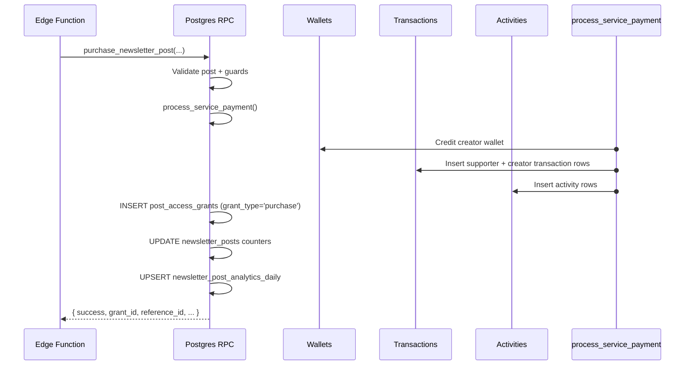

# RPCs Reference

All functions use `SECURITY DEFINER` and `SET search_path = ''`. The empty search path means every identifier must be fully qualified (e.g. `public.newsletter_posts`), preventing search-path injection attacks.

## Quick Reference

| Function | Caller | Returns | Description |
|---|---|---|---|
| `check_newsletter_post_access(p_post_id)` | Any | `TABLE(has_access bool, access_reason text)` | Access check for a single post |
| `create_newsletter_draft(p_profile_id)` | Authenticated | `TABLE(id, title, slug)` | Create a new blank draft |
| `unpublish_newsletter_post(p_post_id)` | Authenticated (author) | `jsonb` | Move published post back to draft |
| `toggle_newsletter_post_like(p_post_id)` | Authenticated | `jsonb` | Like / unlike a post |
| `gift_newsletter_post(...)` | Authenticated | `uuid` (grant_id) | Gift a post to another profile |
| `record_newsletter_post_view(p_post_id)` | Any | `void` | Increment view counter + daily row |
| `record_newsletter_post_click(p_post_id)` | Any | `void` | Increment click counter + daily row |
| `get_newsletter_stats(p_profile_id, p_from, p_to)` | Authenticated (author) | `TABLE(...)` | 3-card stat summary for Creator Studio |
| `get_post_analytics(p_post_id, p_from, p_to)` | Authenticated (author) | `TABLE(...)` | Per-post analytics for the dialog |
| `get_posts_page(p_profile_id, p_status, ...)` | Authenticated (author) | `TABLE(...)` | Paginated post list for Creator Studio |
| `get_reader_feed(p_profile_id, p_filter, p_limit, p_cursor, ...)` | Any | `TABLE(...)` | Paginated reader feed |
| `purchase_newsletter_post(...)` | **Service role only** | `jsonb` | Post purchase after payment confirmed |
| `purchase_newsletter_membership(...)` | **Service role only** | `jsonb` | Membership purchase after payment confirmed |
| `approve_newsletter_post(p_post_id)` | **Manager only** | `jsonb` | Publish a post in review + notify author |
| `reject_newsletter_post(p_post_id, p_rejection_reason)` | **Manager only** | `jsonb` | Reject a post in review + notify author |

---

## `check_newsletter_post_access`

```sql
FUNCTION public.check_newsletter_post_access(p_post_id uuid)
RETURNS TABLE (has_access boolean, access_reason text)
LANGUAGE plpgsql STABLE SECURITY DEFINER
```

### `access_reason` Values

| Value | Meaning |
|---|---|
| `'not_found'` | Post doesn't exist |
| `'owner'` | Viewer is the author |
| `'free'` | Post is public, no paywall |
| `'membership'` | Viewer has an active newsletter membership |
| `'purchase'` | Viewer purchased the post |
| `'gift'` | Viewer received the post as a gift |
| `'none'` | No access |

### Logic Summary

1. Look up the post. Return `not_found` if missing.
2. If post is not published, return `owner` for the author, else `none`.
3. If viewer is the author, return `owner`.
4. If neither flag is set, return `free`.
5. If viewer is unauthenticated, return `none`.
6. Check `has_active_membership()` — return `membership` if true.
7. If `is_pay_per_post`, check `post_access_grants` — return grant type if found.
8. Return `none`.

---

## `create_newsletter_draft`

```sql
FUNCTION public.create_newsletter_draft(p_profile_id uuid)
RETURNS TABLE (id uuid, title varchar, slug varchar)
LANGUAGE plpgsql SECURITY DEFINER
```

Creates a new draft with an auto-incremented title (`"Untitled Post"`, `"Untitled Post 2"`, etc.) to avoid slug collisions. Mirrors Google Docs naming behaviour. The slug is then frozen by the lifecycle trigger.

**Example response:**
```json
{ "id": "abc123...", "title": "Untitled Post", "slug": "untitled-post" }
```

---

## `unpublish_newsletter_post`

```sql
FUNCTION public.unpublish_newsletter_post(p_post_id uuid)
RETURNS jsonb
LANGUAGE plpgsql SECURITY DEFINER
```

### Error Responses

| `error` key | Condition |
|---|---|
| `POST_NOT_FOUND` | Post does not exist |
| `FORBIDDEN` | Caller is not the author |
| `NOT_PUBLISHED` | Post is already a draft / archived |
| `DRAFT_LIMIT_REACHED` | Profile already has 50 drafts |

### Success Response

```json
{ "success": true, "draft_count": 12 }
```

### Draft Limit Response

```json
{
  "success": false,
  "error": "DRAFT_LIMIT_REACHED",
  "draft_count": 50,
  "message": "You have 50 drafts saved. Please publish or delete a draft before un-publishing this post."
}
```

---

## `toggle_newsletter_post_like`

```sql
FUNCTION public.toggle_newsletter_post_like(p_post_id uuid)
RETURNS jsonb
LANGUAGE plpgsql SECURITY DEFINER
```

Atomic like / unlike. Checks for an existing row in `newsletter_post_likes` and either inserts or deletes it.

**Response:**
```json
{ "liked": true, "like_count": 42 }
```

Raises an exception if the user is not authenticated.

---

## `gift_newsletter_post`

```sql
FUNCTION public.gift_newsletter_post(
  p_post_id                  uuid,
  p_grantee_profile_id       uuid,
  p_gift_message             varchar     DEFAULT NULL,
  p_transaction_reference_id uuid        DEFAULT NULL,
  p_expires_at               timestamptz DEFAULT NULL
)
RETURNS uuid  -- grant_id
LANGUAGE plpgsql SECURITY DEFINER
```

Inserts (or upserts) a row in `post_access_grants` with `grant_type = 'gift'`, then writes two activity rows — one for the grantee (`post_gifted`) and one for the gifter (`post_gift_sent`).

Guards:
- Requires authentication.
- Cannot gift a post to yourself.

On conflict (the grantee already has a grant), the existing grant is overwritten with the new gift, `is_redeemed` is reset to `false`, and `redeemed_at` is cleared.

---

## `record_newsletter_post_view`

```sql
FUNCTION public.record_newsletter_post_view(p_post_id uuid)
RETURNS void
LANGUAGE plpgsql SECURITY DEFINER
```

Increments `newsletter_posts.view_count` and upserts today's row in `newsletter_post_analytics_daily`. Call this once per page load from the post detail page.

---

## `record_newsletter_post_click`

```sql
FUNCTION public.record_newsletter_post_click(p_post_id uuid)
RETURNS void
LANGUAGE plpgsql SECURITY DEFINER
```

Same pattern as `record_newsletter_post_view` but for the CTA click counter. The conversion rate in the Analytics dialog is `purchase_count / click_count`.

---

## `get_newsletter_stats`

```sql
FUNCTION public.get_newsletter_stats(
  p_profile_id uuid,
  p_from       timestamptz DEFAULT now() - interval '30 days',
  p_to         timestamptz DEFAULT now()
)
RETURNS TABLE (
  total_post_views   bigint,
  newsletter_subs    bigint,
  post_sales_revenue bigint
)
LANGUAGE sql STABLE SECURITY DEFINER
```

Powers the **three stat cards** on Creator Studio dashboard.

| Column | What it counts |
|---|---|
| `total_post_views` | Sum of `view_count` for posts published within `[p_from, p_to]` |
| `newsletter_subs` | Active memberships whose `period_start` falls in `[p_from, p_to]` |
| `post_sales_revenue` | Net revenue from `newsletter_post_analytics_daily` rows in the date range |

> Pass `p_from = '-infinity'` and `p_to = now()` to get all-time totals.

---

## `get_post_analytics`

```sql
FUNCTION public.get_post_analytics(
  p_post_id uuid,
  p_from    timestamptz DEFAULT now() - interval '30 days',
  p_to      timestamptz DEFAULT now()
)
RETURNS TABLE (
  total_views   integer,
  total_clicks  integer,
  total_sales   integer,
  conv_rate     numeric,    -- purchase_count / click_count × 100
  chart_date    date,
  day_views     integer,
  day_clicks    integer,
  day_purchases integer,
  day_revenue   bigint
)
LANGUAGE sql STABLE SECURITY DEFINER
```

Returns one row per day in the range. The aggregate columns (`total_views`, `total_clicks`, `total_sales`, `conv_rate`) are repeated on every row (cross join) — the frontend can read them from the first row.

`conv_rate` is calculated as:
```sql
CASE WHEN click_count = 0 THEN 0
     ELSE ROUND((purchase_count::numeric / click_count) * 100, 1)
END
```

---

## `get_posts_page`

```sql
FUNCTION public.get_posts_page(
  p_profile_id uuid,
  p_status     public.post_status_enum,
  p_from       timestamptz DEFAULT now() - interval '30 days',
  p_to         timestamptz DEFAULT now(),
  p_limit      integer     DEFAULT 20,
  p_cursor     timestamptz DEFAULT NULL,
  p_search     varchar     DEFAULT NULL
)
RETURNS TABLE (
  id, title, slug, subtitle, excerpt, cover_image_url,
  is_members_only, is_pay_per_post, price, tags,
  view_count, like_count, click_count, purchase_count, revenue_total,
  published_at, created_at, updated_at,
  draft_count bigint   -- quota convenience column
)
```

### Pagination

Uses **cursor-based pagination** for stable ordering:

- `p_status = 'published'` — sorted by `published_at DESC`; cursor is the last row's `published_at`.
- `p_status = 'draft'` — sorted by `updated_at DESC`; cursor is the last row's `updated_at`.

Pass `p_cursor = NULL` to get the first page. Pass the last row's relevant timestamp to get the next page.

### Date Range Filtering

- Published posts: `published_at BETWEEN p_from AND p_to`
- Draft posts: `created_at BETWEEN p_from AND p_to`

### Search

`p_search` does a case-insensitive `ILIKE '%…%'` on `title` and `subtitle`. The trigram GIN indexes make this fast for most string lengths.

### `draft_count`

Every row includes the current draft count for the profile. This lets the UI show the quota warning (`12 / 50 drafts`) without making a second request.

---

## `get_reader_feed`

```sql
FUNCTION public.get_reader_feed(
  p_profile_id varchar,
  p_filter varchar     DEFAULT 'all',  -- 'all' | 'liked' | 'owned'
  p_limit  integer     DEFAULT 20,
  p_cursor timestamptz DEFAULT NULL,
  p_from   timestamptz DEFAULT NULL,
  p_to     timestamptz DEFAULT NULL,
  p_search varchar     DEFAULT NULL
)
RETURNS TABLE (
  post_id, profile_id,
  author_display_name, author_username, author_avatar_url,
  title, slug, subtitle, cover_image_url, excerpt,
  is_members_only, is_pay_per_post, price, tags, reading_time_minutes,
  view_count, like_count, published_at,
  is_liked boolean,
  has_access boolean,
  access_badge text  -- 'free' | 'members_only' | 'paid' | 'members_only_and_paid'
)
```

### Filters

| `p_filter` | What is returned |
|---|---|
| `'all'` | All published public posts |
| `'liked'` | Only posts the authenticated viewer has liked |
| `'owned'` | Only posts with a valid `post_access_grants` row for the viewer |

### `has_access` Logic (in-query)

```sql
CASE
  WHEN NOT np.is_members_only AND NOT np.is_pay_per_post THEN true
  WHEN v_viewer_id IS NULL                               THEN false
  WHEN np.profile_id = v_viewer_id                      THEN true
  WHEN has_active_membership(np.profile_id, v_viewer_id, 'newsletter') THEN true
  WHEN np.is_pay_per_post AND EXISTS (grant row for viewer) THEN true
  ELSE false
END
```

### Pagination

Cursor-based on `published_at DESC`. Pass `p_cursor` as the `published_at` value of the last post in the previous page.

---

## `purchase_newsletter_post` (Service Role Only)

```sql
FUNCTION public.purchase_newsletter_post(
  p_post_id                  uuid,
  p_buyer_profile_id         uuid,
  p_buyer_name               varchar,
  p_identity_hash            varchar,
  p_amount                   numeric(10,2),
  p_provider                 public.provider_enum,
  p_provider_transaction_id  varchar,
  p_buyer_platform           public.supporter_platform_enum DEFAULT NULL,
  p_message                  varchar        DEFAULT NULL,
  p_source                   varchar        DEFAULT 'web'
)
RETURNS jsonb
LANGUAGE plpgsql SECURITY DEFINER
```

> **Service role only.** Any call from an authenticated user (`auth.uid() IS NOT NULL`) raises `'Not allowed'`.
>
> **Platform fee is computed server-side** via `get_creator_effective_fee_rate(creator, 'newsletter_onetime')`. Do not pass a fee — it is never accepted from callers.

### Validation Steps

1. Post must exist and be `'published'`.
2. `is_pay_per_post` must be `true`.
3. Buyer cannot be the creator.
4. `p_amount` must exactly match `newsletter_posts.price` (prevents tampered client amounts).
5. Buyer must not already have a valid access grant.

### What it Does



### Success Response

```json
{
  "success": true,
  "grant_id": "...",
  "reference_id": "...",
  "supporter_id": "...",
  "supporter_transaction_id": "...",
  "creator_transaction_id": "...",
  "creator_balance_after": 12500
}
```

---

## `purchase_newsletter_membership` (Service Role Only)

```sql
FUNCTION public.purchase_newsletter_membership(
  p_plan_id                  uuid,
  p_buyer_profile_id         uuid,
  p_buyer_name               varchar,
  p_identity_hash            varchar,
  p_provider                 public.provider_enum,
  p_provider_transaction_id  varchar,
  p_buyer_platform           public.supporter_platform_enum DEFAULT NULL,
  p_message                  varchar                        DEFAULT NULL,
  p_source                   varchar                        DEFAULT 'web'
)
RETURNS jsonb
LANGUAGE plpgsql SECURITY DEFINER
```

> **Service role only.** Same guard as `purchase_newsletter_post`.
>
> **Platform fee is computed server-side** via `get_creator_effective_fee_rate(creator, 'newsletter_subscription')`. Do not pass a fee — it is never accepted from callers.

### Membership Period Extension Logic

| Existing membership state | New `period_end` |
|---|---|
| Active and not expired | `current_period_end + 1 month` |
| Expired, cancelled, or first purchase | `now() + 1 month` |

This allows a member to renew early without losing the remaining days of their current period.

The plan price is authoritative — the caller passes no `p_amount` or `p_platform_fee`.

### Success Response

```json
{
  "success": true,
  "membership_id": "...",
  "period_end": "2026-05-30T00:00:00Z",
  "reference_id": "...",
  "supporter_id": "...",
  "supporter_transaction_id": "...",
  "creator_transaction_id": "...",
  "creator_balance_after": 25000
}
```

---

## `approve_newsletter_post` *(manager only)*

```sql
FUNCTION public.approve_newsletter_post(p_post_id uuid)
RETURNS jsonb
LANGUAGE plpgsql SECURITY DEFINER
```

Requires `content.approve` manager permission.

Transitions a post from `status = 'review'` to `status = 'published'`. The `trg_newsletter_post_lifecycle` trigger auto-sets `published_at` on the status transition. Any stale `reject_reason` is cleared. A private activity notification is inserted for the author.

**Guards:**
- `NOT_IN_REVIEW` — post is not currently in `'review'` state (prevents double-approval, acting on drafts/published posts)
- `NOT_FOUND` — post does not exist

**Activity written:**

```json
{
  "role": "system",
  "service_type": "newsletter",
  "visibility": "private",
  "metadata": {
    "activity_type": "post_approved",
    "post_id": "<uuid>",
    "post_title": "<title>"
  }
}
```

**Response:**
```json
{ "success": true }
```

**Errors:** `UNAUTHORIZED`, `NOT_FOUND`, `NOT_IN_REVIEW`

---

## `reject_newsletter_post` *(manager only)*

```sql
FUNCTION public.reject_newsletter_post(
  p_post_id          uuid,
  p_rejection_reason text
)
RETURNS jsonb
LANGUAGE plpgsql SECURITY DEFINER
```

Requires `content.approve` manager permission.

Transitions a post from `status = 'review'` back to `status = 'draft'` and sets `reject_reason`. The author can revise and resubmit by updating the post and setting `status = 'review'` again. A private activity notification is inserted for the author.

Rejection reason is **required** and must be non-empty. It is exposed to the author via `get_posts_page` (`reject_reason` column).

**Guards:**
- `NOT_IN_REVIEW` — post is not currently in `'review'` state

**Activity written:**

```json
{
  "role": "system",
  "service_type": "newsletter",
  "visibility": "private",
  "metadata": {
    "activity_type": "post_rejected",
    "post_id": "<uuid>",
    "post_title": "<title>",
    "rejection_reason": "<reason>"
  }
}
```

**Response:**
```json
{ "success": true }
```

**Errors:** `UNAUTHORIZED`, `REJECTION_REASON_REQUIRED`, `NOT_FOUND`, `NOT_IN_REVIEW`

---

**Next:** [Frontend Developer Docs → Overview](../frontend/index.md)
