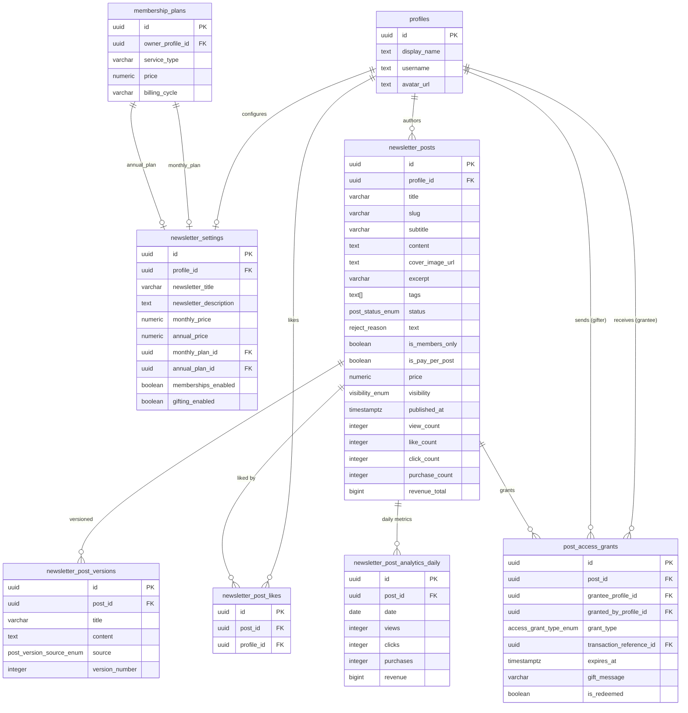

# Database Tables & ER Diagram

This page lists every table in the Newsletter Service with a quick reference column summary, then shows the full entity-relationship diagram.

## Table Inventory

| Table | Rows represent | Key constraint |
|---|---|---|
| `newsletter_posts` | A single article/post authored by a profile | Unique `(profile_id, slug)` |
| `newsletter_post_versions` | A snapshot of a post's title + content | Unique `(post_id, version_number)` |
| `newsletter_settings` | A creator's newsletter config (pricing, labels) | Unique `profile_id` |
| `newsletter_post_likes` | One "heart" from a reader on a post | Unique `(post_id, profile_id)` |
| `post_access_grants` | A reader's purchased or gifted access to a post | Unique `(post_id, grantee_profile_id)` |
| `newsletter_post_analytics_daily` | Daily aggregated metrics for a post | Unique `(post_id, date)` |

## Enum Types

```sql
-- Post lifecycle status
public.post_status_enum:
  'draft' | 'published' | 'review' | 'archived'

-- How a reader gained access to a pay-per-post article
public.access_grant_type_enum:
  'purchase' | 'gift'

-- What triggered a version snapshot to be saved
public.post_version_source_enum:
  'autosave' | 'ai_polish' | 'manual_save' | 'pre_publish'
```

## Entity-Relationship Diagram



## Column Quick Reference

### `newsletter_posts`

| Column | Type | Notes |
|---|---|---|
| `id` | `uuid` | PK, auto-generated |
| `profile_id` | `uuid` | Author; FK → `profiles(id)` CASCADE |
| `title` | `varchar(300)` | Required |
| `slug` | `varchar(320)` | Auto-generated by trigger; unique per profile; frozen on publish |
| `subtitle` | `varchar(500)` | Optional teaser |
| `content` | `text` | Rich text / Markdown body |
| `cover_image_url` | `text` | URL in `post-images` bucket |
| `excerpt` | `varchar(500)` | Shown behind paywall instead of full content |
| `tags` | `text[]` | GIN-indexed for fast tag queries |
| `reading_time_minutes` | `integer` | Set by client before saving |
| `status` | `post_status_enum` | Default `'draft'` |
| `reject_reason` | `text` | The reason behind the post being rejected from the managers |
| `is_members_only` | `boolean` | Default `false` |
| `is_pay_per_post` | `boolean` | Default `false` |
| `price` | `numeric(10,2)` | Required + `> 0` when `is_pay_per_post = true`; CHECK enforced |
| `visibility` | `visibility_enum` | Default `'public'`; `'private'` = direct link only |
| `published_at` | `timestamptz` | Auto-set by trigger on first publish |
| `view_count` | `integer` | Denormalised; incremented by `record_newsletter_post_view()` |
| `like_count` | `integer` | Denormalised; kept in sync by trigger on `newsletter_post_likes` |
| `click_count` | `integer` | Denormalised; incremented by `record_newsletter_post_click()` |
| `purchase_count` | `integer` | Denormalised; incremented by `purchase_newsletter_post()` |
| `revenue_total` | `bigint` | Denormalised net revenue (amount − fee), in smallest currency unit |

### `newsletter_post_versions`

| Column | Type | Notes |
|---|---|---|
| `post_id` | `uuid` | FK → `newsletter_posts(id)` CASCADE |
| `title` | `varchar(300)` | Snapshot of title at save time |
| `content` | `text` | Snapshot of content at save time |
| `source` | `post_version_source_enum` | What triggered the save |
| `version_number` | `integer` | Monotonically increasing per post |

### `newsletter_settings`

| Column | Type | Notes |
|---|---|---|
| `profile_id` | `uuid` | Unique; FK → `profiles(id)` CASCADE |
| `newsletter_title` | `varchar(200)` | Shown in header |
| `newsletter_description` | `text` | About section |
| `welcome_message` | `text` | Sent to new members |
| `monthly_price` | `numeric(10,2)` | Display shortcut; canonical price in `membership_plans` |
| `annual_price` | `numeric(10,2)` | Display shortcut; canonical price in `membership_plans` |
| `monthly_plan_id` | `uuid` | FK → `membership_plans(id)` SET NULL |
| `annual_plan_id` | `uuid` | FK → `membership_plans(id)` SET NULL |
| `memberships_enabled` | `boolean` | Default `true` |
| `gifting_enabled` | `boolean` | Default `true` |
| `member_label` | `varchar(100)` | Default `'Member'` |
| `free_tier_label` | `varchar(100)` | Default `'Free Reader'` |

---

**Next:** [newsletter_posts — Deep Dive](./newsletter-posts.md)
