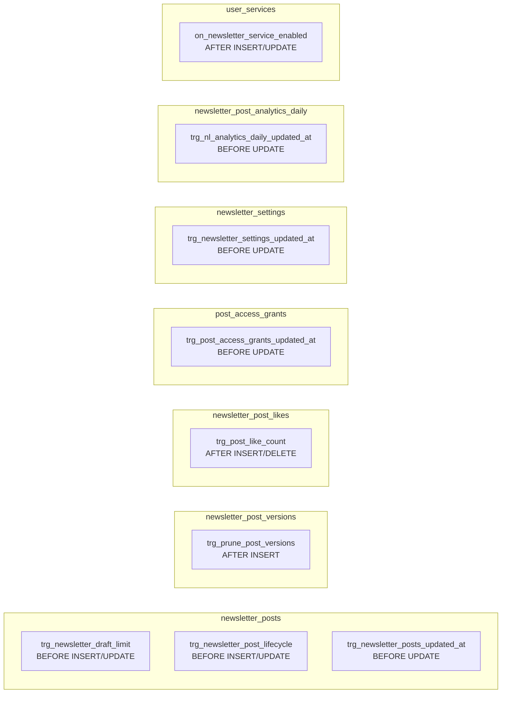
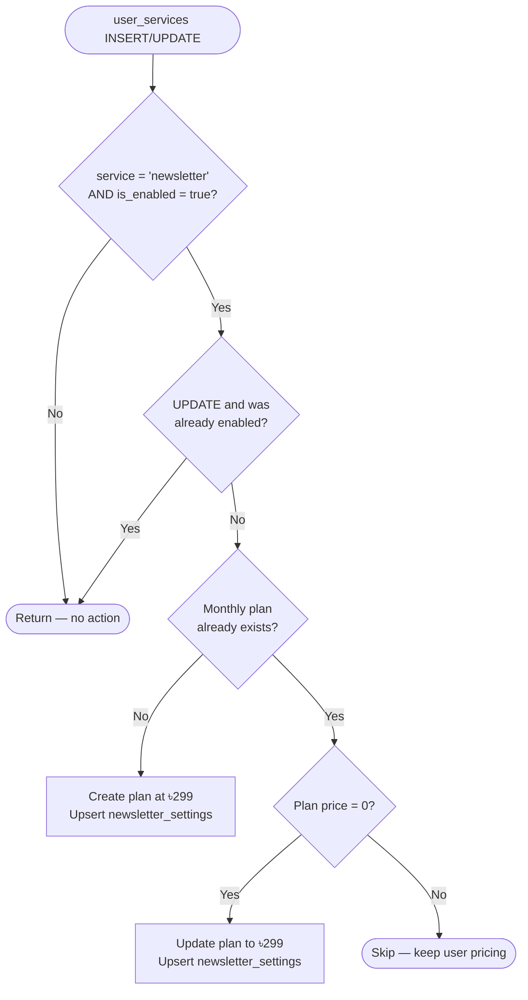

# Triggers & RLS Policies Reference

## Trigger Map



## Trigger Details

### `trg_newsletter_draft_limit`

**Table:** `newsletter_posts`  
**Fires:** `BEFORE INSERT OR UPDATE`  
**Function:** `enforce_newsletter_draft_limit()`

Counts existing drafts for the profile **excluding the current row** and raises a `P0001` exception if the count is already at 50. The trigger fires for two scenarios:

- `TG_OP = 'INSERT'` and `new.status = 'draft'`
- `TG_OP = 'UPDATE'` and `new.status = 'draft'` and `old.status <> 'draft'`

The second case handles unpublishing (moving a post from `published` back to `draft`).

```sql
IF v_count >= 50 THEN
  RAISE EXCEPTION 'DRAFT_LIMIT_REACHED'
    USING detail  = 'Maximum 50 drafts per profile. Publish or delete a draft first.',
          errcode = 'P0001';
END IF;
```

---

### `trg_newsletter_post_lifecycle`

**Table:** `newsletter_posts`  
**Fires:** `BEFORE INSERT OR UPDATE`  
**Function:** `handle_newsletter_post_lifecycle()`

Handles two concerns:

**1. Auto-set `published_at`**

Set once, on first publish. Never overwritten on subsequent updates:

```sql
IF new.status = 'published'
  AND (old.status IS NULL OR old.status <> 'published')
  AND new.published_at IS NULL
THEN
  new.published_at = now();
END IF;
```

**2. Slug generation**

| Scenario | Behaviour |
|---|---|
| INSERT with `slug IS NULL` | Generate from title |
| UPDATE while `status = 'draft'` and title changed | Regenerate slug |
| UPDATE while `status = 'published'` | Skip — slug frozen |

The collision loop appends `-1`, `-2`, … until it finds an available slug for the profile.

---

### `trg_prune_post_versions`

**Table:** `newsletter_post_versions`  
**Fires:** `AFTER INSERT`  
**Function:** `prune_newsletter_post_versions()`

After each new version is inserted, deletes all rows for `post_id` that are not in the top 20 by `version_number DESC`. This keeps storage bounded at 20 versions per post regardless of how many times a post is saved.

---

### `trg_post_like_count`

**Table:** `newsletter_post_likes`  
**Fires:** `AFTER INSERT OR DELETE`  
**Function:** `sync_post_like_count()`

Keeps `newsletter_posts.like_count` in sync:

```sql
-- INSERT → +1
UPDATE public.newsletter_posts SET like_count = like_count + 1 WHERE id = new.post_id;

-- DELETE → -1 (minimum 0)
UPDATE public.newsletter_posts SET like_count = GREATEST(like_count - 1, 0) WHERE id = old.post_id;
```

---

### `on_newsletter_service_enabled`

**Table:** `user_services`
**Fires:** `AFTER INSERT OR UPDATE OF is_enabled, service`
**Function:** `handle_newsletter_service_enabled()`

Auto-provisions a monthly membership plan when a creator first enables the newsletter service. Full behaviour:



---

### Manager approval RPCs — activity notifications

`approve_newsletter_post` and `reject_newsletter_post` are not triggers but they interact with `trg_newsletter_post_lifecycle` (which auto-sets `published_at` on the `'review' → 'published'` transition) and write to the `activities` table. See [RPCs Reference → approve_newsletter_post](./rpcs.md#approve_newsletter_post-manager-only) for full details.

| RPC | Status transition | Activity `activity_type` |
|---|---|---|
| `approve_newsletter_post` | `review → published` | `post_approved` |
| `reject_newsletter_post` | `review → draft` | `post_rejected` |

Both insert a `role='system'`, `service_type='newsletter'`, `visibility='private'` activity row for the post author.

---

### `updated_at` Triggers

All tables that have an `updated_at` column use the shared `handle_updated_at()` function from `common.sql`. These triggers fire `BEFORE UPDATE` and set `updated_at = now()`:

| Trigger | Table |
|---|---|
| `trg_newsletter_posts_updated_at` | `newsletter_posts` |
| `trg_newsletter_settings_updated_at` | `newsletter_settings` |
| `trg_post_access_grants_updated_at` | `post_access_grants` |
| `trg_nl_analytics_daily_updated_at` | `newsletter_post_analytics_daily` |

---

## RLS Policies Reference

### `newsletter_posts`

| Policy | Operation | Roles | Rule |
|---|---|---|---|
| `Select newsletter posts` | SELECT | `anon`, `authenticated` | `(status = 'published' AND visibility = 'public') OR profile_id = auth.uid()` |
| `Profile inserts own posts` | INSERT | `authenticated` | `profile_id = auth.uid()` |
| `Profile updates own posts` | UPDATE | `authenticated` | `profile_id = auth.uid()` |
| `Profile deletes own posts` | DELETE | `authenticated` | `profile_id = auth.uid()` |
| `Managers can view all newsletter posts` | SELECT | `authenticated` | `authorize_manager('content.approve')` |
| `Managers can update all newsletter posts` | UPDATE | `authenticated` | `authorize_manager('content.moderate')` |
| `Managers can delete all newsletter posts` | DELETE | `authenticated` | `authorize_manager('content.delete')` |

> For status transitions use `approve_newsletter_post` / `reject_newsletter_post` RPCs — they handle activity notifications and trigger `published_at` auto-set. Direct UPDATE is available for metadata overrides and re-classification.

### `newsletter_post_versions`

| Policy | Operation | Roles | Rule |
|---|---|---|---|
| `Authors manage own post versions` | ALL | `authenticated` | `post_id` must belong to `auth.uid()` (subquery) |
| `Managers can view all newsletter post versions` | SELECT | `authenticated` | `authorize_manager('content.approve')` |

### `newsletter_settings`

| Policy | Operation | Roles | Rule |
|---|---|---|---|
| `Select newsletter settings` | SELECT | `anon`, `authenticated` | `true` — public |
| `Profile inserts own settings` | INSERT | `authenticated` | `profile_id = auth.uid()` |
| `Profile updates own settings` | UPDATE | `authenticated` | `profile_id = auth.uid()` |
| `Profile deletes own settings` | DELETE | `authenticated` | `profile_id = auth.uid()` |

### `newsletter_post_likes`

| Policy | Operation | Roles | Rule |
|---|---|---|---|
| `Select newsletter post likes` | SELECT | `anon`, `authenticated` | `true` — public |
| `Profiles insert own likes` | INSERT | `authenticated` | `profile_id = auth.uid()` |
| `Profiles delete own likes` | DELETE | `authenticated` | `profile_id = auth.uid()` |

### `post_access_grants`

| Policy | Operation | Roles | Rule |
|---|---|---|---|
| `Select post access grants` | SELECT | `authenticated` | Grantee, gifter, or post author |
| `Block direct inserts` | INSERT | `authenticated` | `false` — always blocked |
| `Block direct deletes` | DELETE | `authenticated` | `false` — always blocked |
| `Grantees redeem own grants` | UPDATE | `authenticated` | `grantee_profile_id = auth.uid()` and `is_redeemed = true` |

### `newsletter_post_analytics_daily`

| Policy | Operation | Roles | Rule |
|---|---|---|---|
| `Post owners view own analytics` | SELECT | `authenticated` | Post must belong to `auth.uid()` |
| `Block direct writes` | INSERT | `authenticated` | `false` — always blocked |

---

**Next:** [RPCs Reference](./rpcs.md)
