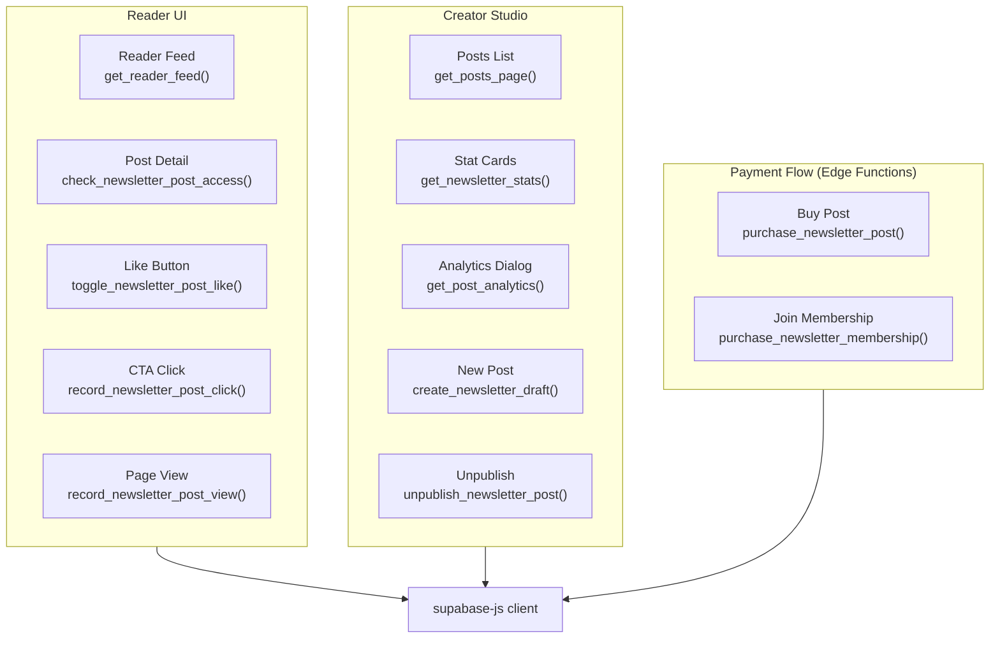

# Newsletter Service — Frontend Overview

This section is for frontend developers integrating with the Newsletter Service. All data access goes through Supabase's auto-generated REST API and RPC endpoints, accessed via the `supabase-js` client.

## What You're Building

The Newsletter Service powers two distinct UI surfaces:

**Reader-facing:**
- A chronological public feed of published posts
- Post detail page with access control (paywall / members-only gate)
- Like button (heart) with live counter
- "All / Liked / Owned" feed filter tabs
- Search across title and subtitle

**Creator-facing (Creator Studio):**
- Published posts tab with stats
- Drafts tab with quota indicator
- Per-post analytics dialog (views, clicks, sales, conversion rate, revenue chart)
- Newsletter settings (title, description, membership pricing)
- Stat cards (total views, subscribers, revenue)
- AI Polish — rewrites title, excerpt, tags, or full content via the `polish-post` edge function
- AI Review — returns editorial todos (spelling, grammar, structure) before publishing; content-type aware (blog, story, poetry, historical, news, review, opinion, tutorial, travel)

## Client Setup

```ts
import { createClient } from '@supabase/supabase-js'

const supabase = createClient(
  import.meta.env.PUBLIC_SUPABASE_URL,
  import.meta.env.PUBLIC_SUPABASE_ANON_KEY
)
```

All RPCs are called via `supabase.rpc()`. Direct table access (`.from().select()`) is used for simple reads that don't require joins or computed fields.

## Data Flow Overview



## Authentication Context

| Scenario | `auth.uid()` | Effect |
|---|---|---|
| Unauthenticated visitor | `NULL` | Can see public published posts; `has_access = true` only on free posts; `is_liked = false` |
| Authenticated reader | UUID | `is_liked` and `has_access` resolved for their account |
| Authenticated author | UUID (= `profile_id`) | Can see own posts in any status; `has_access = true` via `'owner'` reason |

## Key Concepts to Know Before You Start

### Access Badge

Every post card should render a badge based on the `access_badge` field returned by `get_reader_feed()`:

| `access_badge` | Display |
|---|---|
| `'free'` | Grey "Public" pill |
| `'members_only'` | Purple "Members Only" pill |
| `'paid'` | Green "Paid (৳NNN)" pill |
| `'members_only_and_paid'` | Show both or primary "Members Only" |

### Cursor-Based Pagination

Both `get_reader_feed()` and `get_posts_page()` use cursor-based pagination, not offset. When rendering a list, store the `published_at` (or `updated_at` for drafts) of the last item and pass it as `p_cursor` to fetch the next page.

### Draft Quota

The `get_posts_page()` RPC returns a `draft_count` column on every row. Use this to show the quota warning (e.g. `"12 / 50 drafts"`) without a second query.

---

**Pages in this section:**

- [Reader Feed](./reader-feed.md) — Browsing, filtering, searching, pagination
- [Post Access & Paywalls](./post-access.md) — Access model, gating content, gifting
- [Post Interactions](./interactions.md) — Likes, views, and click tracking
- [Creator Studio](./creator-studio.md) — Post management, stats, drafts
- [Payments](./payments.md) — Purchasing posts and memberships
