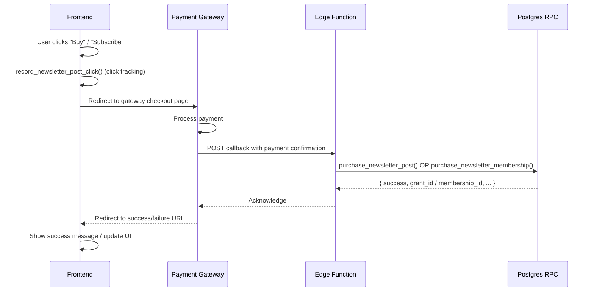

# Payments — Buying Posts & Memberships

Purchasing a post or a newsletter membership requires a payment gateway flow. The frontend initiates the payment, the gateway confirms it, and an Edge Function then calls the relevant Postgres RPC to finalise the purchase. The frontend never calls the purchase RPCs directly.

## Purchase Flow Overview



## Buying a Post (Pay-per-Post)

### Step 1 — Record the Click

Before redirecting to the gateway, record the CTA click for analytics:

```ts
await supabase.rpc('record_newsletter_post_click', { p_post_id: postId })
```

### Step 2 — Redirect to Gateway

Initiate the payment. Pass the `post_id` and `profile_id` so the Edge Function can look up the correct post after payment confirmation. The exact gateway integration depends on your payment provider (SSLCommerz, ShurjoPay, etc.).

```ts
async function handleBuyPost(post) {
  await supabase.rpc('record_newsletter_post_click', { p_post_id: post.id })

  const response = await fetch('/api/initiate-post-purchase', {
    method: 'POST',
    headers: { 'Content-Type': 'application/json' },
    body: JSON.stringify({
      post_id: post.id,
      amount: post.price,
      success_url: `${window.location.origin}/posts/${post.slug}?purchased=true`,
      fail_url: `${window.location.origin}/posts/${post.slug}?purchase=failed`,
    }),
  })

  const { redirect_url } = await response.json()
  window.location.href = redirect_url
}
```

### Step 3 — Handle Success Redirect

After the gateway confirms payment and the Edge Function runs `purchase_newsletter_post()`, the user is redirected to the success URL. On that page, re-check access to update the UI:

```ts
// On post detail page mount
const params = new URLSearchParams(window.location.search)
if (params.get('purchased') === 'true') {
  showToast('Purchase successful! You now have permanent access.')
  // Re-fetch access state
  const { data } = await supabase.rpc('check_newsletter_post_access', { p_post_id: postId })
  accessReason = data[0].access_reason
}
```

### What the Edge Function Does

The Edge Function calls `purchase_newsletter_post()` with:

```ts
// Inside the Edge Function (not frontend code)
await supabase.rpc('purchase_newsletter_post', {
  p_post_id: postId,
  p_buyer_profile_id: buyerProfileId,
  p_buyer_name: buyerDisplayName,
  p_identity_hash: identityHash,
  p_amount: amount,              // must match newsletter_posts.price
  p_platform_fee: platformFee,
  p_provider: 'sslcommerz',      // or 'shurjopay', etc.
  p_provider_transaction_id: gatewayTxId,
  p_source: 'web',
})
```

The RPC validates the price, guards against duplicate purchases, creates the `post_access_grants` row, and updates all counters in one atomic transaction.

### Error Codes from the RPC

| Code | Meaning | Suggested UI Action |
|---|---|---|
| `POST_NOT_FOUND` | Post was deleted after the payment was initiated | Show error; redirect to feed |
| `NOT_FOR_SALE` | Post became free after payment was initiated | Show message; redirect to post |
| `CANNOT_BUY_OWN_POST` | Author attempted a purchase | Should not happen; log and alert |
| `AMOUNT_MISMATCH` | Gateway sent a different amount than the stored price | Show error; contact support |
| `ALREADY_OWNED` | Buyer already has access (double-call) | Treat as success; redirect to post |

---

## Joining a Newsletter Membership

The membership flow is identical in structure. The key differences are:
- The plan price is authoritative from the DB — the frontend doesn't pass an amount.
- The period is extended if the user is already an active member.

### Step 1 — Show the Membership Pricing

Fetch the creator's newsletter settings to get the plan prices:

```ts
const { data: settings } = await supabase
  .from('newsletter_settings')
  .select('monthly_price, annual_price, monthly_plan_id, annual_plan_id, member_label')
  .eq('profile_id', creatorProfileId)
  .single()
```

### Step 2 — Initiate Membership Purchase

```ts
async function handleJoinMembership(planId: string) {
  const response = await fetch('/api/initiate-membership', {
    method: 'POST',
    headers: { 'Content-Type': 'application/json' },
    body: JSON.stringify({
      plan_id: planId,
      success_url: `${window.location.origin}/profile/${creatorUsername}?joined=true`,
      fail_url: `${window.location.origin}/profile/${creatorUsername}?membership=failed`,
    }),
  })

  const { redirect_url } = await response.json()
  window.location.href = redirect_url
}
```

### Step 3 — Handle Success

After the Edge Function runs `purchase_newsletter_membership()`, redirect back to the creator's profile page and show a welcome message:

```ts
const params = new URLSearchParams(window.location.search)
if (params.get('joined') === 'true') {
  showToast('Welcome! You are now a member.')
  // Re-fetch the reader feed — has_access will now be true for members-only posts
}
```

### Membership Period Extension

The `purchase_newsletter_membership()` RPC extends the period automatically:

- **First purchase or expired:** `period_end = now() + 1 month`
- **Already active:** `period_end = current_period_end + 1 month`

This means a member can renew early without losing their remaining days. Display the renewal date from the success response:

```ts
// Success response from Edge Function
const { membership_id, period_end } = result

showToast(`Membership active until ${new Date(period_end).toLocaleDateString()}`)
```

### Error Codes from the RPC

| Code | Meaning | Suggested UI Action |
|---|---|---|
| `PLAN_NOT_FOUND` | Plan was deleted | Reload page; show plans |
| `PLAN_INACTIVE` | Plan was deactivated | Reload page; show plans |
| `CANNOT_SUBSCRIBE_TO_OWN` | Creator trying to subscribe to themselves | Should not happen |
| `SUBSCRIPTIONS_NOT_ALLOWED` | Creator disabled memberships | Show message; reload |
| `INVALID_PLATFORM_FEE` | Fee configuration error | Contact support |

---

## Displaying Membership Status to the Reader

After a successful membership purchase, the reader's posts should show `has_access = true` for all members-only content from that creator. The `get_reader_feed()` RPC resolves this dynamically on each call — no local state update is needed beyond a data refetch.

To check if a user is currently a member of a creator:

```ts
const { data } = await supabase
  .from('profile_memberships')
  .select('status, period_end')
  .eq('owner_profile_id', creatorProfileId)
  .eq('member_profile_id', userId)
  .eq('service_type', 'newsletter')
  .eq('status', 'active')
  .maybeSingle()

const isMember = data !== null && (data.period_end === null || new Date(data.period_end) > new Date())
```

---

**Back to:** [Frontend Overview](./index.md)
