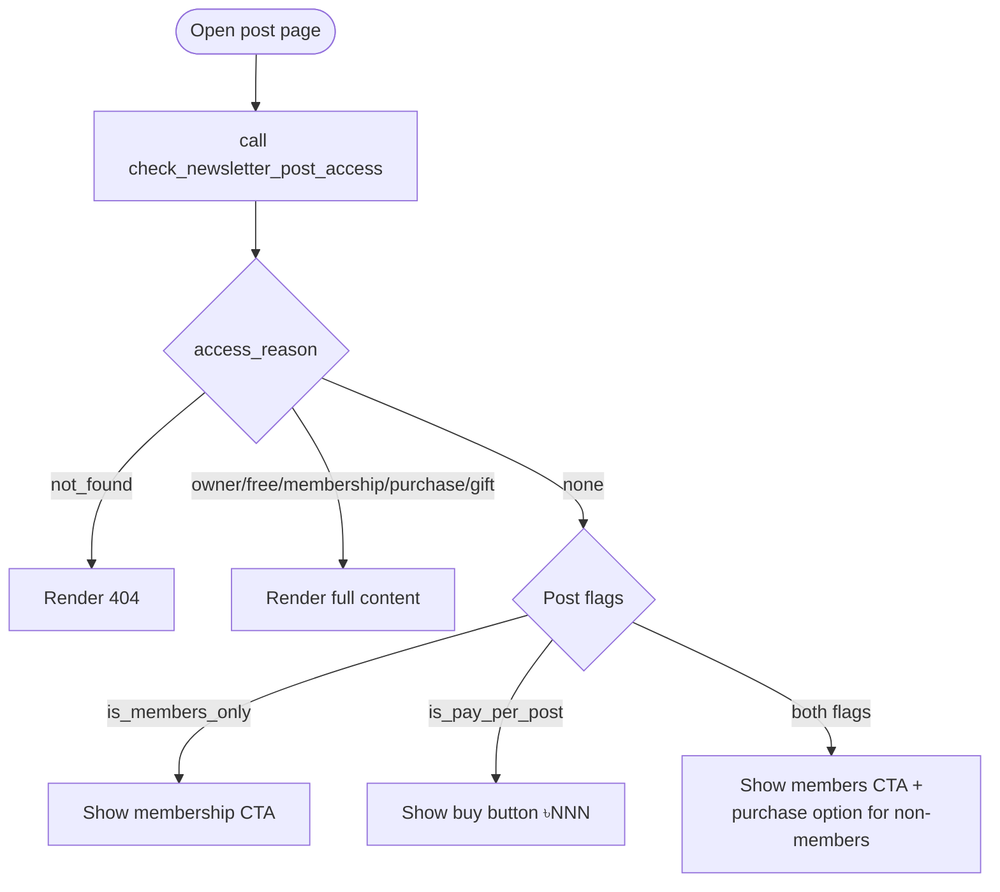

# Post Access & Paywalls

This page covers how to check a reader's access to a specific post, how to render the paywall, and how gifting works.

## Access Decision Flow

When a reader opens a post detail page, call `check_newsletter_post_access()` to find out whether they can read the full content:

```ts
const { data, error } = await supabase.rpc('check_newsletter_post_access', {
  p_post_id: postId,
})

// data is a single-row result set
const { has_access, access_reason } = data[0]
```

## `access_reason` Values

| Value | Meaning | Show paywall? |
|---|---|---|
| `'not_found'` | Post doesn't exist | Redirect to 404 |
| `'owner'` | Reader is the author | No |
| `'free'` | No paywall on this post | No |
| `'membership'` | Reader has an active membership | No |
| `'purchase'` | Reader purchased this post | No |
| `'gift'` | Reader received this post as a gift | No |
| `'none'` | No access | **Yes** |

## Paywall Decision Tree



## Checking Access on the Post Detail Page

Best practice is to fetch the post data and call `check_newsletter_post_access()` in parallel:

```ts
const [postResult, accessResult] = await Promise.all([
  supabase
    .from('newsletter_posts')
    .select('id, title, slug, subtitle, content, excerpt, cover_image_url, is_members_only, is_pay_per_post, price, tags, reading_time_minutes, published_at, profile_id')
    .eq('id', postId)
    .single(),
  supabase.rpc('check_newsletter_post_access', { p_post_id: postId }),
])

const post = postResult.data
const { has_access, access_reason } = accessResult.data?.[0] ?? {}
```

Then conditionally render the content or paywall:

```ts
const showContent = has_access
const showPaywall = !has_access && access_reason === 'none'
const showExcerpt = showPaywall && post.excerpt
```

## Rendering Content vs. Excerpt

When `has_access = false`, show the `excerpt` field (max 500 chars) instead of `content`. The excerpt is intended to be a teaser visible behind the paywall:

```svelte
{#if showContent}
  <article>{@html renderedContent}</article>
{:else if showExcerpt}
  <article class="paywall-preview">
    <p>{post.excerpt}</p>
    <PaywallGate {post} />
  </article>
{:else}
  <PaywallGate {post} />
{/if}
```

## Paywall Gate Component

The gate UI depends on the post's access flags:

```svelte
<!-- PaywallGate.svelte -->
<script>
  export let post  // { is_members_only, is_pay_per_post, price }
</script>

{#if post.is_members_only && !post.is_pay_per_post}
  <!-- Members-only gate -->
  <div class="paywall-box">
    <h3>This post is for members only</h3>
    <a href="/subscribe">Become a Member</a>
  </div>

{:else if post.is_pay_per_post && !post.is_members_only}
  <!-- Pay-per-post gate -->
  <div class="paywall-box">
    <h3>Buy this post for ৳{post.price}</h3>
    <button on:click={handlePurchase}>Buy Now</button>
    <p>Or <a href="/subscribe">subscribe for unlimited access</a></p>
  </div>

{:else if post.is_members_only && post.is_pay_per_post}
  <!-- Both flags: members read free, others can purchase -->
  <div class="paywall-box">
    <h3>Members read free</h3>
    <a href="/subscribe">Become a Member</a>
    <p>Or buy for ৳{post.price}</p>
    <button on:click={handlePurchase}>Buy for ৳{post.price}</button>
  </div>
{/if}
```

## Access from the Feed vs. Access on Detail Page

The `get_reader_feed()` RPC already computes `has_access` and `access_badge` for each post. You don't need to call `check_newsletter_post_access()` again to render the feed card paywall indicator.

Only call `check_newsletter_post_access()` on the **post detail page** where you need the precise `access_reason` to decide what UI to show.

## Gifting a Post

To gift a post to another user, call `gift_newsletter_post()`:

```ts
const { data, error } = await supabase.rpc('gift_newsletter_post', {
  p_post_id: postId,
  p_grantee_profile_id: recipientProfileId,
  p_gift_message: 'Thought you'd enjoy this!',
  // p_expires_at: optional ISO timestamp
  // p_transaction_reference_id: optional, set by payment flow
})

// data is the grant_id (uuid string)
const grantId = data
```

### Gifting Rules

- Requires authentication.
- You cannot gift a post to yourself.
- If the recipient already has a grant (from a prior purchase or gift), it is overwritten by the new gift — `is_redeemed` is reset to `false`.

### Gift Redemption

When a user receives a gift, they need to "redeem" it (mark it as seen/opened). You can update the grant directly from the client since the `Grantees redeem own grants` policy allows it:

```ts
await supabase
  .from('post_access_grants')
  .update({ is_redeemed: true, redeemed_at: new Date().toISOString() })
  .eq('post_id', postId)
  .eq('grantee_profile_id', userId)
```

## Listing Unredeemed Gifts for a User

```ts
const { data: gifts } = await supabase
  .from('post_access_grants')
  .select(`
    id,
    post_id,
    grant_type,
    gift_message,
    granted_by_profile_id,
    created_at,
    newsletter_posts ( title, slug, cover_image_url )
  `)
  .eq('grantee_profile_id', userId)
  .eq('is_redeemed', false)
  .eq('grant_type', 'gift')
```

---

**Next:** [Post Interactions — Likes, Views, Clicks](./interactions.md)
