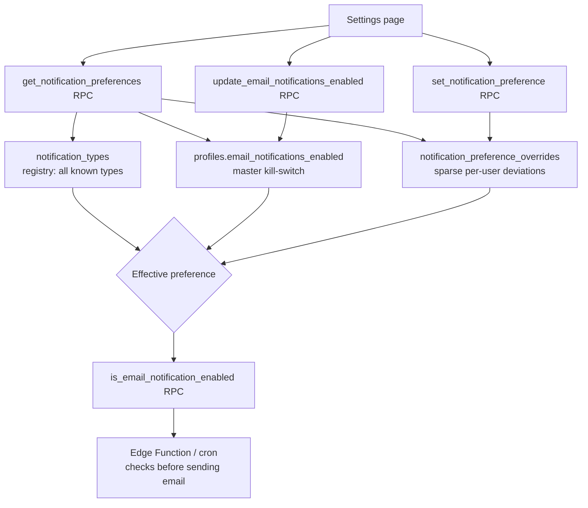
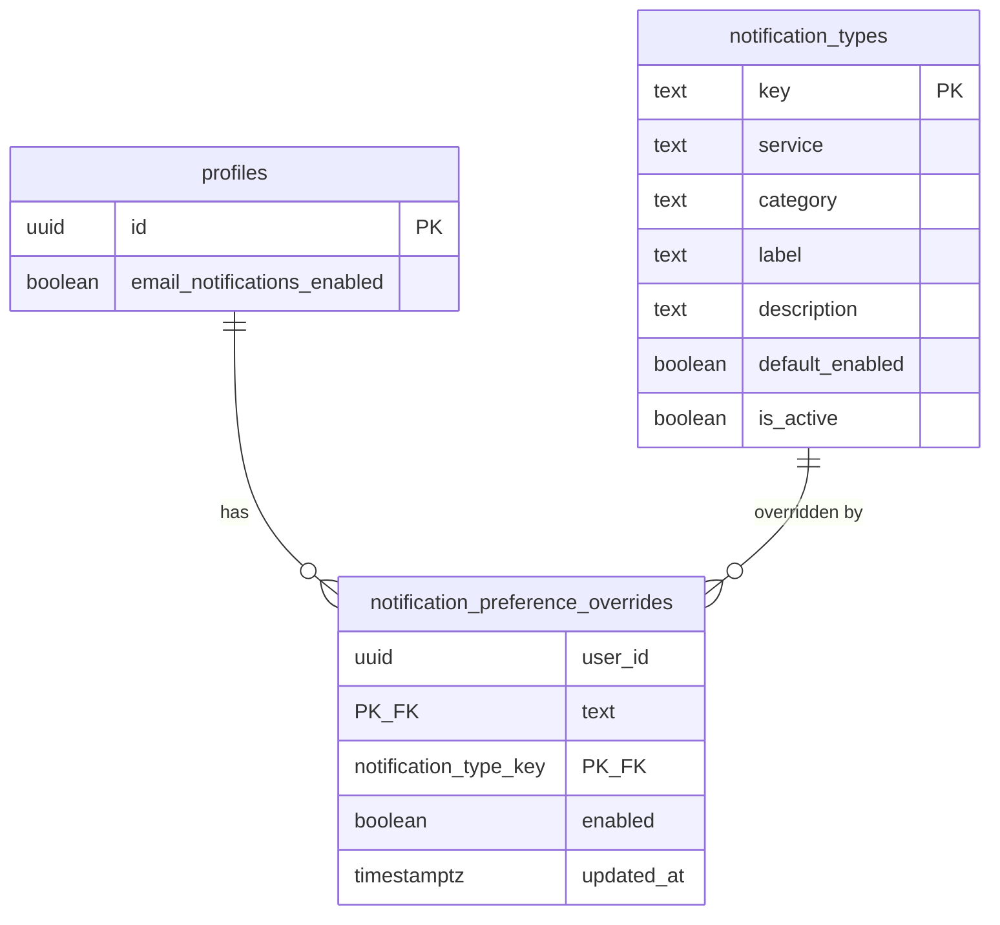
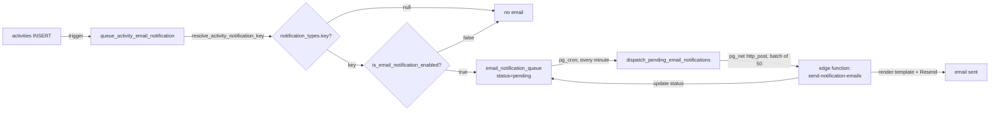

# Email Notification Preferences — Backend Implementation Guide

Lets users toggle email notifications globally and per notification type. Built service-agnostic via a registry table (`notification_types`) so new services (shop, newsletter, etc.) can add notification types via data inserts — no schema migrations needed.

## Architecture



## Entity Relationship



## Source Files

| File | Location |
|---|---|
| Registry table + seed data | `backend/supabase/schemas/common.sql` |
| Master toggle column, overrides table, RPCs | `backend/supabase/schemas/profiles.sql` |

## Key Design Decisions

| Concern | Decision |
|---|---|
| New services add notification types without migrations | `notification_types` registry — `INSERT` new rows (key, service, category, label, default_enabled); no DDL change |
| Master on/off switch | Single column `profiles.email_notifications_enabled` (not a separate 1:1 table) — overrides everything when `false` |
| Per-user overrides storage | Sparse `notification_preference_overrides` table — only stores rows that *differ* from `notification_types.default_enabled` |
| "Reset to default" semantics | `set_notification_preference()` deletes the override row when the requested value matches the type's default |
| `notification_types` loads before `profiles.sql` | Defined in `common.sql` (loads first per `config.toml` `schema_paths`) since `notification_preference_overrides.notification_type_key` FKs to it |
| Admin override pattern | All RPCs accept optional `p_target_user_id`, honored only if caller `is_admin()` — same pattern as `moderate_user()` |

## Database Schema

### `notification_types` (registry, in `common.sql`)

| Column | Type | Notes |
|---|---|---|
| `key` | `text PK` | Stable identifier, e.g. `gift.received`, `shop.order_placed` |
| `service` | `text NOT NULL` | Owning domain, e.g. `gift`, `follow`, `memberships`, `withdrawal_requests`, `kyc` |
| `category` | `text NOT NULL` | UI grouping for settings page, e.g. `earnings`, `engagement`, `account` |
| `label` | `text NOT NULL` | Human-readable label |
| `description` | `text` | Helper text for settings page |
| `default_enabled` | `boolean NOT NULL DEFAULT true` | Used when user has no override |
| `is_active` | `boolean NOT NULL DEFAULT true` | Soft-disable a type without deleting (preserves override history) |

RLS: `select` for `authenticated` (`using (true)`); `anon` fully revoked. Writes are service-role only (seed migrations) — no insert/update/delete policy.

**Seeded types**: `gift.received`, `follow.new_follower`, `supporter.new_supporter`, `membership.new_member`, `membership.expiring`, `withdrawal.status_changed`, `platform_subscription.expiring`, `kyc.status_changed`.

### `profiles.email_notifications_enabled` (in `profiles.sql`)

`boolean NOT NULL DEFAULT true` — master kill-switch. Covered by the existing `profiles` update RLS policy (no new policy needed).

### `notification_preference_overrides` (in `profiles.sql`)

| Column | Type | Notes |
|---|---|---|
| `user_id` | `uuid` | FK → `profiles(id) ON DELETE CASCADE` |
| `notification_type_key` | `text` | FK → `notification_types(key) ON DELETE CASCADE` |
| `enabled` | `boolean NOT NULL` | User's chosen override value |
| `updated_at` | `timestamptz NOT NULL DEFAULT now()` | |

PK: `(user_id, notification_type_key)`. RLS: owner or `is_admin()` can select/insert/update/delete; `anon` fully revoked.

**Effective preference** for `(user, type)`:
```
profiles.email_notifications_enabled
  AND coalesce(override.enabled, notification_types.default_enabled)
  AND notification_types.is_active
```

## RPCs (all in `profiles.sql`)

| RPC | Purpose |
|---|---|
| `is_email_notification_enabled(p_user_id, p_type_key)` | Returns the effective boolean for a (user, type) pair. Called by edge functions/cron before sending any notification email. |
| `update_email_notifications_enabled(p_enabled, p_target_user_id default null)` | Updates the master toggle on `profiles`. |
| `set_notification_preference(p_type_key, p_enabled, p_target_user_id default null)` | Upserts an override; deletes the override row if `p_enabled` matches the type's default (keeps the table sparse). |
| `get_notification_preferences(p_target_user_id default null)` | Returns `{ email_notifications_enabled, preferences: [...] }` — the full settings page payload, automatically including any newly registered notification types. |
| `get_notification_preferences_for_user(p_user_id)` | Service-role-only variant of `get_notification_preferences` for an arbitrary user (no `auth.uid()` session). Used by the marketing site's `/unsubscribe` page for users arriving via a signed email link. |
| `apply_unsubscribe(p_user_id, p_disable_all, p_type_keys, p_reason, p_comment)` | Service-role-only. Disables `profiles.email_notifications_enabled` (if `p_disable_all`) or adds `false` overrides for each key in `p_type_keys`, and records a row per affected type (or one row with `notification_type_key = null` for "all") in `email_unsubscribe_feedback`. |

## Adding a New Service's Notification Types

```sql
insert into public.notification_types (key, service, category, label, description, default_enabled)
values ('shop.order_placed', 'shop', 'earnings', 'New order placed', 'A buyer places an order in your shop', true)
on conflict (key) do nothing;
```

No changes needed to `profiles`, `notification_preference_overrides`, RLS, or RPCs — the settings page and `is_email_notification_enabled()` pick up new types automatically.

---

## Email Sending Pipeline (`email_notifications.sql`)

While the in-app activity feed (`public.activities`) always receives a row for
every event, the corresponding **email** is only sent if
`is_email_notification_enabled()` returns true for that user/type. This is
implemented in `backend/supabase/schemas/email_notifications.sql`.



### `notification_types` email columns

Each notification type carries its own admin-editable email template directly
on the registry row (no separate templates table — 1:1 relationship):

| Column | Notes |
|---|---|
| `email_subject` | Subject template, supports `{{placeholder}}` substitution. `null` = no email configured for this type yet. |
| `email_html_body` | Body template (HTML), supports `{{placeholder}}`. Rendered into the shared layout (`_shared/email-templates/layout.ts`) by the edge function. |
| `email_placeholders` | Human-readable doc of available `{{placeholder}}` keys, shown in the admin template editor. |
| `email_updated_at` / `email_updated_by` | Audit fields, set by `update_notification_email_template()`. |

Three additional keys were added beyond the original 8 to cover moderation
activities: `shop.product_status`, `shop.category_status`,
`newsletter.post_status`.

### `resolve_activity_notification_key(service_type, role, metadata)`

Pure SQL function mapping an `activities` row to a `notification_types.key`,
or `null` if the activity has no associated email (e.g. unfollow, reports).
See `email_notifications.sql` for the full mapping table.

### `email_notification_queue`

Outbox table populated by the `on_activity_insert_queue_email` trigger
(`activities.sql`) → `queue_activity_email_notification()`
(`email_notifications.sql`). Fully revoked from `anon`/`authenticated` —
service-role only. Columns: `activity_id`, `user_profile_id`,
`notification_type_key`, `status` (`pending`/`processing`/`sent`/`failed`),
`attempts`, `last_error`, `sent_at`.

### `dispatch_pending_email_notifications()`

pg_cron job (`dispatch-email-notifications`, every minute). Batches up to 50
`pending` rows, marks them `processing`, and posts them via `net.http_post` to
the `send-notification-emails` edge function. The dispatch secret is sent as
a custom `X-Dispatch-Secret` header (not `Authorization`), since Kong
strips/blanks the `Authorization` header for routes with `verify_jwt = false`.
Requires the `edge_function_base_url` and `secret_key` Supabase Vault secrets
to be configured (read via `vault.decrypted_secrets`):

```sql
select vault.create_secret('https://<project-ref>.supabase.co/functions/v1', 'edge_function_base_url', 'Base URL for edge function dispatch');
select vault.create_secret('<secret-key>', 'secret_key', 'Secret API key for send-notification-emails calls');
```

### `cleanup_old_email_notification_queue()`

pg_cron job (`cleanup-old-email-notification-queue`, nightly at 03:00 Dhaka
time / 21:00 UTC — pg_cron runs in UTC). Deletes `email_notification_queue`
rows with `status = 'sent'` and `sent_at` older than 6 months, keeping the
outbox table from growing unbounded. `pending`, `processing`, and `failed`
rows are never deleted by this job.

### Edge function: `send-notification-emails`

`backend/supabase/functions/send-notification-emails/index.ts`. For each
queued item: fetches the activity + recipient profile + counterparty profile +
recipient email (`auth.admin.getUserById`), looks up the
`notification_types.email_subject` / `email_html_body`, builds a
`{{placeholder}}` map from the activity metadata, renders via
`_shared/email-templates/render.ts`, wraps in `_shared/email-templates/layout.ts`,
and sends via `_shared/resend.ts` (Resend API, `RESEND_API_KEY` secret). Marks
the queue row `sent` or `failed`.

**Local testing**: if `SMTP_HOST` is set (with `SMTP_PORT` defaulting to
`54325`), `_shared/resend.ts` sends via SMTP to that host instead of the Resend
API. Edge functions run inside the `supabase_edge_runtime` container, so use
the Inbucket container's hostname on the shared docker network:
`SMTP_HOST=inbucket`, `SMTP_PORT=1025` (not the host-mapped
`127.0.0.1:54325`). With local Supabase running, captured emails can be viewed
at `http://127.0.0.1:54324` (Mailpit/Inbucket UI). Leave `SMTP_HOST` unset to
use Resend.

### One-click unsubscribe (footer link)

Every notification email's footer (rendered by
`_shared/email-templates/layout.ts`) includes a signed unsubscribe link built by
`_shared/email-templates/unsubscribe-link.ts`:

```
{MARKETING_URL}/unsubscribe?uid={user_profile_id}&type={notification_type_key}&sig={hmac}
```

`sig` is `HMAC-SHA256(user_profile_id, UNSUBSCRIBE_SECRET)`, hex-encoded. The
`type` param is only a hint for which row to highlight — the page always shows
the user's full preference set.

The link points at the **marketing site**, not an edge function — there is no
public `unsubscribe` edge function. The marketing `/unsubscribe` page
(`marketing/src/pages/unsubscribe/`) recomputes the HMAC server-side with the
same `UNSUBSCRIBE_SECRET`, and on match calls
`get_notification_preferences_for_user` / `apply_unsubscribe` via its
service-role Supabase client (`createServiceDBClient()`). It renders:

- a master "unsubscribe from all emails" toggle
- per-type toggles grouped by `notification_types.category`
- an optional "why are you leaving" reason + free-text comment, stored in
  `email_unsubscribe_feedback`

`UNSUBSCRIBE_SECRET` must be set identically in `backend/supabase/functions/.env`
(edge function secrets) and in the marketing site's environment.

### `email_unsubscribe_feedback`

| Column | Type | Notes |
|---|---|---|
| `id` | `bigint PK` | |
| `user_id` | `uuid` | FK → `profiles(id) ON DELETE CASCADE` |
| `notification_type_key` | `text` | FK → `notification_types(key) ON DELETE SET NULL`; `null` = "unsubscribed from all" |
| `reason` | `text` | Selected reason from the unsubscribe page's radio group |
| `comment` | `text` | Optional free-text feedback |
| `created_at` | `timestamptz NOT NULL DEFAULT now()` | |

Fully revoked from `anon`/`authenticated`; written only via `apply_unsubscribe`
(service-role).

### Admin template editing

`update_notification_email_template(p_key, p_subject, p_html_body)` —
`security definer`, `is_admin()`-gated, granted to `authenticated`. The admin
tool can read current templates via
`select * from notification_types` (already permitted) and save edits via this
RPC.
