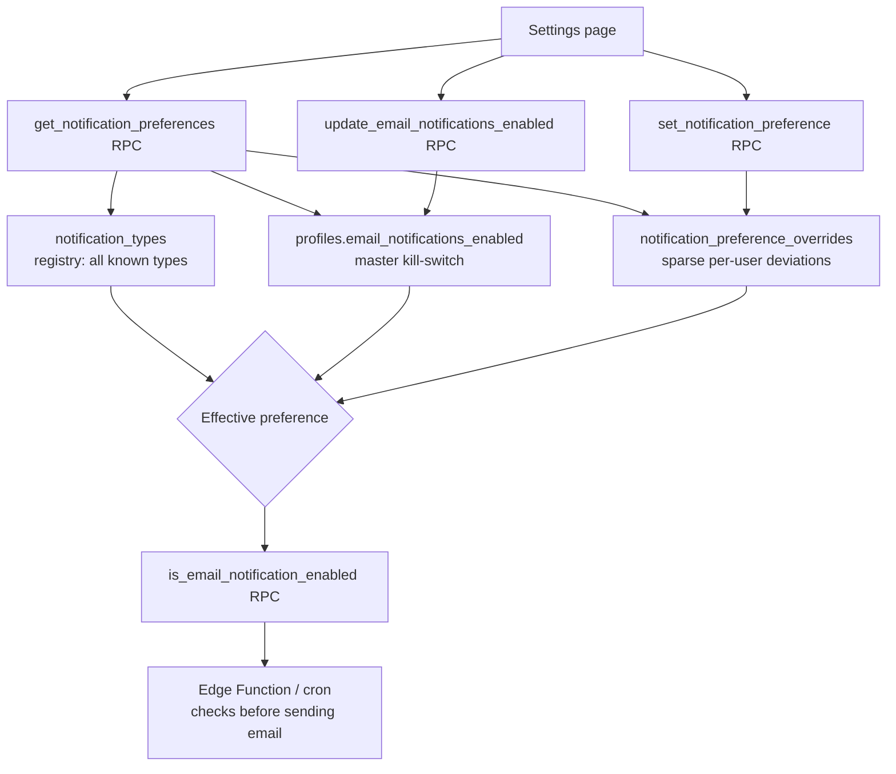
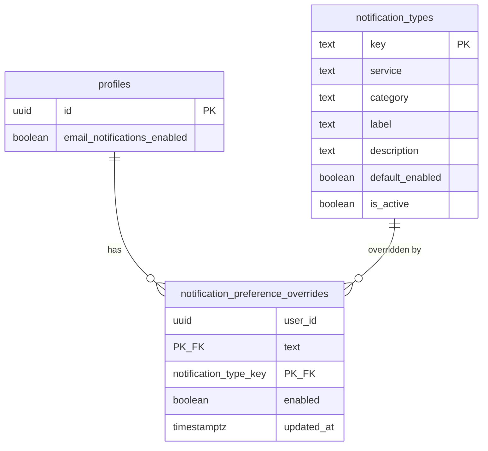

# Email Notification Preferences — Backend Implementation Guide

Lets users toggle email notifications globally and per notification type. Built service-agnostic via a registry table (`notification_types`) so new services (shop, newsletter, etc.) can add notification types via data inserts — no schema migrations needed.

## Architecture



## Entity Relationship



## Source Files

| File | Location |
|---|---|
| Registry table + seed data | `backend/supabase/schemas/common.sql` |
| Master toggle column, overrides table, RPCs | `backend/supabase/schemas/profiles.sql` |

## Key Design Decisions

| Concern | Decision |
|---|---|
| New services add notification types without migrations | `notification_types` registry — `INSERT` new rows (key, service, category, label, default_enabled); no DDL change |
| Master on/off switch | Single column `profiles.email_notifications_enabled` (not a separate 1:1 table) — overrides everything when `false` |
| Per-user overrides storage | Sparse `notification_preference_overrides` table — only stores rows that *differ* from `notification_types.default_enabled` |
| "Reset to default" semantics | `set_notification_preference()` deletes the override row when the requested value matches the type's default |
| `notification_types` loads before `profiles.sql` | Defined in `common.sql` (loads first per `config.toml` `schema_paths`) since `notification_preference_overrides.notification_type_key` FKs to it |
| Admin override pattern | All RPCs accept optional `p_target_user_id`, honored only if caller `is_admin()` — same pattern as `moderate_user()` |

## Database Schema

### `notification_types` (registry, in `common.sql`)

| Column | Type | Notes |
|---|---|---|
| `key` | `text PK` | Stable identifier, e.g. `gift.received`, `shop.order_placed` |
| `service` | `text NOT NULL` | Owning domain, e.g. `gift`, `follow`, `memberships`, `withdrawal_requests`, `kyc` |
| `category` | `text NOT NULL` | UI grouping for settings page, e.g. `earnings`, `engagement`, `account` |
| `label` | `text NOT NULL` | Human-readable label |
| `description` | `text` | Helper text for settings page |
| `default_enabled` | `boolean NOT NULL DEFAULT true` | Used when user has no override |
| `is_active` | `boolean NOT NULL DEFAULT true` | Soft-disable a type without deleting (preserves override history) |

RLS: `select` for `authenticated` (`using (true)`); `anon` fully revoked. Writes are service-role only (seed migrations) — no insert/update/delete policy.

**Seeded types**: `gift.received`, `follow.new_follower`, `supporter.new_supporter`, `membership.new_member`, `membership.expiring`, `withdrawal.status_changed`, `platform_subscription.expiring`, `kyc.status_changed`.

### `profiles.email_notifications_enabled` (in `profiles.sql`)

`boolean NOT NULL DEFAULT true` — master kill-switch. Covered by the existing `profiles` update RLS policy (no new policy needed).

### `notification_preference_overrides` (in `profiles.sql`)

| Column | Type | Notes |
|---|---|---|
| `user_id` | `uuid` | FK → `profiles(id) ON DELETE CASCADE` |
| `notification_type_key` | `text` | FK → `notification_types(key) ON DELETE CASCADE` |
| `enabled` | `boolean NOT NULL` | User's chosen override value |
| `updated_at` | `timestamptz NOT NULL DEFAULT now()` | |

PK: `(user_id, notification_type_key)`. RLS: owner or `is_admin()` can select/insert/update/delete; `anon` fully revoked.

**Effective preference** for `(user, type)`:
```
profiles.email_notifications_enabled
  AND coalesce(override.enabled, notification_types.default_enabled)
  AND notification_types.is_active
```

## RPCs (all in `profiles.sql`)

| RPC | Purpose |
|---|---|
| `is_email_notification_enabled(p_user_id, p_type_key)` | Returns the effective boolean for a (user, type) pair. Called by edge functions/cron before sending any notification email. |
| `update_email_notifications_enabled(p_enabled, p_target_user_id default null)` | Updates the master toggle on `profiles`. |
| `set_notification_preference(p_type_key, p_enabled, p_target_user_id default null)` | Upserts an override; deletes the override row if `p_enabled` matches the type's default (keeps the table sparse). |
| `get_notification_preferences(p_target_user_id default null)` | Returns `{ email_notifications_enabled, preferences: [...] }` — the full settings page payload, automatically including any newly registered notification types. |

## Adding a New Service's Notification Types

```sql
insert into public.notification_types (key, service, category, label, description, default_enabled)
values ('shop.order_placed', 'shop', 'earnings', 'New order placed', 'A buyer places an order in your shop', true)
on conflict (key) do nothing;
```

No changes needed to `profiles`, `notification_preference_overrides`, RLS, or RPCs — the settings page and `is_email_notification_enabled()` pick up new types automatically.
