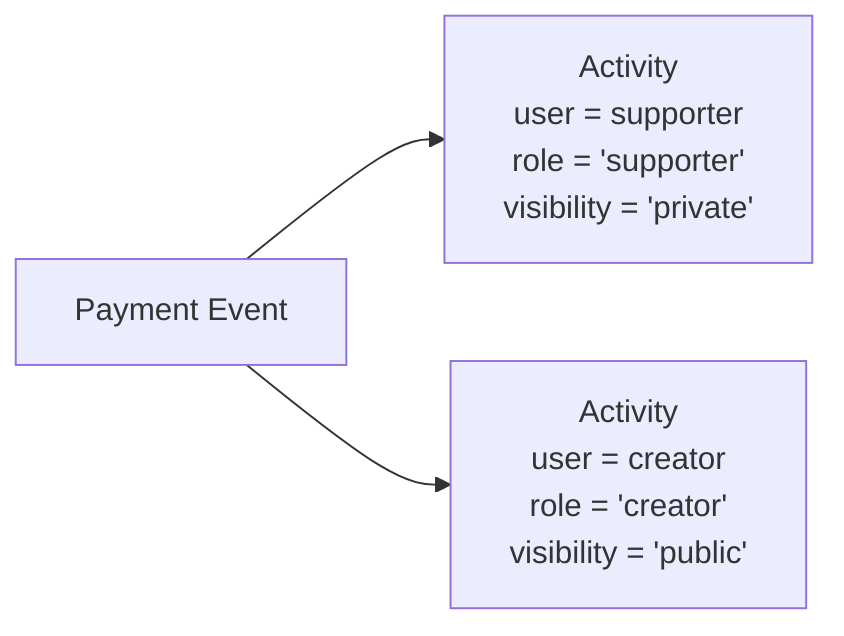

# Activities

The `activities` table is the unified notification and feed system. Every financial event (gift, subscription, withdrawal) results in activity rows that drive both the **public creator feed** and the **private supporter notifications**.

---

## Table Definition

```sql
create table public.activities (
  id                      uuid                    primary key default gen_random_uuid(),
  transaction_id          uuid                    references public.transactions(id) on delete cascade,
  reference_id            uuid                    not null,
  user_profile_id         uuid                    not null references public.profiles(id) on delete cascade,
  counterparty_profile_id uuid                    references public.profiles(id) on delete set null,
  role                    varchar(20)             not null check (role in ('creator', 'supporter', 'system')),
  service_type            varchar(20)             not null default 'gift',
  metadata                jsonb                   not null default '{}'::jsonb,
  visibility              public.visibility_enum  not null default 'public',
  is_dismissed            boolean                 not null default false,
  created_at              timestamptz             not null default now(),
  updated_at              timestamptz             not null default now()
);
```

### Column Reference

| Column | Type | Description |
|---|---|---|
| `id` | `uuid` | Primary key |
| `transaction_id` | `uuid` | FK → `transactions.id`; null for system notifications (e.g. membership expiry) |
| `reference_id` | `uuid` | Logical group reference — same value as `transactions.reference_id` for payment activities |
| `user_profile_id` | `uuid` | Activity owner — who sees this in their feed |
| `counterparty_profile_id` | `uuid` | The other party; null for anonymous or system activities |
| `role` | `varchar(20)` | Perspective: `'creator'`, `'supporter'`, or `'system'` |
| `service_type` | `varchar(20)` | `'gift'`, `'newsletter'`, `'subscription'`, etc. |
| `metadata` | `jsonb` | Display data — amounts, messages, notification context |
| `visibility` | `visibility_enum` | `'public'` or `'private'` |
| `is_dismissed` | `boolean` | User-controlled dismiss for notifications |
| `created_at` | `timestamptz` | When the activity occurred |
| `updated_at` | `timestamptz` | Auto-updated by trigger |

---

## Activity Roles

Each payment generates **two** activity rows:



| Role | Owner | Visibility | Purpose |
|---|---|---|---|
| `supporter` | The supporter | `private` | Private receipt / confirmation for the supporter |
| `creator` | The creator | `public` | Public entry on the creator's support feed |
| `system` | The member | `private` | System-generated notifications (e.g. membership expiry reminders) |

---

## Visibility

| `visibility` | Who can read it |
|---|---|
| `public` | Via the `get_creator_public_activities` RPC (accessible to anon + authenticated) |
| `private` | Only `user_profile_id` — the activity owner |

`anon` is **revoked from the `activities` table entirely** — there is no direct anon `SELECT` policy. Public activities reach anonymous visitors through the `get_creator_public_activities` security-definer RPC, which queries the table with elevated privileges and returns only `visibility = 'public'` rows for the requested creator.

---

## `metadata` Shapes

### Supporter activity (private)

```json
{
  "type": "gift",
  "amount": 500,
  "platform_fee": 25,
  "supporter_id": "uuid",
  "coffee_count": 3,
  "message": "Keep it up!"
}
```

### Creator activity (public)

```json
{
  "type": "gift",
  "amount": 475,
  "platform_fee": 25,
  "supporter_id": "uuid",
  "supporter_anonymous": false,
  "coffee_count": 3,
  "message": "Keep it up!"
}
```

Note: `amount` in the creator activity is the **net amount** (after platform fee). In the supporter activity it's the **gross amount**. `platform_fee` is the gross platform fee on the payment and is the same on both sides.

### Membership expiry notification (system)

```json
{
  "notification_type": "3_days",
  "plan_name": "Premium Monthly",
  "service_type": "newsletter",
  "period_end": "2026-05-03T22:00:00Z",
  "creator_name": "Rahim Uddin",
  "creator_username": "rahimuddin",
  "membership_id": "uuid"
}
```

### Shop: Category Approved

```json
{
  "activity_type": "category_approved",
  "service_type": "shop",
  "category_id": "uuid",
  "category_name": "Coffee Beans",
  "requester_name": "Rahim Uddin",
  "message": "Your category has been approved!"
}
```

### Shop: Category Rejected

```json
{
  "activity_type": "category_rejected",
  "service_type": "shop",
  "category_id": "uuid",
  "category_name": "Coffee Beans",
  "requester_name": "Rahim Uddin",
  "rejection_reason": "Category name violates naming guidelines",
  "message": "Your category submission was not approved."
}
```

### Shop: Product Approved

```json
{
  "activity_type": "product_approved",
  "service_type": "shop",
  "product_id": "uuid",
  "product_title": "Ethiopian Yirgacheffe",
  "price_at_purchase": 450,
  "requester_name": "Rahim Uddin",
  "message": "Your product has been published!"
}
```

### Shop: Product Rejected

```json
{
  "activity_type": "product_rejected",
  "service_type": "shop",
  "product_id": "uuid",
  "product_title": "Ethiopian Yirgacheffe",
  "price_at_purchase": 450,
  "requester_name": "Rahim Uddin",
  "rejection_reason": "Product images do not meet quality standards",
  "message": "Your product submission was not approved."
}
```

### Coffee Gifts: Post Gifted

```json
{
  "activity_type": "post_gifted",
  "service_type": "gift",
  "type": "gift",
  "amount": 500,
  "net_amount": 475,
  "platform_fee": 25,
  "supporter_id": "uuid",
  "supporter_name": "John Doe",
  "supporter_platform": "twitter",
  "supporter_anonymous": false,
  "coffee_count": 3,
  "post_id": "uuid",
  "post_slug": "my-blog-post",
  "post_title": "My Blog Post",
  "gift_message": "Great article!"
}
```

### Coffee Gifts: Post Gift Sent

```json
{
  "activity_type": "post_gift_sent",
  "service_type": "gift",
  "type": "gift",
  "amount": 500,
  "net_amount": 475,
  "platform_fee": 25,
  "supporter_id": "uuid",
  "supporter_name": "John Doe",
  "supporter_platform": "twitter",
  "supporter_anonymous": false,
  "coffee_count": 3,
  "buyer_name": "John Doe",
  "buyer_platform": "twitter",
  "post_id": "uuid",
  "post_slug": "my-blog-post",
  "post_title": "My Blog Post",
  "gift_message": "Great article!"
}
```

### Newsletter: Post Approved

```json
{
  "activity_type": "post_approved",
  "service_type": "newsletter",
  "post_id": "uuid",
  "post_slug": "weekly-update-42",
  "post_title": "Weekly Update #42",
  "requester_name": "Rahim Uddin",
  "message": "Your post has been published!"
}
```

### Newsletter: Post Rejected

```json
{
  "activity_type": "post_rejected",
  "service_type": "newsletter",
  "post_id": "uuid",
  "post_slug": "weekly-update-42",
  "post_title": "Weekly Update #42",
  "requester_name": "Rahim Uddin",
  "rejection_reason": "Content violates community guidelines",
  "message": "Your post was not approved for publication."
}
```

### Newsletter: Post Status Updated

Written by `update_newsletter_post_status` to the author's own feed
(`role: "system"`, `visibility: "private"`) on every self-service
draft↔review / archive transition.

```json
{
  "activity_type": "post_status_updated",
  "service_type": "newsletter",
  "post_id": "uuid",
  "post_slug": "weekly-update-42",
  "post_title": "Weekly Update #42",
  "old_status": "draft",
  "new_status": "review"
}
```

### Shop: Order Item Shipped

Written by `update_order_tracking` to the buyer's feed
(`role: "supporter"`, `visibility: "private"`).

```json
{
  "activity_type": "order_item_shipped",
  "service_type": "shop",
  "order_id": "uuid",
  "order_number": "SHOP-20260616-0001",
  "product_id": "uuid",
  "product_title": "Ceramic Mug",
  "carrier": "Pathao",
  "tracking_number": "PTH123456",
  "tracking_url": "https://pathao.com/track/PTH123456"
}
```

### Shop: Order Item Delivered

Written by `mark_order_item_delivered` to the buyer's feed
(`role: "supporter"`, `visibility: "private"`).

```json
{
  "activity_type": "order_item_delivered",
  "service_type": "shop",
  "order_id": "uuid",
  "order_number": "SHOP-20260616-0001",
  "product_id": "uuid",
  "product_title": "Ceramic Mug"
}
```

### Shop: Order Item Cancelled

Written by `cancel_cod_order_item` to the buyer's feed
(`role: "supporter"`, `visibility: "private"`).

```json
{
  "activity_type": "order_item_cancelled",
  "service_type": "shop",
  "order_id": "uuid",
  "order_number": "SHOP-20260616-0001",
  "product_id": "uuid",
  "product_title": "Ceramic Mug",
  "cancellation_reason": "Out of stock"
}
```

---

## Row Level Security

| Operation | Role | Policy |
|---|---|---|
| `SELECT` | `anon` | **Blocked** — `revoke all from anon` |
| `SELECT` | `authenticated` | `visibility = 'public'` OR `user_profile_id = auth.uid()` |
| `INSERT` | `authenticated` | **Blocked** (`with check (false)`) — backend only |
| `UPDATE` | `authenticated`/`anon` | **Blocked entirely** — `revoke update` (see below) |
| `DELETE` | `authenticated` | **Blocked** |

::: warning Immutable by design
Activities are never deleted or modified by clients. Once created, the only user action is dismissing a notification via the `dismiss_activity()`/`dismiss_all_activities()` RPCs. This preserves the audit trail.
:::

::: warning
**Security fix (SEC-15, 2026-06-24):** the previous `UPDATE` policy used a `WITH CHECK` that only constrained `is_dismissed = true`, but did **not** freeze any other column — a user could mutate `metadata`/`amount` in the same request as dismissing. The policy has been replaced with `revoke update on public.activities from authenticated, anon;` plus two new RPCs.
:::

---

## Dismissing a Notification

A user dismisses one activity via `dismiss_activity()`, or all of their own via `dismiss_all_activities()`. Both are `SECURITY DEFINER`, scoped to `user_profile_id = auth.uid()`, and only ever write `is_dismissed = true` — no other column is reachable through either RPC:

```sql
select public.dismiss_activity('activity-uuid');
select public.dismiss_all_activities();
```

---

## Email Notifications

Every insert into `activities` fires the `on_activity_insert_queue_email`
trigger (`queue_activity_email_notification()`), which maps the activity to a
`notification_types` key and — if email notifications are enabled for that
user/type — queues a row in `email_notification_queue` for async delivery.
This never blocks or affects the in-app activity row, which is always
inserted regardless. See
[Email Sending Pipeline](../../notifications/index.md#email-sending-pipeline-email_notificationssql)
for the full flow.

---

## Indexes

| Index | Columns | Purpose |
|---|---|---|
| `idx_activities_user_profile_id` | `user_profile_id` | Own feed queries |
| `idx_activities_visibility` | `visibility` | Public feed queries |
| `idx_activities_created_at` | `created_at DESC` | Timeline ordering |
| `idx_activities_user_service_created` | `(user_profile_id, service_type, created_at DESC)` | Filtered feed pagination |
| `idx_activities_user_dismissed_created` | `(user_profile_id, is_dismissed, created_at DESC)` | Unread notification count / list |
| `idx_activities_reference_id` | `reference_id` | Join to transactions |
| `idx_activities_transaction_id` | `transaction_id` | Cascade delete tracking |
| `idx_activities_counterparty_profile_id` | `counterparty_profile_id` | Reverse-lookup queries |

---

## RPC: `get_creator_public_activities`

Paginated public activity feed for a creator's profile page. Accessible by `anon`, `authenticated`, and `service_role` via `SECURITY DEFINER` — the underlying `activities` table is fully revoked from `anon`.

```sql
get_creator_public_activities(
  p_creator_profile_id  uuid,
  p_limit               int           default 10,
  p_cursor_created_at   timestamptz   default null,
  p_cursor_id           uuid          default null
)
returns table (
  id                       uuid,
  counterparty_profile_id  uuid,
  service_type             varchar,
  visibility               public.visibility_enum,
  metadata                 jsonb,
  created_at               timestamptz,
  cp_id                    uuid,
  cp_display_name          text,
  cp_avatar_url            text,
  cp_username              text
)
```

### Behaviour

- Returns only `visibility = 'public'` rows owned by `p_creator_profile_id`.
- Joins `profiles` on `counterparty_profile_id` — `cp_*` columns are `NULL` when the counterparty is anonymous or system-generated.
- Results are ordered `created_at DESC, id DESC`.
- Uses **keyset (cursor) pagination** for stable traversal — pass the `created_at` and `id` of the last row received to get the next page.

### Pagination

**First page** — omit cursor params (or pass `null`):

```typescript
const { data } = await supabase.rpc('get_creator_public_activities', {
  p_creator_profile_id: creatorId,
  p_limit: 10,
})
```

**Subsequent pages** — pass the last row's `created_at` and `id` as the cursor:

```typescript
const last = data.at(-1)

const { data: nextPage } = await supabase.rpc('get_creator_public_activities', {
  p_creator_profile_id: creatorId,
  p_limit: 10,
  p_cursor_created_at: last.created_at,
  p_cursor_id: last.id,
})
```

### Security

```sql
security definer
set search_path = public
grant execute on function get_creator_public_activities(uuid, int, timestamptz, uuid)
  to anon, authenticated, service_role;
```

Anon callers cannot query `activities` directly — this function is the only public entry point for the creator feed.

---

## Weekly Pulse Panel & Coaching Tip

The Activities page's "Weekly Pulse" panel shows three tiles — earnings (via
`get_transaction_stats`, see [Transactions](./transactions#get-transaction-stats)),
new followers, and active supporters — plus an AI-generated coaching tip. The
follower and supporter tiles are powered by two RPCs that follow the exact
same period-over-period pattern as `get_transaction_stats`: both are
`SECURITY DEFINER`, `STABLE`, scoped internally to `auth.uid()`, and compute
the previous-period comparison window automatically from `p_from`/`p_to`.

### RPC: `get_follower_stats`

Defined in `follows.sql`. Powers the "new followers" tile.

```sql
get_follower_stats(
  p_from timestamptz default now() - interval '7 days',
  p_to   timestamptz default now()
)
returns table (
  new_followers        bigint,
  new_followers_change numeric
)
```

Counts rows in `public.follows` where `following_id = auth.uid()`, scoped to
the given window. The previous period is the same-length window immediately
before `p_from`.

```typescript
const { data } = await supabase.rpc('get_follower_stats', {
  p_from: '2026-06-14T00:00:00Z',
  p_to:   '2026-06-21T00:00:00Z',
})
// data[0] = { new_followers: 12, new_followers_change: 33.33 }
```

### RPC: `get_active_supporters_stats`

Defined in `supporters.sql`. Powers the "active supporters" tile.

```sql
get_active_supporters_stats(
  p_from timestamptz default now() - interval '7 days',
  p_to   timestamptz default now()
)
returns table (
  active_supporters        bigint,
  active_supporters_change numeric
)
```

A supporter counts as "active" if their `supporters.last_supported_at` falls
within the window, scoped to `creator_id = auth.uid()`.

```typescript
const { data } = await supabase.rpc('get_active_supporters_stats', {
  p_from: '2026-06-14T00:00:00Z',
  p_to:   '2026-06-21T00:00:00Z',
})
// data[0] = { active_supporters: 8, active_supporters_change: -11.11 }
```

### Change Percentage Formula

Both RPCs use the same convention as `get_transaction_stats`:

| Case | Result |
|---|---|
| Both periods are `0` | `0` |
| Previous is `0`, current > `0` | `100` |
| Otherwise | `ROUND((current - previous) / previous * 100, 2)` |

### Security

Both functions are revoked from `anon` and `public` — only `authenticated`
(via the default per-role grant) can call them:

```sql
revoke execute on function public.get_follower_stats(timestamptz, timestamptz) from public, anon;
revoke execute on function public.get_active_supporters_stats(timestamptz, timestamptz) from public, anon;
```

### Coaching Tip Cache (`profiles.coaching_tip`)

The panel also shows a short, bilingual AI coaching tip. Rather than calling
OpenAI on every page load, the tip is cached on the creator's own profile row:

| Column | Type | Description |
|---|---|---|
| `profiles.coaching_tip` | `jsonb` | `{ tip: { en, "bn-BD" }, ctaLabel: { en, "bn-BD" }, ctaHref } \| null` |
| `profiles.coaching_tip_generated_at` | `timestamptz` | When the cache was last (re)generated |

The `coaching-tip` edge function is the only writer:

1. Reads `coaching_tip` / `coaching_tip_generated_at` for the authenticated caller.
2. If a cached tip exists and is **less than 24h old** (and `force` was not requested), returns it as-is (`cached: true`).
3. Otherwise calls OpenAI (`gpt-4o-mini`) with the caller's stats (earnings, follower/supporter deltas, KYC/payout/membership flags) and writes the result back to `profiles`, then returns it (`cached: false`).

`ctaHref` is constrained server-side to a fixed allow-list
(`/settings/verification`, `/earnings`, `/earnings/payouts`, `/supporters`,
`/services`) — the model's output can never point the CTA anywhere else, even
under prompt injection.

```typescript
const { data } = await supabase.functions.invoke('coaching-tip', {
  body: {
    stats: {
      earnedTotal: 2750, earnedChange: 14.29,
      newFollowers: 12, newFollowersChange: 33.33,
      activeSupporters: 8, activeSupportersChange: -11.11,
    },
    isKycVerified: true,
    hasPayoutMethod: true,
    hasActiveMembershipPlan: false,
  },
})
// data = { tip: { en, "bn-BD" }, ctaLabel: { en, "bn-BD" }, ctaHref, cached, generatedAt }
```

Pass `force: true` to bypass the 24h cache and regenerate immediately (e.g. a manual "refresh" button).

---

## Common Queries

### Unread notification count

```sql
select count(*)
from public.activities
where user_profile_id = auth.uid()
  and visibility = 'private'
  and is_dismissed = false;
```

### All notifications for a user (latest first)

```sql
select *
from public.activities
where user_profile_id = auth.uid()
  and visibility = 'private'
order by created_at desc
limit 20;
```
