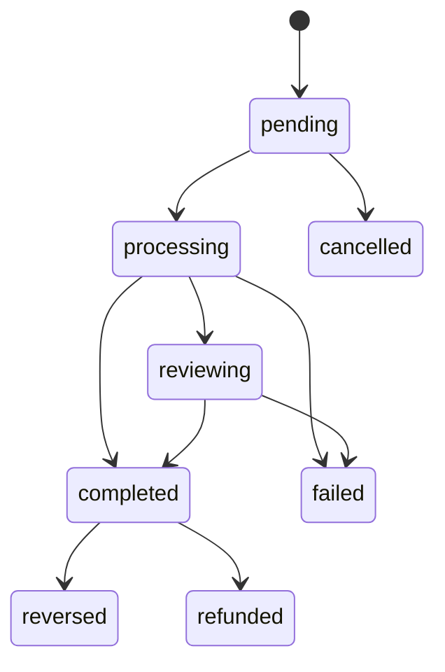
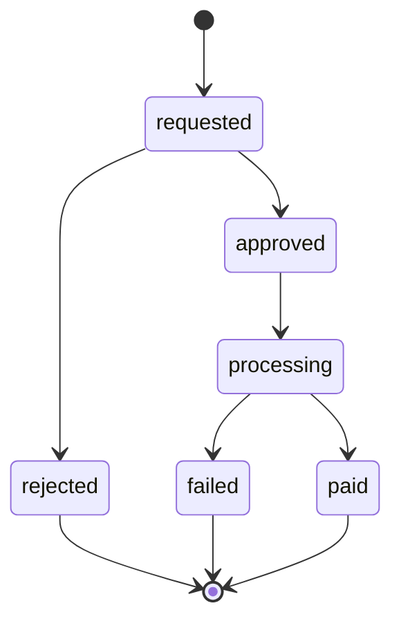

# Enums & Shared Types

All custom types live in the `public` schema and are defined in `supabase/schemas/common.sql`. They are referenced throughout every payment-related table and function.

---

## `provider_enum`

Represents the payment gateway or internal wallet used to process a payment.

| Value | Description |
|---|---|
| `HobeNakiCoffee` | Internal platform wallet (wallet-to-wallet transfer) |
| `Bkash` | bKash mobile banking |
| `Nagad` | Nagad mobile banking |
| `Rocket` | Rocket mobile banking |
| `Upay` | Upay mobile banking |
| `SSLCommerz` | SSLCommerz payment gateway |
| `Aamarpay` | AamarPay payment gateway |
| `Portwallet` | PortWallet payment gateway |
| `Tap` | Tap Payments |
| `Other` | Any other provider |

::: tip
When `provider = 'HobeNakiCoffee'`, the platform deducts from the **supporter's wallet** directly. All other providers represent external charges where no wallet deduction happens on the supporter side.
:::

---

## `payout_provider`

The provider used when a creator withdraws funds to their bank or mobile wallet.

| Value | Description |
|---|---|
| `bkash` | bKash personal/merchant account |
| `nagad` | Nagad account |
| `rocket` | Rocket account |
| `bank` | Bank transfer (any bank) |

Note: `payout_provider` is **lowercase** by convention, unlike `provider_enum`.

---

## `reference_type_enum`

Classifies what a transaction represents in the system lifecycle.

| Value | Used when |
|---|---|
| `one-time` | Single coffee gift or one-off payment |
| `subscription` | Recurring membership/subscription payment |
| `payout` | Funds paid out to creator (withdrawal complete) |
| `withdraw_lock` | Funds locked pending admin approval of withdrawal |
| `withdraw_release` | Locked funds released back (rejected/failed withdrawal) |
| `withdraw_complete` | Withdrawal successfully paid out |
| `manual_adjustment` | Admin-initiated balance correction |

---

## `transaction_direction_enum`

| Value | Meaning |
|---|---|
| `debit` | Money leaving the user's wallet (supporter paying, or creator withdrawing) |
| `credit` | Money entering the user's wallet (creator receiving payment) |

---

## `payment_status_enum`

Lifecycle status for a transaction row.

| Value | Meaning |
|---|---|
| `pending` | Created but not yet processed (e.g. withdrawal lock) |
| `processing` | Being processed by the payment provider |
| `completed` | Fully settled and final |
| `failed` | Processing failed |
| `reversed` | Completed but subsequently reversed |
| `cancelled` | Cancelled before processing |
| `refunded` | Payment was refunded to supporter |
| `reviewing` | Flagged for manual admin review |



---

## `withdrawal_status`

Lifecycle status for a withdrawal request.

| Value | Meaning |
|---|---|
| `requested` | User submitted the request; funds locked in wallet |
| `approved` | Admin approved; ready to process |
| `processing` | Transfer initiated to bank/mobile banking |
| `paid` | Successfully transferred |
| `rejected` | Admin rejected; funds returned to wallet balance |
| `failed` | Transfer attempt failed; funds returned to wallet balance |



---

## `visibility_enum`

Controls who can see an activity row.

| Value | Meaning |
|---|---|
| `public` | Visible to anyone (anonymous + authenticated) |
| `private` | Visible only to the owning user |

---

## `membership_billing_cycle_enum`

| Value | Description |
|---|---|
| `monthly` | Renews every calendar month |
| `annual` | Renews every year |
| `lifetime` | One-time purchase, no expiry (`period_end` is `null`) |

---

## `membership_status_enum`

| Value | Description |
|---|---|
| `active` | Membership is live and grants access |
| `cancelled` | User cancelled; access remains valid until `period_end` |
| `expired` | `period_end` has passed; access revoked |
| `paused` | Temporarily suspended |
| `past_due` | Renewal payment failed; grace period |

---

## `membership_notification_type_enum`

Used internally by the nightly cron to prevent duplicate expiry notifications.

| Value | When it fires |
|---|---|
| `5_days` | 4–6 days before `period_end` |
| `3_days` | 2–4 days before `period_end` |
| `1_day` | 0–2 days before `period_end` |
| `expired` | Within 24 hours after expiry |
| `3_days_post` | 2–4 days after expiry |
| `7_days_post` | 6–8 days after expiry (final nudge) |

---

## `supporter_platform_enum`

The social platform from which a supporter discovered the creator (used for attribution analytics).

Values: `facebook`, `x`, `instagram`, `youtube`, `github`, `linkedin`, `twitch`, `tiktok`, `threads`, `whatsapp`, `telegram`, `discord`, `reddit`, `pinterest`, `medium`, `devto`, `behance`, `dribbble`.

---

## `handle_updated_at()` trigger function

A shared trigger function defined in `common.sql`. It automatically sets `updated_at = now()` before any `UPDATE` on tables that attach the `on_<table>_updated` trigger.

```sql
create or replace function public.handle_updated_at()
returns trigger language plpgsql security definer
set search_path = ''
as $$
begin
  new.updated_at = now();
  return new;
end;
$$;
```

Every schema file that has an `updated_at` column attaches this trigger — you do not need to set `updated_at` manually in application code.
