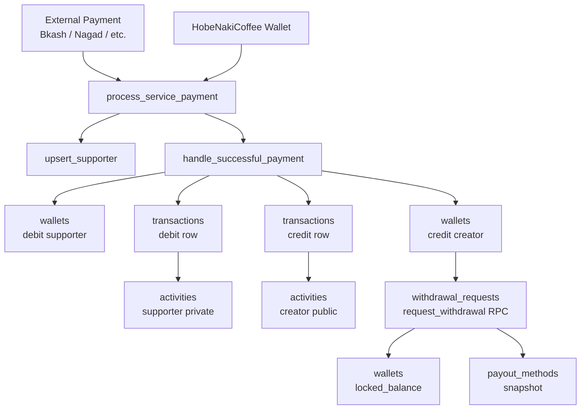
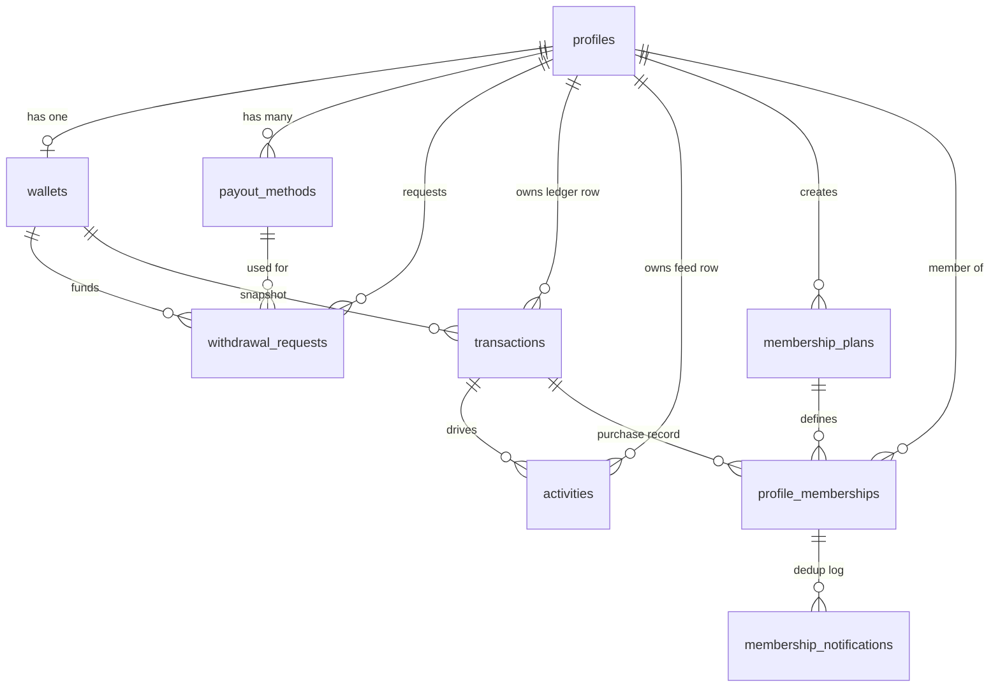

# Payments & Wallets — System Overview

This section documents the full financial layer of HobeNakiCoffee: how money flows from a supporter to a creator, how creator balances are tracked, how withdrawals are processed, and how every financial event surfaces in the activity feed.

## Scope

| Schema area | Pages |
|---|---|
| Shared enums & types | [Enums & Types](./enums) |
| Wallets | [Wallets](./wallets) |
| Payout Methods | [Payout Methods](./payout-methods) |
| Transactions | [Transactions](./transactions) |
| Withdrawal Requests | [Withdrawal Requests](./withdrawal-requests) |
| Activities | [Activities](./activities) |
| Memberships | [Memberships](./memberships) |
| Payment Functions | [Payment Functions](./payment-functions) |

---

## High-Level Architecture

---

## Money Flow — Step by Step

Every supporter payment (gift or subscription) goes through the same pipeline:

1. **`process_service_payment`** is called server-side (service role only). It accepts all context: who is paying, who is receiving, how much, via which provider.
2. It calls **`upsert_supporter`** to ensure the supporter entity exists for analytics.
3. It calls **`handle_successful_payment`**, which:
   - Validates inputs (positive amounts, platform fee constraints, no self-gifting).
   - **Supporter side (debit):** if paid via internal wallet (`HobeNakiCoffee` provider), deducts the balance and creates a `debit` transaction row.
   - **Creator side (credit):** credits the net amount (`amount − platform_fee`) to the creator's wallet and creates a `credit` transaction row.
   - Creates two **activity** rows — a `private` one for the supporter and a `public` one for the creator's feed.

4. When a creator wants to withdraw, they call **`request_withdrawal`**, which moves the requested amount from `balance` → `locked_balance` on the wallet and inserts a `withdrawal_requests` row plus a pending `debit` transaction.

---

## Entity Relationship Diagram

---

## Key Design Decisions

**User-centric ledger.** The `transactions` table stores _two_ rows per payment — one owned by the supporter (`debit`) and one owned by the creator (`credit`). Each user sees only their own rows via RLS. This means the ledger is never shared; each party has their own immutable record.

**`balance_after` snapshot.** Every transaction stores the wallet balance _after_ that transaction was applied. This lets you reconstruct balance history without replaying all prior transactions.

**`locked_balance` for pending withdrawals.** When a withdrawal is requested, funds move from `balance` to `locked_balance` atomically, so `balance` always reflects what is immediately spendable.

**`reference_id` as the logical link.** Each payment creates a unique `reference_id` per transaction row (supporter and creator get different UUIDs). The same `reference_id` is written to the `activities` row, allowing a client to correlate an activity back to its transaction without an extra join.

**Service-role guard on payment functions.** `handle_successful_payment` and `process_service_payment` check `auth.uid() is not null` and raise an exception if so — ensuring they can _only_ be called from your server-side backend (service role), never directly from a browser client.

---

## Security Model Summary

| Table | anon | authenticated (own) | service role |
|---|---|---|---|
| `wallets` | ✗ | SELECT, INSERT, UPDATE | Full |
| `payout_methods` | ✗ | Full CRUD | Full |
| `transactions` | ✗ | SELECT | Full |
| `withdrawal_requests` | ✗ | SELECT, INSERT | Full |
| `activities` | SELECT (public only) | SELECT (own + public), UPDATE `is_dismissed` | Full |
| `membership_plans` | SELECT (active only) | Full CRUD (own) | Full |
| `profile_memberships` | ✗ | SELECT (own), UPDATE cancel/pause | Full |
| `membership_notifications` | ✗ | SELECT | Full |
