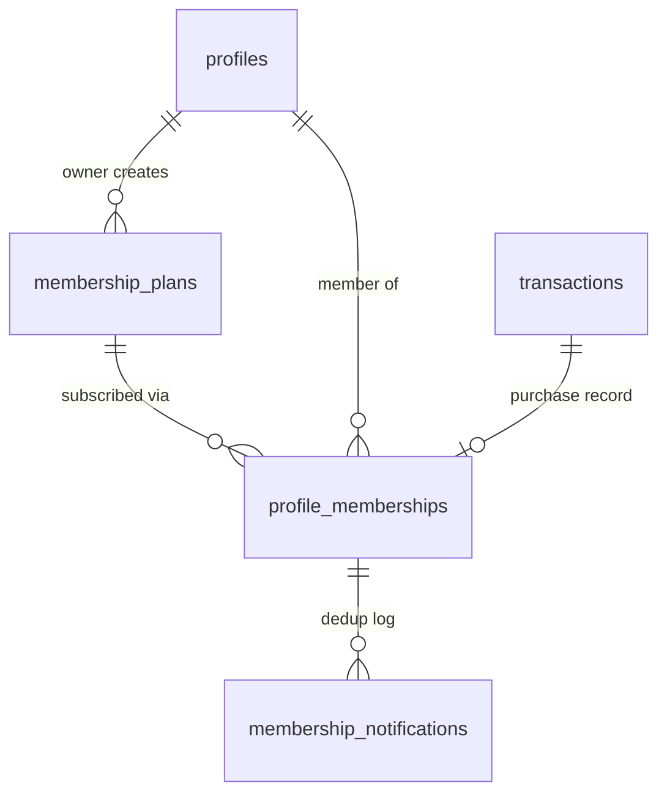
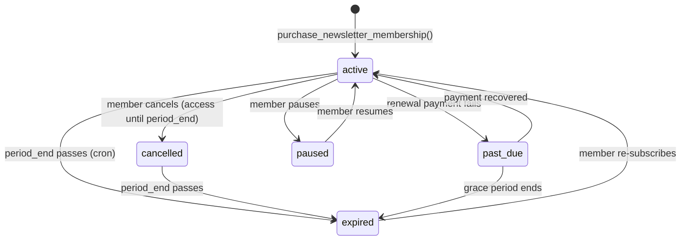

# Memberships

The membership system is **service-agnostic**: a single schema handles subscriptions for newsletters, courses, or any future service type without schema changes. Three tables work together — `membership_plans`, `profile_memberships`, and `membership_notifications`.

---

## Schema Overview



---

## `membership_plans`

Defines the available subscription tiers that a creator offers for a given service.

```sql
create table public.membership_plans (
  id               uuid    primary key default gen_random_uuid(),
  owner_profile_id uuid    not null references public.profiles(id) on delete cascade,
  service_type     varchar(50) not null,
  name             varchar(200) not null,
  description      text,
  is_featured      boolean not null default false,
  price            numeric(10,2) not null check (price >= 0),
  billing_cycle    public.membership_billing_cycle_enum not null,
  access_config    jsonb   not null default '{}'::jsonb,
  sort_order       integer not null default 0,
  is_active        boolean not null default true,
  created_at       timestamptz not null default now(),
  updated_at       timestamptz not null default now()
);
```

### Column Reference

| Column | Type | Description |
|---|---|---|
| `id` | `uuid` | Primary key |
| `owner_profile_id` | `uuid` | The creator who owns this plan |
| `service_type` | `varchar(50)` | e.g. `'newsletter'`, `'course'`, `'podcast'` |
| `name` | `varchar(200)` | Display name (e.g. `"Premium Monthly"`) |
| `description` | `text` | Optional plan description |
| `is_featured` | `boolean` | Highlight this plan in the UI |
| `price` | `numeric(10,2)` | Monthly/annual/lifetime price in BDT |
| `billing_cycle` | `membership_billing_cycle_enum` | `monthly`, `annual`, or `lifetime` |
| `access_config` | `jsonb` | Per-service rules (e.g. `{"max_gifted_articles": 5}`) |
| `sort_order` | `integer` | Display ordering |
| `is_active` | `boolean` | Soft delete — inactive plans are hidden from non-owners |

### RLS

- **anon + authenticated**: can `SELECT` active plans (`is_active = true`), or their own plans regardless of `is_active`.
- **owner**: full `INSERT`, `UPDATE`, `DELETE` on own plans.

---

## `profile_memberships`

One row per `(owner × member × service_type)` — there can only be one active subscription per member per creator per service.

```sql
create table public.profile_memberships (
  id                 uuid    primary key default gen_random_uuid(),
  plan_id            uuid    not null references public.membership_plans(id) on delete restrict,
  owner_profile_id   uuid    not null references public.profiles(id) on delete cascade,
  member_profile_id  uuid    not null references public.profiles(id) on delete cascade,
  service_type       varchar(50) not null,
  status             public.membership_status_enum not null default 'active',
  period_start       timestamptz not null default now(),
  period_end         timestamptz,           -- null = lifetime
  cancelled_at       timestamptz,
  renewed_at         timestamptz,
  price_at_purchase  numeric(10,2) not null,
  transaction_id     uuid    references public.transactions(id) on delete set null,
  auto_renew         boolean not null default true,
  created_at         timestamptz not null default now(),
  updated_at         timestamptz not null default now(),

  constraint profile_memberships_unique
    unique (owner_profile_id, member_profile_id, service_type)
);
```

### Key columns

| Column | Description |
|---|---|
| `plan_id` | The plan subscribed to (`ON DELETE RESTRICT` — can't delete a plan with active members) |
| `owner_profile_id` | Denormalized from `plan_id` for fast access-check joins |
| `status` | Current subscription state |
| `period_end` | Expiry timestamp; `null` for lifetime plans |
| `price_at_purchase` | Price locked at the time of purchase — survives plan price changes |
| `transaction_id` | Links back to the payment transaction |
| `auto_renew` | Whether the subscription should automatically renew |

### RLS

| Operation | Policy |
|---|---|
| `SELECT` | Member or owner (`member_profile_id = auth.uid()` OR `owner_profile_id = auth.uid()`) |
| `INSERT` | Blocked — only via RPC (`purchase_newsletter_membership`, etc.) |
| `UPDATE` | Members can set `status` to `'cancelled'` or `'paused'` on their own rows |
| `DELETE` | Blocked |

### Hot-path index

```sql
create index idx_profile_memberships_active
  on public.profile_memberships(owner_profile_id, member_profile_id, service_type)
  where status = 'active';
```

This partial index is what makes `has_active_membership()` fast — it only scans active rows.

---

## `membership_notifications`

A deduplication log that prevents sending the same expiry reminder twice.

```sql
create table public.membership_notifications (
  id                    uuid    primary key default gen_random_uuid(),
  profile_membership_id uuid    not null references public.profile_memberships(id) on delete cascade,
  notification_type     public.membership_notification_type_enum not null,
  sent_at               timestamptz not null default now(),
  created_at            timestamptz not null default now(),

  constraint membership_notifications_unique
    unique (profile_membership_id, notification_type)
);
```

The `UNIQUE` constraint on `(profile_membership_id, notification_type)` is the primary dedup guard. The cron function uses `ON CONFLICT DO NOTHING` as a second layer. No notification type is ever sent twice to the same membership.

### RLS

All writes are blocked for authenticated users — only service role (via cron) can insert. Members and owners can `SELECT` the notification history.

---

## Functions

### `has_active_membership(owner, member, service_type)`

The shared access-check helper called by every RPC that gates content behind a subscription.

```sql
create or replace function public.has_active_membership(
  p_owner_profile_id  uuid,
  p_member_profile_id uuid,
  p_service_type      varchar
)
returns boolean
language sql stable security definer set search_path = ''
as $$
  select exists (
    select 1 from public.profile_memberships
    where owner_profile_id  = p_owner_profile_id
      and member_profile_id = p_member_profile_id
      and service_type      = p_service_type
      and status            = 'active'
      and (period_end is null or period_end > now())
  );
$$;
```

**Usage inside other RPCs:**

```sql
if not public.has_active_membership(
  p_owner_profile_id  => v_creator_id,
  p_member_profile_id => auth.uid(),
  p_service_type      => 'newsletter'
) then
  raise exception 'Active membership required';
end if;
```

::: tip
Always call `has_active_membership()` with the exact `service_type` string you used when creating the plan. A `'newsletter'` membership does not grant access to a `'course'`.
:::

---

### `process_membership_expiry_notifications()`

The nightly cron function (runs at **22:00 UTC / 04:00 BDT**) that generates in-app notification activities for members whose memberships are approaching expiry or have recently expired.

#### Notification windows

| Type | When period_end is |
|---|---|
| `5_days` | 4–6 days from now |
| `3_days` | 2–4 days from now |
| `1_day` | 0–2 days from now |
| `expired` | Within the last 24 hours |
| `3_days_post` | 2–4 days ago |
| `7_days_post` | 6–8 days ago (final nudge) |

#### What it does for each membership in each window

1. Inserts an `activities` row with `role = 'system'`, `visibility = 'private'`, scoped to the member.
2. Inserts a `membership_notifications` row (`ON CONFLICT DO NOTHING` for dedup).

The activity insert triggers `on_activity_insert_queue_email`, which resolves the `membership.expiring` notification type via `resolve_activity_notification_key()` and queues an email (sent via `dispatch_pending_email_notifications()` and the `send-notification-emails` Edge Function) if the recipient has it enabled.

#### Hard cutoff

Memberships expired more than **7 days ago** are never notified. This prevents notification spam for long-expired subscriptions.

#### Cron schedule

```sql
select cron.schedule(
  'nightly-membership-expiry-notifications',
  '0 22 * * *',
  $$ select public.process_membership_expiry_notifications(); $$
);
```

---

## Membership Lifecycle


