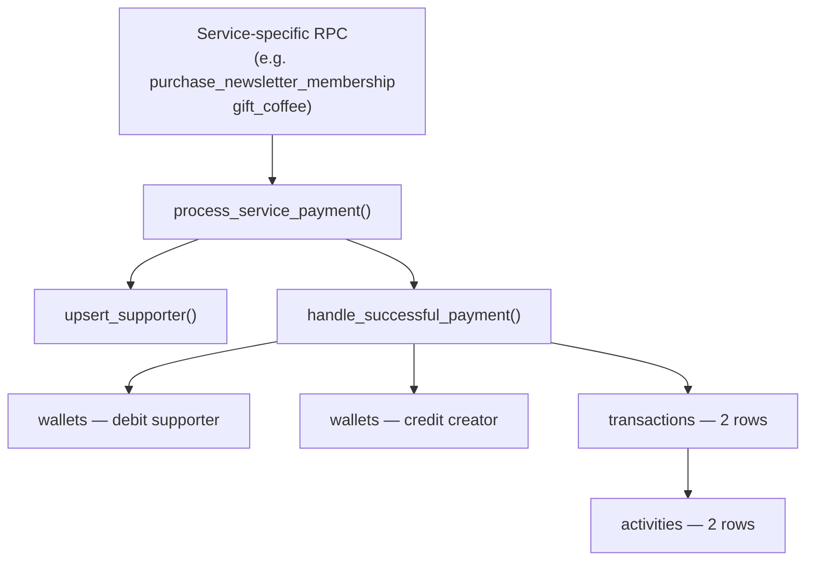

# Payment Functions

These are the core server-side functions that orchestrate all money movement. They are **service-role only** — never called directly by the browser client.

---

## Call Hierarchy



Service-specific RPCs (e.g. `purchase_newsletter_membership`, `perform_coffee_gift`) call `process_service_payment`, which in turn calls `upsert_supporter` and `handle_successful_payment`. You should never call `handle_successful_payment` directly from a new service RPC — always go through `process_service_payment`.

---

## `handle_successful_payment`

The atomic payment processor. Performs all wallet mutations, inserts both transaction rows, and creates both activity rows inside a single database transaction.

### Signature

```sql
create or replace function public.handle_successful_payment(
  p_creator_profile_id       uuid,
  p_supporter_id             uuid,
  p_amount                   numeric(10,2),
  p_platform_fee             numeric(10,2),
  p_provider                 public.provider_enum,
  p_reference_type           public.reference_type_enum,
  p_provider_transaction_id  varchar,
  p_supporter_profile_id     uuid    default null,
  p_service_type             varchar default 'gift',
  p_metadata                 jsonb   default '{}'::jsonb
)
returns jsonb
```

### Parameters

| Parameter | Required | Description |
|---|---|---|
| `p_creator_profile_id` | ✓ | UUID of the creator receiving the payment |
| `p_supporter_id` | ✓ | UUID from `supporters` table (from `upsert_supporter`) |
| `p_amount` | ✓ | Gross payment amount in BDT |
| `p_platform_fee` | ✓ | Platform's cut (0 or positive; must be ≤ `p_amount`) |
| `p_provider` | ✓ | Payment provider enum |
| `p_reference_type` | ✓ | `'one-time'` or `'subscription'` |
| `p_provider_transaction_id` | ✓ | Provider's own transaction ID for dedup/reconciliation |
| `p_supporter_profile_id` | optional | `null` for anonymous supporters |
| `p_service_type` | optional | `'gift'` (default), `'newsletter'`, etc. |
| `p_metadata` | optional | Extra data merged into transaction and activity metadata |

### Return value

```json
{
  "success": true,
  "reference_id": "uuid",
  "supporter_transaction_id": "uuid",
  "creator_transaction_id": "uuid",
  "supporter_balance_after": 2500.00,
  "creator_balance_after": 4750.00
}
```

### Validation rules

| Rule | Error raised |
|---|---|
| Called with non-null `auth.uid()` | `'Not allowed!'` — service role only |
| `p_amount <= 0` | `'Amount must be greater than zero'` |
| `p_platform_fee < 0` | `'Platform fee cannot be negative'` |
| `p_platform_fee > p_amount` | `'Platform fee cannot exceed amount'` |
| `HobeNakiCoffee` provider with wrong `reference_type` | Must be `'one-time'` or `'subscription'` |
| `p_supporter_profile_id = p_creator_profile_id` | `'Cannot gift yourself'` |
| Supporter wallet balance < `p_amount` (internal wallet only) | `'Insufficient wallet balance'` |

### Execution flow

```mermaid
flowchart TD
    A[Start] --> B{auth.uid() null?}
    B -- No --> ERR1[raise: Not allowed!]
    B -- Yes --> C[Validate inputs]
    C --> D[v_net_amount = amount - platform_fee]

    D --> E{Supporter profile exists?}
    E -- No / Anonymous --> F[Skip supporter wallet]
    E -- Yes + HobeNakiCoffee --> G[Lock + deduct supporter wallet]
    E -- Yes + External provider --> H[Read supporter balance only]

    F --> I[Insert supporter debit transaction]
    G --> I
    H --> I

    I --> J[Upsert creator wallet]
    J --> K[Lock + credit creator wallet]
    K --> L[Insert creator credit transaction]
    L --> M[Insert supporter activity - private]
    M --> N[Insert creator activity - public]
    N --> O[Return jsonb result]
```

### Anonymous supporters

When `p_supporter_profile_id` is `null`:
- No wallet deduction happens.
- No supporter `transactions` row is inserted.
- A supporter `activities` row is **not** inserted.
- The creator still receives their credit and activity row, with `supporter_anonymous: true` in the metadata.

### Provider behaviour

| Provider | Supporter wallet deducted? | Supporter tx row inserted? |
|---|---|---|
| `HobeNakiCoffee` | ✓ (if supporter authenticated) | ✓ |
| External (`Bkash`, etc.) | ✗ | ✓ (balance read-only snapshot) |
| Anonymous (no profile) | N/A | ✗ |

---

## `process_service_payment`

The recommended entry point for all service-specific payment RPCs. Wraps `upsert_supporter` + `handle_successful_payment` into one call so you don't need to manage the two-step call yourself.

### Signature

```sql
create or replace function public.process_service_payment(
  p_creator_profile_id       uuid,
  p_supporter_profile_id     uuid,
  p_supporter_name           varchar,
  p_identity_hash            varchar,
  p_amount                   numeric(10,2),
  p_platform_fee             numeric(10,2),
  p_provider                 public.provider_enum,
  p_reference_type           public.reference_type_enum,
  p_provider_transaction_id  varchar,
  p_service_type             varchar,
  p_supporter_platform       public.supporter_platform_enum default null,
  p_metadata                 jsonb default '{}'::jsonb
)
returns jsonb
```

### Parameters

| Parameter | Description |
|---|---|
| `p_creator_profile_id` | UUID of the creator |
| `p_supporter_profile_id` | UUID of the supporter (authenticated user) |
| `p_supporter_name` | Display name for the supporter (used in `upsert_supporter`) |
| `p_identity_hash` | Stable hash to identify anonymous/repeat supporters |
| `p_amount` | Gross amount |
| `p_platform_fee` | Platform's cut |
| `p_provider` | Payment provider |
| `p_reference_type` | `'one-time'` or `'subscription'` |
| `p_provider_transaction_id` | Provider transaction reference |
| `p_service_type` | Service type string (`'gift'`, `'newsletter'`, etc.) |
| `p_supporter_platform` | Optional social platform attribution |
| `p_metadata` | Extra data merged into transactions and activities |

### Return value

Same as `handle_successful_payment`, plus `supporter_id`:

```json
{
  "success": true,
  "supporter_id": "uuid",
  "reference_id": "uuid",
  "supporter_transaction_id": "uuid",
  "creator_transaction_id": "uuid",
  "supporter_balance_after": 2500.00,
  "creator_balance_after": 4750.00
}
```

### Usage in a new service RPC

When building a new service-specific RPC (e.g. `sell_course_access`), call `process_service_payment` like this:

```sql
create or replace function public.sell_course_access(
  p_creator_id uuid,
  p_course_id  uuid,
  p_amount     numeric,
  -- ... other params
)
returns jsonb
language plpgsql
security definer
set search_path = ''
as $$
declare
  v_result jsonb;
begin
  -- Gate: service role only (inherited from handle_successful_payment)

  v_result := public.process_service_payment(
    p_creator_profile_id      => p_creator_id,
    p_supporter_profile_id    => auth.uid(),  -- or null if called from server
    p_supporter_name          => 'Learner Name',
    p_identity_hash           => md5(auth.uid()::text),
    p_amount                  => p_amount,
    p_platform_fee            => round(p_amount * 0.05, 2),  -- 5% fee
    p_provider                => 'HobeNakiCoffee',
    p_reference_type          => 'one-time',
    p_provider_transaction_id => gen_random_uuid()::text,
    p_service_type            => 'course',
    p_metadata                => jsonb_build_object('course_id', p_course_id)
  );

  -- Do service-specific work after payment (e.g. grant access)
  -- ...

  return v_result;
end;
$$;
```

---

## Security

Both functions enforce **service-role-only execution** at the database level:

```sql
if auth.uid() is not null then
  raise exception 'Not allowed!';
end if;
```

This means:
- `SECURITY DEFINER` functions run as the function owner, but if `auth.uid()` is set, the call originated from a browser client — rejected.
- Only your backend server (using `SUPABASE_SERVICE_ROLE_KEY`) can invoke these functions.
- Never expose these functions as callable Supabase Edge Functions or PostgREST endpoints accessible with a user JWT.

::: danger
Do not grant `EXECUTE` on `handle_successful_payment` or `process_service_payment` to the `authenticated` or `anon` roles. The service role guard is a defence-in-depth measure, not a replacement for correct grants.
:::
