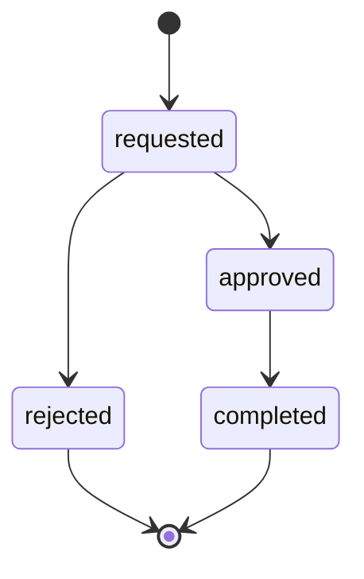

# Refunds

The `refunds` table tracks supporter/creator-initiated refund requests against a completed transaction. It is distinct from chargebacks/disputes (`transactions.is_disputed`) — see [Chargebacks / Disputes vs. Refunds](./transactions#chargebacks-disputes-vs-refunds).

Refunds do **not** move wallet funds automatically. Support manually reverses the underlying payment gateway charge out-of-band today; this table is the system of record for what was promised/approved/completed.

---

## Table Definition

```sql
create table public.refunds (
  id                      uuid                      primary key default gen_random_uuid(),
  transaction_id          uuid                      not null references public.transactions(id) on delete restrict,
  requested_by_profile_id uuid                      not null references public.profiles(id) on delete cascade,

  status                  public.refund_status_enum not null default 'requested',
  reason                  text                      not null,

  amount                  numeric(10,2)             not null check (amount > 0),
  platform_fee_refunded   numeric(10,2)             not null default 0 check (platform_fee_refunded >= 0),

  processed_by            uuid                      references public.profiles(id) on delete set null,
  processed_at            timestamptz,

  created_at              timestamptz               not null default now(),
  updated_at              timestamptz               not null default now()
);
```

### Column Reference

| Column | Type | Description |
|---|---|---|
| `id` | `uuid` | Primary key |
| `transaction_id` | `uuid` | The transaction being refunded (typically the creator's credit-side row, which carries `platform_fee`). `ON DELETE RESTRICT` — a transaction with an open or resolved refund cannot be deleted |
| `requested_by_profile_id` | `uuid` | Whoever called `request_refund` — the supporter who paid, or the creator |
| `status` | `refund_status_enum` | `requested` → `approved`/`rejected` → `completed` |
| `reason` | `text` | Required free-text reason supplied by the requester |
| `amount` | `numeric(10,2)` | Amount requested to be refunded; must not exceed the original transaction's `amount` |
| `platform_fee_refunded` | `numeric(10,2)` | Set when a manager completes the refund; how much of the platform's fee was also given back |
| `processed_by` | `uuid` | FK → `profiles.id`; the manager who last actioned the refund (`ON DELETE SET NULL`) |
| `processed_at` | `timestamptz` | When `admin_process_refund` last ran on this row |

### `refund_status_enum`

| Value | Meaning |
|---|---|
| `requested` | Created via `request_refund`, awaiting manager action |
| `approved` | Manager approved; refund is in progress out-of-band |
| `rejected` | Manager rejected; terminal state |
| `completed` | Manager confirmed the gateway reversal happened; terminal state |



---

## `request_refund` RPC (authenticated)

Either party on the transaction — the supporter who paid, or the creator, on their own initiative — can request a refund.

### Signature

```sql
create or replace function public.request_refund(
  p_transaction_id uuid,
  p_reason         text,
  p_amount         numeric default null  -- defaults to the full transaction amount
)
returns jsonb
```

### What it does

1. Authenticates the caller via `auth.uid()`.
2. Requires a non-blank `p_reason`.
3. Looks up the transaction; the caller must be `user_profile_id` or `counterparty_profile_id` on that row.
4. Requires the transaction `status = 'completed'`.
5. Validates `0 < p_amount <= transaction.amount` (defaults to the full amount when omitted).
6. Rejects if a `requested`/`approved` refund is already pending for the same transaction.
7. Inserts the `refunds` row and returns its id.

### Return values

```json
{ "success": true, "refund_id": "..." }
{ "success": false, "error": "UNAUTHENTICATED" }
{ "success": false, "error": "REASON_REQUIRED" }
{ "success": false, "error": "TRANSACTION_NOT_FOUND" }
{ "success": false, "error": "FORBIDDEN" }
{ "success": false, "error": "TRANSACTION_NOT_COMPLETED" }
{ "success": false, "error": "INVALID_AMOUNT" }
{ "success": false, "error": "REFUND_ALREADY_PENDING" }
```

### Example

```sql
-- Full-amount refund request
select public.request_refund('transaction-uuid', 'Product not as described');

-- Partial refund request
select public.request_refund('transaction-uuid', 'One item missing', 150.00);
```

---

## `admin_process_refund` RPC (manager only — `transactions.refund`)

Approves, rejects, or completes a refund request. Does not move wallet funds — support reverses the underlying payment gateway charge out-of-band, then records the outcome here.

### Signature

```sql
create or replace function public.admin_process_refund(
  p_refund_id             uuid,
  p_new_status            public.refund_status_enum,  -- 'approved' | 'rejected' | 'completed'
  p_platform_fee_refunded numeric default 0            -- only applied when p_new_status = 'completed'
)
returns jsonb
```

Rejects any transition away from an already-finalised (`rejected`/`completed`) refund.

::: warning
**Security fix (SEC-10, 2026-06-24):** `EXECUTE` is now granted to `authenticated` (previously `service_role` only, which made the function unreachable since `service_role` has no `manager_role` JWT claim for `authorize_manager()` to check). Managers call this directly with their own session. See [Manager RPCs](../../managers-and-rbac/backend/rpcs.md#admin_process_refund).
:::

### Return values

```json
{ "success": true, "refund_id": "...", "new_status": "approved" }
{ "success": false, "error": "UNAUTHORIZED" }
{ "success": false, "error": "INVALID_STATUS" }
{ "success": false, "error": "NOT_FOUND" }
{ "success": false, "error": "ALREADY_FINALISED" }
```

### Example

```sql
-- Approve a pending refund request
select public.admin_process_refund('refund-uuid', 'approved');

-- Complete it once the gateway reversal has been confirmed,
-- also refunding the platform's fee
select public.admin_process_refund('refund-uuid', 'completed', 25.00);
```

---

## Row Level Security

| Operation | Policy |
|---|---|
| `SELECT` | Requester (`requested_by_profile_id = auth.uid()`), the transaction's other party (`user_profile_id`/`counterparty_profile_id = auth.uid()`), or a manager with `transactions.refund` |
| `INSERT` | Blocked entirely (`with check (false)`) — use `request_refund` |
| `UPDATE` | Blocked entirely (`using (false)`) — use `admin_process_refund` |
| `DELETE` | Not allowed |

---

## Indexes

| Index | Columns | Purpose |
|---|---|---|
| `idx_refunds_transaction_id` | `transaction_id` | Look up refunds for a transaction |
| `idx_refunds_requested_by` | `requested_by_profile_id` | List a user's refund requests |
| `idx_refunds_status` | `status` | Admin queue filtering |
