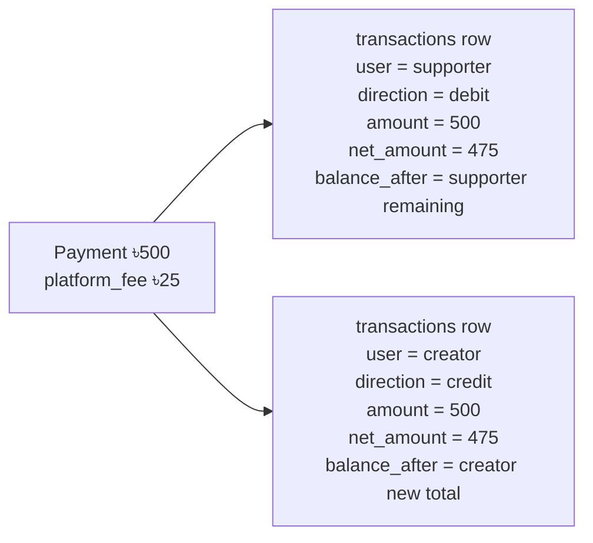

# Transactions

The `transactions` table is the financial ledger. It is **user-centric**: every payment creates two rows — one for the supporter (debit) and one for the creator (credit). Each user sees only their own rows via RLS.

---

## Table Definition

```sql
create table public.transactions (
  id                      uuid                              primary key default gen_random_uuid(),
  user_profile_id         uuid                              not null references public.profiles(id) on delete cascade,
  counterparty_profile_id uuid                              references public.profiles(id) on delete set null,
  supporter_id            uuid                              references public.supporters(id) on delete set null,
  creator_profile_id      uuid                              references public.profiles(id) on delete set null,

  service_type            varchar(20)                       not null default 'gift',
  reference_type          public.reference_type_enum        not null,
  direction               public.transaction_direction_enum not null,

  amount                  numeric(10,2)                     not null check (amount >= 0),
  platform_fee            numeric(10,2)                     not null default 0 check (platform_fee >= 0),
  net_amount              numeric(10,2)                     not null check (net_amount >= 0),

  constraint transactions_amount_consistency
    check (amount = platform_fee + net_amount),

  status                  public.payment_status_enum        not null,
  provider                public.provider_enum,
  provider_transaction_id varchar,
  reference_id            uuid                              unique,
  balance_after           bigint                            not null check (balance_after >= 0),
  wallet_id               uuid                              references public.wallets(id) on delete set null,

  metadata                jsonb                             not null default '{}'::jsonb,

  is_disputed             bool                              not null default false,
  dispute_noted_at        timestamptz,
  dispute_noted_by        uuid                              references public.profiles(id) on delete set null,

  created_at              timestamptz                       not null default now(),
  updated_at              timestamptz                       not null default now()
);
```

### Column Reference

| Column | Type | Description |
|---|---|---|
| `id` | `uuid` | Primary key |
| `user_profile_id` | `uuid` | The user who **owns** this ledger row (what they see) |
| `counterparty_profile_id` | `uuid` | The other party (nullable; null for anonymous supporters) |
| `supporter_id` | `uuid` | FK → `supporters.id`; null for payout/adjustment rows |
| `creator_profile_id` | `uuid` | Who received the support (denormalized for analytics) |
| `service_type` | `varchar(20)` | e.g. `'gift'`, `'newsletter'`, `'withdrawal'` |
| `reference_type` | `reference_type_enum` | What kind of transaction (see [Enums](./enums)) |
| `direction` | `transaction_direction_enum` | `'debit'` or `'credit'` |
| `amount` | `numeric(10,2)` | Gross amount (always positive) |
| `platform_fee` | `numeric(10,2)` | Platform's cut |
| `net_amount` | `numeric(10,2)` | `amount − platform_fee` (always positive) |
| `status` | `payment_status_enum` | Transaction lifecycle status |
| `provider` | `provider_enum` | Payment provider used |
| `provider_transaction_id` | `varchar` | Provider's own transaction reference |
| `reference_id` | `uuid` | Unique business reference; links to activity rows |
| `balance_after` | `bigint` | Wallet balance snapshot after this transaction |
| `wallet_id` | `uuid` | FK → `wallets.id`; null for external provider transactions |
| `metadata` | `jsonb` | Extensible extra data (`role`, `supporter_id`, etc.) |
| `is_disputed` | `bool` | Set by `flag_transaction_disputed()` when the payment gateway reports a chargeback/dispute |
| `dispute_noted_at` | `timestamptz` | When staff flagged the dispute (null when not disputed) |
| `dispute_noted_by` | `uuid` | FK → `profiles.id`; the manager who flagged it (`ON DELETE SET NULL`) |

---

## The Two-Row Model

For every payment, two rows are inserted atomically inside `handle_successful_payment`:



Each user only ever sees their own row — RLS ensures `user_profile_id = auth.uid()`. Neither party can see the other's ledger row.

Managers with `transactions.view` (finance managers, support managers, super admins) can read all rows across all users for audit and dispute resolution purposes. No manager role can write to this table — it is insert-only for payment RPCs running as service role.

---

## Amount Consistency Constraint

The database enforces:

```
amount = platform_fee + net_amount
```

This means you can never insert a transaction where the numbers don't add up. This is a `CHECK` constraint, not application logic.

---

## `metadata` Patterns

The `metadata` column stores role context and any service-specific data passed from the calling RPC.

**Supporter debit row:**
```json
{ "role": "supporter", "coffee_count": 3 }
```

**Creator credit row:**
```json
{ "role": "creator", "coffee_count": 3, "message": "Great content!" }
```

**Withdrawal lock:**
```json
{ "description": "Withdrawal request submitted" }
```

---

## Chargebacks / Disputes vs. Refunds

`is_disputed` is distinct from the [`refunds`](./refunds) table:

- **Dispute (chargeback):** initiated by the supporter's **bank or MFS provider** against the payment gateway, outside the platform. There is no gateway webhook integration yet — staff set `is_disputed = true` manually via `flag_transaction_disputed()` once the gateway reports it.
- **Refund:** initiated **on-platform** by the supporter or creator via `request_refund()`, and resolved by a manager via `admin_process_refund()`. See the [Refunds](./refunds) page.

### `flag_transaction_disputed` (manager only — `transactions.refund`)

```sql
create or replace function public.flag_transaction_disputed(
  p_transaction_id uuid,
  p_is_disputed    boolean default true
)
returns jsonb
```

Sets `is_disputed`, and stamps (or clears) `dispute_noted_at`/`dispute_noted_by` to the acting manager. Pass `p_is_disputed := false` to clear a flag set in error. Granted to `service_role` only — see [Manager RPCs](../../managers-and-rbac/backend/rpcs.md#flag_transaction_disputed).

```sql
-- Flag a chargeback reported by the gateway
select public.flag_transaction_disputed('transaction-uuid');

-- Clear a flag set in error
select public.flag_transaction_disputed('transaction-uuid', false);
```

| Return | Meaning |
|---|---|
| `{ "success": true, "transaction_id": ..., "is_disputed": true }` | Flag updated |
| `{ "success": false, "error": "UNAUTHORIZED" }` | Caller lacks `transactions.refund` |
| `{ "success": false, "error": "NOT_FOUND" }` | No transaction with that id |

---

## Row Level Security

| Operation | Policy |
|---|---|
| `SELECT` | `user_profile_id = auth.uid()` |
| `INSERT` | Service role only (no client INSERT) |
| `UPDATE` | Service role only |
| `DELETE` | Not allowed |

---

## Indexes

| Index | Columns | Notes |
|---|---|---|
| `idx_transactions_user_profile_id` | `user_profile_id` | Primary access pattern |
| `idx_transactions_user_created` | `(user_profile_id, created_at DESC)` | Paginated history |
| `idx_transactions_user_amount_created` | `(user_profile_id, net_amount, created_at DESC)` | Amount-sorted pagination |
| `idx_transactions_reference_id` | `reference_id` | Join to activities |
| `idx_transactions_provider_tx` | `(provider, provider_transaction_id)` | Idempotency / dedup |
| `idx_transactions_direction_status` | `(direction, status)` WHERE `status='completed'` | Stats aggregations |
| `idx_transactions_created_at` | `created_at DESC` | Time-range scans |

---

## RPCs

### `get_transactions_page`

Cursor-based paginated list of transactions for the Transaction History page. Supports two sort modes and several filters.

#### Signature

```sql
create or replace function public.get_transactions_page(
  p_limit           integer     default 20,
  p_amount_sort     text        default null,   -- null | 'asc' | 'desc'
  p_cursor_ts       timestamptz default null,
  p_cursor_amount   numeric     default null,
  p_statuses        text[]      default null,
  p_reference_types text[]      default null,
  p_providers       text[]      default null,
  p_service_types   text[]      default null,
  p_date_from       timestamptz default null,
  p_date_to         timestamptz default null
)
returns table (
  id                      uuid,
  supporter_id            uuid,
  service_type            varchar,
  metadata                jsonb,
  net_amount              numeric,
  platform_fee            numeric,
  status                  public.payment_status_enum,
  created_at              timestamptz,
  reference_type          public.reference_type_enum,
  provider                public.provider_enum,
  provider_transaction_id varchar,
  direction               public.transaction_direction_enum
)
```

#### Parameters

| Parameter | Default | Description |
|---|---|---|
| `p_limit` | `20` | Max rows per page |
| `p_amount_sort` | `null` | `null` = sort by `created_at DESC`; `'asc'` / `'desc'` = sort by `net_amount` |
| `p_cursor_ts` | `null` | Last row's `created_at` (used for all sort modes as primary or tiebreaker cursor) |
| `p_cursor_amount` | `null` | Last row's `net_amount` (used only when `p_amount_sort` is set) |
| `p_statuses` | `null` | Filter by `status[]`, e.g. `ARRAY['completed']` |
| `p_reference_types` | `null` | Filter by `reference_type[]` |
| `p_providers` | `null` | Filter by `provider[]` |
| `p_service_types` | `null` | Filter by `service_type[]` |
| `p_date_from` | `null` | Inclusive start date |
| `p_date_to` | `null` | Inclusive end date |

#### Cursor pagination

**Sort by date (default):**
- First page: all parameters `null`
- Next page: set `p_cursor_ts` to the `created_at` of the last row returned
- `hasNextPage = (returned rows == p_limit)`

**Sort by amount:**
- First page: `p_amount_sort = 'asc'` or `'desc'`, cursors `null`
- Next page: set both `p_cursor_amount` (last row's `net_amount`) and `p_cursor_ts` (last row's `created_at`)

#### Example

```sql
-- First page, newest first
select * from get_transactions_page();

-- Next page (cursor from last row)
select * from get_transactions_page(
  p_cursor_ts := '2026-04-20T10:30:00Z'
);

-- Completed credits only, sorted by amount descending
select * from get_transactions_page(
  p_statuses        := ARRAY['completed'],
  p_reference_types := ARRAY['one-time', 'subscription'],
  p_amount_sort     := 'desc'
);
```

---

### `get_transaction_stats`

Powers the analytics cards on the Transaction History page.

#### Signature

```sql
create or replace function public.get_transaction_stats(
  p_from timestamptz default now() - interval '30 days',
  p_to   timestamptz default now()
)
returns table (
  earned_total        numeric,  -- total credits (completed, one-time + subscription)
  earned_one_time     numeric,
  earned_subscription numeric,
  earned_change       numeric,  -- % change vs previous equivalent period

  spent_total         numeric,  -- total debits (completed, one-time + subscription)
  spent_one_time      numeric,
  spent_subscription  numeric,
  spent_change        numeric,

  pending_in          numeric,  -- credit rows with status pending/processing
  pending_out         numeric,
  pending_in_change   numeric,
  pending_out_change  numeric
)
```

The function automatically calculates a **period-over-period comparison window** of the same duration immediately before `p_from`. Change values are percentages (e.g. `+15.5` means 15.5% increase). `100` is returned when the previous period had zero.

#### Example

```sql
-- Last 30 days stats
select * from get_transaction_stats();

-- Custom date range
select * from get_transaction_stats(
  p_from := '2026-04-01 00:00:00+06',
  p_to   := '2026-04-30 23:59:59+06'
);
```

---

### `get_transaction_service_breakdown`

Powers the "Top Services" analytics card and the billing page's per-service stats. Returns the top `p_limit` services (default 3) by volume in the given period.

#### Signature

```sql
create or replace function public.get_transaction_service_breakdown(
  p_from      timestamptz default now() - interval '30 days',
  p_to        timestamptz default now(),
  p_direction public.transaction_direction_enum default 'credit',
  p_limit     integer default 3
)
returns table (
  service_type       text,
  total_amount       numeric,
  transaction_count  bigint,
  percentage         numeric   -- share of total (0–100)
)
```

Pass `p_direction = 'credit'` for the Earnings tab, `'debit'` for the Spending tab. Pass `p_limit = 5` to get all 5 `platform_subscription_plans.service_type` values (used by the billing page's upsell stats).

#### Example

```sql
-- Top 3 earning services this month
select * from get_transaction_service_breakdown();

-- Top 3 spending services
select * from get_transaction_service_breakdown(p_direction := 'debit');

-- All 5 platform services, for billing page upsell stats
select * from get_transaction_service_breakdown(p_direction := 'credit', p_limit := 5);
```
