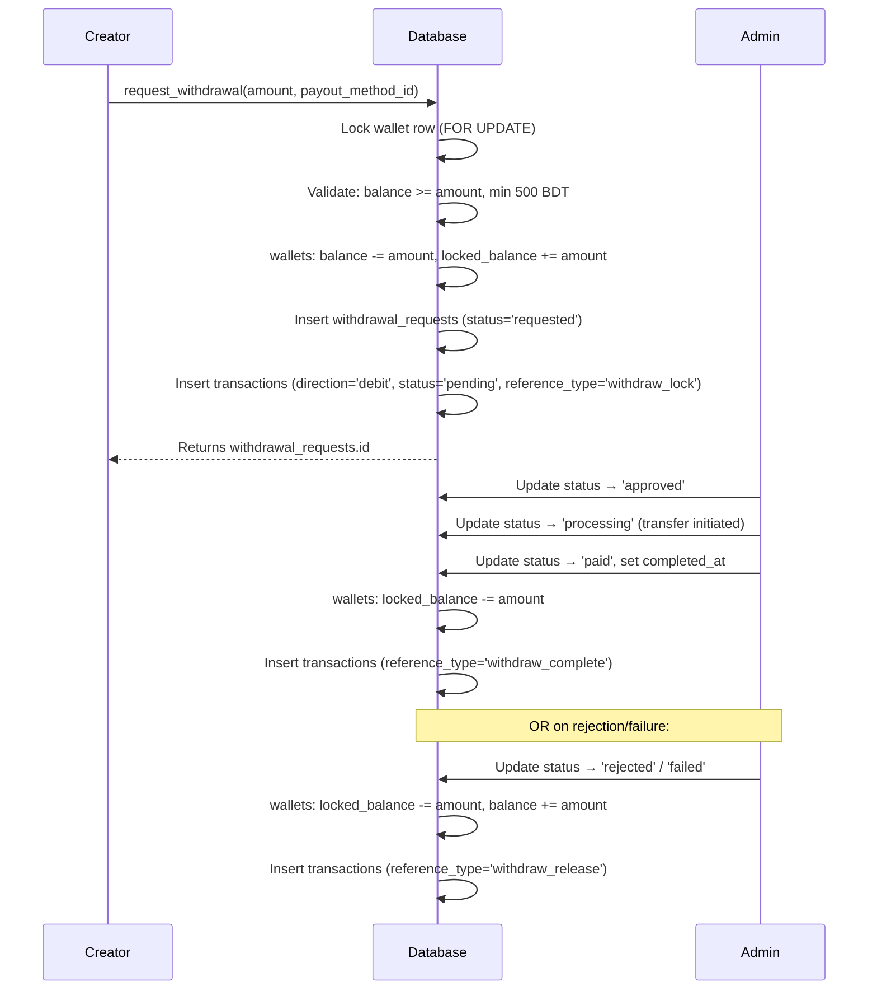

# Withdrawal Requests

The `withdrawal_requests` table tracks every creator withdrawal request from submission through to payment. Funds are locked in the wallet at request time and only released when the request is resolved.

---

## Table Definition

```sql
create table public.withdrawal_requests (
  id               uuid                      primary key default gen_random_uuid(),
  profile_id       uuid                      not null references public.profiles(id) on delete cascade,
  wallet_id        uuid                      not null references public.wallets(id) on delete cascade,
  payout_method_id uuid                      not null references public.payout_methods(id) on delete restrict,

  amount           numeric(12,2)             not null check (amount > 0),
  fee              numeric(12,2)             not null default 0 check (fee >= 0),
  net_amount       numeric(12,2)             not null check (net_amount > 0),

  status           public.withdrawal_status  not null default 'requested',

  requested_at     timestamptz               not null default now(),
  processed_at     timestamptz,
  completed_at     timestamptz,

  admin_note       text,
  failure_reason   text,
  payout_snapshot  jsonb
);
```

### Column Reference

| Column | Type | Description |
|---|---|---|
| `id` | `uuid` | Primary key |
| `profile_id` | `uuid` | FK → `profiles.id` |
| `wallet_id` | `uuid` | FK → `wallets.id` — the wallet funds came from |
| `payout_method_id` | `uuid` | FK → `payout_methods.id` (`ON DELETE RESTRICT`) |
| `amount` | `numeric(12,2)` | Gross amount requested (before fee) |
| `fee` | `numeric(12,2)` | Platform withdrawal fee (currently `0`) |
| `net_amount` | `numeric(12,2)` | `amount − fee`; what the creator receives |
| `status` | `withdrawal_status` | Current lifecycle status |
| `requested_at` | `timestamptz` | When the request was submitted |
| `processed_at` | `timestamptz` | When admin approved or began processing |
| `completed_at` | `timestamptz` | When funds were fully transferred |
| `admin_note` | `text` | Admin comment visible to creator |
| `failure_reason` | `text` | Populated when `status = 'failed'` |
| `payout_snapshot` | `jsonb` | Copy of `payout_methods.details` at request time |

---

## Withdrawal Lifecycle



---

## `request_withdrawal` RPC

The only way for a client to create a withdrawal request is through this security-definer RPC. Direct `INSERT` via the client is blocked by RLS (`with check (profile_id = auth.uid())` only passes for the authenticated user's own profile, but the RPC enforces additional business rules).

### Signature

```sql
create or replace function request_withdrawal(
  p_amount           numeric,
  p_payout_method_id uuid
)
returns uuid  -- the new withdrawal_requests.id
```

### What it does

1. Authenticates the caller via `auth.uid()`.
2. Validates the amount is positive and `≥ 500 BDT` (minimum withdrawal).
3. Locks the wallet row (`FOR UPDATE`) to prevent concurrent withdrawals.
4. Checks `balance >= p_amount`.
5. Validates the payout method belongs to the user and is active.
6. Updates the wallet: `balance -= p_amount`, `locked_balance += p_amount`.
7. Inserts the `withdrawal_requests` row with `status = 'requested'` and a copy of the payout details as `payout_snapshot`.
8. Inserts a `transactions` row with `direction = 'debit'`, `status = 'pending'`, `reference_type = 'withdraw_lock'`.
9. Returns the new `withdrawal_requests.id`.

### Calling it (service role or authenticated user)

```sql
select * from request_withdrawal(500.00, 'xxxxxxxx-xxxx-xxxx-xxxx-xxxxxxxxxxxx');
```

### Error cases

| Error message | Cause |
|---|---|
| `Not authenticated` | `auth.uid()` is null |
| `Invalid withdrawal amount` | `p_amount <= 0` |
| `Minimum withdrawal is 500` | Amount below minimum |
| `Wallet not found` | User has no wallet |
| `Insufficient balance` | `balance < p_amount` |
| `Invalid payout method` | Method not found, not owned, or inactive |
| `Invalid net amount after fee` | `net_amount <= 0` after fee deduction |

---

## Row Level Security

| Operation | Policy |
|---|---|
| `SELECT` | Owner only (`profile_id = auth.uid()`) |
| `INSERT` | Owner only (but use `request_withdrawal` RPC, not direct insert) |
| `UPDATE` | Restricted to service role for admin operations |
| `DELETE` | Not allowed |

---

## Indexes

| Index | Columns | Purpose |
|---|---|---|
| `idx_withdrawal_requests_profile_id` | `profile_id` | List withdrawals per user |
| `idx_withdrawal_requests_profile_requested_at` | `(profile_id, requested_at DESC)` | Paginated history |
| `idx_withdrawal_requests_status` | `status` | Admin queue filtering |
| `idx_withdrawal_requests_wallet_id` | `wallet_id` | Wallet reconciliation |

---

## Business Rules

- **Minimum withdrawal:** 500 BDT. Configured as `v_min_withdraw := 500` inside the RPC — update that constant if the minimum changes.
- **Fee:** Currently `0`. The `fee` column exists for future use.
- **`payout_method_id` is `ON DELETE RESTRICT`**: you cannot delete a payout method that has any associated withdrawal requests. Soft-delete (`is_active = false`) instead.
- **Concurrent safety:** The wallet row is locked with `SELECT ... FOR UPDATE` before balance checks, preventing race conditions if a user submits two requests simultaneously.
