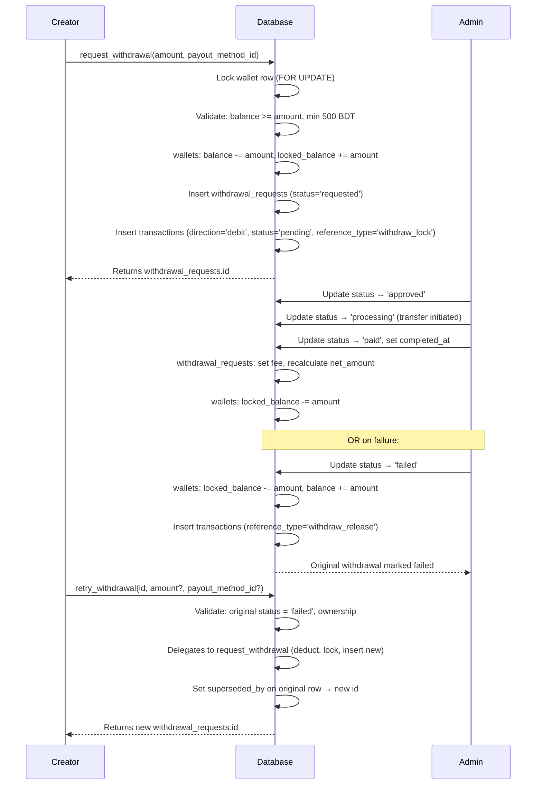

# Withdrawal Requests

The `withdrawal_requests` table tracks every creator withdrawal request from submission through to payment. Funds are locked in the wallet at request time and only released when the request is resolved.

---

## Table Definition

```sql
create table public.withdrawal_requests (
  id               uuid                      primary key default gen_random_uuid(),
  profile_id       uuid                      not null references public.profiles(id) on delete cascade,
  wallet_id        uuid                      not null references public.wallets(id) on delete cascade,
  payout_method_id uuid                      references public.payout_methods(id) on delete set null,

  amount           numeric(12,2)             not null check (amount > 0),
  fee              numeric(12,2)             not null default 0 check (fee >= 0),
  net_amount       numeric(12,2)             not null check (net_amount > 0),

  status           public.withdrawal_status  not null default 'requested',

  requested_at     timestamptz               not null default now(),
  processed_at     timestamptz,
  completed_at     timestamptz,

  admin_note       text,
  failure_reason   text,
  payout_snapshot  jsonb,

  superseded_by    uuid                      references public.withdrawal_requests(id) on delete set null
);
```

### Column Reference

| Column | Type | Description |
|---|---|---|
| `id` | `uuid` | Primary key |
| `profile_id` | `uuid` | FK → `profiles.id` |
| `wallet_id` | `uuid` | FK → `wallets.id` — the wallet funds came from |
| `payout_method_id` | `uuid` | FK → `payout_methods.id` (`ON DELETE SET NULL`) |
| `amount` | `numeric(12,2)` | Gross amount requested (before fee) |
| `fee` | `numeric(12,2)` | TDB tax (withholding tax) — set by admin at payout time. Defaults to 10% of amount |
| `net_amount` | `numeric(12,2)` | `amount − fee`; the creator's payout after TDB tax |
| `status` | `withdrawal_status` | Current lifecycle status |
| `requested_at` | `timestamptz` | When the request was submitted |
| `processed_at` | `timestamptz` | When admin approved or began processing |
| `completed_at` | `timestamptz` | When funds were fully transferred |
| `admin_note` | `text` | Admin comment visible to creator |
| `failure_reason` | `text` | Populated when `status = 'failed'` |
| `payout_snapshot` | `jsonb` | Copy of `payout_methods.details` at request time |
| `superseded_by` | `uuid` | FK → `withdrawal_requests.id` — set when retried, points to the new request |

---

## Withdrawal Lifecycle



---

## `request_withdrawal` RPC

The only way for a client to create a withdrawal request is through this security-definer RPC. Direct `INSERT` via the client is blocked by RLS (`with check (profile_id = auth.uid())` only passes for the authenticated user's own profile, but the RPC enforces additional business rules).

### Signature

```sql
create or replace function request_withdrawal(
  p_amount           numeric,
  p_payout_method_id uuid
)
returns uuid  -- the new withdrawal_requests.id
```

### What it does

1. Authenticates the caller via `auth.uid()`.
2. Takes a per-user advisory lock (`pg_advisory_xact_lock(hashtext('withdrawal_requests:' || user_id))`) so two concurrent requests from the same user can't both pass the daily/monthly limit check below.
3. Validates the amount is positive and `≥ 500 BDT` (minimum withdrawal).
4. Checks the daily and monthly withdrawal limits (see below).
5. Locks the wallet row (`FOR UPDATE`) to prevent concurrent withdrawals.
6. Checks `balance >= p_amount`.
7. Validates the payout method belongs to the user and is active.
8. Updates the wallet: `balance -= p_amount`, `locked_balance += p_amount`.
9. Inserts the `withdrawal_requests` row with `status = 'requested'` and a copy of the payout details as `payout_snapshot`.
10. Inserts a `transactions` row with `direction = 'debit'`, `status = 'pending'`, `reference_type = 'withdraw_lock'`.
11. Returns the new `withdrawal_requests.id`.

### Daily / monthly withdrawal limits

Configured via [`platform_settings`](../../memberships-hub/backend/platform-settings.md): `withdrawal_daily_limit` and `withdrawal_monthly_limit`. Both default to `0`, meaning **unlimited**.

When a limit is `> 0`, `request_withdrawal` sums the user's `withdrawal_requests.amount` for the current calendar day/month — **excluding** `rejected` and `failed` rows — and rejects the new request if `existing_sum + p_amount` would exceed the limit:

```sql
where profile_id = v_user_id
  and status not in ('rejected', 'failed')
  and requested_at >= date_trunc('day', now())    -- or date_trunc('month', now()) for the monthly check
```

Both checks raise with `errcode = 'P0001'` and a `detail` describing the configured limit, same as the other business-rule errors below.

### Calling it (service role or authenticated user)

```sql
select * from request_withdrawal(500.00, 'xxxxxxxx-xxxx-xxxx-xxxx-xxxxxxxxxxxx');
```

### Error cases

| Error message | Cause |
|---|---|
| `Not authenticated` | `auth.uid()` is null |
| `Invalid withdrawal amount` | `p_amount <= 0` |
| `Minimum withdrawal is 500` | Amount below minimum |
| `DAILY_WITHDRAWAL_LIMIT_EXCEEDED` | Today's requested total + `p_amount` would exceed `withdrawal_daily_limit` |
| `MONTHLY_WITHDRAWAL_LIMIT_EXCEEDED` | This month's requested total + `p_amount` would exceed `withdrawal_monthly_limit` |
| `Wallet not found` | User has no wallet |
| `Insufficient balance` | `balance < p_amount` |
| `Invalid payout method` | Method not found, not owned, or inactive |
| `Invalid net amount after fee` | `net_amount <= 0` after fee deduction |

---

## Row Level Security

| Operation | Policy | Who |
|---|---|---|
| `SELECT` | `Users and managers can view withdrawal requests` | Owner (`profile_id = auth.uid()`) or `payouts.approve`/`payouts.process` |
| `INSERT` | — | Not allowed for `authenticated`/`anon` |
| `UPDATE` | — | Not allowed for `authenticated`/`anon` |
| `DELETE` | — | Not allowed for `authenticated`/`anon` |

::: warning
**Security fix (SEC-03, 2026-06-24):** withdrawal_requests used to carry owner-writable `INSERT` and `UPDATE` policies, letting a client insert a withdrawal row without locking the wallet balance, or change its own `status`/`amount`/`net_amount` directly — desyncing wallet vs. withdrawal state. Those policies have been removed entirely; `insert/update/delete` is now revoked from `authenticated`/`anon` at the grant level. All creates go through `request_withdrawal()`/`retry_withdrawal()`; all status changes go through `process_withdrawal()` (manager-only).
:::

---

## `process_withdrawal` RPC (manager only)

Finance managers advance withdrawal requests through the lifecycle using this RPC. Direct table `UPDATE` is no longer possible at all (see RLS table above) — this RPC is the only path.

::: warning
**Security fixes (SEC-07/SEC-10, 2026-06-24):**
- The row is now locked with `SELECT ... FOR UPDATE` before any status change, and a state-machine guard enforces `requested → approved → processing → paid`, with `rejected`/`failed` reachable from any non-terminal state and **no transitions out of a terminal status** (`paid`/`rejected`/`failed`). This prevents double-crediting the wallet from a repeated/concurrent call.
- `EXECUTE` is now granted to `authenticated` (previously `service_role` only, which made the function unreachable since it has no `manager_role` JWT claim). Managers call this directly with their own session; the internal `authorize_manager()` checks below still gate access.
:::

### Signature

```sql
public.process_withdrawal(
  p_withdrawal_id  uuid,
  p_new_status     public.withdrawal_status,
  p_admin_note     text default null,
  p_failure_reason text default null,
  p_fee            numeric(12,2) default null
)
returns jsonb
```

### Permission gates

| New status | Permission required |
|---|---|
| `'approved'` | `payouts.approve` |
| `'processing'`, `'paid'`, `'rejected'`, `'failed'` | `payouts.process` |

### Timestamps set automatically

| New status | `processed_at` | `completed_at` |
|---|---|---|
| `approved`, `processing`, `rejected` | `now()` | unchanged |
| `paid`, `failed` | unchanged | `now()` |

### Return values

```json
{ "success": true, "new_status": "approved" }
{ "success": false, "error": "UNAUTHORIZED" }
{ "success": false, "error": "NOT_FOUND" }
{ "success": false, "error": "INVALID_STATUS" }
```

### Fee handling (`paid` only)

When `p_new_status = 'paid'`, if `p_fee` is provided the function updates `fee` and recalculates `net_amount = amount − p_fee` on the `withdrawal_requests` row. If `p_fee` is omitted the existing values are preserved.

The frontend prefills the fee at **10% of `amount`** via the `WITHDRAWAL_TAX_FEE_RATE` constant. Admins can override this in the dialog before confirming.

### Example

```sql
select public.process_withdrawal(
  'withdrawal-uuid',
  'paid',
  'Processed via bank transfer',
  null,
  50.00  -- TDB tax (10% of 500)
);
```

```sql
select public.process_withdrawal(
  'withdrawal-uuid',
  'approved',
  'Account verified — approved for processing'
);
```

See [Manager RPCs](../../managers-and-rbac/backend/rpcs.md#process_withdrawal) for full details.

---

## `retry_withdrawal` RPC (creator only, from `failed` state)

Creators can retry a failed withdrawal to create a fresh request without manually re-entering the details. Only withdrawals in `failed` status are eligible.

### Signature

```sql
create or replace function public.retry_withdrawal(
  p_withdrawal_id   uuid,
  p_amount           numeric default null,
  p_payout_method_id uuid   default null
)
returns uuid  -- the new withdrawal_requests.id
```

### What it does

1. Authenticates the caller via `auth.uid()`.
2. Validates the original withdrawal exists, belongs to the caller, and has `status = 'failed'`.
3. Delegates to `request_withdrawal` with the original `amount` and `payout_method_id` (or overrides if provided).
4. Sets `superseded_by` on the original row to point to the new request.
5. Returns the new `withdrawal_requests.id`.

### Calling it

```sql
select * from retry_withdrawal('failed-withdrawal-uuid');
-- uses original amount and payout method

select * from retry_withdrawal('failed-withdrawal-uuid', 1000.00);
-- overrides amount to 1000, keeps original payout method

select * from retry_withdrawal('failed-withdrawal-uuid', 500.00, 'new-payout-id');
-- overrides both amount and payout method
```

### Error cases

| Error message | Cause |
|---|---|
| `Not authenticated` | `auth.uid()` is null |
| `Withdrawal not found or not eligible for retry` | Wrong owner, not found, or status ≠ `failed` |

Any error from `request_withdrawal` is also propagated (insufficient balance, invalid payout method, etc.).

---

## `get_withdrawal_requests_page` RPC

Cursor-based paginated list of the caller's withdrawal requests. Rows that have been superseded by a retry (`superseded_by IS NOT NULL`) are excluded — only the latest active request is visible.

### Signature

```sql
create or replace function public.get_withdrawal_requests_page(
  p_limit               integer     default 10,
  p_cursor_requested_at timestamptz default null
)
returns table (
  id, profile_id, wallet_id, payout_method_id,
  amount, fee, net_amount, status,
  requested_at, processed_at, completed_at,
  failure_reason, payout_snapshot
)
```

---

## Indexes

| Index | Columns | Purpose |
|---|---|---|
| `idx_withdrawal_requests_profile_id` | `profile_id` | List withdrawals per user |
| `idx_withdrawal_requests_profile_requested_at` | `(profile_id, requested_at DESC)` | Paginated history |
| `idx_withdrawal_requests_status` | `status` | Admin queue filtering |
| `idx_withdrawal_requests_wallet_id` | `wallet_id` | Wallet reconciliation |
| `idx_withdrawal_requests_superseded_by` | `superseded_by` | Retry chain lookups |

---

## Business Rules

- **Minimum withdrawal:** 500 BDT. Configured as `v_min_withdraw := 500` inside the RPC — update that constant if the minimum changes.
- **Daily/monthly withdrawal limits:** configured via `platform_settings.withdrawal_daily_limit` / `withdrawal_monthly_limit` (`0` = unlimited). Only non-`rejected`/`failed` requests count toward the window. Enforced inside `request_withdrawal`, serialized per-user with a `pg_advisory_xact_lock` to prevent two concurrent requests from both passing the check.
- **Fee (TDB tax):** Withholding tax recorded on the `withdrawal_requests` row at payout time. When an admin marks a withdrawal as `paid`, the frontend sends a `p_fee` calculated at **10% of `amount`** (configurable via the `WITHDRAWAL_TAX_FEE_RATE` constant). The `process_withdrawal` RPC then updates `fee` and recalculates `net_amount = amount − fee`. Admins can override the fee in the dialog before confirming; empty yields no change to the stored fee.
- **`payout_method_id` is `ON DELETE SET NULL`**: deleting a payout method sets the column to null instead of blocking deletion. The immutable copy is preserved in `payout_snapshot`.
- **`superseded_by`**: set when a failed withdrawal is retried. The original row links to the new request, forming a retry chain. `get_withdrawal_requests_page` excludes superseded rows.
- **Concurrent safety:** The wallet row is locked with `SELECT ... FOR UPDATE` before balance checks, preventing race conditions if a user submits two requests simultaneously.
