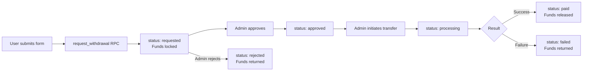

# Withdrawal

Creators withdraw their available balance to a registered payout method. The flow involves validating the amount, selecting a payout method, calling the `request_withdrawal` RPC, and then tracking the withdrawal through to completion.

---

## Withdrawal lifecycle



---

## Data shape

```ts
interface WithdrawalRequest {
  id: string
  profile_id: string
  wallet_id: string
  payout_method_id: string
  amount: number
  fee: number
  net_amount: number
  status: WithdrawalStatus
  requested_at: string
  processed_at: string | null
  completed_at: string | null
  admin_note: string | null
  failure_reason: string | null
  payout_snapshot: MobileDetails | BankDetails | null
}
```

---

## Submitting a withdrawal request

Call the `request_withdrawal` RPC with the amount and payout method ID:

```ts
export async function submitWithdrawal(
  amount: number,
  payoutMethodId: string
): Promise<string> {  // returns the new withdrawal request ID
  const { data, error } = await supabase.rpc('request_withdrawal', {
    p_amount: amount,
    p_payout_method_id: payoutMethodId,
  })

  if (error) throw error
  return data as string
}
```

### Error handling

The RPC raises meaningful errors — map them to user-friendly messages:

```ts
const ERROR_MESSAGES: Record<string, string> = {
  'Not authenticated': 'Please log in to withdraw.',
  'Invalid withdrawal amount': 'Please enter a valid amount.',
  'Minimum withdrawal is 500': 'The minimum withdrawal is ৳500.',
  'Wallet not found': 'Your wallet has not been set up yet.',
  'Insufficient balance': 'You do not have enough balance for this withdrawal.',
  'Invalid payout method': 'The selected payout method is not valid.',
}

export async function submitWithdrawalSafe(
  amount: number,
  payoutMethodId: string
) {
  try {
    const id = await submitWithdrawal(amount, payoutMethodId)
    return { success: true, id }
  } catch (err: unknown) {
    const msg = err instanceof Error ? err.message : String(err)
    const userMessage = ERROR_MESSAGES[msg] ?? 'Withdrawal failed. Please try again.'
    return { success: false, error: userMessage }
  }
}
```

---

## Withdrawal form validation

Validate client-side before calling the RPC:

```ts
const MIN_WITHDRAWAL = 500  // BDT

interface WithdrawalFormErrors {
  amount?: string
  payoutMethod?: string
}

export function validateWithdrawalForm(
  amount: number | '',
  balance: number,
  payoutMethodId: string | null
): WithdrawalFormErrors {
  const errors: WithdrawalFormErrors = {}

  if (!amount || amount <= 0) {
    errors.amount = 'Please enter a valid amount'
  } else if (amount < MIN_WITHDRAWAL) {
    errors.amount = `Minimum withdrawal is ৳${MIN_WITHDRAWAL}`
  } else if (amount > balance) {
    errors.amount = `Amount exceeds your available balance of ৳${balance.toFixed(2)}`
  }

  if (!payoutMethodId) {
    errors.payoutMethod = 'Please select a payout method'
  }

  return errors
}
```

---

## Listing withdrawal history

```ts
const { data: withdrawals, error } = await supabase
  .from('withdrawal_requests')
  .select(`
    id,
    amount,
    fee,
    net_amount,
    status,
    requested_at,
    processed_at,
    completed_at,
    admin_note,
    failure_reason,
    payout_snapshot,
    payout_methods (
      provider
    )
  `)
  .order('requested_at', { ascending: false })
  .limit(20)
```

---

## Tracking a single withdrawal

```ts
export function useWithdrawal(withdrawalId: string) {
  return useQuery({
    queryKey: ['withdrawal', withdrawalId],
    queryFn: async () => {
      const { data, error } = await supabase
        .from('withdrawal_requests')
        .select('*')
        .eq('id', withdrawalId)
        .single()
      if (error) throw error
      return data as WithdrawalRequest
    },
    // Poll every 30s while in-flight
    refetchInterval: (query) => {
      const status = query.state.data?.status
      const inFlight = ['requested', 'approved', 'processing']
      return inFlight.includes(status ?? '') ? 30_000 : false
    },
  })
}
```

---

## Withdrawal status display

```tsx
const STATUS_CONFIG: Record<
  WithdrawalStatus,
  { label: string; color: string; description: string }
> = {
  requested:  { label: 'Pending',    color: 'yellow', description: 'Awaiting admin review' },
  approved:   { label: 'Approved',   color: 'blue',   description: 'Ready to transfer' },
  processing: { label: 'Processing', color: 'blue',   description: 'Transfer in progress' },
  paid:       { label: 'Paid',       color: 'green',  description: 'Successfully transferred' },
  rejected:   { label: 'Rejected',   color: 'red',    description: 'Funds returned to wallet' },
  failed:     { label: 'Failed',     color: 'red',    description: 'Transfer failed — funds returned' },
}

function WithdrawalStatusBadge({ status }: { status: WithdrawalStatus }) {
  const config = STATUS_CONFIG[status]
  return (
    <span className={`badge badge-${config.color}`}>
      {config.label}
    </span>
  )
}
```

---

## Invalidating wallet after withdrawal

After a successful withdrawal submission, invalidate wallet and transaction queries so balances update immediately:

```ts
import { useQueryClient } from '@tanstack/react-query'

const queryClient = useQueryClient()

const handleWithdraw = async () => {
  const result = await submitWithdrawalSafe(amount, payoutMethodId)

  if (result.success) {
    // Refetch wallet (balance moved to locked_balance)
    await queryClient.invalidateQueries({ queryKey: ['wallet'] })
    // Refetch transactions (a new pending debit was inserted)
    await queryClient.invalidateQueries({ queryKey: ['transactions'] })
    // Navigate to confirmation
    router.push(`/withdrawals/${result.id}`)
  }
}
```

---

## Minimum withdrawal constant

The minimum withdrawal amount (৳500) is enforced by the database RPC. Keep your frontend constant in sync:

```ts
// constants/payments.ts
export const MIN_WITHDRAWAL_BDT = 500
```
