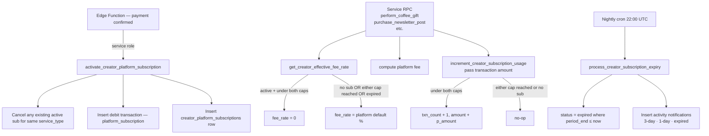

# Platform Subscriptions — Backend Overview

Platform Subscriptions let creators pay a flat monthly fee for a specific service type so that the platform takes **0% of every transaction** for that service instead of the normal percentage fee. Subscriptions are prepaid, non-auto-renewing, and are tied to exactly one service type per subscription period.

## How It Works

1. A creator browses available plans and picks a tier (Basic / Pro / Ultra) for the service type they want to cover (e.g. `gift`, `shop_digital`).
2. They pay via the payment gateway. The Edge Function confirms the charge and calls `activate_creator_platform_subscription()`.
3. For the next month, every transaction of that service type calls `get_creator_effective_fee_rate()`, which returns `0` instead of the platform default — as long as neither the monthly transaction cap nor the monthly amount cap has been reached.
4. Each transaction also calls `increment_creator_subscription_usage(amount)` which atomically increments both the transaction count and the BDT volume counter.
5. Once either `transactions_used_this_period >= monthly_transaction_cap` or `amount_used_this_period >= monthly_amount_cap`, the fee rate silently reverts to the platform default for the remainder of the month. **Transactions never fail due to cap exhaustion.**
6. A nightly cron (`process_creator_subscription_expiry`) marks subscriptions whose `period_end` has passed as `expired` and sends reminder notifications.

## Architecture

## Tier Structure

Each service type has three tiers. All tiers give exactly the same **0% fee** — the difference is how much activity per month is covered at that rate, defined by two independent caps. Prices and caps are configurable by a super-admin via the `platform_subscription_plans` table.

| Tier | `sort_order` | `monthly_transaction_cap` | `monthly_amount_cap` |
|---|---|---|---|
| Basic | 1 | set by admin (e.g. 50) | set by admin (e.g. BDT 10,000) |
| Pro | 2 | set by admin (e.g. 200) | set by admin (e.g. BDT 50,000) |
| Ultra | 3 | `NULL` — unlimited | `NULL` — unlimited |

The 0% benefit applies only while **both** caps remain unexhausted. Whichever cap is hit first ends the benefit for the remainder of the period.

## Service Types Covered

| `service_type` | What it covers |
|---|---|
| `gift` | Coffee gifts received via `perform_coffee_gift` |
| `newsletter_onetime` | Pay-per-post sales via `purchase_newsletter_post` |
| `newsletter_subscription` | Newsletter memberships via `purchase_newsletter_membership` |
| `shop_digital` | Digital product checkouts via `initiate_shop_checkout` |
| `shop_physical` | Physical product checkouts via `initiate_shop_checkout` |

## Table of Contents

| Page | What you'll learn |
|---|---|
| [Schema Reference](./schema) | All three tables, columns, indexes, constraints, ER diagram |
| [RPCs](./rpcs) | Every function: signature, parameters, return value, errors, examples |

## Key Design Principles

**Transactions never fail at cap.** When a creator exhausts their monthly cap, `get_creator_effective_fee_rate()` quietly returns the platform default percentage. The checkout proceeds normally — the creator simply pays the standard fee for that transaction.

**One active subscription per service type.** The unique partial index `idx_cps_one_active_per_service` enforces this. Activating a new subscription for the same service type first cancels the existing one.

**Atomic counters.** `increment_creator_subscription_usage()` is a single `UPDATE … WHERE` statement that increments both `transactions_used_this_period` and `amount_used_this_period` and enforces both caps atomically — no race conditions.

**No auto-renewal.** Subscriptions are prepaid and expire at `period_end`. Creators receive 3-day and 1-day expiry reminders (and an "expired" notification) via in-app activity rows, deduped by `creator_subscription_notifications`.

**Both counters reset on new periods.** When `activate_creator_platform_subscription()` creates a new subscription row, both usage counters default to `0`. When `admin_grant_creator_subscription()` extends an existing row, it explicitly resets both `transactions_used_this_period = 0` and `amount_used_this_period = 0` for the new period.

## Related Schemas

- `public.transactions` — the debit transaction for the subscription payment (`service_type = 'platform_subscription'`)
- `public.platform_settings` — stores the per-service default fee rates (`platform_fee_rate_gift`, etc.) that are returned when no subscription is active or cap is exhausted
- `public.activities` — receives private `role = 'system'` entries for expiry reminder notifications
- `public.profiles` — creator identity; `profile_id` FK on `creator_platform_subscriptions`
