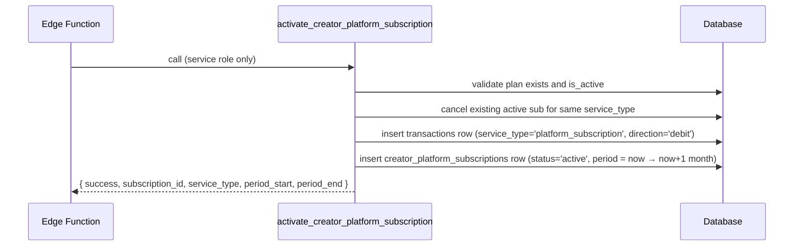

# RPCs — Platform Subscriptions

Six functions power the platform subscription system. Two are internal helpers called on every paid transaction; four are the public-facing operations for activating, cancelling, and managing subscriptions.

## Function Overview

| Function | Caller | Purpose |
|---|---|---|
| [`get_creator_effective_fee_rate`](#get_creator_effective_fee_rate) | Service RPCs (internal) | Returns the fee rate to apply for a given creator + service |
| [`increment_creator_subscription_usage`](#increment_creator_subscription_usage) | Service RPCs (internal) | Atomically ticks the monthly usage counter |
| [`activate_creator_platform_subscription`](#activate_creator_platform_subscription) | Edge Function (service role) | Records payment and activates a subscription period |
| [`cancel_creator_platform_subscription`](#cancel_creator_platform_subscription) | Authenticated creator | Cancels their active subscription for a service |
| [`admin_grant_creator_subscription`](#admin_grant_creator_subscription) | Super-admin | Grants or extends a subscription without payment |
| [`process_creator_subscription_expiry`](#process_creator_subscription_expiry) | Nightly cron (service role) | Expires stale subscriptions and sends reminder notifications |

---

## `get_creator_effective_fee_rate`

Returns `0` when the creator has an active, in-period subscription for the requested service type **and** the monthly transaction cap has not yet been reached. Otherwise returns the platform default percentage from `platform_settings`.

**This function is the single source of truth for fee rates.** All service RPCs (`perform_coffee_gift`, `purchase_newsletter_post`, `purchase_newsletter_membership`, `initiate_shop_checkout`) call it server-side. It is never trusted from the client.

### Signature

```sql
function public.get_creator_effective_fee_rate(
  p_profile_id   uuid,
  p_service_type varchar
) returns numeric
```

### Cap-Exceeded Behaviour

| Subscription state | Return value |
|---|---|
| Active, `transactions_used_this_period < monthly_transaction_cap` | `0` |
| Active, `transactions_used_this_period >= monthly_transaction_cap` | platform default (e.g. `0.05`) |
| Active, `monthly_transaction_cap IS NULL` (Ultra tier) | `0` always |
| No active subscription | platform default |
| Subscription `period_end` passed | platform default |

**Transactions never fail when the cap is exhausted.** The fee silently reverts to the platform default percentage; the service RPC continues normally.

### Platform Default Sources

Platform defaults are stored as JSON numerics in `platform_settings` under keys:

| Key | Default |
|---|---|
| `platform_fee_rate_gift` | `0.05` (5%) |
| `platform_fee_rate_newsletter_onetime` | `0.10` (10%) |
| `platform_fee_rate_newsletter_subscription` | `0.08` (8%) |
| `platform_fee_rate_shop_digital` | `0.10` (10%) |
| `platform_fee_rate_shop_physical` | `0.05` (5%) |

### Security

- `SECURITY DEFINER`, `SET search_path = ''`
- `REVOKE EXECUTE` from `public`, `anon`, `authenticated` — only callable server-side

### Usage (inside a service RPC)

```sql
v_platform_fee_rate := public.get_creator_effective_fee_rate(p_creator_profile_id, 'gift');
v_platform_fee      := round(p_amount * v_platform_fee_rate, 2);
```

---

## `increment_creator_subscription_usage`

Atomically increments `transactions_used_this_period` on the creator's active subscription. The increment only fires when the creator is under their cap (or the cap is `NULL`). No-op in all other cases — no exception is ever raised.

Called once per service transaction, not per item. For shop checkouts with mixed product types, it is called once per service type present in the order.

### Signature

```sql
function public.increment_creator_subscription_usage(
  p_profile_id   uuid,
  p_service_type varchar
) returns void
```

### No-op Conditions

The function silently does nothing when:
- No active subscription exists for `(p_profile_id, p_service_type)`
- The subscription's `period_end` has passed
- `transactions_used_this_period >= monthly_transaction_cap`

### Security

- `SECURITY DEFINER`, `SET search_path = ''`
- `REVOKE EXECUTE` from `public`, `anon`, `authenticated` — only callable server-side

### Usage (inside a service RPC)

```sql
-- Called immediately after fee computation:
v_platform_fee_rate := public.get_creator_effective_fee_rate(p_creator_profile_id, 'gift');
v_platform_fee      := round(p_amount * v_platform_fee_rate, 2);
perform public.increment_creator_subscription_usage(p_creator_profile_id, 'gift');
```

For shop checkouts (once per checkout, per service type):

```sql
if v_has_digital then
  perform public.increment_creator_subscription_usage(v_seller_id, 'shop_digital');
end if;
if v_has_physical then
  perform public.increment_creator_subscription_usage(v_seller_id, 'shop_physical');
end if;
```

---

## `activate_creator_platform_subscription`

Called by the Edge Function after the payment gateway confirms the prepaid monthly charge. Cancels any existing active subscription for the same service type, records a debit transaction, and inserts a new active subscription row valid for 1 month.

### Signature

```sql
function public.activate_creator_platform_subscription(
  p_creator_profile_id      uuid,
  p_plan_id                 bigint,
  p_provider_transaction_id varchar,
  p_provider                public.provider_enum
) returns jsonb
```

### Parameters

| Parameter | Type | Required | Description |
|---|---|---|---|
| `p_creator_profile_id` | `uuid` | YES | The creator purchasing the subscription |
| `p_plan_id` | `bigint` | YES | FK → `platform_subscription_plans.id` |
| `p_provider_transaction_id` | `varchar` | YES | Gateway transaction ID for reconciliation |
| `p_provider` | `provider_enum` | YES | Payment provider (e.g. `Bkash`, `SSLCommerz`) |

### Execution Flow



### Success Response

```json
{
  "success": true,
  "subscription_id": 42,
  "service_type": "gift",
  "period_start": "2026-05-19T00:00:00Z",
  "period_end": "2026-06-19T00:00:00Z"
}
```

### Errors

| Error Code | Condition |
|---|---|
| `Not allowed` | Caller is authenticated (not service role). `auth.uid()` must be `NULL`. |
| `PLAN_NOT_FOUND` | `p_plan_id` does not exist |
| `PLAN_INACTIVE` | Plan exists but `is_active = false` |

### Security

- `SECURITY DEFINER`, `SET search_path = ''`
- `REVOKE EXECUTE` from `public`, `anon`, `authenticated`
- Guard: `if (select auth.uid()) is not null then raise exception 'Not allowed'`

### TypeScript Example (Edge Function)

```typescript
const { data, error } = await supabase.rpc('activate_creator_platform_subscription', {
  p_creator_profile_id: creatorId,
  p_plan_id: planId,
  p_provider_transaction_id: gatewayTxnId,
  p_provider: 'Bkash',
})

if (error || !data.success) {
  throw new Error(data?.error ?? error?.message)
}
// data.subscription_id, data.period_end
```

---

## `cancel_creator_platform_subscription`

An authenticated creator cancels their own active subscription for a given service type. The cancellation takes effect immediately for billing — no refund is issued. The 0% fee benefit continues until `period_end`.

### Signature

```sql
function public.cancel_creator_platform_subscription(
  p_service_type varchar
) returns jsonb
```

### Parameters

| Parameter | Type | Required | Description |
|---|---|---|---|
| `p_service_type` | `varchar` | YES | One of `gift`, `newsletter_onetime`, `newsletter_subscription`, `shop_digital`, `shop_physical` |

### Success Response

```json
{
  "success": true,
  "subscription_id": 42
}
```

### Error Response

```json
{
  "success": false,
  "error": "NO_ACTIVE_SUBSCRIPTION"
}
```

```json
{
  "success": false,
  "error": "UNAUTHENTICATED"
}
```

### Security

- `SECURITY DEFINER`, `SET search_path = ''`
- `REVOKE EXECUTE` from `public`, `anon` (authenticated users **can** call this)
- Uses `auth.uid()` to scope the cancellation to the calling user only

### TypeScript Example

```typescript
const { data } = await supabase.rpc('cancel_creator_platform_subscription', {
  p_service_type: 'gift',
})

if (!data.success) {
  console.error(data.error) // 'NO_ACTIVE_SUBSCRIPTION'
}
```

::: tip Cancellation vs. expiry
Cancellation sets `status = 'cancelled'` immediately. The `get_creator_effective_fee_rate()` check includes `status = 'active'`, so the fee reverts to the platform default on the **next** transaction after cancellation. The subscription row is kept for audit history.
:::

---

## `admin_grant_creator_subscription`

Super-admin only. Grants a creator a platform subscription without requiring payment (comps, corrections). If the creator already has an active subscription on the same service type, the existing `period_end` is extended and the usage counter is reset. Otherwise a new subscription row is created.

### Signature

```sql
function public.admin_grant_creator_subscription(
  p_profile_id uuid,
  p_plan_id    bigint,
  p_months     integer default 1
) returns jsonb
```

### Parameters

| Parameter | Type | Required | Default | Description |
|---|---|---|---|---|
| `p_profile_id` | `uuid` | YES | — | The creator receiving the grant |
| `p_plan_id` | `bigint` | YES | — | FK → `platform_subscription_plans.id` |
| `p_months` | `integer` | NO | `1` | How many months to grant or extend. Must be `1–24`. |

### Behaviour

| State | Action |
|---|---|
| No active subscription for that service type | Insert a new `active` row from `now()` for `p_months` months |
| Active subscription exists | Extend `period_end` by `p_months` months **and reset `transactions_used_this_period = 0`** |

### Success Response

```json
{
  "success": true,
  "subscription_id": 42,
  "service_type": "newsletter_subscription",
  "period_end": "2026-08-19T00:00:00Z"
}
```

### Errors

| Error Code | Condition |
|---|---|
| `Not allowed` | Caller does not have `manager_role = 'super_admin'` in their JWT |
| `INVALID_MONTHS` | `p_months` is outside `1–24` |
| `PLAN_NOT_FOUND` | `p_plan_id` does not exist |

### Security

- `SECURITY DEFINER`, `SET search_path = ''`
- `REVOKE EXECUTE` from `public`, `anon` (authenticated)
- Guard: `if (auth.jwt() ->> 'manager_role') is distinct from 'super_admin' then raise exception 'Not allowed'`
- `transaction_reference_id` is `NULL` — no payment transaction is created

---

## `process_creator_subscription_expiry`

Nightly cron function (runs at `22:00 UTC` / `04:00 BDT`). Does two things:

1. **Expires** all `active` subscriptions whose `period_end ≤ now()`.
2. **Sends notifications** for three windows: 3-day warning, 1-day warning, and expiry confirmation. Each notification is an in-app private activity row deduped by `creator_subscription_notifications`.

### Signature

```sql
function public.process_creator_subscription_expiry() returns void
```

### Notification Windows

| `notification_type` | Fires when `period_end` is… |
|---|---|
| `3_days` | Between 2 and 4 days from now |
| `1_day` | Between 0 and 2 days from now |
| `expired` | Between 1 day ago and now |

Hard cutoff: subscriptions expired more than 1 day ago are never notified (prevents spamming creators of long-expired subs on first run after a gap).

### Security

- `SECURITY DEFINER`, `SET search_path = ''`
- `REVOKE EXECUTE` from `public`, `anon`, `authenticated`
- Scheduled via `pg_cron`: `select cron.schedule('nightly-creator-subscription-expiry', '0 22 * * *', ...)`

### Cron Schedule

```sql
select cron.schedule(
  'nightly-creator-subscription-expiry',
  '0 22 * * *',  -- 22:00 UTC = 04:00 BDT
  $$ select public.process_creator_subscription_expiry(); $$
);
```

---

## Usage Page Integration

No additional RPC is needed to display quota on the creator's usage page. Creators can query their own `creator_platform_subscriptions` rows directly via RLS:

```typescript
const { data } = await supabase
  .from('creator_platform_subscriptions')
  .select(`
    service_type,
    status,
    period_start,
    period_end,
    transactions_used_this_period,
    platform_subscription_plans (
      name,
      monthly_transaction_cap,
      price_per_month
    )
  `)
  .eq('status', 'active')
```

### Response Shape

```typescript
[
  {
    service_type: 'gift',
    status: 'active',
    period_start: '2026-05-19T00:00:00Z',
    period_end: '2026-06-19T00:00:00Z',
    transactions_used_this_period: 37,
    platform_subscription_plans: {
      name: 'Gift Pro',
      monthly_transaction_cap: 200,   // null = unlimited
      price_per_month: 500.00,
    },
  },
]
```

Compute the usage percentage client-side:

```typescript
const pct = plan.monthly_transaction_cap
  ? Math.min(100, (sub.transactions_used_this_period / plan.monthly_transaction_cap) * 100)
  : 0 // unlimited — always 0%
```
