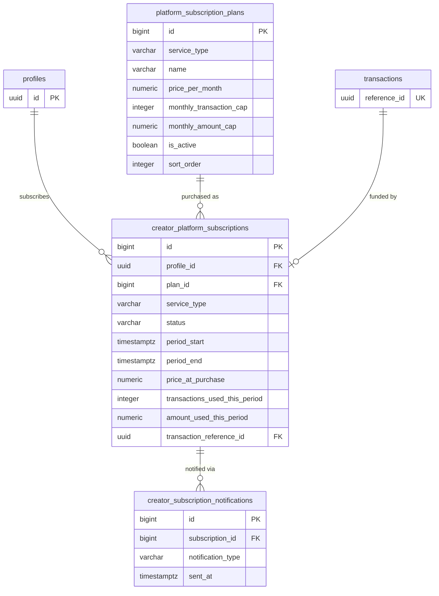
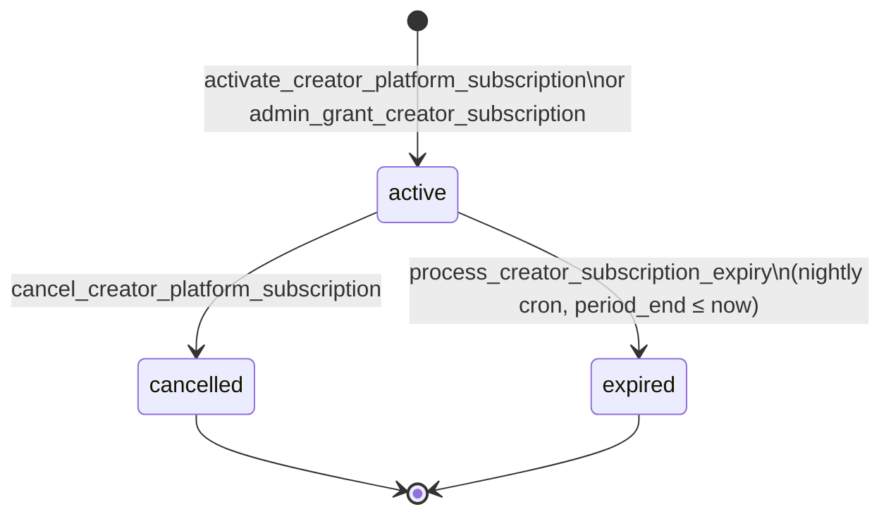

# Database Schema — Platform Subscriptions

Three tables form the platform subscription system: `platform_subscription_plans` (super-admin-managed tier catalogue), `creator_platform_subscriptions` (one row per active/expired/cancelled period per creator per service), and `creator_subscription_notifications` (dedup log for expiry reminders).

## ER Diagram



---

## `platform_subscription_plans`

Super-admin-managed catalogue of flat-fee tiers. Creators pick a plan when subscribing.

```sql
create table public.platform_subscription_plans (
  id                      bigint generated always as identity primary key,
  service_type            varchar(50) not null
                            check (service_type in (
                              'gift','newsletter_onetime','newsletter_subscription',
                              'shop_digital','shop_physical'
                            )),
  name                    varchar(100) not null,
  description             text,
  price_per_month         numeric(10,2) not null check (price_per_month > 0),
  monthly_transaction_cap integer
                            check (monthly_transaction_cap is null or monthly_transaction_cap > 0),
  monthly_amount_cap      numeric(12,2)
                            check (monthly_amount_cap is null or monthly_amount_cap > 0),
  is_active               boolean not null default true,
  sort_order              integer not null default 0,
  created_at              timestamptz not null default now(),
  updated_at              timestamptz not null default now()
);
```

### Column Reference

| Column | Type | Nullable | Description |
|---|---|---|---|
| `id` | `bigint` | NO | Auto-generated primary key |
| `service_type` | `varchar(50)` | NO | The service this plan covers. One of `gift`, `newsletter_onetime`, `newsletter_subscription`, `shop_digital`, `shop_physical` |
| `name` | `varchar(100)` | NO | Display name shown to creators (e.g. "Gift Pro") |
| `description` | `text` | YES | Human-readable description of what the plan includes |
| `price_per_month` | `numeric(10,2)` | NO | Monthly price in BDT. Must be `> 0` |
| `monthly_transaction_cap` | `integer` | YES | Max transactions covered at 0% fee per period. `NULL` = unlimited (Ultra tier) |
| `monthly_amount_cap` | `numeric(12,2)` | YES | Max total BDT volume covered at 0% fee per period. `NULL` = unlimited (Ultra tier). A plan enforces **both** caps — whichever is reached first ends the 0% benefit. |
| `is_active` | `boolean` | NO | Inactive plans are hidden from creators and cannot be subscribed to. Defaults `true` |
| `sort_order` | `integer` | NO | Display order within a service type. `1` = Basic, `2` = Pro, `3` = Ultra |
| `created_at` | `timestamptz` | NO | Row creation timestamp |
| `updated_at` | `timestamptz` | NO | Auto-updated by trigger |

### RLS

| Operation | Who |
|---|---|
| `SELECT` | Authenticated users see active plans only. Super-admins see all (including `is_active = false`). |
| `INSERT` / `UPDATE` / `DELETE` | Super-admins only. |

### Index

```sql
-- Used by get_creator_effective_fee_rate() and plan browsing queries.
create index idx_psp_service_type_active
  on public.platform_subscription_plans (service_type, sort_order)
  where is_active = true;
```

---

## `creator_platform_subscriptions`

One row per subscription period per creator per service type. Rows are never deleted — cancelled and expired periods remain for audit history.

```sql
create table public.creator_platform_subscriptions (
  id                            bigint generated always as identity primary key,
  profile_id                    uuid not null references public.profiles(id) on delete cascade,
  plan_id                       bigint not null references public.platform_subscription_plans(id),
  service_type                  varchar(50) not null,  -- denormalised from plan for fast lookup

  status                        varchar(20) not null default 'active'
                                  check (status in ('active', 'cancelled', 'expired')),
  period_start                  timestamptz not null,
  period_end                    timestamptz not null,
  price_at_purchase             numeric(10,2) not null,
  transactions_used_this_period integer not null default 0
                                  constraint cps_transactions_used_nonneg
                                  check (transactions_used_this_period >= 0),
  amount_used_this_period       numeric(12,2) not null default 0
                                  constraint cps_amount_used_nonneg
                                  check (amount_used_this_period >= 0),

  transaction_reference_id      uuid references public.transactions(reference_id) on delete set null,

  created_at                    timestamptz not null default now(),
  updated_at                    timestamptz not null default now(),

  constraint cps_period_positive check (period_end > period_start)
);
```

### Column Reference

| Column | Type | Nullable | Description |
|---|---|---|---|
| `id` | `bigint` | NO | Auto-generated primary key |
| `profile_id` | `uuid` | NO | FK → `profiles.id`. The subscribing creator. Cascade delete. |
| `plan_id` | `bigint` | NO | FK → `platform_subscription_plans.id`. Which plan was purchased |
| `service_type` | `varchar(50)` | NO | Denormalised from `plan.service_type` for fast lookup without a join |
| `status` | `varchar(20)` | NO | `active` — in effect; `cancelled` — creator cancelled before expiry; `expired` — period ended naturally |
| `period_start` | `timestamptz` | NO | When the subscription period begins |
| `period_end` | `timestamptz` | NO | When the subscription period ends. Must be `> period_start` |
| `price_at_purchase` | `numeric(10,2)` | NO | Price snapshot at time of purchase. Preserved even if the plan's price later changes |
| `transactions_used_this_period` | `integer` | NO | Running count of transactions processed under this subscription. Incremented by `increment_creator_subscription_usage()`. Bounded by `plan.monthly_transaction_cap`. Defaults `0`. |
| `amount_used_this_period` | `numeric(12,2)` | NO | Running BDT volume processed under this subscription. Incremented by `increment_creator_subscription_usage()`. Bounded by `plan.monthly_amount_cap`. Defaults `0`. |
| `transaction_reference_id` | `uuid` | YES | FK → `transactions.reference_id`. Links to the payment. `NULL` for admin-comped grants. |
| `created_at` | `timestamptz` | NO | Row creation timestamp |
| `updated_at` | `timestamptz` | NO | Auto-updated by trigger |

### Status Lifecycle



### RLS

| Operation | Who |
|---|---|
| `SELECT` | Creators see their own rows. Super-admins see all. |
| `INSERT` / `UPDATE` / `DELETE` | No direct access. All writes go through `SECURITY DEFINER` RPCs. |

### Indexes

```sql
-- Enforces at most one active subscription per creator per service type.
create unique index idx_cps_one_active_per_service
  on public.creator_platform_subscriptions (profile_id, service_type)
  where status = 'active';

-- Primary read index: "all subscriptions for this creator".
create index idx_cps_profile_id
  on public.creator_platform_subscriptions (profile_id, service_type, status);

-- Fast nightly cron scan for expired subscriptions.
create index idx_cps_expiry
  on public.creator_platform_subscriptions (period_end)
  where status = 'active';
```

### Why `service_type` is denormalised

`get_creator_effective_fee_rate()` and `increment_creator_subscription_usage()` look up subscriptions by `(profile_id, service_type)` on every paid transaction. Denormalising avoids a join to `platform_subscription_plans` on the hot path. The value is copied from `plan.service_type` at insert time and never changes.

---

## `creator_subscription_notifications`

Dedup log. Prevents the nightly cron from sending the same expiry reminder twice.

```sql
create table public.creator_subscription_notifications (
  id                bigint generated always as identity primary key,
  subscription_id   bigint not null references public.creator_platform_subscriptions(id) on delete cascade,
  notification_type varchar(20) not null
                      check (notification_type in ('3_days', '1_day', 'expired')),
  sent_at           timestamptz not null default now(),

  unique (subscription_id, notification_type)
);
```

### Column Reference

| Column | Type | Nullable | Description |
|---|---|---|---|
| `id` | `bigint` | NO | Auto-generated primary key |
| `subscription_id` | `bigint` | NO | FK → `creator_platform_subscriptions.id`. Cascade delete. |
| `notification_type` | `varchar(20)` | NO | Which window was notified: `3_days` (3 days before expiry), `1_day` (1 day before), `expired` (day of expiry) |
| `sent_at` | `timestamptz` | NO | When the notification was sent |

The `unique(subscription_id, notification_type)` constraint is the dedup key — `ON CONFLICT DO NOTHING` in `process_creator_subscription_expiry()` ensures idempotency on cron reruns.

### RLS

No direct access. Written exclusively by `process_creator_subscription_expiry()` (SECURITY DEFINER).
